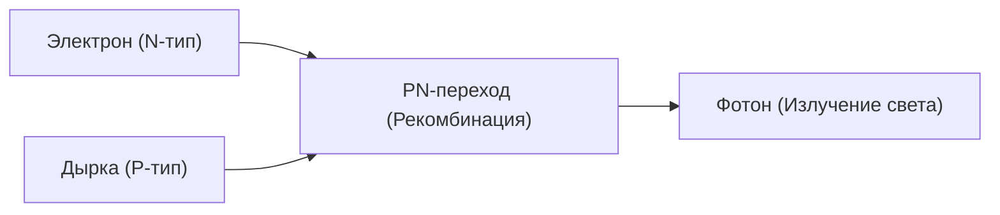

## 1. Разница между лампой накаливания и LED
Лампа накаливания излучает свет за счет нагрева нити до высокой температуры, в то время как LED (Light Emitting Diode: светоизлучающий диод) преобразует электрическую энергию напрямую в световую без выделения тепла. Поэтому он является невероятно энергосберегающим.

## 2. Механизм свечения (полупроводник)
LED состоит из соединения полупроводника N-типа, в котором есть избыток электронов, и полупроводника P-типа, в котором их недостаток (есть дырки). При пропускании тока электроны и дырки сталкиваются и рекомбинируют, а разница в энергии при этом высвобождается в виде «света (фотонов)».

$$
E = h \nu = \frac{hc}{\lambda}
$$

## 3. Барьер синего LED
Красные и зеленые светодиоды были изобретены в 1960-х годах, но кристаллизация материала (нитрида галлия) для получения «синего» цвета была крайне сложной, и говорили, что до конца 20-го века это реализовать невозможно.

## 4. Прорыв японских исследователей
Благодаря новаторским исследованиям Исаму Акасаки, Хироси Амано и Сюдзи Накамуры, в 1990-х годах был создан синий светодиод высокой яркости. С появлением трех основных цветов света (красного, зеленого и синего) стало возможным создание белого LED освещения и полноцветных дисплеев, за что трое ученых были удостоены Нобелевской премии по физике.

## Дополнительная техническая проверка, часть 1

## Дополнительная техническая проверка, часть 2

## Дополнительная техническая проверка, часть 3

## Дополнительная техническая проверка, часть 4

## Дополнительная техническая проверка, часть 5

## Дополнительная техническая проверка, часть 6

## Дополнительная техническая проверка, часть 7

## Дополнительная техническая проверка, часть 8

## Дополнительная техническая проверка, часть 9

## Дополнительная техническая проверка, часть 10

## Дополнительная техническая проверка, часть 11

## Дополнительная техническая проверка, часть 12

## Дополнительная техническая проверка, часть 13

## Дополнительная техническая проверка, часть 14

