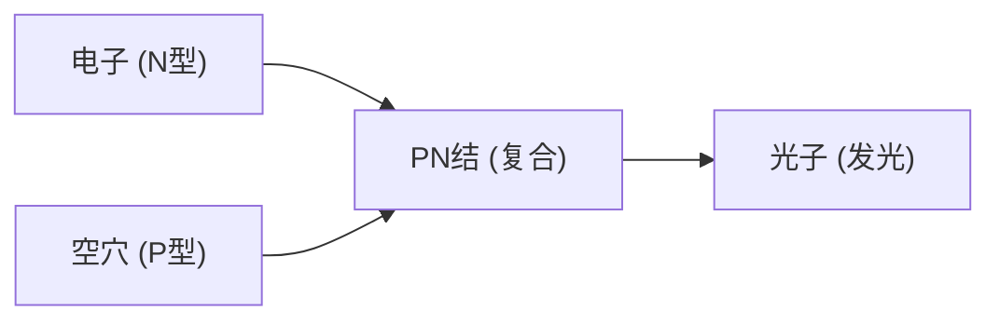

## 1. 灯泡与LED的区别
白炽灯通过将灯丝加热至高温来发光，而LED（Light Emitting Diode：发光二极管）则不发热，直接将电能转化为光能。因此它极其节能。

## 2. 发光机制（半导体）
LED是将电子过剩的“N型半导体”和电子不足（存在空穴）的“P型半导体”结合而成的。通电时，电子和空穴碰撞并结合，此时的能量差便以“光（光子）”的形式释放出来。

$$
E = h \nu = \frac{hc}{\lambda}
$$

## 3. 蓝色LED的壁垒
红色和绿色LED在20世纪60年代就被发明了，但用于发出“蓝色”光的材料（氮化镓）极难结晶，曾被认为在20世纪内不可能实现。

## 4. 日本研究者的突破
得益于赤崎勇、天野浩、中村修二三位突破性的研究，高亮度蓝色LED于20世纪90年代问世。随着光的三原色（红、绿、蓝）齐聚，白色LED照明和全彩显示器得以实现，这三位研究者也因此荣获了诺贝尔物理学奖。

## 附加技术验证部分 1

### 1. 灯泡与LED的区别
白炽灯通过将灯丝加热至高温来发光，而LED（Light Emitting Diode：发光二极管）则不发热，直接将电能转化为光能。因此它极其节能。

### 2. 发光机制（半导体）
LED是将电子过剩的“N型半导体”和电子不足（存在空穴）的“P型半导体”结合而成的。通电时，电子和空穴碰撞并结合，此时的能量差便以“光（光子）”的形式释放出来。

$$
E = h \nu = \frac{hc}{\lambda}
$$

### 3. 蓝色LED的壁垒
红色和绿色LED在20世纪60年代就被发明了，但用于发出“蓝色”光的材料（氮化镓）极难结晶，曾被认为在20世纪内不可能实现。

### 4. 日本研究者的突破
得益于赤崎勇、天野浩、中村修二三位突破性的研究，高亮度蓝色LED于20世纪90年代问世。随着光的三原色（红、绿、蓝）齐聚，白色LED照明和全彩显示器得以实现，这三位研究者也因此荣获了诺贝尔物理学奖。

## 附加技术验证部分 2

### 1. 灯泡与LED的区别
白炽灯通过将灯丝加热至高温来发光，而LED（Light Emitting Diode：发光二极管）则不发热，直接将电能转化为光能。因此它极其节能。

### 2. 发光机制（半导体）
LED是将电子过剩的“N型半导体”和电子不足（存在空穴）的“P型半导体”结合而成的。通电时，电子和空穴碰撞并结合，此时的能量差便以“光（光子）”的形式释放出来。

$$
E = h \nu = \frac{hc}{\lambda}
$$

### 3. 蓝色LED的壁垒
红色和绿色LED在20世纪60年代就被发明了，但用于发出“蓝色”光的材料（氮化镓）极难结晶，曾被认为在20世纪内不可能实现。

### 4. 日本研究者的突破
得益于赤崎勇、天野浩、中村修二三位突破性的研究，高亮度蓝色LED于20世纪90年代问世。随着光的三原色（红、绿、蓝）齐聚，白色LED照明和全彩显示器得以实现，这三位研究者也因此荣获了诺贝尔物理学奖。

## 附加技术验证部分 3

### 1. 灯泡与LED的区别
白炽灯通过将灯丝加热至高温来发光，而LED（Light Emitting Diode：发光二极管）则不发热，直接将电能转化为光能。因此它极其节能。

### 2. 发光机制（半导体）
LED是将电子过剩的“N型半导体”和电子不足（存在空穴）的“P型半导体”结合而成的。通电时，电子和空穴碰撞并结合，此时的能量差便以“光（光子）”的形式释放出来。

$$
E = h \nu = \frac{hc}{\lambda}
$$

### 3. 蓝色LED的壁垒
红色和绿色LED在20世纪60年代就被发明了，但用于发出“蓝色”光的材料（氮化镓）极难结晶，曾被认为在20世纪内不可能实现。

### 4. 日本研究者的突破
得益于赤崎勇、天野浩、中村修二三位突破性的研究，高亮度蓝色LED于20世纪90年代问世。随着光的三原色（红、绿、蓝）齐聚，白色LED照明和全彩显示器得以实现，这三位研究者也因此荣获了诺贝尔物理学奖。

## 附加技术验证部分 4

### 1. 灯泡与LED的区别
白炽灯通过将灯丝加热至高温来发光，而LED（Light Emitting Diode：发光二极管）则不发热，直接将电能转化为光能。因此它极其节能。

### 2. 发光机制（半导体）
LED是将电子过剩的“N型半导体”和电子不足（存在空穴）的“P型半导体”结合而成的。通电时，电子和空穴碰撞并结合，此时的能量差便以“光（光子）”的形式释放出来。

$$
E = h \nu = \frac{hc}{\lambda}
$$

### 3. 蓝色LED的壁垒
红色和绿色LED在20世纪60年代就被发明了，但用于发出“蓝色”光的材料（氮化镓）极难结晶，曾被认为在20世纪内不可能实现。

### 4. 日本研究者的突破
得益于赤崎勇、天野浩、中村修二三位突破性的研究，高亮度蓝色LED于20世纪90年代问世。随着光的三原色（红、绿、蓝）齐聚，白色LED照明和全彩显示器得以实现，这三位研究者也因此荣获了诺贝尔物理学奖。

## 附加技术验证部分 5

### 1. 灯泡与LED的区别
白炽灯通过将灯丝加热至高温来发光，而LED（Light Emitting Diode：发光二极管）则不发热，直接将电能转化为光能。因此它极其节能。

### 2. 发光机制（半导体）
LED是将电子过剩的“N型半导体”和电子不足（存在空穴）的“P型半导体”结合而成的。通电时，电子和空穴碰撞并结合，此时的能量差便以“光（光子）”的形式释放出来。

$$
E = h \nu = \frac{hc}{\lambda}
$$

### 3. 蓝色LED的壁垒
红色和绿色LED在20世纪60年代就被发明了，但用于发出“蓝色”光的材料（氮化镓）极难结晶，曾被认为在20世纪内不可能实现。

### 4. 日本研究者的突破
得益于赤崎勇、天野浩、中村修二三位突破性的研究，高亮度蓝色LED于20世纪90年代问世。随着光的三原色（红、绿、蓝）齐聚，白色LED照明和全彩显示器得以实现，这三位研究者也因此荣获了诺贝尔物理学奖。

## 附加技术验证部分 6

### 1. 灯泡与LED的区别
白炽灯通过将灯丝加热至高温来发光，而LED（Light Emitting Diode：发光二极管）则不发热，直接将电能转化为光能。因此它极其节能。

### 2. 发光机制（半导体）
LED是将电子过剩的“N型半导体”和电子不足（存在空穴）的“P型半导体”结合而成的。通电时，电子和空穴碰撞并结合，此时的能量差便以“光（光子）”的形式释放出来。

$$
E = h \nu = \frac{hc}{\lambda}
$$

### 3. 蓝色LED的壁垒
红色和绿色LED在20世纪60年代就被发明了，但用于发出“蓝色”光的材料（氮化镓）极难结晶，曾被认为在20世纪内不可能实现。

### 4. 日本研究者的突破
得益于赤崎勇、天野浩、中村修二三位突破性的研究，高亮度蓝色LED于20世纪90年代问世。随着光的三原色（红、绿、蓝）齐聚，白色LED照明和全彩显示器得以实现，这三位研究者也因此荣获了诺贝尔物理学奖。

## 附加技术验证部分 7

### 1. 灯泡与LED的区别
白炽灯通过将灯丝加热至高温来发光，而LED（Light Emitting Diode：发光二极管）则不发热，直接将电能转化为光能。因此它极其节能。

### 2. 发光机制（半导体）
LED是将电子过剩的“N型半导体”和电子不足（存在空穴）的“P型半导体”结合而成的。通电时，电子和空穴碰撞并结合，此时的能量差便以“光（光子）”的形式释放出来。

$$
E = h \nu = \frac{hc}{\lambda}
$$

### 3. 蓝色LED的壁垒
红色和绿色LED在20世纪60年代就被发明了，但用于发出“蓝色”光的材料（氮化镓）极难结晶，曾被认为在20世纪内不可能实现。

### 4. 日本研究者的突破
得益于赤崎勇、天野浩、中村修二三位突破性的研究，高亮度蓝色LED于20世纪90年代问世。随着光的三原色（红、绿、蓝）齐聚，白色LED照明和全彩显示器得以实现，这三位研究者也因此荣获了诺贝尔物理学奖。

## 附加技术验证部分 8

### 1. 灯泡与LED的区别
白炽灯通过将灯丝加热至高温来发光，而LED（Light Emitting Diode：发光二极管）则不发热，直接将电能转化为光能。因此它极其节能。

### 2. 发光机制（半导体）
LED是将电子过剩的“N型半导体”和电子不足（存在空穴）的“P型半导体”结合而成的。通电时，电子和空穴碰撞并结合，此时的能量差便以“光（光子）”的形式释放出来。

$$
E = h \nu = \frac{hc}{\lambda}
$$

### 3. 蓝色LED的壁垒
红色和绿色LED在20世纪60年代就被发明了，但用于发出“蓝色”光的材料（氮化镓）极难结晶，曾被认为在20世纪内不可能实现。

### 4. 日本研究者的突破
得益于赤崎勇、天野浩、中村修二三位突破性的研究，高亮度蓝色LED于20世纪90年代问世。随着光的三原色（红、绿、蓝）齐聚，白色LED照明和全彩显示器得以实现，这三位研究者也因此荣获了诺贝尔物理学奖。

## 附加技术验证部分 9

### 1. 灯泡与LED的区别
白炽灯通过将灯丝加热至高温来发光，而LED（Light Emitting Diode：发光二极管）则不发热，直接将电能转化为光能。因此它极其节能。

### 2. 发光机制（半导体）
LED是将电子过剩的“N型半导体”和电子不足（存在空穴）的“P型半导体”结合而成的。通电时，电子和空穴碰撞并结合，此时的能量差便以“光（光子）”的形式释放出来。

$$
E = h \nu = \frac{hc}{\lambda}
$$

### 3. 蓝色LED的壁垒
红色和绿色LED在20世纪60年代就被发明了，但用于发出“蓝色”光的材料（氮化镓）极难结晶，曾被认为在20世纪内不可能实现。

### 4. 日本研究者的突破
得益于赤崎勇、天野浩、中村修二三位突破性的研究，高亮度蓝色LED于20世纪90年代问世。随着光的三原色（红、绿、蓝）齐聚，白色LED照明和全彩显示器得以实现，这三位研究者也因此荣获了诺贝尔物理学奖。

## 附加技术验证部分 10

### 1. 灯泡与LED的区别
白炽灯通过将灯丝加热至高温来发光，而LED（Light Emitting Diode：发光二极管）则不发热，直接将电能转化为光能。因此它极其节能。

### 2. 发光机制（半导体）
LED是将电子过剩的“N型半导体”和电子不足（存在空穴）的“P型半导体”结合而成的。通电时，电子和空穴碰撞并结合，此时的能量差便以“光（光子）”的形式释放出来。

$$
E = h \nu = \frac{hc}{\lambda}
$$

### 3. 蓝色LED的壁垒
红色和绿色LED在20世纪60年代就被发明了，但用于发出“蓝色”光的材料（氮化镓）极难结晶，曾被认为在20世纪内不可能实现。

### 4. 日本研究者的突破
得益于赤崎勇、天野浩、中村修二三位突破性的研究，高亮度蓝色LED于20世纪90年代问世。随着光的三原色（红、绿、蓝）齐聚，白色LED照明和全彩显示器得以实现，这三位研究者也因此荣获了诺贝尔物理学奖。

## 附加技术验证部分 11

### 1. 灯泡与LED的区别
白炽灯通过将灯丝加热至高温来发光，而LED（Light Emitting Diode：发光二极管）则不发热，直接将电能转化为光能。因此它极其节能。

### 2. 发光机制（半导体）
LED是将电子过剩的“N型半导体”和电子不足（存在空穴）的“P型半导体”结合而成的。通电时，电子和空穴碰撞并结合，此时的能量差便以“光（光子）”的形式释放出来。

$$
E = h \nu = \frac{hc}{\lambda}
$$

### 3. 蓝色LED的壁垒
红色和绿色LED在20世纪60年代就被发明了，但用于发出“蓝色”光的材料（氮化镓）极难结晶，曾被认为在20世纪内不可能实现。

### 4. 日本研究者的突破
得益于赤崎勇、天野浩、中村修二三位突破性的研究，高亮度蓝色LED于20世纪90年代问世。随着光的三原色（红、绿、蓝）齐聚，白色LED照明和全彩显示器得以实现，这三位研究者也因此荣获了诺贝尔物理学奖。

## 附加技术验证部分 12

### 1. 灯泡与LED的区别
白炽灯通过将灯丝加热至高温来发光，而LED（Light Emitting Diode：发光二极管）则不发热，直接将电能转化为光能。因此它极其节能。

### 2. 发光机制（半导体）
LED是将电子过剩的“N型半导体”和电子不足（存在空穴）的“P型半导体”结合而成的。通电时，电子和空穴碰撞并结合，此时的能量差便以“光（光子）”的形式释放出来。

$$
E = h \nu = \frac{hc}{\lambda}
$$

### 3. 蓝色LED的壁垒
红色和绿色LED在20世纪60年代就被发明了，但用于发出“蓝色”光的材料（氮化镓）极难结晶，曾被认为在20世纪内不可能实现。

### 4. 日本研究者的突破
得益于赤崎勇、天野浩、中村修二三位突破性的研究，高亮度蓝色LED于20世纪90年代问世。随着光的三原色（红、绿、蓝）齐聚，白色LED照明和全彩显示器得以实现，这三位研究者也因此荣获了诺贝尔物理学奖。

## 附加技术验证部分 13

### 1. 灯泡与LED的区别
白炽灯通过将灯丝加热至高温来发光，而LED（Light Emitting Diode：发光二极管）则不发热，直接将电能转化为光能。因此它极其节能。

### 2. 发光机制（半导体）
LED是将电子过剩的“N型半导体”和电子不足（存在空穴）的“P型半导体”结合而成的。通电时，电子和空穴碰撞并结合，此时的能量差便以“光（光子）”的形式释放出来。

$$
E = h \nu = \frac{hc}{\lambda}
$$

### 3. 蓝色LED的壁垒
红色和绿色LED在20世纪60年代就被发明了，但用于发出“蓝色”光的材料（氮化镓）极难结晶，曾被认为在20世纪内不可能实现。

### 4. 日本研究者的突破
得益于赤崎勇、天野浩、中村修二三位突破性的研究，高亮度蓝色LED于20世纪90年代问世。随着光的三原色（红、绿、蓝）齐聚，白色LED照明和全彩显示器得以实现，这三位研究者也因此荣获了诺贝尔物理学奖。

## 附加技术验证部分 14

### 1. 灯泡与LED的区别
白炽灯通过将灯丝加热至高温来发光，而LED（Light Emitting Diode：发光二极管）则不发热，直接将电能转化为光能。因此它极其节能。

### 2. 发光机制（半导体）
LED是将电子过剩的“N型半导体”和电子不足（存在空穴）的“P型半导体”结合而成的。通电时，电子和空穴碰撞并结合，此时的能量差便以“光（光子）”的形式释放出来。

$$
E = h \nu = \frac{hc}{\lambda}
$$

### 3. 蓝色LED的壁垒
红色和绿色LED在20世纪60年代就被发明了，但用于发出“蓝色”光的材料（氮化镓）极难结晶，曾被认为在20世纪内不可能实现。

### 4. 日本研究者的突破
得益于赤崎勇、天野浩、中村修二三位突破性的研究，高亮度蓝色LED于20世纪90年代问世。随着光的三原色（红、绿、蓝）齐聚，白色LED照明和全彩显示器得以实现，这三位研究者也因此荣获了诺贝尔物理学奖。
