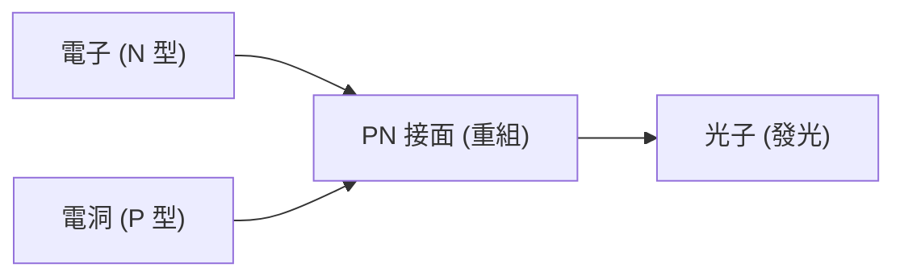

## 1. 燈泡與 LED 的差異
白熾燈泡是藉由將燈絲加熱至高溫來發光，而 LED（Light Emitting Diode：發光二極體）則不發熱，直接將電能轉換為光能。因此非常節能。

## 2. 發光的機制（半導體）
LED 是將電子過剩的「N 型半導體」與電子不足（具有電洞）的「P 型半導體」接合而成。當電流通過時，電子與電洞會碰撞並結合，這時的能量差就會以「光（光子）」的形式釋放出來。

$$
E = h \nu = \frac{hc}{\lambda}
$$

## 3. 藍光 LED 的障礙
紅光與綠光 LED 早在 1960 年代就已被發明，但要製造出「藍光」所需的材料（氮化鎵）結晶化極其困難，曾被說過在 20 世紀內是不可能實現的。

## 4. 日本研究者的重大突破
藉由赤崎勇、天野浩、中村修二等 3 位學者的劃時代研究，在 1990 年代成功完成了高亮度藍光 LED。因為湊齊了光的三原色（紅、綠、藍），使得白光 LED 照明與全彩顯示器得以實現，這 3 位學者也因此榮獲諾貝爾物理學獎。

## 附加技術驗證部分 1

## 附加技術驗證部分 2

## 附加技術驗證部分 3

## 附加技術驗證部分 4

## 附加技術驗證部分 5

## 附加技術驗證部分 6

## 附加技術驗證部分 7

## 附加技術驗證部分 8

## 附加技術驗證部分 9

## 附加技術驗證部分 10

## 附加技術驗證部分 11

## 附加技術驗證部分 12

## 附加技術驗證部分 13

## 附加技術驗證部分 14

