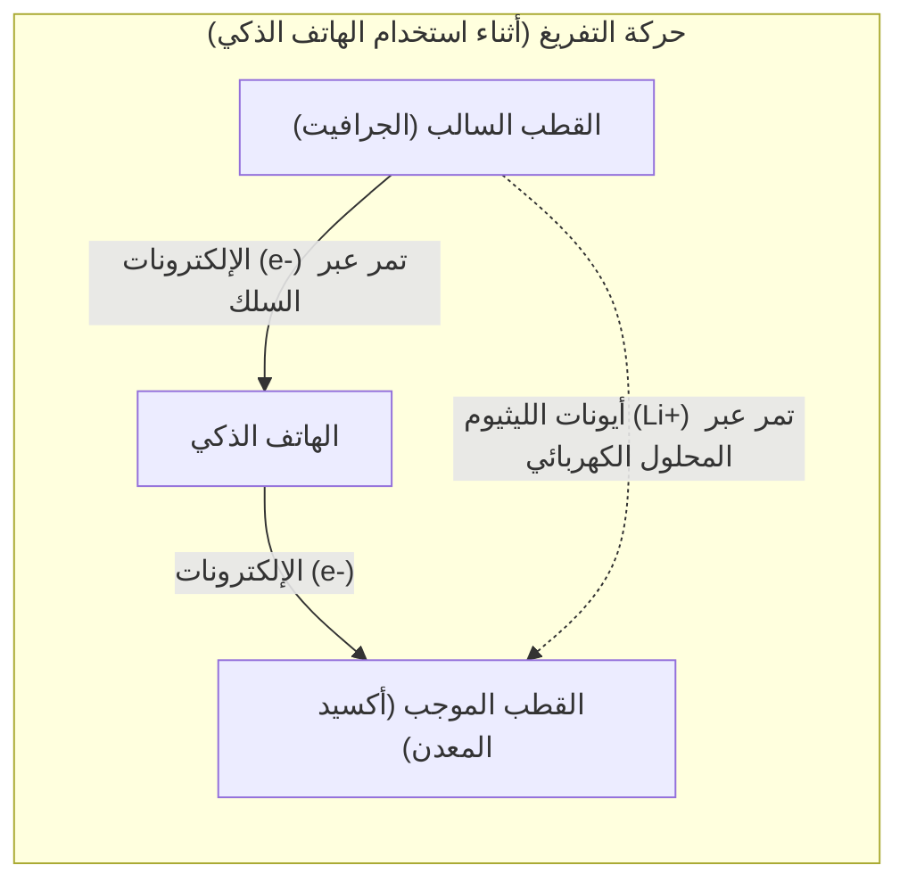

## 1. البطل الخفي لثورة الهواتف المحمولة

في التسعينيات، تطورت الهواتف المحمولة بشكل جذري من "هواتف الكتف" الضخمة والثقيلة إلى حجم يناسب الجيب. التكنولوجيا التي دعمت هذه "الثورة المحمولة" من جذورها هي " **بطارية الليثيوم أيون** "، والتي تم تسويقها لأول مرة في العالم بواسطة شركة سوني في عام 1991.

بالمقارنة مع بطاريات النيكل والكادميوم أو بطاريات الرصاص الحمضية التي كانت سائدة حتى ذلك الحين، كانت بطاريات الليثيوم أيون تتمتع بأداء أشبه بالحلم: "أخف وزناً بشكل مذهل، وأصغر حجماً، وذات جهد أعلى". اليوم، لم يقتصر الأمر على الهواتف الذكية وأجهزة الكمبيوتر المحمولة، بل نمت لتصبح تقنية تحمل مفتاح مجتمع خالٍ من الكربون، حيث تُستخدم كقلب نابض للسيارات الكهربائية (EV) مثل سيارات تسلا. في عام 2019، مُنحت جائزة نوبل في الكيمياء لأكيرا يوشينو وآخرين لمساهمتهم في تطويرها.

لماذا يمكن لبطاريات الليثيوم أيون أن تقدم هذا الأداء العالي؟

## 2. الأسباب الفيزيائية والكيميائية لاختيار الليثيوم

هناك أسباب حتمية نابعة من خصائص العناصر التي أدت إلى اختيار " **الليثيوم (Li)** " ليكون اللاعب الرئيسي في البطارية.

تخيل الجدول الدوري. الليثيوم هو ثالث أخف عنصر بعد الهيدروجين والهيليوم. ومن بين المعادن، هو **العنصر الأخف (الأقل كثافة)** .
علاوة على ذلك، يمتلك الليثيوم إلكتروناً واحداً فقط في مداره الخارجي، وله خاصية الرغبة الشديدة في التخلي عن هذا الإلكترون (ميل كبير جداً للتأين).

إن الرغبة في التخلي عن الإلكترونات تعني بعبارة أخرى "قوة كبيرة لتوليد جهد عالٍ".
من خلال استخدام الليثيوم، يمكننا صنع بطارية مثالية للأجهزة المحمولة، فهي "خفيفة للغاية، وقوية (ذات جهد عالٍ) في نفس الوقت".

## 3. آلية الشحن والتفريغ: انتقال الأيونات والإلكترونات

يتكون الجزء الداخلي للبطارية من ثلاثة مكونات رئيسية:
1. **القطب الموجب** : أكاسيد المعادن مثل أكسيد كوبالت الليثيوم
2. **القطب السالب** : الجرافيت (طبقات الكربون)
3. **الإلكتروليت والفاصل** : سائل وغشاء يسمحان بمرور الأيونات فقط ولا يمرران الإلكترونات

السبب الذي يسمح لبطاريات الليثيوم أيون بتكرار "الشحن والتفريغ" هو أن الليثيوم يصبح "أيوناً (حالة فقد فيها إلكتروناً)" وينتقل جيئة وذهاباً بين القطب الموجب والقطب السالب. يُطلق على هذا اسم " **نموذج الكرسي الهزاز** ".

### [أثناء الشحن] عملية تخزين الطاقة
عند تدفق الكهرباء (الإلكترونات) من المنفذ، يحدث التفاعل التالي:
1. تُنتزع الإلكترونات من ذرات الليثيوم الموجودة في القطب الموجب، وتتحول إلى **أيونات ليثيوم (Li+)** .
2. تُجبر الإلكترونات على الانتقال إلى القطب السالب عبر سلك موصل (كابل خارجي).
3. وفي الوقت نفسه، تسبح أيونات الليثيوم (Li+) عبر المحلول الكهربائي داخل البطارية متجهة نحو القطب السالب.
4. في القطب السالب (في الفجوات بين طبقات الجرافيت)، تلتقي أيونات الليثيوم الواصلة والإلكترونات مرة أخرى، وتغوص هناك لتصبح في حالة طاقة مخزنة.

### [أثناء التفريغ] عملية إطلاق الطاقة (عند استخدام الهاتف الذكي)
عند تشغيل الهاتف الذكي، يحدث عكس ما يحدث أثناء الشحن.
1. يتخلى الليثيوم، الذي كان محشوراً بإحكام في القطب السالب، عن الإلكترونات ويصبح أيونات ليثيوم (Li+).
2. تتدفق الإلكترونات المنبعثة عبر لوحة دوائر الهاتف الذكي (وحدة المعالجة المركزية والشاشة) نحو القطب الموجب. **مرور هذه الإلكترونات هو "التيار الكهربائي"، وهو القوة التي تشغل الهاتف الذكي.**
3. تسبح أيونات الليثيوم (Li+) مرة أخرى عبر المحلول الكهربائي، وتعود إلى القطب الموجب المريح.

## 4. المعركة ضد التشعبات (الديندرايت) وتكنولوجيا السلامة

على الرغم من أن بطاريات الليثيوم أيون ممتازة جداً، إلا أن تاريخ تطورها كان أيضاً معركة ضد "حوادث الاشتعال".

الليثيوم معدن شديد التفاعل. في الأبحاث الأولية، كانت هناك محاولات لاستخدام معدن الليثيوم نفسه في القطب السالب. ومع ذلك، مع تكرار دورات الشحن والتفريغ، حدثت ظاهرة حيث تبلور الليثيوم ونما على شكل "شجرة" (تشعبات) على سطح القطب السالب.
إذا نمت هذه التشعبات المدببة كالإبر واخترقت الفاصل (الغشاء العازل) الذي يفصل بين القطبين الموجب والسالب، فسيحدث "ماس كهربائي (دائرة قصر)" بالداخل، وتنطلق كمية هائلة من الطاقة الحرارية دفعة واحدة، مما يتسبب في حدوث انفجار أو حريق.

ما حل هذه المشكلة هو الفكرة الرائدة لأكيرا يوشينو وآخرين: "استخدام **طبقة من الكربون (الجرافيت)** بدلاً من معدن الليثيوم نفسه في القطب السالب". من خلال إنشاء هيكل يسمح لأيونات الليثيوم بالدخول والخروج من الفجوات بين طبقات الجرافيت، تم قمع تكوين التشعبات وأصبح من الممكن تكرار الشحن والتفريغ بأمان.

## 5. بطاريات الجيل القادم: نحو بطاريات الحالة الصلبة

حالياً، التطور الإضافي لبطاريات الليثيوم أيون الذي يتم تسريع تطويره حول العالم هو " **بطاريات الحالة الصلبة** ".

نقطة الضعف الأكبر في بطاريات الليثيوم أيون التقليدية هي استخدام "محلول كهربائي سائل". هذا السائل عبارة عن مذيب عضوي، وله خصائص قابلة للاشتعال.
في بطاريات الحالة الصلبة، يُستبدل هذا السائل بـ "إلكتروليت صلب غير قابل للاشتعال". بفضل هذا، لا ينخفض خطر الاشتعال إلى الصفر تقريباً فحسب، بل يُتوقع أيضاً أن تزداد سرعة الشحن بشكل كبير ويطول العمر الافتراضي للبطارية بشكل ملحوظ.

## 6. الخلاصة

بطارية الليثيوم أيون ليست مجرد "وعاء للكهرباء". بداخلها، يتكشف عالم جميل وديناميكي حيث تنتقل أيونات الليثيوم والإلكترونات باستمرار جيئة وذهاباً بين الأقطاب الموجبة والسالبة وفقاً لقوانين الكيمياء والفيزياء.
إن قدرتنا على استخراج المعلومات من جميع أنحاء العالم في راحة أيدينا، والسيارات الكهربائية التي تسير في الشوارع بصمت، كل ذلك بفضل هذه "القفزات الجانبية المتواصلة (الكرسي الهزاز)" لأيونات الليثيوم الصغيرة.
