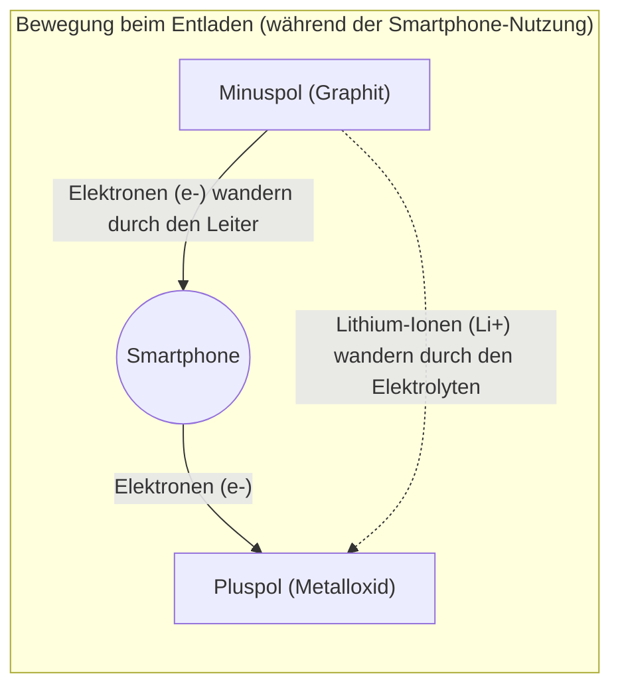

## 1. Der stille Held der mobilen Revolution

In den 1990er Jahren erlebten Mobiltelefone eine dramatische Entwicklung von riesigen und schweren „Schultertelefonen“ hin zu Geräten im Taschenformat. Die Technologie, die diese „mobile Revolution“ im Wesentlichen unterstützte, war die „**Lithium-Ionen-Batterie**“, die 1991 von Sony als Weltneuheit kommerzialisiert wurde.

Im Vergleich zu den damals vorherrschenden Nickel-Cadmium- und Blei-Säure-Batterien hatten Lithium-Ionen-Batterien eine traumhafte Leistung: Sie waren „überwältigend leicht, klein und hatten eine hohe Spannung“. Heute sind sie nicht nur auf Smartphones und Laptops beschränkt, sondern haben sich als Herzstück von Elektrofahrzeugen (EVs) wie denen von Tesla zu einer Schlüsseltechnologie für eine dekarbonisierte Gesellschaft entwickelt. Im Jahr 2019 erhielten Akira Yoshino und andere Forscher, die zu ihrer Entwicklung beigetragen haben, den Nobelpreis für Chemie.

Warum können Lithium-Ionen-Batterien eine so hohe Leistung erbringen?

## 2. Physikalische und chemische Gründe für die Wahl von Lithium

Dass „**Lithium (Li)**“ als Hauptakteur der Batterie ausgewählt wurde, hat unvermeidliche Gründe, die aus den Eigenschaften des Elements resultieren.

Stellen Sie sich das Periodensystem vor. Lithium ist nach Wasserstoff und Helium das drittleichteste Element. Unter den Metallen ist es das **leichteste Element (mit der geringsten Dichte)**.
Darüber hinaus hat Lithium nur ein Elektron auf seiner äußersten Bahn und die Eigenschaft, dass es dieses Elektron sehr gerne abgeben möchte (sehr hohe Ionisierungstendenz).

Das Verlangen, ein Elektron abzugeben, bedeutet mit anderen Worten, dass „die Kraft, eine hohe Spannung zu erzeugen, stark ist“.
Durch die Verwendung von Lithium kann eine Batterie hergestellt werden, die „sehr leicht und gleichzeitig leistungsstark (hochspannend)“ ist – eine ideale Batterie für mobile Geräte.

## 3. Der Mechanismus des Ladens und Entladens: Die Reise von Ionen und Elektronen

Das Innere einer Batterie besteht im Wesentlichen aus drei Komponenten:
1. **Pluspol (Kathode)**: Metalloxide wie Lithiumkobaltoxid
2. **Minuspol (Anode)**: Graphit (Kohlenstoffschichten)
3. **Elektrolyt und Separator**: Eine Flüssigkeit und eine Membran, die nur Ionen durchlassen, aber keine Elektronen.

Der Grund, warum Lithium-Ionen-Batterien wiederholt „geladen und entladen“ werden können, ist, dass Lithium zu „Ionen“ (ein Zustand, in dem es ein Elektron verloren hat) wird und zwischen dem Plus- und Minuspol hin und her wandert. Dies wird als „**Schaukelstuhl-Modell**“ bezeichnet.

### [Beim Laden] Der Prozess der Energiespeicherung
Wenn Elektrizität (Elektronen) aus der Steckdose zugeführt wird, läuft folgende Reaktion ab:
1. Den Lithiumatomen am Pluspol werden Elektronen entzogen, wodurch sie zu **Lithium-Ionen (Li+)** werden.
2. Die Elektronen werden gezwungen, über einen Leiter (ein externes Kabel) zum Minuspol zu wandern.
3. Gleichzeitig schwimmen die Lithium-Ionen (Li+) durch den Elektrolyten im Inneren der Batterie und bewegen sich in Richtung des Minuspols.
4. Am Minuspol (in den Zwischenräumen der Graphitschichten) treffen die angekommenen Lithium-Ionen und Elektronen wieder aufeinander, schlüpfen hinein und speichern die Energie.

### [Beim Entladen] Der Prozess der Energiefreigabe (bei Nutzung des Smartphones)
Wenn das Smartphone eingeschaltet wird, geschieht das Gegenteil des Ladevorgangs.
1. Das eng in den Minuspol gequetschte Lithium gibt seine Elektronen ab und wird zu Lithium-Ionen (Li+).
2. Die freigesetzten Elektronen fließen durch die Platine des Smartphones (CPU und Bildschirm) zum Pluspol. **Dieser Durchgang von Elektronen ist der „elektrische Strom“, die Kraft, die das Smartphone antreibt.**
3. Die Lithium-Ionen (Li+) schwimmen erneut durch den Elektrolyten und kehren zum gemütlichen Pluspol zurück.

## 4. Der Kampf gegen Dendriten und die Sicherheitstechnologie

Obwohl die Lithium-Ionen-Batterie eine so hervorragende Erfindung ist, war ihre Entwicklungsgeschichte auch ein Kampf gegen „Brandunfälle“.

Lithium ist ein extrem reaktionsfreudiges Metall. In frühen Forschungen versuchte man, metallisches Lithium selbst für den Minuspol zu verwenden. Durch wiederholtes Laden und Entladen kristallisierte sich das Lithium jedoch auf der Oberfläche des Minuspols und wuchs in „baumartigen (dendritischen)“ Strukturen.
Wenn diese nadelartig spitzen Dendriten wachsen und den Separator (Isolierfolie), der Plus- und Minuspol trennt, durchstoßen, kommt es im Inneren zu einem „Kurzschluss“. Dabei wird eine enorme Menge an Wärmeenergie auf einmal freigesetzt, was zu einer Explosion oder einem Brand führt.

Dieses Problem wurde durch die bahnbrechende Idee von Akira Yoshino und seinem Team gelöst: „Verwenden Sie keine reinen Lithiummetalle für den Minuspol, sondern **Kohlenstoffschichten (Graphit)**.“ Durch die Konstruktion einer Struktur, in der Lithium-Ionen in die Lücken zwischen den Graphitschichten „hinein- und herausrutschen“ können, wurde die Entstehung von Dendriten unterdrückt und sicheres, wiederholtes Laden und Entladen ermöglicht.

## 5. Batterien der nächsten Generation: Der Weg zu Festkörperbatterien

Derzeit wird weltweit intensiv an der „**Festkörperbatterie**“ als nächste Evolutionsstufe der Lithium-Ionen-Batterie geforscht.

Die größte Schwäche herkömmlicher Lithium-Ionen-Batterien ist die Verwendung eines „flüssigen Elektrolyten“. Diese Flüssigkeit ist ein organisches Lösungsmittel und daher brennbar.
Bei einer Festkörperbatterie wird diese Flüssigkeit durch einen „nicht brennbaren, festen Elektrolyten“ ersetzt. Es wird erwartet, dass dadurch nicht nur das Brandrisiko auf nahezu null sinkt, sondern auch die Ladegeschwindigkeit drastisch erhöht und die Lebensdauer erheblich verlängert wird.

## 6. Zusammenfassung

Eine Lithium-Ionen-Batterie ist nicht einfach nur ein „Behälter für Elektrizität“. In ihrem Inneren entfaltet sich eine faszinierende und dynamische Welt, in der Lithium-Ionen und Elektronen nach den Gesetzen der Chemie und Physik unaufhörlich zwischen dem Plus- und Minuspol hin und her wandern.
Die Tatsache, dass wir Informationen aus der ganzen Welt in unserer Handfläche abrufen können und dass Elektroautos geräuschlos durch die Straßen fahren, ist alles diesem kontinuierlichen Hin- und Herwechseln (Schaukelstuhl-Modell) dieser kleinen Lithium-Ionen zu verdanken.
