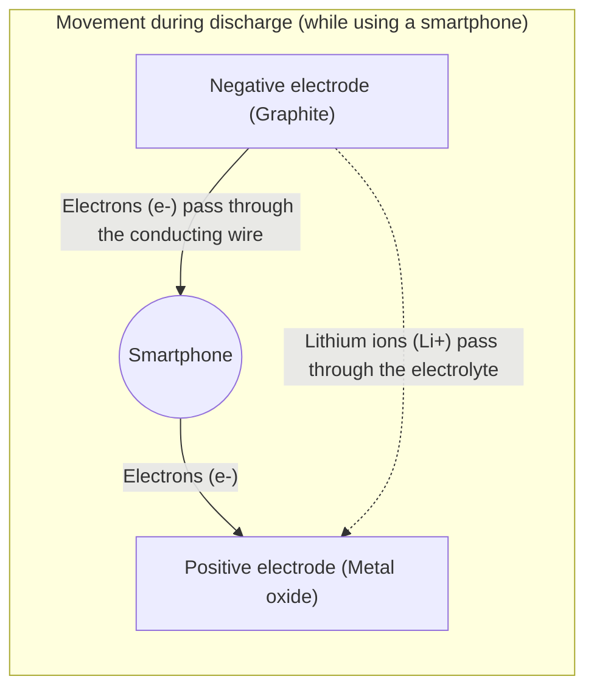

## 1. The Unsung Hero of the Mobile Revolution

In the 1990s, mobile phones underwent a dramatic evolution from huge, heavy "shoulder phones" to pocket-sized devices. The technology that fundamentally supported this "mobile revolution" was the "**lithium-ion battery**," first commercialized in the world by Sony in 1991.

Compared to the previously mainstream NiCd and lead-acid batteries, lithium-ion batteries possessed the dream-like performance of being "overwhelmingly light, small, and high-voltage." Today, they have grown beyond smartphones and laptops to become the heart of electric vehicles (EVs) like Tesla, and the key technology for a decarbonized society. In 2019, Akira Yoshino and others were awarded the Nobel Prize in Chemistry for their contributions to its development.

Why can lithium-ion batteries exhibit such high performance?

## 2. Physical and Chemical Reasons Why Lithium Was Chosen

There is an inevitable reason based on the properties of elements why "**lithium (Li)**" was chosen as the star of the battery.

Imagine the periodic table. Lithium is the third lightest element, following hydrogen and helium. Among metals, it is the **lightest (lowest density) element**.
Furthermore, lithium has only one electron in its outermost orbit, and it has a strong tendency to let go of this electron (extremely high ionization tendency).

Wanting to let go of an electron, in other words, means "having a strong force to generate a high voltage."
By using lithium, it is possible to create an ideal battery for mobile devices that is "very light, yet powerful (high voltage)."

## 3. The Mechanism of Charge and Discharge: Relocation of Ions and Electrons

The inside of a battery is broadly composed of three parts.
1. **Positive electrode (Cathode)**: Metal oxides such as lithium cobalt oxide
2. **Negative electrode (Anode)**: Graphite (layers of carbon)
3. **Electrolyte and Separator**: Liquid and membrane that allow only ions to pass through, but not electrons

The reason a lithium-ion battery can repeat "charging and discharging" is that lithium becomes an "ion (a state without an electron)" and travels back and forth between the positive and negative electrodes. This is called the "**rocking-chair model**."

### [During Charging] The Process of Storing Energy
When electricity (electrons) is poured in from an outlet, the following reactions occur:
1. Electrons are stripped from the lithium atoms at the positive electrode, becoming **lithium ions (Li+)**.
2. The electrons are forcibly moved to the negative electrode through a conducting wire (external cable).
3. Meanwhile, the lithium ions (Li+) swim through the electrolyte inside the battery and head toward the negative electrode.
4. At the negative electrode (between the layers of graphite), the arriving lithium ions and electrons meet again, slip into the gaps, and store energy.

### [During Discharging] The Process of Releasing Energy (While using a smartphone)
When you turn on the smartphone, the opposite of charging occurs.
1. The lithium, tightly packed in the negative electrode, lets go of its electrons to become lithium ions (Li+).
2. The released electrons flow toward the positive electrode through the smartphone's circuit board (CPU and screen). **This passing of electrons is the "current" and becomes the power that runs the smartphone.**
3. The lithium ions (Li+) swim through the electrolyte again and return to the comfortable positive electrode.

## 4. The Battle with Dendrites and Safety Technology

Despite being such excellent lithium-ion batteries, their history of development was also a battle against "fire accidents."

Lithium is a highly reactive metal. In early research, they tried using metallic lithium itself for the negative electrode. However, as charging and discharging were repeated, a phenomenon occurred where lithium crystallized and grew in a "dendritic (tree-like)" shape on the surface of the negative electrode.
When these needle-sharp dendrites grew and pierced the separator (insulating membrane) that separates the positive and negative electrodes, a "short circuit" occurred internally, releasing an enormous amount of heat energy at once and causing explosions or fires.

What solved this was the groundbreaking idea by Akira Yoshino and others to "use **layers of carbon (graphite)** for the negative electrode instead of metallic lithium itself." By adopting a structure that allows lithium ions to "enter and exit" the gaps between the layers of graphite, the generation of dendrites was suppressed, making it possible to safely repeat charging and discharging.

## 5. Next-Generation Batteries: Toward All-Solid-State Batteries

Currently, the "**all-solid-state battery**" is being rapidly developed around the world as the further evolution of lithium-ion batteries.

The biggest weakness of conventional lithium-ion batteries is that they use a "liquid electrolyte." This liquid is an organic solvent and is flammable.
In an all-solid-state battery, this liquid is replaced by a "non-flammable solid electrolyte." This is expected not only to reduce the risk of fire to almost zero but also to dramatically speed up charging times and significantly extend battery life.

## 6. Conclusion

A lithium-ion battery is not just an "electricity container." Inside it, a beautiful yet dynamic world unfolds where lithium ions and electrons constantly travel back and forth between the positive and negative electrodes according to the laws of chemistry and physics.
The ability to pull up information from all over the world in the palm of our hands, and the electric vehicles that run silently through the streets, are all thanks to the ceaseless side-to-side jumps (rocking chair) of these tiny lithium ions.
