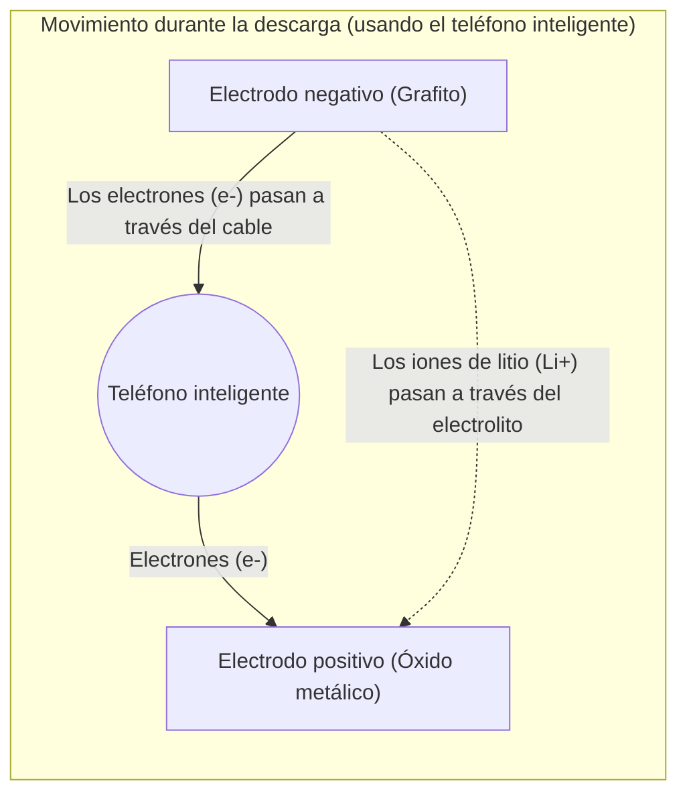

## 1. El héroe anónimo de la revolución móvil

En la década de 1990, los teléfonos móviles experimentaron una evolución dramática, pasando de ser enormes y pesados teléfonos de hombro a tener un tamaño que cabía en el bolsillo. La tecnología que sustentó fundamentalmente esta "revolución móvil" fue la "**batería de iones de litio**", comercializada por primera vez en el mundo por Sony en 1991.

En comparación con las baterías de níquel-cadmio y de plomo-ácido que predominaban hasta entonces, las baterías de iones de litio tenían un rendimiento de ensueño: eran "abrumadoramente más ligeras, más pequeñas y tenían un voltaje más alto". En la actualidad, han crecido hasta convertirse en una tecnología clave para una sociedad descarbonizada, no solo para teléfonos inteligentes y computadoras portátiles, sino también como el corazón de los vehículos eléctricos (VE) como los de Tesla. En 2019, Akira Yoshino y otros investigadores fueron galardonados con el Premio Nobel de Química por sus contribuciones a su desarrollo.

¿Por qué las baterías de iones de litio pueden ofrecer un rendimiento tan alto?

## 2. Razones físicas y químicas por las que se eligió el litio

Hay razones inevitables derivadas de las propiedades de los elementos por las que se eligió el "**litio (Li)**" como protagonista de las baterías.

Imagina la tabla periódica. El tercer elemento más ligero después del hidrógeno y el helio es el litio. Entre los metales, es el **elemento más ligero (de menor densidad)**.
Además, el litio tiene solo un electrón en su órbita más externa, y tiene la propiedad de estar muy dispuesto a desprenderse de este electrón (su tendencia a la ionización es extremadamente grande).

Estar dispuesto a desprenderse de electrones significa, en otras palabras, que "la fuerza para generar un alto voltaje es fuerte".
Al usar litio, es posible crear una batería ideal para dispositivos móviles, que es "muy ligera y, al mismo tiempo, potente (alto voltaje)".

## 3. El mecanismo de carga y descarga: El movimiento de iones y electrones

El interior de la batería se compone a grandes rasgos de tres componentes.
1. **Electrodo positivo (cátodo)**: Óxidos metálicos como el óxido de litio y cobalto.
2. **Electrodo negativo (ánodo)**: Grafito (capas de carbono).
3. **Electrolito y separador**: Líquido y membrana que permiten el paso solo de iones y no de electrones.

La razón por la que las baterías de iones de litio pueden repetir la "carga y descarga" es porque el litio se convierte en un "ion (un estado en el que ha perdido electrones)" y viaja de un lado a otro entre el electrodo positivo y el electrodo negativo. A esto se le llama el "**modelo de mecedora**".

### 【Durante la carga】 El proceso de almacenamiento de energía
Cuando se introduce electricidad (electrones) desde un enchufe, se produce la siguiente reacción:
1. A los átomos de litio en el electrodo positivo se les arrancan sus electrones, convirtiéndose en **iones de litio (Li+)**.
2. Los electrones son obligados a moverse hacia el electrodo negativo a través de un cable conductor (cable externo).
3. Por otro lado, los iones de litio (Li+) nadan a través del electrolito dentro de la batería en dirección al electrodo negativo.
4. En el electrodo negativo (en los espacios entre las capas de grafito), los iones de litio que han llegado y los electrones se vuelven a encontrar, se introducen allí y se encuentran en un estado de almacenamiento de energía.

### 【Durante la descarga】 El proceso de liberación de energía (cuando se usa el teléfono inteligente)
Cuando enciendes tu teléfono inteligente, ocurre lo contrario a la carga.
1. El litio que estaba apretujado en el electrodo negativo libera sus electrones y se convierte en iones de litio (Li+).
2. Los electrones liberados fluyen hacia el electrodo positivo a través de la placa base (CPU y pantalla) del teléfono inteligente. **Este paso de electrones es la "corriente eléctrica" y es la fuerza que hace funcionar al teléfono inteligente.**
3. Los iones de litio (Li+) nadan nuevamente a través del electrolito y regresan al cómodo electrodo positivo.

## 4. La batalla contra las dendritas y la tecnología de seguridad

A pesar de ser una batería tan excelente, la historia de su desarrollo también fue una batalla contra los "accidentes por incendio".

El litio es un metal altamente reactivo. En las primeras investigaciones, intentaron usar litio metálico en sí mismo para el electrodo negativo. Sin embargo, a medida que se repetía la carga y descarga, se produjo un fenómeno en el que el litio cristalizaba y crecía en forma de "ramas (dendritas)" en la superficie del electrodo negativo.
Si estas dendritas afiladas como agujas crecen y atraviesan el separador (película aislante) que separa los electrodos positivo y negativo, se produce un "cortocircuito" en el interior y se libera una enorme cantidad de energía térmica a la vez, causando explosiones o incendios.

Lo que resolvió esto fue la innovadora idea de Akira Yoshino y otros de "no usar litio metálico en sí para el electrodo negativo, sino usar una **capa de carbono (grafito)**". Al crear una estructura en la que los iones de litio "entran y salen" de los espacios en las capas de grafito, lograron suprimir la generación de dendritas y hacer posible la repetición de cargas y descargas de forma segura.

## 5. La próxima generación de baterías: Hacia las baterías de estado sólido

Actualmente, las "**baterías de estado sólido**" se están desarrollando rápidamente en todo el mundo como una evolución futura de las baterías de iones de litio.

La mayor debilidad de las baterías de iones de litio convencionales es que utilizan un "electrolito líquido". Este líquido es un disolvente orgánico y tiene propiedades inflamables.
En las baterías de estado sólido, este líquido se reemplaza por un "electrolito sólido no inflamable". Con esto, no solo el riesgo de incendio se reduce a casi cero, sino que también se espera que la velocidad de carga sea dramáticamente más rápida y la vida útil de la batería se extienda significativamente.

## 6. Resumen

La batería de iones de litio no es solo un simple "recipiente para la electricidad". En su interior se despliega un mundo hermoso y dinámico donde los iones de litio y los electrones viajan continuamente de un lado a otro entre el electrodo positivo y el negativo, siguiendo las leyes de la química y la física.
El hecho de que podamos extraer información de todo el mundo en la palma de nuestra mano, y que los vehículos eléctricos conduzcan por la ciudad sin hacer ruido, se debe a los constantes movimientos laterales (como una mecedora) de estos pequeños iones de litio.
