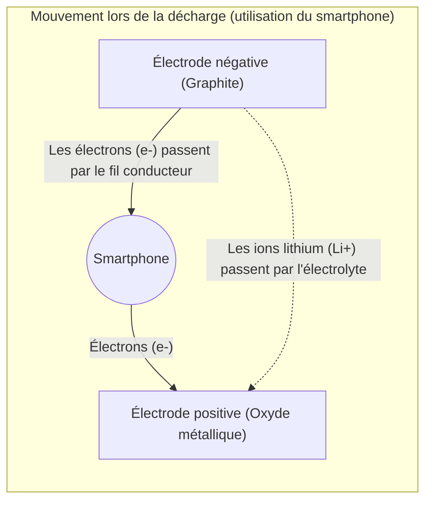

## 1. Le héros de l'ombre de la révolution mobile

Dans les années 1990, les téléphones portables ont connu une évolution spectaculaire, passant d'appareils massifs et lourds portés en bandoulière à des formats tenant dans la poche. La technologie qui a fondamentalement soutenu cette « révolution mobile » est la « **batterie lithium-ion** », commercialisée pour la première fois au monde par Sony en 1991.

Comparée aux batteries nickel-cadmium et au plomb, qui étaient courantes jusqu'alors, la batterie lithium-ion offrait des performances de rêve : « extrêmement légère, compacte et dotée d'une tension élevée ». Aujourd'hui, elle ne se limite plus aux smartphones et aux ordinateurs portables, mais est devenue le cœur des véhicules électriques (VE) tels que ceux de Tesla, ce qui en fait une technologie clé pour une société décarbonée. En 2019, le prix Nobel de chimie a été décerné à Akira Yoshino et à ses collègues pour leur contribution à son développement.

Pourquoi la batterie lithium-ion peut-elle offrir des performances aussi élevées ?

## 2. Raisons physiques et chimiques du choix du lithium

Le choix du « **lithium (Li)** » comme acteur principal des batteries s'explique par des raisons inhérentes aux propriétés de cet élément.

Imaginez le tableau périodique. Après l'hydrogène et l'hélium, le lithium est le troisième élément le plus léger. Parmi les métaux, c'est **l'élément le plus léger (à la densité la plus faible)**.
De plus, le lithium ne possède qu'un seul électron sur son orbite la plus externe, et il a une très forte tendance à s'en débarrasser (son énergie d'ionisation est extrêmement élevée).

Vouloir se débarrasser d'un électron signifie, en d'autres termes, que « la capacité à générer une tension élevée est forte ».
En utilisant du lithium, il est possible de créer une batterie idéale pour les appareils mobiles : « très légère, et en même temps puissante (haute tension) ».

## 3. Le mécanisme de charge et décharge : le déplacement des ions et des électrons

L'intérieur de la batterie se compose principalement de trois éléments.
1. **L'électrode positive (cathode)** : oxydes métalliques tels que l'oxyde de cobalt-lithium.
2. **L'électrode négative (anode)** : graphite (couches de carbone).
3. **L'électrolyte et le séparateur** : un liquide et une membrane qui ne laissent passer que les ions, bloquant les électrons.

La batterie lithium-ion peut répéter la « charge et décharge » parce que le lithium devient un « ion (état dans lequel il a perdu un électron) » et fait des allers-retours entre l'électrode positive et l'électrode négative. C'est ce qu'on appelle le « **modèle de la chaise à bascule** ».

### [Lors de la charge] Le processus de stockage de l'énergie
Lorsqu'on injecte de l'électricité (des électrons) à partir d'une prise de courant, la réaction suivante se produit :
1. Les électrons sont arrachés aux atomes de lithium présents dans l'électrode positive, devenant ainsi des **ions lithium (Li+)**.
2. Les électrons sont forcés de se déplacer vers l'électrode négative à travers un fil conducteur (le câble externe).
3. Pendant ce temps, les ions lithium (Li+) nagent à travers l'électrolyte à l'intérieur de la batterie pour rejoindre l'électrode négative.
4. À l'électrode négative (dans les espaces des couches de graphite), les ions lithium et les électrons arrivés se retrouvent, s'y logent et stockent ainsi de l'énergie.

### [Lors de la décharge] Le processus de libération de l'énergie (lors de l'utilisation du smartphone)
Lorsque vous allumez votre smartphone, l'inverse de la charge se produit.
1. Le lithium, confiné à l'étroit dans l'électrode négative, libère ses électrons pour devenir des ions lithium (Li+).
2. Les électrons libérés traversent le circuit du smartphone (le processeur et l'écran) en direction de l'électrode positive. **Ce passage des électrons constitue le « courant électrique », qui est la force permettant de faire fonctionner le smartphone.**
3. Les ions lithium (Li+) nagent à nouveau à travers l'électrolyte pour retourner dans l'électrode positive, où ils sont plus à l'aise.

## 4. La lutte contre les dendrites et les technologies de sécurité

Bien que la batterie lithium-ion soit exceptionnelle, l'histoire de son développement a également été marquée par la lutte contre les « incidents d'incendie ».

Le lithium est un métal extrêmement réactif. Dans les premières recherches, on tentait d'utiliser du lithium métallique pur pour l'électrode négative. Cependant, au fil des cycles de charge et de décharge, un phénomène de cristallisation du lithium se produisait à la surface de l'électrode négative, formant des ramifications appelées « dendrites ».
Lorsque ces dendrites pointues comme des aiguilles se développaient jusqu'à percer le séparateur (le film isolant) qui sépare les électrodes positive et négative, un « court-circuit » interne se produisait, libérant brusquement une énorme quantité d'énergie thermique et provoquant des explosions ou des incendies.

Ce problème a été résolu par l'idée révolutionnaire d'Akira Yoshino et de ses collègues : « utiliser une **couche de carbone (graphite)** pour l'électrode négative plutôt que du lithium métallique pur ». En concevant une structure permettant aux ions lithium d'« entrer et sortir » dans les espaces de la couche de graphite, la formation de dendrites a été contenue, rendant possible la répétition des charges et décharges en toute sécurité.

## 5. La batterie de nouvelle génération : vers la batterie tout solide

Actuellement, dans le monde entier, le développement de la « **batterie tout solide** » s'accélère en tant qu'évolution supplémentaire de la batterie lithium-ion.

Le principal point faible de la batterie lithium-ion traditionnelle est l'utilisation d'un « électrolyte liquide ». Ce liquide est un solvant organique, qui a des propriétés inflammables.
Dans la batterie tout solide, ce liquide est remplacé par un « électrolyte solide ininflammable ». Grâce à cela, on s'attend non seulement à ce que le risque d'incendie soit réduit presque à zéro, mais aussi à ce que la vitesse de charge devienne considérablement plus rapide et la durée de vie soit considérablement prolongée.

## 6. Conclusion

La batterie lithium-ion n'est pas un simple « conteneur d'électricité ». À l'intérieur, un monde aussi beau que dynamique se déploie : les ions lithium et les électrons font des allers-retours incessants entre les électrodes positive et négative, obéissant aux lois de la chimie et de la physique.
Si nous pouvons accéder aux informations du monde entier dans le creux de nos mains et si les voitures électriques parcourent silencieusement nos villes, c'est grâce à ces incessants sauts latéraux (la chaise à bascule) de ces petits ions lithium.
