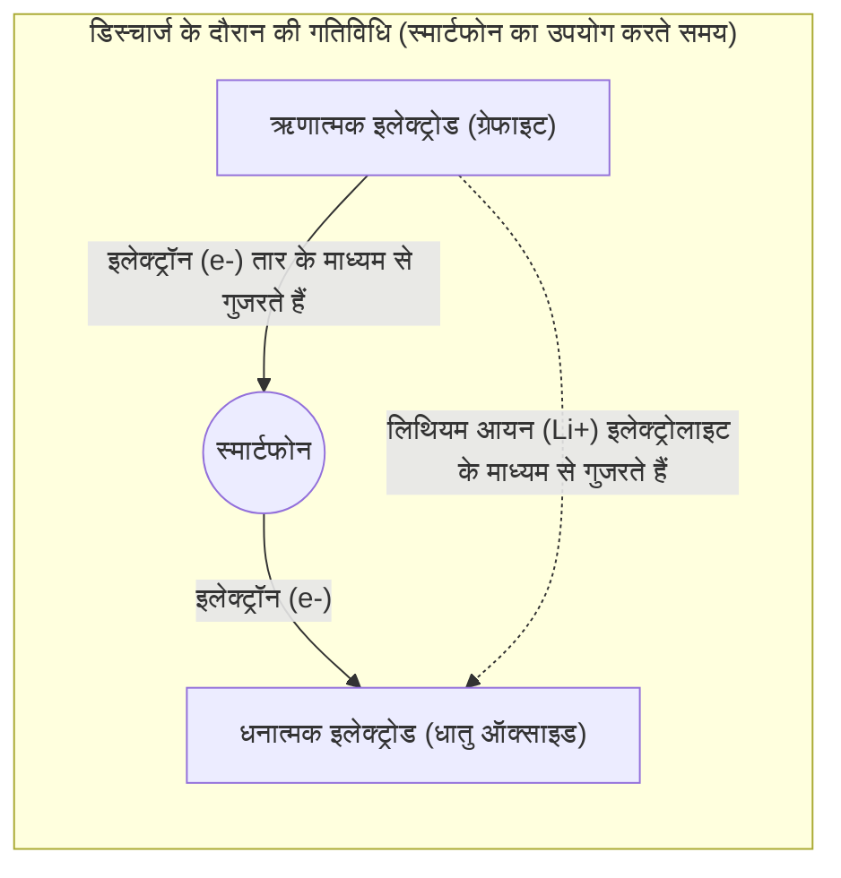

## 1. मोबाइल क्रांति के गुमनाम नायक

1990 के दशक में, मोबाइल फोन भारी और बड़े "शोल्डर फोन" से विकसित होकर जेब में फिट होने वाले आकार में नाटकीय रूप से बदल गए। इस "[मोबाइल क्रांति](/hi/p/history-of-iphone/)" को मौलिक रूप से समर्थन देने वाली तकनीक वास्तव में "**लिथियम-आयन बैटरी**" है, जिसका 1991 में सोनी द्वारा दुनिया में पहली बार व्यावसायीकरण किया गया था।

उस समय तक मुख्यधारा में रही NiCd (निकेल-कैडमियम) बैटरी और लेड-एसिड बैटरी की तुलना में, लिथियम-आयन बैटरी में "अत्यधिक हल्की, छोटी और उच्च वोल्टेज" जैसी अद्भुत विशेषताएं थीं। वर्तमान में, यह न केवल स्मार्टफोन और लैपटॉप में, बल्कि टेस्ला जैसे इलेक्ट्रिक वाहनों (EV) के दिल के रूप में, एक डीकार्बोनाइज्ड समाज की कुंजी रखने वाली तकनीक के रूप में विकसित हुई है। 2019 में, इसके विकास में योगदान देने वाले अकीरा योशिनो और अन्य लोगों को रसायन विज्ञान में नोबेल पुरस्कार से सम्मानित किया गया था।

लिथियम-आयन बैटरी इतना उच्च प्रदर्शन कैसे कर सकती है?

## 2. लिथियम को चुने जाने के भौतिक और रासायनिक कारण

बैटरी के मुख्य घटक के रूप में "**लिथियम (Li)**" को चुने जाने का एक अपरिहार्य कारण है जो तत्व के गुणों से आता है।

आवर्त सारणी (Periodic Table) की कल्पना करें। हाइड्रोजन और हीलियम के बाद लिथियम तीसरा सबसे हल्का तत्व है। यह धातुओं में **सबसे हल्का (सबसे कम घनत्व वाला) तत्व** है।
इसके अलावा, लिथियम के सबसे बाहरी कक्ष (Orbit) में केवल एक इलेक्ट्रॉन होता है, और इसमें इस इलेक्ट्रॉन को बहुत आसानी से छोड़ने (अत्यधिक उच्च आयनीकरण प्रवृत्ति) की विशेषता होती है।

इलेक्ट्रॉन को छोड़ने की प्रवृत्ति का मतलब है, दूसरे शब्दों में, "उच्च वोल्टेज उत्पन्न करने की मजबूत शक्ति" होना।
लिथियम का उपयोग करके, एक ऐसी बैटरी बनाई जा सकती है जो "बहुत हल्की और फिर भी शक्तिशाली (उच्च वोल्टेज)" हो, जो मोबाइल उपकरणों के लिए आदर्श है।

## 3. चार्जिंग और डिस्चार्जिंग का तंत्र: आयनों और इलेक्ट्रॉनों का स्थानांतरण

बैटरी का आंतरिक भाग मोटे तौर पर तीन घटकों से बना होता है:
1. **धनात्मक इलेक्ट्रोड (कैथोड)**: लिथियम कोबाल्ट ऑक्साइड जैसे धातु ऑक्साइड
2. **ऋणात्मक इलेक्ट्रोड (एनोड)**: ग्रेफाइट (कार्बन की परतें)
3. **इलेक्ट्रोलाइट और सेपरेटर**: एक तरल और झिल्ली जो केवल आयनों को गुजरने देती है लेकिन इलेक्ट्रॉनों को नहीं

लिथियम-आयन बैटरी "चार्ज और डिस्चार्ज" को बार-बार दोहरा सकती है क्योंकि लिथियम एक "आयन (इलेक्ट्रॉन खोने की अवस्था)" बन जाता है और धनात्मक इलेक्ट्रोड और ऋणात्मक इलेक्ट्रोड के बीच आगे-पीछे जाता है। इसे "**रॉकिंग चेयर मॉडल**" कहा जाता है।

### 【चार्जिंग के दौरान】 ऊर्जा संचय करने की प्रक्रिया
जब आउटलेट से बिजली (इलेक्ट्रॉन) प्रवाहित की जाती है, तो निम्नलिखित प्रतिक्रियाएं होती हैं:
1. धनात्मक इलेक्ट्रोड में लिथियम परमाणुओं से इलेक्ट्रॉन छीन लिए जाते हैं, और वे **लिथियम आयन (Li+)** बन जाते हैं।
2. इलेक्ट्रॉनों को एक तार (बाहरी केबल) के माध्यम से ऋणात्मक इलेक्ट्रोड की ओर जाने के लिए मजबूर किया जाता है।
3. इस बीच, लिथियम आयन (Li+) बैटरी के अंदर इलेक्ट्रोलाइट के माध्यम से तैरते हैं और ऋणात्मक इलेक्ट्रोड की ओर बढ़ते हैं।
4. ऋणात्मक इलेक्ट्रोड (ग्रेफाइट परतों के बीच का अंतराल) पर, आने वाले लिथियम आयन और इलेक्ट्रॉन फिर से मिलते हैं, और वे वहां ऊर्जा को संग्रहित करने के लिए फिसल जाते हैं।

### 【डिस्चार्ज के दौरान】 ऊर्जा जारी करने की प्रक्रिया (जब स्मार्टफोन का उपयोग किया जाता है)
जब आप स्मार्टफोन चालू करते हैं, तो चार्जिंग के दौरान जो हुआ था उसका ठीक उल्टा होता है।
1. ऋणात्मक इलेक्ट्रोड में कसकर धकेला गया लिथियम अपने इलेक्ट्रॉन को छोड़ देता है और लिथियम आयन (Li+) बन जाता है।
2. जारी किए गए इलेक्ट्रॉन स्मार्टफोन के सर्किट बोर्ड (CPU या स्क्रीन) से गुजरते हैं और धनात्मक इलेक्ट्रोड की ओर प्रवाहित होते हैं। **इलेक्ट्रॉनों का यह प्रवाह "विद्युत प्रवाह" (Current) है, जो स्मार्टफोन को चलाने की शक्ति बन जाता है।**
3. लिथियम आयन (Li+) फिर से इलेक्ट्रोलाइट में तैरते हैं और अपने आरामदायक स्थान, धनात्मक इलेक्ट्रोड पर लौट आते हैं।

## 4. डेंड्राइट के साथ लड़ाई और सुरक्षा तकनीक

हालांकि लिथियम-आयन बैटरी इतनी उत्कृष्ट है, इसके विकास का इतिहास "आग लगने की दुर्घटनाओं" के साथ लड़ाई भी रहा है।

लिथियम अत्यधिक प्रतिक्रियाशील धातु है। शुरुआती शोध में, धातु लिथियम का उपयोग सीधे ऋणात्मक इलेक्ट्रोड में करने का प्रयास किया गया था। हालांकि, जैसे-जैसे चार्जिंग और डिस्चार्जिंग को दोहराया गया, लिथियम ऋणात्मक इलेक्ट्रोड की सतह पर "पेड़ की शाखाओं (डेंड्राइट)" के आकार में क्रिस्टलीकृत हो गया और बढ़ने लगा।
जब यह सुई जैसा नुकीला डेंड्राइट बढ़ता है और धनात्मक इलेक्ट्रोड और ऋणात्मक इलेक्ट्रोड को अलग करने वाले सेपरेटर (इंसुलेटिंग फिल्म) को छेद देता है, तो अंदर एक "शॉर्ट सर्किट" होता है, और भारी मात्रा में तापीय ऊर्जा एक साथ निकलती है, जिससे विस्फोट या आग लग जाती है।

इस समस्या को अकीरा योशिनो और अन्य लोगों के क्रांतिकारी विचार से हल किया गया था: "ऋणात्मक इलेक्ट्रोड के लिए धातु लिथियम का उपयोग करने के बजाय, **कार्बन (ग्रेफाइट) की परत** का उपयोग करें।" एक ऐसी संरचना बनाकर जिसमें लिथियम आयन ग्रेफाइट परतों के बीच अंतराल में "अंदर और बाहर" जा सकते हैं, डेंड्राइट की वृद्धि को दबा दिया गया और सुरक्षित रूप से चार्जिंग और डिस्चार्जिंग को बार-बार दोहराना संभव हो गया।

## 5. अगली पीढ़ी की बैटरी: सॉलिड-स्टेट बैटरी की ओर

वर्तमान में, लिथियम-आयन बैटरी के और विकास के रूप में, दुनिया भर में जिस चीज़ को तेजी से विकसित किया जा रहा है वह "**सॉलिड-स्टेट बैटरी**" है।

पारंपरिक लिथियम-आयन बैटरी की सबसे बड़ी कमजोरी यह है कि वे "तरल इलेक्ट्रोलाइट" का उपयोग करती हैं। यह तरल एक कार्बनिक विलायक है और इसमें ज्वलनशील गुण होते हैं।
सॉलिड-स्टेट बैटरी में, इस तरल को "गैर-ज्वलनशील ठोस इलेक्ट्रोलाइट" से बदल दिया जाता है। उम्मीद की जा रही है कि इससे न केवल आग लगने का जोखिम लगभग शून्य हो जाएगा, बल्कि चार्जिंग की गति नाटकीय रूप से तेज हो जाएगी और जीवनकाल भी काफी बढ़ जाएगा।

## 6. निष्कर्ष

लिथियम-आयन बैटरी केवल "बिजली का कंटेनर" नहीं है। इसके अंदर, रासायनिक और भौतिक नियमों के अनुसार, धनात्मक और ऋणात्मक इलेक्ट्रोड के बीच लिथियम आयनों और इलेक्ट्रॉनों के लगातार आगे-पीछे होने की एक सुंदर लेकिन गतिशील दुनिया मौजूद है।
हम अपने हाथों की हथेलियों से दुनिया भर की जानकारी प्राप्त कर सकते हैं, और इलेक्ट्रिक वाहन बिना शोर किए शहरों में चल सकते हैं - यह सब इन छोटे लिथियम आयनों की निरंतर रॉकिंग-चेयर (आगे-पीछे) गति के कारण संभव है।
