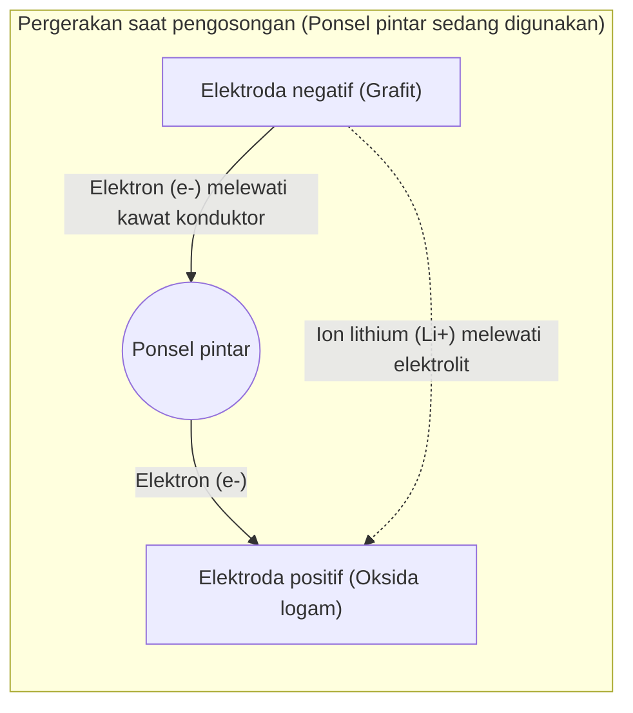

## 1. Pahlawan di Balik Layar Revolusi Seluler

Pada tahun 1990-an, ponsel berevolusi secara dramatis dari "telepon bahu" yang besar dan berat menjadi ukuran yang pas di saku. Teknologi yang mendasari "[revolusi seluler](/id/p/history-of-iphone/)" ini adalah "**baterai lithium-ion**" yang dikomersialkan untuk pertama kalinya di dunia oleh Sony pada tahun 1991.

Dibandingkan dengan baterai nikel-kadmium dan baterai asam timbal yang merupakan arus utama pada saat itu, baterai lithium-ion memiliki performa impian, yaitu "sangat ringan, kecil, dan memiliki tegangan tinggi". Saat ini, tidak hanya terbatas pada ponsel pintar dan laptop, baterai ini telah berkembang menjadi teknologi kunci untuk masyarakat dekarbonisasi sebagai jantung dari kendaraan listrik (EV) seperti Tesla. Pada tahun 2019, Penghargaan Nobel Kimia dianugerahkan kepada Akira Yoshino dan lainnya yang berkontribusi pada pengembangannya.

Mengapa baterai lithium-ion mampu memberikan performa setinggi itu?

## 2. Alasan Fisik dan Kimia di Balik Pemilihan Lithium

Ada alasan yang tak terelakkan yang berasal dari sifat unsur mengapa "**Lithium (Li)**" dipilih sebagai pemeran utama untuk baterai.

Bayangkan tabel periodik. Unsur teringan ketiga setelah hidrogen dan helium adalah lithium. Di antara logam, ini adalah **unsur paling ringan (kepadatan terendah)**.
Selain itu, lithium hanya memiliki satu elektron di orbit terluarnya, dan memiliki sifat sangat ingin melepaskan elektron ini (kecenderungan ionisasinya sangat tinggi).

Keinginan untuk melepaskan elektron, dengan kata lain, berarti "memiliki kekuatan besar untuk menghasilkan tegangan tinggi".
Dengan menggunakan lithium, kita dapat membuat baterai ideal untuk perangkat seluler yang "sangat ringan namun kuat (tegangan tinggi)".

## 3. Mekanisme Pengisian dan Pengosongan: Perpindahan Ion dan Elektron

Bagian dalam baterai secara garis besar terdiri dari tiga komponen.
1. **Elektroda positif (kutub positif)**: Oksida logam seperti lithium kobalt oksida
2. **Elektroda negatif (kutub negatif)**: Grafit (karbon berlapis)
3. **Elektrolit dan separator**: Cairan dan membran yang hanya melewatkan ion dan bukan elektron

Alasan baterai lithium-ion dapat berulang kali "diisi (charge) dan dikosongkan (discharge)" adalah karena lithium menjadi "ion (keadaan kehilangan elektron)" dan bergerak bolak-balik antara elektroda positif dan elektroda negatif. Ini disebut "**model kursi goyang (rocking-chair model)**".

### [Saat Pengisian Daya] Proses Menyimpan Energi
Ketika listrik (elektron) dialirkan dari stopkontak, reaksi berikut terjadi.
1. Elektron ditarik dari atom lithium yang berada di elektroda positif, mengubahnya menjadi **ion lithium (Li+)**.
2. Elektron dipaksa bergerak ke elektroda negatif melalui kawat konduktor (kabel eksternal).
3. Sementara itu, ion lithium (Li+) berenang melalui elektrolit di dalam baterai menuju elektroda negatif.
4. Di elektroda negatif (celah di antara lapisan grafit), ion lithium yang tiba dan elektron bertemu kembali, menyusup ke dalamnya, dan berada dalam keadaan menyimpan energi.

### [Saat Pengosongan Daya] Proses Melepaskan Energi (Saat menggunakan ponsel pintar)
Saat Anda menyalakan ponsel pintar, hal yang sebaliknya dari pengisian daya terjadi.
1. Lithium yang terkurung secara sempit di elektroda negatif melepaskan elektronnya dan menjadi ion lithium (Li+).
2. Elektron yang dilepaskan mengalir ke elektroda positif melalui papan sirkuit ponsel pintar (CPU dan layar). **Aliran elektron inilah yang disebut "arus listrik", yang menjadi tenaga untuk menggerakkan ponsel pintar.**
3. Ion lithium (Li+) kembali berenang melewati elektrolit dan kembali ke elektroda positif yang nyaman.

## 4. Pertempuran Melawan Dendrit dan Teknologi Keselamatan

Meskipun baterai lithium-ion sangat luar biasa, sejarah pengembangannya juga merupakan pertempuran melawan "insiden kebakaran".

Lithium adalah logam yang sangat reaktif. Dalam penelitian awal, logam lithium itu sendiri dicoba digunakan pada elektroda negatif. Namun, saat siklus pengisian dan pengosongan diulang, terjadi fenomena di mana lithium mengkristal dan memanjang menjadi bentuk "seperti pohon (dendrit)" pada permukaan elektroda negatif.
Jika dendrit tajam seperti jarum ini tumbuh dan menembus separator (membran isolasi) yang memisahkan elektroda positif dan elektroda negatif, "korsleting (arus pendek)" akan terjadi di dalam, melepaskan energi panas yang sangat besar sekaligus dan menyebabkan ledakan atau kebakaran.

Yang menyelesaikan masalah ini adalah ide inovatif dari Akira Yoshino dan lainnya, yaitu "menggunakan **lapisan karbon (grafit)** alih-alih logam lithium itu sendiri pada elektroda negatif". Dengan menciptakan struktur yang memungkinkan ion lithium "masuk dan keluar" dari celah di antara lapisan grafit, pembentukan dendrit dapat ditekan, memungkinkan pengisian dan pengosongan yang aman untuk diulang.

## 5. Baterai Generasi Berikutnya: Menuju Baterai Solid-State

Saat ini, pengembangan sedang dipacu di seluruh dunia sebagai evolusi lebih lanjut dari baterai lithium-ion, yaitu "**baterai solid-state (all-solid-state battery)**".

Kelemahan terbesar dari baterai lithium-ion konvensional adalah menggunakan "elektrolit cair". Cairan ini adalah pelarut organik, yang memiliki sifat mudah terbakar.
Dalam baterai solid-state, cairan ini diganti dengan "elektrolit padat yang tidak mudah terbakar". Dengan ini, risiko kebakaran tidak hanya turun menjadi hampir nol, tetapi kecepatan pengisian diharapkan menjadi jauh lebih cepat, dan masa pakainya akan diperpanjang secara signifikan.

## 6. Kesimpulan

Baterai lithium-ion bukan sekadar "wadah listrik". Di dalamnya terbentang dunia yang indah dan dinamis di mana ion lithium dan elektron bolak-balik tanpa henti antara elektroda positif dan elektroda negatif, mengikuti hukum kimia dan fisika.
Fakta bahwa kita dapat mengambil informasi dari seluruh dunia di telapak tangan kita, dan mobil listrik berjalan melintasi kota tanpa suara, semuanya berkat lompatan samping (kursi goyang) yang tak henti-hentinya dari ion lithium kecil ini.
