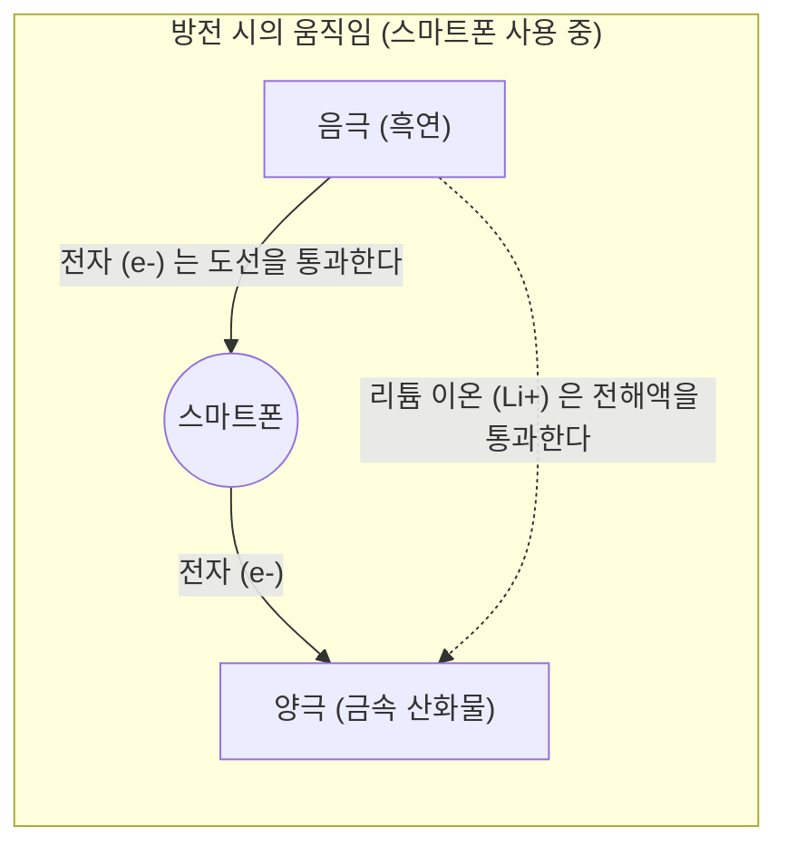

## 1. 모바일 혁명의 숨은 주역

1990년대, 휴대전화는 거대하고 무거운 '숄더폰'에서 주머니에 들어가는 크기로 극적인 진화를 이뤘습니다. 이 '모바일 혁명'을 근저에서 지탱한 기술이 바로 1991년 소니가 세계 최초로 상품화한 ' **리튬 이온 배터리** '입니다.

그때까지 주류였던 니켈 카드뮴 배터리나 납 축전지에 비해, 리튬 이온 배터리는 '압도적으로 가볍고, 작고, 전압이 높다'는 꿈같은 성능을 가지고 있었습니다. 현재는 스마트폰이나 노트북에 그치지 않고, 테슬라 등 전기 자동차(EV)의 심장부로서 탈탄소 사회의 열쇠를 쥐고 있는 기술로까지 성장했습니다. 2019년에는 그 개발에 공헌한 요시노 아키라(吉野彰) 씨 등에게 노벨 화학상이 수여되었습니다.

왜 리튬 이온 배터리는 이토록 높은 성능을 발휘할 수 있는 것일까요?

## 2. 리튬이 선택된 물리적·화학적 이유

배터리의 주역으로 ' **리튬(Li)** '이 선택된 데에는 원소의 성질에서 비롯된 필연적인 이유가 있습니다.

주기율표를 떠올려 보세요. 수소, 헬륨에 이어 3번째로 가벼운 원소가 리튬입니다. 금속 중에서는 **가장 가벼운(밀도가 낮은) 원소** 입니다.
더불어 리튬은 가장 바깥쪽 궤도에 전자를 1개만 가지고 있으며, 이 전자를 매우 놓아버리고 싶어 하는(이온화 경향이 극히 큰) 성질을 가지고 있습니다.

전자를 놓아버리고 싶어 한다는 것은, 바꿔 말하면 '높은 전압을 만들어내는 힘이 강하다'는 의미입니다.
리튬을 사용함으로써, '매우 가벼우면서도 파워풀한(고전압)' 모바일 기기에 이상적인 배터리를 만들 수 있는 것입니다.

## 3. 충방전의 원리: 이온과 전자의 이사

배터리 내부는 크게 3개의 부품으로 구성되어 있습니다.
1. **양극(플러스 극)** : 코발트산 리튬 등의 금속 산화물
2. **음극(마이너스 극)** : 흑연(그라파이트 = 탄소 층)
3. **전해액과 분리막** : 이온만 통과시키고 전자는 통과시키지 않는 액체와 막

리튬 이온 배터리가 '충전·방전'을 반복할 수 있는 것은, 리튬이 '이온(전자를 잃은 상태)'이 되어 양극과 음극 사이를 왔다 갔다 하기 때문입니다. 이를 ' **흔들의자 모델** '이라고 부릅니다.

### 【충전 시】 에너지를 축적하는 과정
콘센트에서 전기(전자)를 흘려보내면 다음과 같은 반응이 일어납니다.
1. 양극에 있는 리튬 원자에서 전자가 떨어져 나가, **리튬 이온(Li+)** 이 됩니다.
2. 전자는 도선(외부 케이블)을 통해 음극으로 강제로 이동하게 됩니다.
3. 한편, 리튬 이온(Li+)은 배터리 내부의 전해액 속을 헤엄쳐 음극으로 향합니다.
4. 음극(흑연 층의 틈새)에서 도착한 리튬 이온과 전자가 다시 만나, 그곳에 숨어들어 에너지를 축적한 상태가 됩니다.

### 【방전 시】 에너지를 방출하는 과정 (스마트폰을 사용할 때)
스마트폰의 전원을 켜면 충전 시와는 반대의 일이 일어납니다.
1. 음극에 비좁게 갇혀 있던 리튬이 전자를 놓아버리고 리튬 이온(Li+)이 됩니다.
2. 방출된 전자는 스마트폰의 기판(CPU나 화면)을 거쳐 양극을 향해 흐릅니다. **이 전자의 통과가 '전류'이며, 스마트폰을 움직이는 힘이 됩니다.**
3. 리튬 이온(Li+)은 다시 전해액 속을 헤엄쳐 안락한 양극으로 돌아갑니다.

## 4. 덴드라이트와의 싸움과 안전 기술

이토록 우수한 리튬 이온 배터리이지만, 개발의 역사는 '발화 사고'와의 싸움이기도 했습니다.

리튬은 매우 반응성이 높은 금속입니다. 초기 연구에서는 음극에 금속 리튬 자체를 사용하려고 했습니다. 그러나 충전과 방전을 반복하는 동안, 음극 표면에 리튬이 '나뭇가지 모양(덴드라이트)'으로 결정화되어 자라나는 현상이 발생했습니다.
이 바늘처럼 뾰족한 덴드라이트가 성장하여 양극과 음극을 가로막고 있는 분리막(절연막)을 뚫어버리면, 내부에서 '쇼트(단락)'가 일어나 막대한 열에너지가 단번에 방출되어 폭발이나 발화를 일으킵니다.

이를 해결한 것이 '음극에 금속 리튬 자체가 아닌, **탄소(흑연) 층** 을 사용한다'는 요시노 아키라 씨 등의 획기적인 아이디어였습니다. 흑연 층의 틈새로 리튬 이온을 '드나들게' 하는 구조로 만듦으로써, 덴드라이트의 발생을 억제하고 안전하게 충방전을 반복하는 것이 가능해진 것입니다.

## 5. 차세대 배터리: 전고체 배터리로

현재 리튬 이온 배터리의 한 단계 더 나아간 진화로서 전 세계적으로 개발이 서둘러지고 있는 것이 ' **전고체 배터리** '입니다.

기존 리튬 이온 배터리의 최대 약점은 '액체 전해액'을 사용한다는 것입니다. 이 액체는 유기 용매이며, 불에 타기 쉬운 성질을 가지고 있습니다.
전고체 배터리에서는 이 액체를 '타지 않는 고체 전해질'로 대체합니다. 이로 인해 발화의 위험이 거의 제로가 될 뿐만 아니라, 충전 속도가 극적으로 빨라지고 수명도 대폭 늘어날 것으로 기대되고 있습니다.

## 6. 요약

리튬 이온 배터리는 단순한 '전기 그릇'이 아닙니다. 그 내부에서는 리튬 이온과 전자가 화학 법칙과 물리 법칙에 따라 양극과 음극 사이를 끊임없이 왕복한다는, 아름답고도 역동적인 세계가 펼쳐져 있습니다.
우리 손안에서 전 세계의 정보를 끌어낼 수 있는 것도, 소리 없이 거리를 달리는 전기 자동차도, 모두 이 작은 리튬 이온의 끊임없는 왕복 운동(흔들의자) 덕분인 것입니다.
