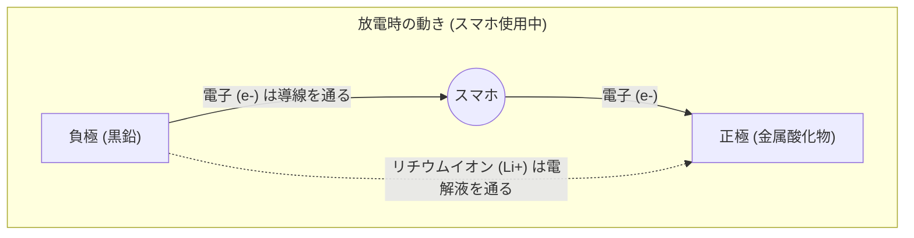

## 1. モバイル革命の影の立役者

1990年代、携帯電話は巨大で重い「ショルダーホン」から、ポケットに入るサイズへと劇的な進化を遂げました。この「[モバイル革命](/p/history-of-iphone/)」を根底で支えた技術こそが、1991年にソニーが世界で初めて商品化した「**リチウムイオン電池**」です。

それまで主流だったニカド電池や鉛蓄電池に比べ、リチウムイオン電池は「圧倒的に軽くて、小さくて、電圧が高い」という夢のような性能を持っていました。現在ではスマートフォンやノートPCにとどまらず、テスラなどの電気自動車（EV）の心臓部として、脱炭素社会の鍵を握る技術にまで成長しています。2019年には、その開発に貢献した吉野彰氏らにノーベル化学賞が授与されました。

なぜ、リチウムイオン電池はこれほどまでに高い性能を発揮できるのでしょうか？

## 2. リチウムが選ばれた物理的・化学的理由

電池の主役に「**リチウム (Li)**」が選ばれたのには、元素の性質からくる必然的な理由があります。

周期表を思い浮かべてください。水素、ヘリウムに次いで3番目に軽い元素がリチウムです。金属の中では**最も軽い（密度が低い）元素**です。
さらに、リチウムは一番外側の軌道に電子を1つだけ持っており、この電子を非常に手放したがる（イオン化傾向が極めて大きい）性質を持っています。

電子を手放したがるということは、言い換えれば「高い電圧を生み出す力が強い」ということです。
リチウムを使うことで、「とても軽くて、なおかつパワフル（高電圧）」という、モバイル機器にとって理想的なバッテリーを作ることができるのです。

## 3. 充放電の仕組み：イオンと電子の引っ越し

電池の内部は、大きく分けて3つの部品で構成されています。
1. **正極（プラス極）**：コバルト酸リチウムなどの金属酸化物
2. **負極（マイナス極）**：黒鉛（グラファイト＝炭素の層）
3. **電解液とセパレータ**：イオンだけを通し、電子を通さない液体と膜

リチウムイオン電池が「充電・放電」を繰り返すことができるのは、リチウムが「イオン（電子を失った状態）」となって、正極と負極の間を行ったり来たりするからです。これを「**ロッキングチェア・モデル**」と呼びます。

### 【充電時】エネルギーを蓄えるプロセス
コンセントから電気（電子）を流し込むと、次のような反応が起きます。
1. 正極にいるリチウム原子から電子が引き剥がされ、**リチウムイオン（Li+）**になります。
2. 電子は、導線（外部のケーブル）を通って負極へと強制的に移動させられます。
3. 一方、リチウムイオン（Li+）は、電池内部の電解液の中を泳いで負極へと向かいます。
4. 負極（黒鉛の層の隙間）で、到着したリチウムイオンと電子が再び出会い、そこに潜り込んでエネルギーを蓄えた状態になります。

### 【放電時】エネルギーを解放するプロセス（スマホを使っている時）
スマホの電源を入れると、充電時とは逆のことが起きます。
1. 負極に窮屈に押し込められていたリチウムが、電子を手放してリチウムイオン（Li+）になります。
2. 放出された電子は、スマホの基板（CPUや画面）を通って正極へ向かって流れます。**この電子の通り抜けが「電流」であり、スマホを動かす力になります。**
3. リチウムイオン（Li+）は、再び電解液の中を泳いで、居心地の良い正極へと戻っていきます。

## 4. デンドライトとの戦いと安全技術

これほど優秀なリチウムイオン電池ですが、開発の歴史は「発火事故」との戦いでもありました。

リチウムは非常に反応性の高い金属です。初期の研究では、負極に金属リチウムそのものを使おうとしていました。しかし、充電と放電を繰り返すうちに、負極の表面にリチウムが「樹枝状（デンドライト）」に結晶化して伸びてしまう現象が起きました。
この針のように尖ったデンドライトが成長し、正極と負極を隔てているセパレータ（絶縁膜）を突き破ってしまうと、内部で「ショート（短絡）」が起き、莫大な熱エネルギーが一気に解放されて爆発や発火を引き起こします。

これを解決したのが、「負極に金属リチウムそのものではなく、**炭素（黒鉛）の層**を使う」という吉野彰氏らの画期的なアイデアでした。黒鉛の層の隙間にリチウムイオンを「出入り」させる構造にしたことで、デンドライトの発生を抑え込み、安全に充放電を繰り返すことが可能になったのです。

## 5. 次世代のバッテリー：全固体電池へ

現在、リチウムイオン電池のさらなる進化として世界中で開発が急がれているのが「**全固体電池**」です。

従来のリチウムイオン電池の最大の弱点は「液体の電解液」を使っていることです。この液体は有機溶媒であり、燃えやすい性質を持っています。
全固体電池では、この液体を「燃えない固体の電解質」に置き換えます。これにより、発火のリスクがほぼゼロになるだけでなく、充電速度が劇的に速くなり、寿命も大幅に延びると期待されています。

## 6. まとめ

リチウムイオン電池は、単なる「電気の入れ物」ではありません。その内部では、リチウムイオンと電子が、化学の法則と物理の法則に従って、正極と負極の間を絶え間なく往復するという、美しくもダイナミックな世界が広がっています。
私たちの手のひらで世界中の情報を引き出せるのも、音もなく街を走る電気自動車も、すべてはこの小さなリチウムイオンの絶え間ない反復横跳び（ロッキングチェア）のおかげなのです。
