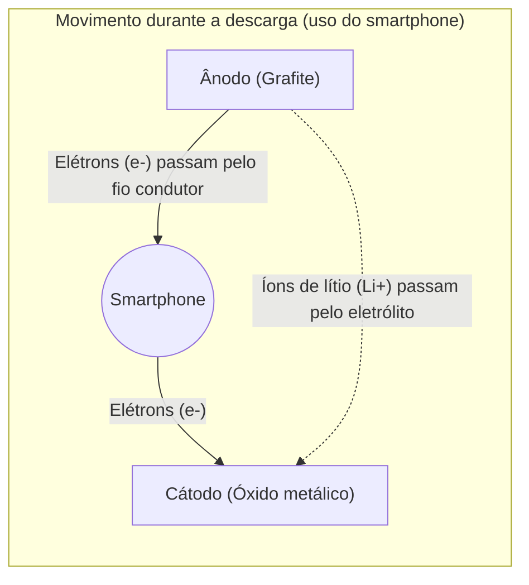

## 1. O Herói Oculto da Revolução Móvel

Na década de 1990, os telefones celulares passaram por uma evolução drástica, deixando de ser telefones gigantes e pesados de carregar no ombro para tamanhos que cabem no bolso. A tecnologia que fundamentou essa "[revolução móvel](/pt/p/history-of-iphone/)" foi a "**bateria de íons de lítio**", comercializada pela primeira vez no mundo pela Sony em 1991.

Em comparação com as baterias de níquel-cádmio e de chumbo-ácido que dominavam até então, a bateria de íons de lítio possuía o desempenho dos sonhos: era "esmagadoramente mais leve, menor e de maior voltagem". Hoje, ela cresceu além dos smartphones e notebooks, tornando-se o coração de veículos elétricos (EVs) como os da Tesla, sendo uma tecnologia fundamental para uma sociedade descarbonizada. Em 2019, o Prêmio Nobel de Química foi concedido a Akira Yoshino e outros que contribuíram para o seu desenvolvimento.

Por que as baterias de íons de lítio conseguem oferecer um desempenho tão alto?

## 2. Razões Físicas e Químicas para a Escolha do Lítio

O "**lítio (Li)**" ter sido escolhido como o protagonista das baterias tem uma razão inevitável que decorre das propriedades do elemento.

Imagine a tabela periódica. Após o hidrogênio e o hélio, o terceiro elemento mais leve é o lítio. Entre os metais, é o **elemento mais leve (de menor densidade)**.
Além disso, o lítio possui apenas um elétron em sua órbita mais externa, e tem a propriedade de querer se desfazer desse elétron com muita facilidade (tendência de ionização extremamente alta).

Querer se desfazer dos elétrons significa, em outras palavras, "forte capacidade de gerar alta voltagem".
Ao usar o lítio, é possível criar uma bateria ideal para dispositivos móveis, que é "muito leve e ao mesmo tempo potente (alta voltagem)".

## 3. O Mecanismo de Carga e Descarga: A Mudança de Íons e Elétrons

O interior de uma bateria é composto por três partes principais:
1. **Cátodo (polo positivo)**: Óxidos metálicos, como o óxido de lítio-cobalto
2. **Ânodo (polo negativo)**: Grafite (camadas de carbono)
3. **Eletrólito e separador**: Líquido e membrana que permitem apenas a passagem de íons e bloqueiam os elétrons

A bateria de íons de lítio pode repetir "carga e descarga" porque o lítio se torna um "íon (estado sem elétrons)" e vai e vem entre o cátodo e o o ânodo. Isso é chamado de "**modelo de cadeira de balanço**".

### [Durante a carga] O processo de armazenamento de energia
Quando a eletricidade (elétrons) flui da tomada, ocorre a seguinte reação:
1. Os elétrons são arrancados dos átomos de lítio no cátodo, tornando-se **íons de lítio (Li+)**.
2. Os elétrons são forçados a se moverem para o ânodo através de um fio condutor (cabo externo).
3. Enquanto isso, os íons de lítio (Li+) nadam no eletrólito dentro da bateria em direção ao ânodo.
4. No ânodo (espaços nas camadas de grafite), os íons de lítio e os elétrons que chegam se encontram novamente, inserindo-se lá e ficando em um estado de energia armazenada.

### [Durante a descarga] O processo de liberação de energia (ao usar o smartphone)
Ao ligar o smartphone, ocorre o oposto da carga:
1. O lítio que estava comprimido no ânodo libera os elétrons e se torna íons de lítio (Li+).
2. Os elétrons liberados fluem através da placa do smartphone (CPU e tela) em direção ao cátodo. **Essa passagem de elétrons é a "corrente elétrica", que fornece a energia para o smartphone funcionar.**
3. Os íons de lítio (Li+) nadam novamente no eletrólito, retornando ao confortável cátodo.

## 4. A Batalha contra os Dendritos e a Tecnologia de Segurança

Apesar de as baterias de íons de lítio serem tão excelentes, a história do seu desenvolvimento também foi uma batalha contra "acidentes de incêndio".

O lítio é um metal altamente reativo. Em pesquisas iniciais, tentou-se usar o próprio lítio metálico no ânodo. No entanto, com repetidas cargas e descargas, ocorreu um fenômeno em que o lítio se cristalizava e crescia na forma "arborescente (dendritos)" na superfície do ânodo.
Quando esses dendritos pontiagudos como agulhas crescem e perfuram o separador (membrana isolante) que divide o cátodo e o ânodo, ocorre um "curto-circuito" interno, liberando instantaneamente uma enorme quantidade de energia térmica e causando explosões ou incêndios.

O que resolveu isso foi a ideia inovadora de Akira Yoshino e sua equipe: "usar uma **camada de carbono (grafite)** em vez do próprio lítio metálico no ânodo". Ao criar uma estrutura que permite aos íons de lítio "entrarem e saírem" dos espaços nas camadas de grafite, foi possível suprimir a formação de dendritos e repetir a carga e descarga com segurança.

## 5. Baterias de Próxima Geração: Rumo às Baterias de Estado Sólido

Atualmente, como uma evolução adicional das baterias de íons de lítio, as "**baterias de estado sólido**" estão sendo desenvolvidas com urgência em todo o mundo.

A maior fraqueza das baterias de íons de lítio convencionais é o uso de "eletrólito líquido". Esse líquido é um solvente orgânico e tem propriedades inflamáveis.
Nas baterias de estado sólido, esse líquido é substituído por um "eletrólito sólido não inflamável". Espera-se que isso não apenas reduza o risco de incêndio a quase zero, mas também aumente drasticamente a velocidade de carregamento e prolongue significativamente a vida útil.

## 6. Conclusão

A bateria de íons de lítio não é apenas um "recipiente para eletricidade". Em seu interior, íons de lítio e elétrons vão e vêm incessantemente entre o cátodo e o ânodo, de acordo com as leis da química e da física, formando um mundo belo e dinâmico.
O fato de podermos acessar informações do mundo inteiro na palma de nossas mãos, ou de veículos elétricos rodarem silenciosamente pelas ruas, tudo isso se deve ao incessante ir e vir (cadeira de balanço) desses minúsculos íons de lítio.
