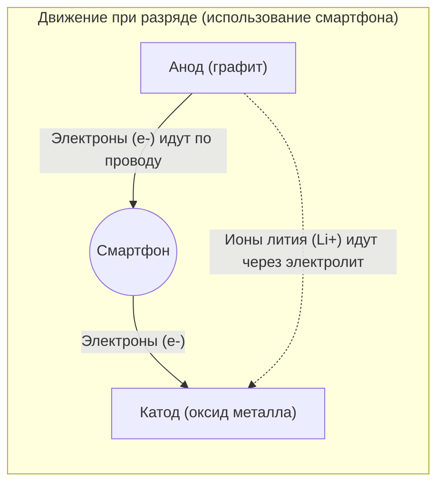

## 1. Теневой герой мобильной революции

В 1990-х годах мобильные телефоны претерпели радикальную эволюцию: от огромных и тяжелых «наплечных телефонов» до размеров, помещающихся в кармане. Технологией, которая фундаментально поддержала эту «мобильную революцию», стал **литий-ионный аккумулятор**, впервые в мире коммерциализированный компанией Sony в 1991 году.

По сравнению с никель-кадмиевыми и свинцово-кислотными батареями, которые были тогда в ходу, литий-ионный аккумулятор обладал характеристиками мечты: «подавляюще легкий, маленький и с высоким напряжением». Сегодня его применение не ограничивается смартфонами и ноутбуками — он стал технологией, являющейся ключом к безуглеродному обществу, будучи сердцем электромобилей (EV), таких как Tesla. В 2019 году Акира Ёсино и его коллеги, внесшие вклад в его разработку, были удостоены Нобелевской премии по химии.

Почему литий-ионные батареи способны демонстрировать такие высокие характеристики?

## 2. Физические и химические причины выбора лития

Существует неизбежная причина, вытекающая из свойств элемента, по которой на главную роль в аккумуляторе был выбран **литий (Li)**.

Представьте себе периодическую систему. Литий — третий по легкости элемент после водорода и гелия. Среди металлов это **самый легкий (с наименьшей плотностью) элемент**.
Кроме того, на своей внешней орбитали литий имеет только один электрон, с которым он очень стремится расстаться (имеет чрезвычайно высокую тенденцию к ионизации).

Желание расстаться с электроном, другими словами, означает «сильную способность создавать высокое напряжение».
Использование лития позволяет создать идеальный для мобильных устройств аккумулятор — «очень легкий, но при этом мощный (высоковольтный)».

## 3. Механизм заряда и разряда: переселение ионов и электронов

Внутренняя часть аккумулятора в общих чертах состоит из трех компонентов:
1. **Катод (положительный полюс)**: оксиды металлов, такие как оксид лития-кобальта
2. **Анод (отрицательный полюс)**: графит (слои углерода)
3. **Электролит и сепаратор**: жидкость и мембрана, пропускающие только ионы и не пропускающие электроны

Литий-ионный аккумулятор способен повторять «заряд-разряд», потому что литий становится «ионом (в состоянии потери электрона)» и перемещается туда-сюда между катодом и анодом. Это называется **моделью кресла-качалки**.

### [Во время зарядки] Процесс накопления энергии
Когда электричество (электроны) поступает из розетки, происходит следующая реакция:
1. Электроны отрываются от атомов лития на катоде, и они становятся **ионами лития (Li+)**.
2. Электроны принудительно перемещаются к аноду через проводящую линию (внешний кабель).
3. Тем временем ионы лития (Li+) перемещаются в электролите внутри аккумулятора и направляются к аноду.
4. На аноде (в зазорах между слоями графита) прибывшие ионы лития и электроны снова встречаются и проникают внутрь, переходя в состояние с накопленной энергией.

### [Во время разряда] Процесс высвобождения энергии (когда вы используете смартфон)
При включении смартфона происходит процесс, обратный зарядке:
1. Литий, тесно втиснутый в анод, отдает электроны и становится ионами лития (Li+).
2. Высвободившиеся электроны текут через плату смартфона (процессор и экран) к катоду. **Это прохождение электронов и есть «электрический ток», который становится силой, приводящей в действие смартфон.**
3. Ионы лития (Li+) снова проплывают через электролит и возвращаются в комфортный для них катод.

## 4. Борьба с дендритами и технологии безопасности

Несмотря на то, что литий-ионные аккумуляторы столь превосходны, история их разработки была также историей борьбы с «возгораниями».

Литий — высокореактивный металл. В ранних исследованиях пытались использовать сам металлический литий для анода. Однако по мере многократных циклов зарядки и разрядки на поверхности анода возникло явление, при котором литий кристаллизовался и разрастался в «древовидные структуры (дендриты)».
Если эти острые, как иглы, дендриты вырастут и пробьют сепаратор (изолирующую мембрану), разделяющий катод и анод, внутри произойдет «короткое замыкание», и огромное количество тепловой энергии мгновенно высвободится, вызывая взрыв или возгорание.

Эту проблему решила революционная идея Акиры Ёсино и его коллег: «использовать для анода не сам металлический литий, а **слой углерода (графита)**». Создав структуру, позволяющую ионам лития «входить и выходить» из зазоров слоев графита, удалось подавить образование дендритов, что позволило безопасно повторять процессы зарядки и разрядки.

## 5. Аккумуляторы следующего поколения: к твердотельным батареям

В настоящее время по всему миру активно ведется разработка **твердотельных аккумуляторов** как следующего этапа эволюции литий-ионных батарей.

Самым большим недостатком традиционных литий-ионных батарей является использование «жидкого электролита». Эта жидкость является органическим растворителем и обладает горючими свойствами.
В твердотельных батареях эта жидкость заменяется «негорючим твердым электролитом». Ожидается, что благодаря этому не только риск возгорания снизится практически до нуля, но и резко возрастет скорость зарядки, а также значительно увеличится срок службы.

## 6. Заключение

Литий-ионный аккумулятор — это не просто «емкость для электричества». Внутри него разворачивается красивый и динамичный мир, где ионы лития и электроны непрерывно курсируют между катодом и анодом, подчиняясь законам химии и физики.
Тот факт, что мы можем получать информацию со всего мира на ладони, и то, что электромобили бесшумно ездят по улицам — всё это благодаря непрерывным движениям туда-сюда (креслу-качалке) этих маленьких ионов лития.
