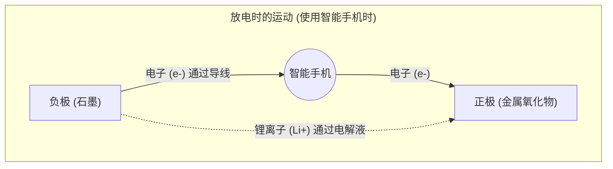

## 1. 移动革命背后的功臣

20世纪90年代，移动电话经历了从巨大沉重的“肩扛式电话”到可以放进口袋的尺寸的戏剧性演变。从根本上支撑这场“[移动革命](/zh-cn/p/history-of-iphone/)”的技术，正是1991年索尼在全球首次商品化的“ **锂离子电池** ”。

与当时主流的镍镉电池或铅酸电池相比，锂离子电池具有“压倒性的轻量、小巧、高电压”这种梦幻般的性能。现在它不仅用于智能手机和笔记本电脑，还作为特斯拉等电动汽车（EV）的心脏，成长为掌握脱碳社会关键的技术。2019年，为其开发做出贡献的吉野彰等人被授予诺贝尔化学奖。

为什么锂离子电池能够发挥如此高的性能呢？

## 2. 选择锂的物理与化学原因

电池的主角之所以选择“ **锂 (Li)** ”，有着源于元素性质的必然原因。

请回想一下元素周期表。继氢、氦之后第三轻的元素就是锂。在金属中，它是 **最轻（密度最低）的元素** 。
此外，锂的最外层轨道只有一个电子，并且具有非常渴望释放这个电子的性质（电离倾向极强）。

渴望释放电子，换句话说，就是“产生高电压的能力很强”。
通过使用锂，可以制造出对于移动设备来说理想的电池，即“非常轻便，同时又充满力量（高电压）”。

## 3. 充放电的机制：离子与电子的搬家

电池的内部大体上由3个主要部件组成。
1. **正极（+极）** ：钴酸锂等金属氧化物
2. **负极（-极）** ：石墨（石墨＝碳层）
3. **电解液与隔膜** ：只允许离子通过而不允许电子通过的液体和膜

锂离子电池能够反复进行“充电与放电”，是因为锂变成“离子（失去电子的状态）”，在正极和负极之间来回移动。这被称为“ **摇椅模型** ”。

### 【充电时】储存能量的过程
当从插座注入电（电子）时，会发生以下反应。
1. 在正极的锂原子被剥离电子，变成 **锂离子 (Li+)** 。
2. 电子被迫通过导线（外部电缆）移动到负极。
3. 另一方面，锂离子（Li+）在电池内部的电解液中游动，前往负极。
4. 在负极（石墨层的间隙），到达的锂离子与电子再次相遇，潜入其中，变成储存能量的状态。

### 【放电时】释放能量的过程（使用智能手机时）
打开智能手机电源时，会发生与充电时相反的情况。
1. 被局促地塞在负极的锂释放出电子，变成锂离子（Li+）。
2. 释放出的电子通过智能手机的主板（CPU或屏幕）流向正极。 **这种电子的通过就是“电流”，成为驱动智能手机的力量。**
3. 锂离子（Li+）再次在电解液中游动，回到舒适的正极。

## 4. 与枝晶的战斗及安全技术

尽管锂离子电池如此优秀，但其开发历史也是一部与“起火事故”战斗的历史。

锂是非常活泼的金属。在早期的研究中，人们试图直接使用金属锂本身作为负极。然而，在反复充放电的过程中，出现了一种现象：锂在负极表面结晶并像“树枝状（枝晶）”一样伸长。
如果这种像针一样尖锐的枝晶生长并刺穿了隔开正负极的隔膜（绝缘膜），内部就会发生“短路”，瞬间释放出巨大的热能，从而引起爆炸或起火。

解决这个问题的是吉野彰等人提出的划时代想法：“在负极不直接使用金属锂，而是使用 **碳（石墨）层** ”。通过采用让锂离子在石墨层的间隙中“进出”的结构，成功抑制了枝晶的产生，从而实现了安全地反复充放电。

## 5. 下一代电池：迈向全固态电池

目前，作为锂离子电池的进一步发展，全世界正在加紧开发的正是“ **全固态电池** ”。

传统锂离子电池最大的弱点是使用了“液态电解液”。这种液体是有机溶剂，具有易燃的性质。
在全固态电池中，这种液体被替换为“不可燃的固态电解质”。这不仅使起火的风险降至几乎为零，而且人们还期待它能大幅缩短充电时间，并显著延长使用寿命。

## 6. 总结

锂离子电池不仅仅是简单的“电容器”。在其内部，锂离子和电子遵循化学定律和物理定律，在正极和负极之间不断往返，展现出一个美丽而充满动态的世界。
我们在手掌中就能获取全世界的信息，电动汽车能无声地行驶在街道上，这一切都归功于这小小的锂离子不知疲倦地反复横跳（摇椅效应）。
