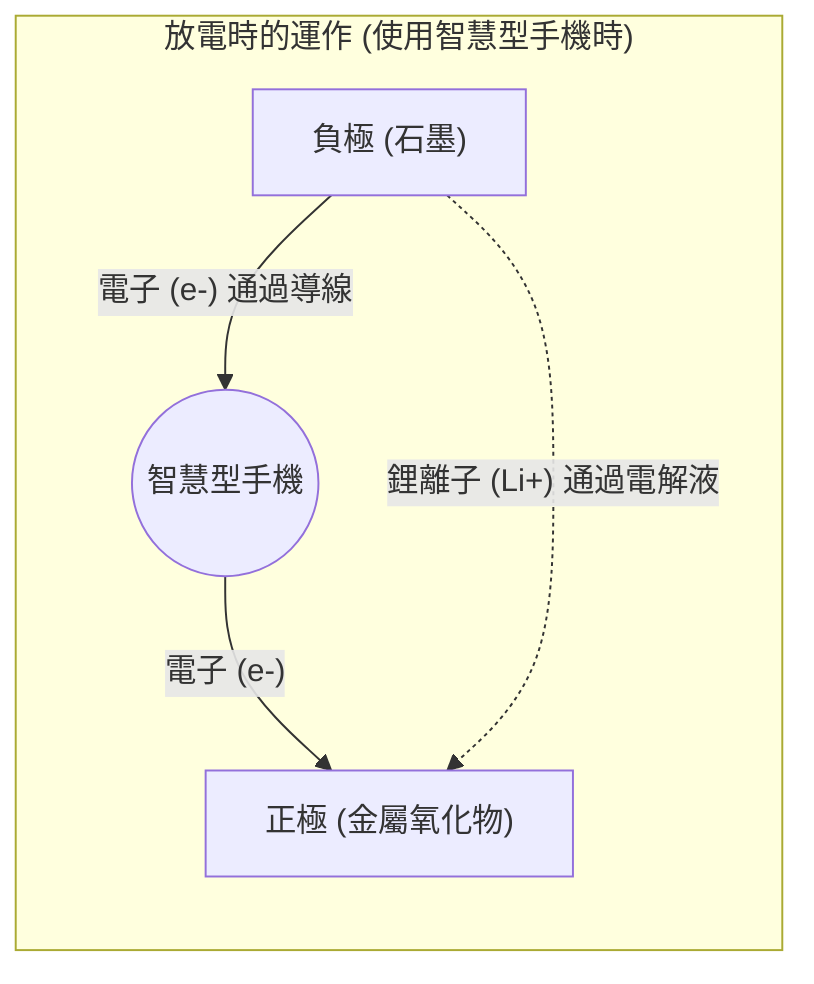

## 1. 行動革命幕後的推手

1990年代，行動電話從巨大笨重的「黑金剛（肩背式電話）」經歷了戲劇性的演進，縮小至能放進口袋的尺寸。而在底層支撐這場「行動革命」的技術，正是1991年由Sony在世界上首次商品化的「 **鋰離子電池** 」。

與當時主流的鎳鎘電池或鉛酸電池相比，鋰離子電池擁有「壓倒性地輕巧、體積小、電壓高」這種如夢一般的性能。現在不僅是智慧型手機與筆記型電腦，它更作為特斯拉等電動車（EV）的心臟，成長為掌握脫碳社會關鍵的技術。2019年，為其開發做出貢獻的吉野彰等人更獲頒了諾貝爾化學獎。

為什麼鋰離子電池能夠發揮出如此高的性能呢？

## 2. 選擇鋰的物理與化學原因

選擇「 **鋰 (Li)** 」作為電池的主角，有著源自元素性質的必然原因。

請回想一下週期表。繼氫、氦之後，第三輕的元素就是鋰。在金屬當中是 **最輕的（密度最低的）元素** 。
此外，鋰的最外層軌域只有一個電子，具有非常容易失去這個電子（游離能極低）的性質。

容易失去電子，換句話說就是「產生高電壓的能力很強」。
透過使用鋰，便能製造出「非常輕巧，而且充滿力量（高電壓）」這種對行動裝置而言最理想的電池。

## 3. 充放電的機制：離子與電子的搬家

電池的內部，大致可分為三個零件組成：
1. **正極（正電極）** ：鈷酸鋰等金屬氧化物
2. **負極（負電極）** ：石墨（Graphite＝碳層）
3. **電解液與隔離膜** ：只讓離子通過，不讓電子通過的液體與薄膜

鋰離子電池之所以能夠反覆「充電・放電」，是因為鋰變成了「離子（失去電子的狀態）」，在正極與負極之間來回移動。這被稱為「 **搖椅模型** 」。

### 【充電時】儲存能量的過程
從插座將電（電子）輸入後，會發生以下反應：
1. 在正極的鋰原子會被剝離電子，變成 **鋰離子（Li+）** 。
2. 電子會被迫通過導線（外部的電纜）移動到負極。
3. 另一方面，鋰離子（Li+）會在電池內部的電解液中游動，前往負極。
4. 在負極（石墨層的縫隙間），抵達的鋰離子與電子會再次相遇，並潛入其中，形成儲存能量的狀態。

### 【放電時】釋放能量的過程（使用智慧型手機時）
打開智慧型手機的電源後，會發生與充電時相反的情況。
1. 被勉強擠進負極的鋰，會釋放電子並變成鋰離子（Li+）。
2. 釋放出的電子，會通過智慧型手機的電路板（CPU或螢幕）流向正極。 **這個電子的流動就是「電流」，也是驅動智慧型手機的力量。**
3. 鋰離子（Li+）會再次在電解液中游動，回到待起來舒適的正極。

## 4. 與枝晶的戰鬥及安全技術

儘管鋰離子電池如此優秀，但其開發歷史同時也是一場與「起火事故」的戰鬥。

鋰是反應性極高的金屬。在初期的研究中，曾試圖直接將金屬鋰用於負極。然而，在反覆充放電的過程中，負極表面出現了鋰結晶化並生長成「樹枝狀（枝晶）」的現象。
一旦這種如針般尖銳的枝晶生長，並刺穿隔開正極與負極的隔離膜（絕緣膜）時，內部就會發生「短路」，巨大的熱能會在一瞬間釋放，進而引發爆炸或起火。

解決這個問題的，是吉野彰等人提出的劃時代想法：「在負極不直接使用金屬鋰，而是使用 **碳（石墨）層** 」。透過讓鋰離子在石墨層的縫隙間「進出」的結構，成功抑制了枝晶的產生，使得安全地反覆充放電成為可能。

## 5. 次世代電池：邁向全固態電池

目前，作為鋰離子電池的進一步演進，世界各地正急於開發的便是「 **全固態電池** 」。

傳統鋰離子電池最大的弱點，在於使用了「液態的電解液」。這種液體是有機溶劑，具有易燃的性質。
在全固態電池中，會將這種液體替換為「不可燃的固態電解質」。這不僅能讓起火的風險降至幾乎為零，更能大幅提升充電速度，並期望能顯著延長使用壽命。

## 6. 總結

鋰離子電池不單只是「裝電的容器」。在其內部，鋰離子與電子遵循著化學與物理的法則，在正極與負極之間不斷往返，展現出一個美麗且動態的世界。
我們能在手掌中提取世界各地的資訊，以及在街道上無聲行駛的電動車，這一切都要歸功於這些微小鋰離子不斷反覆橫跳（搖椅）的功勞。
