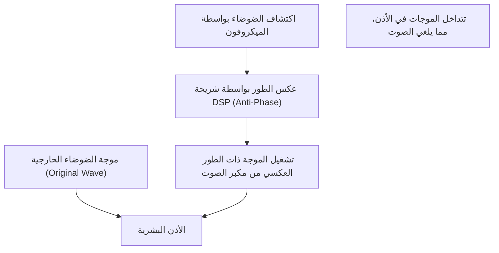

## 1. حقيقة الهدوء السحري

أصبح "إلغاء الضوضاء النشط (ANC)" ميزة لا غنى عنها في سماعات الأذن والرأس اللاسلكية الحديثة.
التجربة التي تختفي فيها الضوضاء المحيطة بسلاسة بمجرد تشغيل المفتاح، وكأنك انتقلت إلى مساحة أخرى، تبدو وكأنها سحر لأولئك الذين يختبرونها لأول مرة.
ومع ذلك، فإن هويتها الحقيقية ليست سحراً، بل هي بلورة للتكنولوجيا العلمية التي تستخدم قانون فيزياء كلاسيكي وجميل للغاية وهو "**تداخل الموجات (Interference)**".

يصل الصوت إلى آذاننا كتغيير في ضغط الهواء، أي "موجة". لإلغاء هذه الموجة، يقوم نظام ANC بإنشاء "موجة عكسية" بشكل مصطنع وضربها بالضوضاء. في هذه المقالة، سنتعمق في الآلية التي تخلق هذا الهدوء السحري من منظور الفيزياء.

## 2. طبيعة الصوت و"تداخل الموجات"

### الصوت هو "موجة طولية"
لفهم كيفية انتقال الصوت، من الأسهل تخيل الهواء كمجموعة من الجسيمات (الجزيئات) الصغيرة.
عندما يتحرك مخروط مكبر الصوت للأمام، يتم دفع الهواء، مما يخلق منطقة "كثيفة" حيث تتجمع الجزيئات. على العكس من ذلك، عندما يتم سحبه للخلف، يتم إنشاء منطقة "نادرة". هذه الظاهرة التي ينتقل فيها نمط الكثافة والندرة هذا تباعاً إلى الهواء المجاور هي "الصوت".
عند تمثيلها في رسم بياني، تُرسم كشكل موجي (مثل موجة الجيب) حيث يكون الجزء ذو ضغط الهواء المرتفع "قمة" والجزء ذو ضغط الهواء المنخفض "قاعاً".

### مبدأ تراكب الموجات
في الفيزياء، عندما تلتقي موجات متعددة في نفس المكان، تؤثر هذه الموجات على بعضها البعض لتكوين موجة جديدة. يُطلق على هذا اسم "مبدأ تراكب الموجات".
يمكن تقسيم التراكب بشكل عام إلى نمطين.

1. **التداخل البناء (Constructive Interference)**
   عندما تتطابق "قمم" و"قيعان" موجتين تماماً (نفس الطور)، تندمج الموجات لتصبح موجة أكبر. هذه هي ظاهرة ارتفاع الصوت.
2. **التداخل الهدام (Destructive Interference)**
   عندما تتطابق "قمة" إحدى الموجات مع "قاع" الموجة الأخرى تماماً (الطور مزاح بمقدار 180 درجة)، تلغي الموجات بعضها البعض وتصبح مسطحة. وبعبارة أخرى، يختفي الصوت.

تقنية إلغاء الضوضاء هي بالضبط نظام يثير عمداً هذا "**التداخل الهدام**".

$$
y_1(t) = A \sin(\omega t)
$$
$$
y_2(t) = A \sin(\omega t + \pi) = -A \sin(\omega t)
$$
$$
y_{total}(t) = y_1(t) + y_2(t) = 0
$$

## 3. آلية إلغاء الضوضاء النشط (ANC)

إذن، كيف يتحقق هذا "التداخل الهدام" داخل سماعات الرأس وسماعات الأذن الفعلية؟
تتكون هذه العملية من تكرار الخطوات الثلاث التالية بسرعات فائقة.

### الخطوة 1: جمع الضوضاء (الاكتشاف)
تلتقط ميكروفونات صغيرة جداً مدمجة في الجزء الخارجي (أو الداخلي) من سماعة الأذن الأصوات البيئية المحيطة (ضجيج محرك الطائرة، وصوت تشغيل القطار، وصوت مكيف الهواء، وما إلى ذلك) في الوقت الفعلي. يحدد أداء هذا الميكروفون وموضعه بشكل كبير دقة ANC.

### الخطوة 2: حساب الموجة ذات الطور العكسي (المعالجة)
يتم إرسال بيانات الصوت المجمعة إلى شريحة DSP (معالج الإشارات الرقمية) المخصصة المدمجة. يقوم DSP بتحليل شكل الموجة الصوتية على الفور وإجراء حساب: "لإلغاء هذا الشكل الموجي، يجب إنتاج شكل موجة معاكس تماماً (الطور معكوس بمقدار 180 درجة)".
نظراً لأن الصوت ينتقل بسرعة حوالي 340 متراً في الثانية، فإن DSP يتطلب قدرات معالجة عالية السرعة بزمن انتقال (تأخير) منخفض للغاية. وذلك لأن التأخير في المعالجة سيؤدي إلى إزاحة الطور، وهناك خطر أن يؤدي في الواقع إلى زيادة الصوت (تداخل بناء).

### الخطوة 3: توليد مكافح الضوضاء (التشغيل)
يتم تشغيل "الموجة ذات الطور العكسي (مكافح الضوضاء)" الناتجة عن DSP من مكبر صوت سماعة الأذن.
يصطدم مكافح الضوضاء هذا والضوضاء التي دخلت الأذن فعلياً من الخارج أمام طبلة الأذن مباشرة. تلغي القمم والقيعان بعضها البعض تماماً، ويتعرف عليها دماغنا على أنها "صمت".

## 4. أنواع ANC: التغذية الأمامية والتغذية الراجعة

لتحسين دقة إلغاء الضوضاء، تبتكر كل شركة مصنعة في وضع الميكروفونات. توجد الطرق التالية بشكل أساسي.

### طريقة التغذية الأمامية
هذه طريقة يتم فيها وضع الميكروفون على الجانب **الخارجي** من سماعة الأذن.
نظراً لأن الميكروفون يمكنه التقاط الضوضاء بسرعة قبل أن تصل إلى الأذن، فهناك متسع للمعالجة، وهو أمر مفيد أيضاً في معالجة ضوضاء التردد العالي. ومع ذلك، نظراً لأن النظام لا يمكنه تأكيد كيفية إلغاء الصوت في الأذن فعلياً (النتيجة)، فإن لديه نقطة ضعف تتمثل في كونه عرضة لضوضاء الرياح.

### طريقة التغذية الراجعة
هذه طريقة يتم فيها وضع الميكروفون في **الداخل** (بين مكبر الصوت وطبلة الأذن) من سماعة الأذن.
نظراً لأنه يلتقط الصوت الذي يصل إلى الأذن في النهاية باستخدام الميكروفون ويمكنه إجراء تصحيحات مرة أخرى إذا بقيت ضوضاء، فإنه يمارس تأثيراً عالياً جداً في الإلغاء ضد ضوضاء الجهير ذات التردد المنخفض. ومع ذلك، هناك خطر من إمكانية التعرف على الموسيقى نفسها بشكل خاطئ على أنها ضوضاء وإلغائها، لذلك هناك حاجة إلى خوارزميات متقدمة.

### الطريقة الهجينة
التيار السائد في الطرز المتميزة الحالية (مثل Apple AirPods Pro وسلسلة Sony WF-1000XM) هي الطريقة الهجينة التي تحتوي على ميكروفونات من الخارج والداخل.
فهي تأخذ أفضل ما في الطريقتين من خلال قراءة الأصوات الخارجية مسبقاً باستخدام طريقة التغذية الأمامية ومراقبة الصوت النهائي داخل الأذن وتعديله بدقة باستخدام طريقة التغذية الراجعة. بفضل هذا، يتم تحقيق كل من الهدوء الساحق والتشغيل الطبيعي للموسيقى.

## 5. تاريخ الاختراع: لحماية آذان الطيارين

مفهوم إلغاء الضوضاء نفسه قديم، وتم تقديم براءات الاختراع بالفعل في ثلاثينيات القرن العشرين. ومع ذلك، تم وضعه موضع التنفيذ العملي في خمسينيات القرن العشرين كتكنولوجيا عسكرية وطيران لحماية طياري الطائرات المروحية والمروحيات من ضوضاء المحرك الشديدة.

جاءت القفزة الحقيقية إلى الأمام في عام 1989 عندما أطلقت الشركة المصنعة لمعدات الصوت Bose أول سماعة رأس تجارية لإلغاء الضوضاء للطيران. يُقال إن الدكتور أمار جي بوز، مؤسس شركة Bose، شعر بخيبة أمل لأن جودة صوت سماعات الرأس التي تم توزيعها على متن الطائرة أثناء رحلة جوية لم تكن مسموعة على الإطلاق بسبب ضجيج المحرك، وكتب الفكرة الأساسية لإلغاء الضوضاء في دفتر ملاحظات على متن تلك الرحلة.

بعد ذلك، مع تطور تقنية المعالجة الرقمية (DSP) والتصغير، بدأت تنتشر كسماعات رأس للمستهلكين العاديين في العقد الأول من القرن الحادي والعشرين، وأصبحت الآن تقنية شائعة يتم تثبيتها حتى في سماعات الأذن اللاسلكية بالكامل بحجم حبة الأرز.

## 6. حدود التكنولوجيا والتطور المستقبلي

حتى إلغاء الضوضاء السحري له نقاط ضعف.

* **الأصوات التي يبرع فيها والأصوات التي يجد صعوبة معها**
  إنه بارع جداً في إلغاء "الأصوات المستمرة ذات التردد المنخفض" التي تستمر في نمط ثابت، مثل ضوضاء محرك الطائرة وصوت أزيز مكيف الهواء. ومع ذلك، بالنسبة للأصوات المفاجئة وعالية التردد، مثل بكاء طفل أو صوت تحطم الزجاج فجأة، فإن حساب DSP وتوليد الموجات لا يمكنه اللحاق بالركب، وغالباً ما لا يمكن إلغاؤه بالكامل.

* **أهمية إلغاء الضوضاء السلبي**
  بالإضافة إلى الإلغاء بواسطة النظام (النشط)، فإن "إلغاء الضوضاء السلبي (تأثير سدادة الأذن)"، الذي يحجب الصوت مادياً عن طريق ربط قطعة الأذن الخاصة بسماعة الأذن بإحكام بفتحة الأذن، مهم جداً أيضاً. تدمج أحدث المنتجات بشكل متقدم بين هذا العزل المادي للصوت والمعالجة الرقمية.

كتطور مستقبلي، يجذب "إلغاء الضوضاء التكيفي" باستخدام الذكاء الاصطناعي (AI) الانتباه. إنها تقنية يتعرف فيها الذكاء الاصطناعي تلقائياً على البيئة التي يوجد فيها المستخدم (داخل قطار، في مقهى، في مكتب، وما إلى ذلك) ويحسن على الفور خصائص الضوضاء المراد إلغاؤها، أو يسمح بمرور أصوات أشخاص معينين فقط.

لقد فتحت تقنية إلغاء الضوضاء، التي بدأت بقانون فيزيائي بسيط وهو تداخل الموجات، جنباً إلى جنب مع تطور علوم الكمبيوتر، حقبة يمكننا فيها التحكم بحرية في "البيئة الصوتية" اليومية.