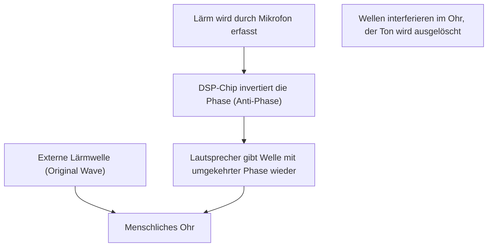

## 1. Das Geheimnis der magischen Stille

„Active Noise Cancelling (ANC)“ ist zu einer unverzichtbaren Funktion in modernen kabellosen Ohr- und Kopfhörern geworden.
Das Erlebnis, dass beim Einschalten die Umgebungsgeräusche plötzlich verschwinden, als ob man in einen anderen Raum versetzt würde, fühlt sich für Erstnutzer wie Magie an.
Doch das Geheimnis dahinter ist keine Magie, sondern die Kristallisation einer technologischen Anwendung des sehr klassischen und faszinierenden physikalischen Gesetzes der „**Welleninterferenz (Interference)**“.

Schall erreicht unsere Ohren als Veränderungen des Luftdrucks, also als „Wellen“. Um diese Wellen auszulöschen, erzeugt das ANC-System künstlich eine „Gegenwelle“ und lässt diese mit dem Lärm kollidieren. In diesem Artikel werden wir tief in die Mechanismen eintauchen, die diese magische Stille erzeugen, betrachtet aus der Perspektive der Physik.

## 2. Die Natur des Schalls und die „Welleninterferenz“

### Schall ist eine „Dichtewelle (Longitudinalwelle)“
Um zu verstehen, wie sich Schall ausbreitet, ist es am einfachsten, sich die Luft als eine Ansammlung winziger Partikel (Moleküle) vorzustellen.
Wenn sich die Membran eines Lautsprechers nach vorne bewegt, wird die Luft verdichtet und es entsteht ein Bereich der „Verdichtung“, in dem die Moleküle dicht beieinander liegen. Zieht sie sich hingegen zurück, entsteht ein Bereich der „Verdünnung“. Dieses Muster von Verdichtung und Verdünnung, das sich nacheinander auf die benachbarte Luft überträgt, ist das Phänomen „Schall“.
In einem Graphen dargestellt, ergibt dies eine Wellenform (wie eine Sinuswelle), bei der Bereiche mit hohem Luftdruck einen „Wellenberg“ und Bereiche mit niedrigem Luftdruck ein „Wellental“ bilden.

### Das Prinzip der Superposition von Wellen
Wenn in der Physik mehrere Wellen am selben Ort aufeinandertreffen, beeinflussen sie sich gegenseitig und erzeugen eine neue Welle. Dies nennt man das „Prinzip der Superposition von Wellen“.
Bei der Überlagerung gibt es im Wesentlichen zwei Muster:

1. **Konstruktive Interferenz (Constructive Interference)**
   Wenn ein „Wellenberg“ einer Welle exakt auf einen „Wellenberg“ einer anderen trifft, oder ein „Wellental“ auf ein „Wellental“ (gleiche Phase), verschmelzen die Wellen zu einer größeren Welle. Dies ist das Phänomen, bei dem der Ton lauter wird.
2. **Destruktive Interferenz (Destructive Interference)**
   Wenn der „Wellenberg“ einer Welle exakt auf das „Wellental“ der anderen Welle trifft (die Phase ist um 180 Grad verschoben), heben sich die Wellen gegenseitig auf und werden flach. Das bedeutet, dass der Ton verschwindet.

Die Noise-Cancelling-Technologie ist genau das System, das absichtlich diese „**destruktive Interferenz**“ hervorruft.

$$
y_1(t) = A \sin(\omega t)
$$
$$
y_2(t) = A \sin(\omega t + \pi) = -A \sin(\omega t)
$$
$$
y_{total}(t) = y_1(t) + y_2(t) = 0
$$

## 3. Wie Active Noise Cancelling (ANC) funktioniert

Wie genau wird nun diese „destruktive Interferenz“ in tatsächlichen Kopf- oder Ohrhörern realisiert?
Dieser Prozess basiert auf den folgenden drei Schritten, die in extrem hoher Geschwindigkeit wiederholt werden.

### Schritt 1: Lärmerfassung (Erkennung)
Ein winziges Mikrofon, das an der Außenseite (oder Innenseite) des Kopfhörers angebracht ist, nimmt Umgebungsgeräusche (wie das Triebwerksgeräusch eines Flugzeugs, das Fahrgeräusch eines Zuges, das Rauschen einer Klimaanlage usw.) in Echtzeit auf. Die Leistung und Platzierung dieses Mikrofons beeinflussen die Genauigkeit des ANC maßgeblich.

### Schritt 2: Berechnung der gegenphasigen Welle (Verarbeitung)
Die erfassten Audiodaten werden an einen eingebauten, dedizierten DSP-Chip (Digital Signal Processor) gesendet. Der DSP analysiert blitzschnell die Schallwellenform und berechnet: „Um diese Wellenform auszulöschen, muss eine Welle mit exakt umgekehrter Form (mit einer um 180 Grad invertierten Phase) erzeugt werden.“
Da sich Schall mit einer Geschwindigkeit von etwa 340 Metern pro Sekunde fortbewegt, benötigt der DSP eine extrem geringe Latenzzeit (Verzögerung) und eine hohe Verarbeitungsgeschwindigkeit. Eine Verzögerung bei der Verarbeitung könnte zu einer Phasenverschiebung führen und stattdessen das Risiko bergen, den Ton lauter zu machen (konstruktive Interferenz).

### Schritt 3: Erzeugung des Antischalls (Wiedergabe)
Die vom DSP generierte „gegenphasige Welle (Antischall)“ wird über den Lautsprecher des Kopfhörers wiedergegeben.
Dieser Antischall und der tatsächliche Lärm, der von außen in das Ohr eindringt, kollidieren genau vor dem Trommelfell. Wellenberge und Wellentäler heben sich perfekt gegenseitig auf, und unser Gehirn nimmt dies als „Stille“ wahr.

## 4. ANC-Typen: Feedforward und Feedback

Um die Genauigkeit der Geräuschunterdrückung zu verbessern, lassen sich die Hersteller verschiedene Mikrofonplatzierungen einfallen. Hauptsächlich gibt es folgende Methoden:

### Feedforward-System
Bei diesem System ist das Mikrofon an der **Außenseite** des Kopfhörers platziert.
Da das Mikrofon den Lärm schnell erfassen kann, bevor er das Ohr erreicht, gibt es mehr Spielraum für die Verarbeitung, was auch für die Unterdrückung von hochfrequentem Lärm von Vorteil ist. Da das System jedoch nicht überprüfen kann, wie der Ton letztendlich im Ohr ausgelöscht wurde (das Ergebnis), hat es die Schwäche, anfällig für Windgeräusche zu sein.

### Feedback-System
Bei diesem System ist das Mikrofon an der **Innenseite** (zwischen Lautsprecher und Trommelfell) des Kopfhörers platziert.
Das Mikrofon nimmt den Ton auf, der letztendlich das Ohr erreicht. Wenn noch Lärm übrig ist, können Korrekturen vorgenommen werden. Dies bietet einen sehr hohen Unterdrückungseffekt gegen tieffrequenten, schweren Lärm. Es besteht jedoch das Risiko, dass die Musik selbst fälschlicherweise als Lärm interpretiert und ausgelöscht wird, weshalb hochentwickelte Algorithmen erforderlich sind.

### Hybrid-System
Das aktuelle Hauptsystem bei High-End-Modellen (wie Apples AirPods Pro und Sonys WF-1000XM-Serie) ist das Hybridsystem, das Mikrofone sowohl außen als auch innen besitzt.
Es kombiniert das Beste aus beiden Welten: Das Feedforward-System liest Außengeräusche voraus, und das Feedback-System überwacht und optimiert den endgültigen Ton im Ohr. Dadurch wird eine überwältigende Stille bei gleichzeitig natürlicher Musikwiedergabe erreicht.

## 5. Die Geschichte der Erfindung: Zum Schutz der Ohren von Piloten

Das Konzept des Noise-Cancelling selbst ist alt; ein Patent dafür wurde bereits in den 1930er Jahren angemeldet. Praktisch umgesetzt wurde es jedoch erst in den 1950er Jahren als Militär- und Luftfahrttechnologie, um Piloten von Propellerflugzeugen und Hubschraubern vor extremem Triebwerkslärm zu schützen.

Der eigentliche Durchbruch erfolgte 1989, als der Audiogerätehersteller Bose das erste kommerzielle Noise-Cancelling-Headset für die Luftfahrt auf den Markt brachte. Es wird gesagt, dass Dr. Amar G. Bose, der Gründer von Bose, während eines Fluges enttäuscht war, dass die ihm an Bord überreichten Kopfhörer aufgrund der Triebwerksgeräusche keinen guten Klang lieferten, und daraufhin die Grundidee des Noise-Cancelling noch im Flugzeug in seinem Notizbuch skizzierte.

Später, durch die Weiterentwicklung und Miniaturisierung der digitalen Verarbeitungstechnologie (DSP), begann die Technologie in den 2000er Jahren als Kopfhörer für allgemeine Verbraucher populär zu werden und ist heute eine alltägliche Technologie, die selbst in reiskorngroßen, vollständig kabellosen Ohrhörern verbaut ist.

## 6. Grenzen der Technologie und zukünftige Entwicklung

Selbst das magisch anmutende Noise-Cancelling hat seine Schwächen.

* **Stärken und Schwächen bei verschiedenen Geräuschen**
  Es ist sehr gut darin, „kontinuierliche Töne mit niedriger Frequenz“, die in einem konstanten Muster andauern, wie Flugzeugtriebwerke oder das Summen von Klimaanlagen, auszulöschen. Bei plötzlichen, hochfrequenten Tönen, wie dem Weinen eines Babys oder dem plötzlichen Klirren von zerbrechendem Glas, können die DSP-Berechnungen und die Wellenerzeugung jedoch oft nicht mithalten, sodass diese Geräusche nicht vollständig eliminiert werden können.

* **Die Bedeutung des passiven Noise-Cancelling**
  Neben der aktiven Auslöschung durch das System (Active) ist auch das „Passive Noise-Cancelling (Ohrstöpsel-Effekt)“, bei dem der Ohrhörer fest im Gehörgang sitzt und den Schall physisch blockiert, extrem wichtig. Moderne Produkte integrieren diese physische Schallisolierung hochgradig mit der digitalen Verarbeitung.

Als zukünftige Entwicklung rückt das „adaptive Noise-Cancelling“ unter Nutzung von KI (Künstlicher Intelligenz) in den Fokus. Bei dieser Technologie erkennt die KI automatisch die Umgebung des Nutzers (im Zug, im Café, im Büro usw.) und optimiert augenblicklich die Eigenschaften des zu unterdrückenden Lärms oder lässt nur die Stimmen bestimmter Personen durch.

Die Noise-Cancelling-Technologie, die mit einem so einfachen physikalischen Gesetz wie der Welleninterferenz begann, hat zusammen mit den Fortschritten in der Informatik eine Ära eingeläutet, in der wir die „Klangumgebung“ unseres Alltags frei kontrollieren können.