## 1. The True Identity of Magical Silence

"Active Noise Cancelling (ANC)" has become an indispensable feature of modern wireless earphones and headphones.
The experience of surrounding noise disappearing the moment you turn on the switch, as if you've moved to another space, feels like magic to those experiencing it for the first time.
However, its true identity is not magic, but the crystallization of scientific technology utilizing a very classical and beautiful law of physics: "**Wave Interference**".

Sound reaches our ears as changes in air pressure, that is, as "waves". To cancel out these waves, ANC systems artificially create "opposite waves" and collide them with the noise. In this article, we will delve deeply into the mechanism that creates this magical silence from the perspective of physics.

## 2. The True Nature of Sound and "Wave Interference"

### Sound is a "Compressional Wave (Longitudinal Wave)"
To understand how sound travels, it is best to imagine air as a collection of tiny particles (molecules).
When a speaker cone moves forward, the air is pushed, creating a "dense" part where molecules are crowded together. Conversely, when it pulls back, a "sparse" part is created. The phenomenon where this pattern of dense and sparse is successively transmitted to adjacent air is "sound".
When represented on a graph, it is drawn as a waveform (such as a sine wave) where areas of high air pressure are "crests" and areas of low pressure are "troughs".

### Principle of Superposition of Waves
In physics, when multiple waves meet at the same place, those waves influence each other and create a new wave. This is called the "principle of superposition of waves".
Superposition can be broadly divided into two patterns.

1. **Constructive Interference**
   When the "crests" and "crests", or "troughs" and "troughs" of two waves perfectly match (have the same phase), the waves combine to become a larger wave. This is a phenomenon where the sound becomes louder.
2. **Destructive Interference**
   When the "crest" of one wave and the "trough" of another wave perfectly match (the phase is shifted by 180 degrees), the waves cancel each other out and become flat. In other words, the sound disappears.

Noise cancelling technology is exactly a system that intentionally induces this "**destructive interference**".

$$
y_1(t) = A \sin(\omega t)
$$
$$
y_2(t) = A \sin(\omega t + \pi) = -A \sin(\omega t)
$$
$$
y_{total}(t) = y_1(t) + y_2(t) = 0
$$

```mermaid
graph TD
    Noise["External Noise Wave (Original Wave)"] --> Brain["Human Ear"]
    Mic["Detect noise with microphone"] --> Chip["Invert phase with DSP chip (Anti-Phase)"]
    Chip --> Speaker["Play reverse phase wave from speaker"]
    Speaker --> Brain
    Note["Waves interfere in the ear, and the sound is cancelled out"]
```

## 3. How Active Noise Cancelling (ANC) Works

So, how is this "destructive interference" realized inside actual headphones and earphones?
The process is established by repeating the following three steps at ultra-high speed.

### Step 1: Sound Collection (Detection) of Noise
A tiny microphone mounted on the outside (or inside) of the earphones picks up ambient environmental sounds (airplane engine noise, train running noise, air conditioner noise, etc.) in real time. The performance and placement of this microphone greatly influence the accuracy of ANC.

### Step 2: Calculation (Processing) of Reverse Phase Wave
The collected sound data is sent to a built-in dedicated DSP (Digital Signal Processor) chip. The DSP instantly analyzes the sound waveform and calculates, "To cancel out this waveform, we just need to output a wave of the completely opposite shape (phase inverted by 180 degrees)."
Since sound travels at a speed of about 340 meters per second, the DSP is required to have high-speed processing capabilities with extremely low latency. If the processing is delayed, the phase will shift, and there is a risk that it might actually make the sound louder (constructive interference).

### Step 3: Generation (Playback) of Anti-Noise
The "reverse phase wave (anti-noise)" generated by the DSP is played from the earphone's speaker.
This anti-noise and the actual noise entering the ear from the outside collide right before the eardrum. The crests and troughs beautifully offset each other, and it is recognized by our brain as "silence".

## 4. Types of ANC: Feedforward and Feedback

To improve the accuracy of noise cancelling, each manufacturer devises various microphone placements. There are mainly the following methods.

### Feedforward Method
This is a method where the microphone is placed on the **outside** of the earphones.
Because it can quickly catch the noise with the microphone before it reaches the ear, it has processing leeway and is advantageous for high-frequency noise processing. However, because the system cannot confirm how the sound was actually cancelled inside the ear (the result), it has a weakness of being easily affected by wind noise.

### Feedback Method
This is a method where the microphone is placed on the **inside** of the earphones (between the speaker and the eardrum).
By picking up the sound that ultimately reaches the ear with a microphone, it can make further corrections if noise remains, thus demonstrating a very high cancelling effect against low-frequency heavy bass noise. However, since there is a risk of misidentifying the music itself as noise and cancelling it, an advanced algorithm is necessary.

### Hybrid Method
The mainstream in current high-end models (such as Apple's AirPods Pro and Sony's WF-1000XM series) is the hybrid method, which is equipped with microphones on both the outside and inside.
It takes the best of both worlds by anticipating outside sounds with the feedforward method and monitoring and fine-tuning the final sound inside the ear with the feedback method. This achieves both overwhelming quietness and natural music playback.

## 5. History of the Invention: To Protect the Ears of Pilots

The concept of noise cancelling itself is old, with patents already filed in the 1930s. However, it was put to practical use in the 1950s as a military and aviation technology to protect pilots of propeller planes and helicopters from intense engine noise.

It made a full-fledged leap in 1989 when the audio equipment manufacturer Bose Corporation launched the first commercial noise-cancelling headset for aviation. It is said that Dr. Amar G. Bose, the founder of Bose, was disappointed during a flight that the sound quality of the headphones handed out in the cabin was completely inaudible due to the engine noise, and he jotted down the basic idea of noise cancelling in a notebook right there in the cabin.

After that, due to the evolution and miniaturization of digital processing technology (DSP), it began to spread as headphones for general consumers in the 2000s, and it has now become a common technology installed even in completely wireless earphones the size of a grain of rice.

## 6. Limits of the Technology and Future Evolution

Even magical noise cancelling has its weaknesses.

* **Sounds it is good at and bad at**
  It is very good at cancelling "low-frequency continuous sounds" that continue in a constant pattern, such as the engine noise of an airplane or the humming of an air conditioner. However, for sudden, high-frequency sounds (high frequencies) like a baby's cry or the sudden sound of glass breaking, the DSP calculations and wave generation often cannot keep up, and it often cannot cancel them out completely.

* **Importance of Passive Noise Cancelling**
  In addition to cancelling by the system (active), "passive noise cancelling (earplug effect)", which physically blocks sound by tightly fitting the earphone earpieces into the ear canal, is also extremely important. The latest products highly integrate this physical sound insulation with digital processing.

As for future evolution, "adaptive noise cancelling" utilizing AI (Artificial Intelligence) is attracting attention. It is a technology where AI automatically recognizes the user's environment (inside a train, cafe, office, etc.) and instantly optimizes the characteristics of the noise to be cancelled, or allows only specific people's voices to pass through.

Noise cancelling technology, which started from the simple physical law of wave interference, has opened up an era where we can freely control the "sound environment" of our daily lives along with the evolution of computer science.