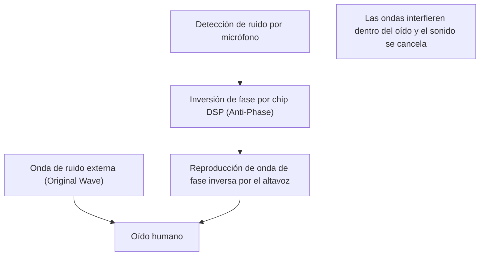

## 1. La verdadera naturaleza del silencio mágico

La "cancelación activa de ruido (ANC)" se ha convertido en una función indispensable en los auriculares y audífonos inalámbricos modernos.
La experiencia de que el ruido circundante desaparezca repentinamente en el instante en que se enciende el interruptor, como si te hubieras trasladado a otro espacio, parece magia para quienes la experimentan por primera vez.
Sin embargo, su verdadera naturaleza no es magia, sino el fruto de la tecnología científica que utiliza la **interferencia de ondas (Interference)**, una ley de la física sumamente clásica y hermosa.

El sonido llega a nuestros oídos como cambios en la presión del aire, es decir, como "ondas". Para cancelar estas ondas, el sistema ANC crea artificialmente "ondas inversas" y las choca contra el ruido. En este artículo, profundizaremos en el mecanismo que crea este silencio aparentemente mágico desde la perspectiva de la física.

## 2. La naturaleza del sonido y la "interferencia de ondas"

### El sonido es una "onda longitudinal (onda de compresión y rarefacción)"
Para comprender el mecanismo por el cual viaja el sonido, la forma más rápida es imaginar el aire como una colección de pequeñas partículas (moléculas).
Cuando el cono de un altavoz se mueve hacia adelante, el aire es empujado, creando una zona de "compresión" donde las moléculas están densamente agrupadas. Por el contrario, cuando tira hacia atrás, se crea una zona de "rarefacción". El fenómeno en el que este patrón de compresión y rarefacción se transmite sucesivamente al aire adyacente es el "sonido".
Cuando se representa en un gráfico, se dibuja como una forma de onda (como una onda sinusoidal) donde las áreas de alta presión del aire son "crestas" y las áreas de baja presión son "valles".

### El principio de superposición de ondas
En física, cuando múltiples ondas se encuentran en el mismo lugar, estas interactúan entre sí para crear una nueva onda. A esto se le llama el "principio de superposición de ondas".
Hay dos patrones principales de superposición.

1. **Interferencia constructiva (Constructive Interference)**
   Cuando las "crestas" y los "valles" de dos ondas coinciden exactamente (tienen la misma fase), las ondas se combinan para formar una onda más grande. Es el fenómeno por el cual el sonido se vuelve más fuerte.
2. **Interferencia destructiva (Destructive Interference)**
   Cuando la "cresta" de una onda y el "valle" de la otra onda coinciden exactamente (sus fases están desfasadas en 180 grados), las ondas se cancelan mutuamente y se vuelven planas. En otras palabras, el sonido desaparece.

La tecnología de cancelación de ruido es un sistema que provoca intencionalmente esta **interferencia destructiva**.

$$
y_1(t) = A \sin(\omega t)
$$
$$
y_2(t) = A \sin(\omega t + \pi) = -A \sin(\omega t)
$$
$$
y_{total}(t) = y_1(t) + y_2(t) = 0
$$

## 3. El mecanismo de la Cancelación Activa de Ruido (ANC)

Entonces, ¿cómo se logra esta "interferencia destructiva" en los auriculares y audífonos reales?
El proceso se basa en repetir los siguientes tres pasos a velocidades ultrarrápidas.

### Paso 1: Recolección del ruido (Detección)
Los micrófonos diminutos montados en el exterior (o interior) de los auriculares captan el sonido ambiental (como el ruido de los motores de los aviones, los sonidos de marcha de los trenes, los ruidos del aire acondicionado, etc.) en tiempo real. El rendimiento y la ubicación de estos micrófonos afectan en gran medida la precisión del ANC.

### Paso 2: Cálculo de la onda de fase inversa (Procesamiento)
Los datos del sonido recogido se envían a un chip DSP (Procesador de Señales Digitales) dedicado incorporado. El DSP analiza instantáneamente la forma de onda del sonido y calcula: "Para cancelar esta forma de onda, solo necesitamos emitir una forma de onda con la forma completamente opuesta (fase invertida 180 grados)".
Dado que el sonido viaja a una velocidad de unos 340 metros por segundo, se requiere que el DSP tenga una capacidad de procesamiento de alta velocidad con una latencia (retraso) extremadamente baja. Si el procesamiento se retrasa, la fase se desfasará y existe el peligro de que el sonido se vuelva aún más fuerte (interferencia constructiva).

### Paso 3: Generación de anti-ruido (Reproducción)
La "onda de fase inversa (anti-ruido)" generada por el DSP se reproduce a través del altavoz del auricular.
Este anti-ruido y el ruido real que entró desde el exterior chocan justo frente al tímpano. Las crestas y los valles se anulan perfectamente y nuestro cerebro lo percibe como "silencio".

## 4. Tipos de ANC: Feedforward y Feedback

Para mejorar la precisión de la cancelación de ruido, cada fabricante diseña cuidadosamente la ubicación de los micrófonos. Existen principalmente los siguientes métodos.

### Método Feedforward (Prealimentación)
Es un método que coloca el micrófono en el **exterior** del auricular.
Dado que puede captar el ruido rápidamente antes de que llegue al oído, tiene más margen de procesamiento y también es ventajoso para procesar ruidos de alta frecuencia. Sin embargo, debido a que el sistema no puede verificar cómo se canceló realmente el sonido dentro del oído (el resultado), tiene la debilidad de ser susceptible a la influencia del ruido del viento.

### Método Feedback (Retroalimentación)
Es un método que coloca el micrófono en el **interior** del auricular (entre el altavoz y el tímpano).
Debido a que el micrófono capta el sonido final que llega al oído, si queda ruido, puede aplicar correcciones nuevamente, por lo que demuestra un efecto de cancelación muy alto contra el ruido de bajos de baja frecuencia. Sin embargo, existe el riesgo de percibir erróneamente la música en sí como ruido y cancelarla, por lo que se requiere un algoritmo avanzado.

### Método Híbrido
El método híbrido, que equipa micrófonos tanto en el exterior como en el interior, es la tendencia principal en los modelos de gama alta actuales (como los AirPods Pro de Apple y la serie WF-1000XM de Sony).
Combina lo mejor de ambos mundos: anticipa los sonidos externos con el método feedforward y monitoriza y ajusta el sonido final dentro del oído con el método feedback. Esto logra tanto un silencio abrumador como una reproducción de música natural.

## 5. Historia del invento: Para proteger los oídos de los pilotos

El concepto de cancelación de ruido en sí es antiguo, y las patentes ya se solicitaron en la década de 1930. Sin embargo, se puso en uso práctico en la década de 1950 como una tecnología militar y de aviación para proteger a los pilotos de aviones de hélice y helicópteros del intenso ruido del motor.

El gran salto adelante se produjo en 1989, cuando el fabricante de equipos de audio Bose lanzó al mercado los primeros auriculares comerciales con cancelación de ruido para aviación. Se dice que el Dr. Amar G. Bose, el fundador de Bose, se sintió decepcionado al descubrir que la calidad del sonido de los auriculares proporcionados en el avión estaba completamente opacada por el ruido del motor durante un vuelo, y escribió la idea básica de la cancelación de ruido en su cuaderno en ese mismo avión.

Posteriormente, con la evolución y miniaturización de la tecnología de procesamiento digital (DSP), comenzó a popularizarse como auriculares para consumidores en general en la década de 2000, y ahora se ha convertido en una tecnología común instalada incluso en auriculares totalmente inalámbricos del tamaño de un grano de arroz.

## 6. Límites de la tecnología y evolución futura

Incluso la cancelación de ruido aparentemente mágica tiene sus puntos débiles.

* **Sonidos fáciles y sonidos difíciles**
  Es muy bueno para cancelar "sonidos continuos de baja frecuencia" que continúan en un patrón constante, como el ruido de los motores de los aviones y el zumbido de los aires acondicionados. Sin embargo, para sonidos repentinos y de alta frecuencia (altas frecuencias) como el llanto de un bebé o el sonido de un vidrio rompiéndose de repente, el cálculo del DSP y la generación de ondas a menudo no llegan a tiempo y no se pueden cancelar por completo.

* **La importancia de la cancelación pasiva de ruido**
  No solo la cancelación por parte del sistema (activa), sino que la "cancelación pasiva de ruido (efecto tapón de oído)" que bloquea físicamente el sonido ajustando herméticamente las almohadillas del auricular en el canal auditivo, también es extremadamente importante. Los últimos productos fusionan altamente este aislamiento físico del sonido y el procesamiento digital.

Como evolución futura, está atrayendo atención la "cancelación de ruido adaptativa" que utiliza IA (Inteligencia Artificial). Es una tecnología en la que la IA reconoce automáticamente el entorno en el que se encuentra el usuario (dentro de un tren, una cafetería, una oficina, etc.) y optimiza instantáneamente las características del ruido a cancelar, o permite que solo se transmitan las voces de ciertas personas.

La tecnología de cancelación de ruido, que comenzó a partir de la simple ley física de la interferencia de ondas, ha abierto una era en la que podemos controlar libremente nuestro "entorno sonoro" cotidiano junto con la evolución de la informática.