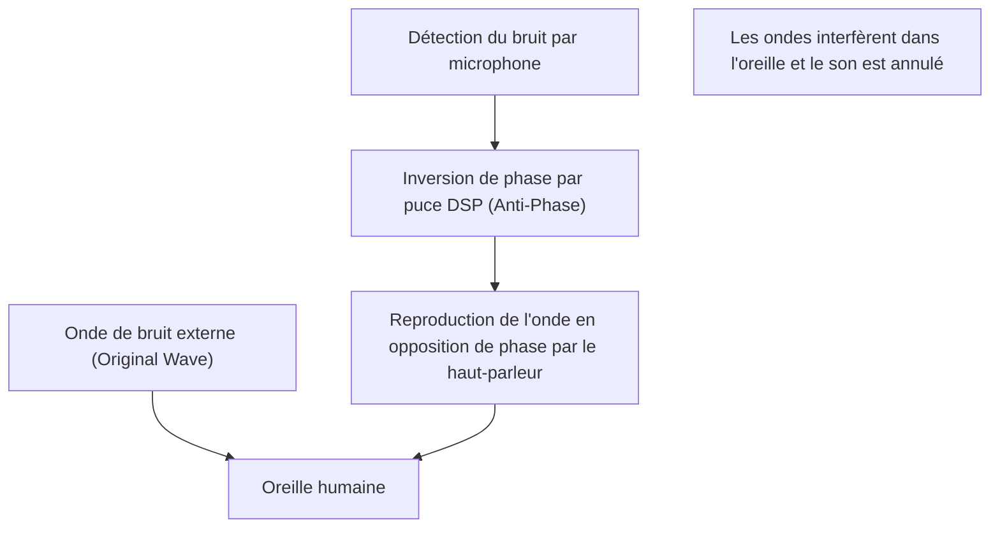

## 1. La véritable nature de ce silence magique

L'« annulation active du bruit (ANC) » est devenue une fonctionnalité indispensable des écouteurs et casques sans fil modernes.
L'expérience de voir les bruits environnants disparaître instantanément dès qu'on allume l'interrupteur, comme si l'on était transporté dans un autre espace, semble magique pour ceux qui l'essaient pour la première fois.
Cependant, sa véritable nature n'est pas magique, mais le fruit d'une technologie scientifique utilisant une loi très classique et magnifique de la physique : l'**interférence des ondes (Interference)**.

Le son parvient à nos oreilles sous la forme de changements de pression atmosphérique, c'est-à-dire d'« ondes ». Pour annuler ces ondes, le système ANC crée artificiellement une « onde inverse » et la fait entrer en collision avec le bruit. Dans cet article, nous explorerons en profondeur, d'un point de vue physique, le mécanisme qui crée ce silence magique.

## 2. La nature du son et l'« interférence des ondes »

### Le son est une « onde longitudinale (onde de compression) »
Pour comprendre comment le son se propage, le plus simple est d'imaginer l'air comme un ensemble de petites particules (molécules).
Lorsque le cône du haut-parleur se déplace vers l'avant, l'air est poussé et crée une zone de « compression » où les molécules sont denses. Inversement, lorsqu'il se retire, il crée une zone de « raréfaction ». Le phénomène où ce motif de compression-raréfaction se propage successivement à l'air adjacent est appelé le « son ».
Représenté sur un graphique, cela se dessine comme une forme d'onde (comme une onde sinusoïdale) où la partie de haute pression atmosphérique est une « crête » et la partie de basse pression est un « creux ».

### Le principe de superposition des ondes
En physique, lorsque plusieurs ondes se rencontrent au même endroit, elles s'influencent mutuellement pour créer une nouvelle onde. C'est ce qu'on appelle le « principe de superposition des ondes ».
Il existe deux principaux modèles de superposition.

1. **Interférence constructive (Constructive Interference)**
   Lorsque la « crête » d'une onde correspond exactement (même phase) à la « crête » d'une autre onde, et le « creux » au « creux », les ondes fusionnent pour devenir une onde plus grande. C'est le phénomène par lequel le son devient plus fort.
2. **Interférence destructive (Destructive Interference)**
   Lorsque la « crête » d'une onde et le « creux » d'une autre onde correspondent exactement (phases décalées de 180 degrés), les ondes s'annulent mutuellement et deviennent plates. En d'autres termes, le son disparaît.

La technologie d'annulation de bruit est précisément un système qui provoque intentionnellement cette « **interférence destructive** ».

$$
y_1(t) = A \sin(\omega t)
$$
$$
y_2(t) = A \sin(\omega t + \pi) = -A \sin(\omega t)
$$
$$
y_{total}(t) = y_1(t) + y_2(t) = 0
$$

## 3. Le fonctionnement de l'annulation active du bruit (ANC)

Alors, comment cette « interférence destructive » est-elle réalisée à l'intérieur des casques et écouteurs réels ?
Ce processus repose sur la répétition ultra-rapide des 3 étapes suivantes.

### Étape 1 : Collecte (détection) du bruit
Un minuscule microphone placé à l'extérieur (ou à l'intérieur) de l'écouteur capte en temps réel les bruits ambiants (bruit des moteurs d'avion, bruit des trains, bruit de la climatisation, etc.). Les performances et le placement de ce microphone influencent grandement la précision de l'ANC.

### Étape 2 : Calcul (traitement) de l'onde en opposition de phase
Les données sonores collectées sont envoyées à une puce DSP (Digital Signal Processor) dédiée intégrée. Le DSP analyse instantanément la forme d'onde du son et calcule que « pour annuler cette forme d'onde, il suffit d'émettre une forme d'onde de forme totalement opposée (avec une phase inversée de 180 degrés) ».
Étant donné que le son voyage à une vitesse d'environ 340 mètres par seconde, le DSP nécessite une capacité de traitement à haute vitesse avec une latence extrêmement faible. Si le traitement est retardé, la phase se décale, ce qui risque au contraire d'amplifier le son (interférence constructive).

### Étape 3 : Génération (reproduction) de l'anti-bruit
L'« onde en opposition de phase (anti-bruit) » générée par le DSP est reproduite par le haut-parleur de l'écouteur.
Cet anti-bruit et le bruit qui est réellement entré de l'extérieur se heurtent juste devant le tympan. Les crêtes et les creux s'annulent magnifiquement, et notre cerveau le perçoit comme du « silence ».

## 4. Types d'ANC : Feedforward et Feedback

Pour améliorer la précision de l'annulation du bruit, chaque fabricant innove dans le placement des microphones. Il existe principalement les méthodes suivantes.

### Méthode Feedforward
Il s'agit d'une méthode où le microphone est placé à l'**extérieur** de l'écouteur.
Comme il peut capter rapidement le bruit avant qu'il n'atteigne l'oreille, il y a de la marge pour le traitement, ce qui est également avantageux pour le traitement des bruits à haute fréquence. Cependant, comme le système ne peut pas vérifier comment le son a été réellement annulé dans l'oreille (le résultat), il a le point faible d'être sensible au bruit du vent.

### Méthode Feedback
Il s'agit d'une méthode où le microphone est placé à l'**intérieur** de l'écouteur (entre le haut-parleur et le tympan).
En captant le son qui atteint finalement l'oreille avec le microphone, il peut apporter de nouvelles corrections s'il reste du bruit, ce qui lui confère un effet d'annulation très élevé pour les bruits de basses fréquences. Cependant, comme il y a un risque d'annuler la musique elle-même en la confondant avec du bruit, un algorithme très avancé est nécessaire.

### Méthode hybride
La tendance actuelle pour les modèles haut de gamme (comme les AirPods Pro d'Apple et la série WF-1000XM de Sony) est la méthode hybride, qui intègre des microphones à la fois à l'extérieur et à l'intérieur.
Elle combine le meilleur des deux mondes : elle anticipe le son extérieur avec la méthode Feedforward et surveille/ajuste le son final dans l'oreille avec la méthode Feedback. Cela permet d'allier un silence écrasant à une reproduction musicale naturelle.

## 5. L'histoire de l'invention : Pour protéger les oreilles des pilotes

Le concept même d'annulation de bruit est ancien ; des brevets avaient déjà été déposés dans les années 1930. Cependant, sa mise en pratique n'a eu lieu que dans les années 1950, en tant que technologie militaire et aéronautique destinée à protéger les pilotes d'avions à hélices et d'hélicoptères du bruit intense des moteurs.

Le véritable bond en avant a eu lieu en 1989, lorsque le fabricant d'équipement audio Bose a lancé le premier casque à annulation de bruit commercial pour l'aviation. On dit que le fondateur de Bose, le Dr Amar G. Bose, a été déçu de constater que la qualité sonore des écouteurs qui lui avaient été distribués lors d'un vol était inaudible à cause du bruit du moteur, et a noté l'idée de base de l'annulation de bruit dans un carnet à bord de ce même vol.

Par la suite, avec l'évolution et la miniaturisation de la technologie de traitement numérique (DSP), il a commencé à se démocratiser en tant que casque pour le grand public dans les années 2000, et c'est aujourd'hui une technologie courante intégrée même dans des écouteurs entièrement sans fil de la taille d'un grain de riz.

## 6. Les limites de la technologie et ses futures évolutions

Même l'annulation de bruit magique a ses faiblesses.

* **Sons faciles et sons difficiles**
  Elle excelle pour annuler les « sons continus à basse fréquence » qui se poursuivent sur un motif constant, comme le bruit d'un moteur d'avion ou le bourdonnement d'un climatiseur. Cependant, pour les sons soudains et de haute fréquence, comme les pleurs d'un bébé ou le bruit de verre brisé, le calcul du DSP et la génération des ondes n'arrivent souvent pas à temps pour les annuler complètement.

* **L'importance de l'annulation passive du bruit**
  Au-delà de l'annulation par le système (active), l'« annulation passive du bruit (effet bouchon d'oreille) », qui bloque physiquement le son en ajustant parfaitement les embouts des écouteurs dans le conduit auditif, est également très importante. Les produits les plus récents fusionnent de manière sophistiquée cette isolation acoustique physique avec le traitement numérique.

Pour les évolutions futures, l'« annulation de bruit adaptative » utilisant l'IA (Intelligence Artificielle) attire l'attention. C'est une technologie où l'IA reconnaît automatiquement l'environnement dans lequel se trouve l'utilisateur (dans un train, dans un café, au bureau, etc.), optimise instantanément les caractéristiques du bruit à annuler ou laisse passer uniquement la voix de personnes spécifiques.

Issue d'une simple loi physique qu'est l'interférence des ondes, la technologie d'annulation de bruit a ouvert la voie à une ère où nous pouvons contrôler librement l'« environnement sonore » de notre quotidien, de pair avec l'évolution de l'informatique.