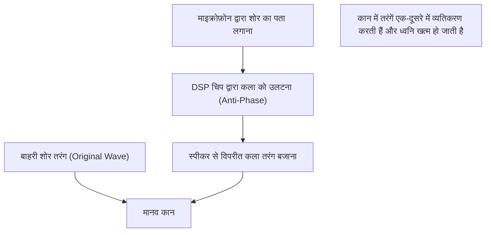

## 1. जादुई सी शांति की असलियत

आधुनिक वायरलेस इयरफ़ोन और हेडफ़ोन में "एक्टिव नॉइज़ कैंसिलिंग (ANC)" एक आवश्यक फीचर बन गया है।
स्विच ऑन करते ही, मानो आप किसी दूसरी दुनिया में पहुँच गए हों, आस-पास का शोर तुरंत गायब हो जाने का अनुभव पहली बार इसे आज़माने वालों को किसी जादू जैसा लगता है।
हालाँकि, इसकी असलियत कोई जादू नहीं है, बल्कि यह भौतिकी के एक बेहद क्लासिक और सुंदर नियम "**तरंग व्यतिकरण (Interference)**" का उपयोग करने वाली वैज्ञानिक तकनीक का परिणाम है।

ध्वनि हवा के दबाव में बदलाव, यानी "तरंगों" के रूप में हमारे कानों तक पहुँचती है। इन तरंगों को खत्म करने के लिए, ANC सिस्टम कृत्रिम रूप से "विपरीत तरंगें" उत्पन्न करता है और उन्हें शोर से टकराता है। इस लेख में, हम इस जादुई सी शांति पैदा करने वाले तंत्र को भौतिकी के दृष्टिकोण से गहराई से समझेंगे।

## 2. ध्वनि की असलियत और "तरंग व्यतिकरण"

### ध्वनि एक "अनुदैर्ध्य तरंग (Longitudinal Wave)" है
ध्वनि के संचरण तंत्र को समझने का सबसे आसान तरीका हवा को छोटे कणों (अणुओं) के समूह के रूप में कल्पना करना है।
जब स्पीकर का कोन आगे बढ़ता है, तो हवा पर दबाव पड़ता है और एक सघन हिस्सा बनता है जहाँ अणु करीब आ जाते हैं, जिसे "संपीड़न (Compression)" कहा जाता है। इसके विपरीत, যখন यह पीछे की ओर खिंचता है, तो एक विरल हिस्सा बनता है, जिसे "विरलन (Rarefaction)" कहते हैं। संपीड़न और विरलन का यह पैटर्न लगातार पास की हवा में फैलता है, और यही घटना "ध्वनि" है।
अगर इसे ग्राफ़ पर दर्शाया जाए, तो उच्च वायु दबाव वाले हिस्से "शिखर (Crest)" और कम दबाव वाले हिस्से "गर्त (Trough)" के रूप में तरंग (जैसे साइन वेव) बनाते हैं।

### तरंगों के अध्यारोपण का सिद्धांत (Principle of Superposition)
भौतिकी में, जब कई तरंगें एक ही स्थान पर मिलती हैं, तो वे एक-दूसरे को प्रभावित करती हैं और एक नई तरंग बनाती हैं। इसे "तरंगों के अध्यारोपण का सिद्धांत" कहा जाता है।
अध्यारोपण मुख्य रूप से दो प्रकार का होता है।

1. **संपोषी व्यतिकरण (Constructive Interference)**
   जब दो तरंगों के "शिखर" और "शिखर", या "गर्त" और "गर्त" बिल्कुल एक साथ मिलते हैं (समान कला या Phase में होते हैं), तो तरंगें जुड़कर एक बड़ी तरंग बनाती हैं। यह वह घटना है जहाँ ध्वनि तेज़ हो जाती है।
2. **विनाशी व्यतिकरण (Destructive Interference)**
   जब एक तरंग का "शिखर" और दूसरी तरंग का "गर्त" बिल्कुल एक साथ मिलते हैं (कला 180 डिग्री भिन्न होती है), तो तरंगें एक-दूसरे को खत्म कर देती हैं और समतल हो जाती हैं। यानी, ध्वनि गायब हो जाती है।

नॉइज़ कैंसिलिंग तकनीक वास्तव में एक ऐसा सिस्टम है जो जानबूझकर इसी "**विनाशी व्यतिकरण**" को उत्पन्न करता है।

$$
y_1(t) = A \sin(\omega t)
$$
$$
y_2(t) = A \sin(\omega t + \pi) = -A \sin(\omega t)
$$
$$
y_{total}(t) = y_1(t) + y_2(t) = 0
$$

## 3. एक्टिव नॉइज़ कैंसिलिंग (ANC) का तंत्र

तो, वास्तविक हेडफ़ोन या इयरफ़ोन के अंदर, यह "विनाशी व्यतिकरण" कैसे प्राप्त किया जाता है?
यह प्रक्रिया निम्नलिखित 3 चरणों को अत्यधिक तेज़ गति से दोहराने पर आधारित है।

### चरण 1: शोर को पकड़ना (पहचानना)
इयरफ़ोन के बाहर (या अंदर) स्थित एक बहुत छोटा माइक्रोफ़ोन आस-पास की आवाज़ों (जैसे हवाई जहाज़ के इंजन की आवाज़, ट्रेन चलने की आवाज़, एयर कंडीशनर की आवाज़ आदि) को रीयल-टाइम में पकड़ता है। इस माइक्रोफ़ोन का प्रदर्शन और इसकी जगह, ANC की सटीकता को काफी हद तक प्रभावित करते हैं।

### चरण 2: विपरीत कला तरंग की गणना (प्रसंस्करण)
पकड़े गए ध्वनि डेटा को एक अंतर्निहित समर्पित DSP (डिजिटल सिग्नल प्रोसेसर) चिप में भेजा जाता है। DSP तुरंत ध्वनि तरंग का विश्लेषण करता है और गणना करता है कि, "इस तरंग को खत्म करने के लिए, बिल्कुल विपरीत आकार (कला को 180 डिग्री उलट कर) की तरंग उत्पन्न करनी चाहिए।"
चूँकि ध्वनि प्रति सेकंड लगभग 340 मीटर की गति से यात्रा करती है, इसलिए DSP को बेहद कम लेटेंसी (देरी) के साथ हाई-स्पीड प्रोसेसिंग क्षमता की आवश्यकता होती है। यदि प्रसंस्करण में देरी होती है, तो कला स्थानांतरित हो जाएगी, और ध्वनि को तेज़ करने (संपोषी व्यतिकरण) का जोखिम हो सकता है।

### चरण 3: एंटी-नॉइज़ उत्पन्न करना (प्लेबैक)
DSP द्वारा उत्पन्न "विपरीत कला तरंग (एंटी-नॉइज़)" को इयरफ़ोन स्पीकर के माध्यम से बजाया जाता है।
यह एंटी-नॉइज़ और बाहर से कानों में आने वाला शोर, वास्तव में कान के पर्दे के ठीक सामने एक-दूसरे से टकराते हैं। शिखर और गर्त पूरी तरह से एक-दूसरे को रद्द कर देते हैं, और हमारा मस्तिष्क इसे "चुप्पी" के रूप में समझता है।

## 4. ANC के प्रकार: फीडफॉरवर्ड और फीडबैक

नॉइज़ कैंसिलिंग की सटीकता को बेहतर बनाने के लिए, प्रत्येक निर्माता माइक्रोफ़ोन के प्लेसमेंट में नवाचार कर रहा है। मुख्य रूप से निम्नलिखित तरीके मौजूद हैं।

### फीडफॉरवर्ड तरीका (Feedforward)
यह वह तरीका है जिसमें इयरफ़ोन के **बाहरी हिस्से** में माइक्रोफ़ोन रखा जाता है।
चूंकि माइक्रोफ़ोन कानों तक पहुंचने से पहले शोर को जल्दी पकड़ सकता है, इसलिए प्रोसेसिंग के लिए पर्याप्त समय होता है, और यह उच्च-आवृत्ति वाले शोर को संभालने के लिए भी फायदेमंद है। हालांकि, चूंकि सिस्टम यह जांच नहीं सकता कि कानों के अंदर ध्वनि वास्तव में कैसे रद्द हुई (परिणाम), इसकी एक कमज़ोरी यह है कि यह हवा की आवाज़ (Wind noise) से आसानी से प्रभावित हो जाता है।

### फीडबैक तरीका (Feedback)
यह वह तरीका है जिसमें इयरफ़ोन के **अंदरूनी हिस्से** (स्पीकर और कान के पर्दे के बीच) में माइक्रोफ़ोन रखा जाता है।
चूंकि माइक्रोफ़ोन उस ध्वनि को पकड़ता है जो अंततः कानों तक पहुँचती है, इसलिए अगर कोई शोर रह जाता है, तो उसे फिर से सुधारा जा सकता है। इसलिए, यह कम आवृत्ति वाले गहरे बास शोर के लिए बहुत उच्च कैंसिलिंग प्रभाव प्रदान करता है। हालांकि, इसमें एक जोखिम होता है कि सिस्टम संगीत को ही शोर समझकर रद्द कर सकता है, इसलिए इसके लिए उन्नत एल्गोरिदम की आवश्यकता होती है।

### हाइब्रिड तरीका (Hybrid)
वर्तमान में हाई-एंड मॉडल्स (जैसे Apple के AirPods Pro और Sony की WF-1000XM सीरीज़) में मुख्य रूप से हाइब्रिड तरीके का उपयोग किया जा रहा है, जिसमें बाहर और अंदर दोनों तरफ माइक्रोफ़ोन होते हैं।
यह फीडफॉरवर्ड तरीके से बाहरी आवाज़ों का पहले से अनुमान लगाता है, और फीडबैक तरीके से कान के अंदर की अंतिम ध्वनि की निगरानी और सूक्ष्म समायोजन करता है। इस प्रकार, यह दोनों की खूबियों को जोड़ता है। इसके परिणामस्वरूप, जबरदस्त शांति और प्राकृतिक संगीत प्लेबैक दोनों एक साथ प्राप्त होते हैं।

## 5. आविष्कार का इतिहास: पायलटों के कानों की सुरक्षा के लिए

नॉइज़ कैंसिलिंग की अवधारणा काफी पुरानी है, और 1930 के दशक में ही इसके पेटेंट के लिए आवेदन किया गया था। हालाँकि, इसे 1950 के दशक में एक सैन्य और विमानन तकनीक के रूप में व्यावहारिक उपयोग में लाया गया था, ताकि प्रोपेलर विमानों और हेलीकॉप्टरों के पायलटों को इंजन के तेज़ शोर से बचाया जा सके।

असली सफलता 1989 में मिली, जब ऑडियो उपकरण निर्माता कंपनी Bose ने विमानन उपयोग के लिए पहला कमर्शियल नॉइज़ कैंसिलिंग हेडसेट लॉन्च किया। कहा जाता है कि Bose के संस्थापक डॉ. अमर जी बोस एक हवाई यात्रा के दौरान निराश हो गए थे, क्योंकि फ्लाइट में दिए गए हेडफ़ोन की आवाज़ इंजन के शोर के कारण बिल्कुल सुनाई नहीं दे रही थी, और उसी फ्लाइट में उन्होंने एक नोटबुक में नॉइज़ कैंसिलिंग का बुनियादी विचार लिखा था।

उसके बाद, डिजिटल प्रोसेसिंग तकनीक (DSP) के विकास और इसे छोटा बनाने की प्रक्रिया के साथ, यह 2000 के दशक में आम उपभोक्ताओं के लिए हेडफ़ोन के रूप में लोकप्रिय होने लगा, और आज यह एक आम तकनीक बन गई है जो चावल के दाने के आकार के पूरी तरह से वायरलेस इयरफ़ोन में भी शामिल है।

## 6. तकनीक की सीमाएँ और भविष्य का विकास

जादुई सी लगने वाली इस नॉइज़ कैंसिलिंग की भी अपनी कमजोरियाँ हैं।

* **आवाज़ें जिनमें यह माहिर है और जिनमें कमज़ोर है**
  यह एक निश्चित पैटर्न में लगातार आने वाली "कम आवृत्ति वाली निरंतर आवाज़ों", जैसे हवाई जहाज़ के इंजन का शोर या एयर कंडीशनर की गड़गड़ाहट को खत्म करने में बहुत अच्छा है। हालाँकि, अचानक आने वाली उच्च आवृत्ति वाली आवाज़ों, जैसे बच्चे के रोने की आवाज़ या शीशा टूटने की तेज़ आवाज़ के मामले में, DSP की गणना और तरंग का निर्माण समय पर नहीं हो पाता है, और वे अक्सर पूरी तरह से खत्म नहीं हो पाती हैं।

* **पैसिव नॉइज़ कैंसिलिंग का महत्व**
  सिस्टम द्वारा आवाज़ रद्द करने (एक्टिव) के अलावा, इयरफ़ोन के इयरपीस को कान के छेद में कसकर फिट करके आवाज़ को भौतिक रूप से रोकना, यानी "पैसिव नॉइज़ कैंसिलिंग (इयरप्लग प्रभाव)", भी बहुत महत्वपूर्ण है। नवीनतम उत्पाद इस भौतिक ध्वनि इन्सुलेशन और डिजिटल प्रोसेसिंग का अत्यधिक उन्नत संयोजन हैं।

भविष्य के विकास के रूप में, AI (आर्टिफिशियल इंटेलिजेंस) का उपयोग करने वाली "एडेप्टिव नॉइज़ कैंसिलिंग (Adaptive Noise Cancelling)" तकनीक ध्यान आकर्षित कर रही है। यह एक ऐसी तकनीक है जहाँ AI स्वचालित रूप से उपयोगकर्ता के वातावरण (ट्रेन, कैफे, ऑफिस आदि) की पहचान करता है, रद्द किए जाने वाले शोर की विशेषताओं को तुरंत अनुकूलित करता है, या केवल विशिष्ट लोगों की आवाज़ों को पार करने की अनुमति देता है।

तरंग व्यतिकरण के सरल भौतिक नियम से शुरू हुई नॉइज़ कैंसिलिंग तकनीक ने, कंप्यूटर विज्ञान के विकास के साथ, एक ऐसे युग की शुरुआत की है जहाँ हम अपने दैनिक "ध्वनि वातावरण" को स्वतंत्र रूप से नियंत्रित कर सकते हैं।