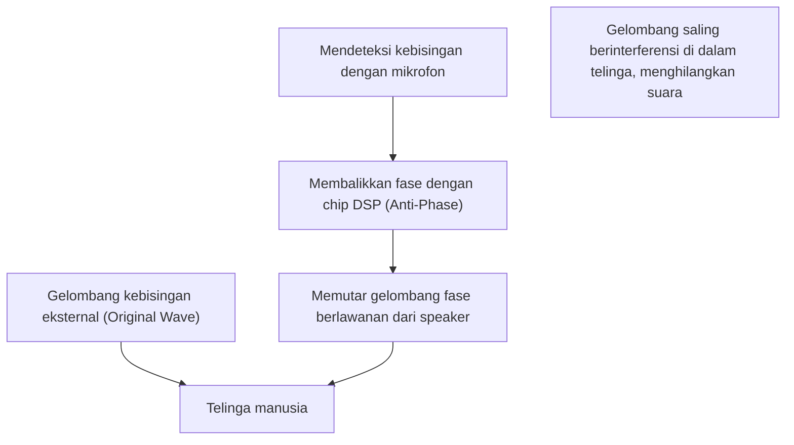

## 1. Identitas Sebenarnya dari Keheningan Layaknya Sihir

"Active Noise Cancelling (ANC)" telah menjadi fitur yang sangat penting pada earphone nirkabel dan headphone modern.
Pengalaman ketika kebisingan sekitar menghilang seketika saat fitur ini dihidupkan, seolah-olah Anda berpindah ke ruang lain, terasa seperti keajaiban bagi orang yang pertama kali merasakannya.
Namun, identitas sebenarnya bukanlah sihir, melainkan kristalisasi dari teknologi sains yang menggunakan hukum fisika yang sangat klasik dan indah, yaitu "**Interferensi Gelombang (Interference)**".

Suara mencapai telinga kita sebagai perubahan tekanan udara, atau dengan kata lain, sebagai "gelombang". Untuk menetralkan gelombang ini, sistem ANC secara buatan menciptakan "gelombang yang berlawanan" dan menabrakkannya dengan kebisingan tersebut. Dalam artikel ini, kami akan menggali secara mendalam mekanisme yang menciptakan keheningan layaknya sihir ini dari sudut pandang fisika.

## 2. Sifat Asli Suara dan "Interferensi Gelombang"

### Suara adalah "Gelombang Longitudinal"
Untuk memahami bagaimana suara merambat, membayangkan udara sebagai kumpulan partikel kecil (molekul) adalah cara yang paling cepat.
Ketika kerucut (cone) speaker bergerak ke depan, udara terdorong, menciptakan area "rapat" (compression) di mana molekul-molekul berkumpul erat. Sebaliknya, ketika ditarik ke belakang, area "renggang" (rarefaction) terbentuk. Fenomena di mana pola rapat dan renggang ini merambat secara berurutan ke udara di sekitarnya adalah "suara".
Jika digambarkan dalam grafik, ia direpresentasikan sebagai bentuk gelombang (seperti gelombang sinus) di mana area dengan tekanan udara tinggi menjadi "puncak" dan area dengan tekanan udara rendah menjadi "lembah".

### Prinsip Superposisi Gelombang
Dalam fisika, ketika beberapa gelombang bertemu di lokasi yang sama, gelombang-gelombang tersebut saling memengaruhi dan menciptakan gelombang baru. Ini disebut "Prinsip Superposisi Gelombang".
Ada dua pola utama superposisi:

1. **Interferensi Konstruktif (Constructive Interference)**
   Ketika "puncak" dan "puncak", serta "lembah" dan "lembah" dari dua gelombang sangat sejajar (memiliki fase yang sama), gelombang tersebut bergabung menjadi gelombang yang lebih besar. Ini adalah fenomena di mana suara menjadi lebih keras.
2. **Interferensi Destruktif (Destructive Interference)**
   Ketika "puncak" dari satu gelombang dan "lembah" dari gelombang lainnya sangat sejajar (fasenya bergeser 180 derajat), gelombang tersebut saling menghilangkan dan menjadi datar. Dengan kata lain, suara menghilang.

Teknologi noise cancelling adalah sistem yang secara sengaja memicu "**Interferensi Destruktif**" ini.

$$
y_1(t) = A \sin(\omega t)
$$
$$
y_2(t) = A \sin(\omega t + \pi) = -A \sin(\omega t)
$$
$$
y_{total}(t) = y_1(t) + y_2(t) = 0
$$

## 3. Mekanisme Active Noise Cancelling (ANC)

Lalu, bagaimana "interferensi destruktif" ini sebenarnya diwujudkan dalam headphone atau earphone?
Prosesnya terdiri dari mengulangi tiga langkah berikut pada kecepatan yang sangat tinggi.

### Langkah 1: Pengumpulan Kebisingan (Deteksi)
Mikrofon sangat kecil yang dipasang di bagian luar (atau dalam) earphone menangkap suara lingkungan sekitar (seperti suara mesin pesawat, suara kereta api yang berjalan, suara AC, dll.) secara real-time. Kinerja dan penempatan mikrofon ini sangat memengaruhi akurasi ANC.

### Langkah 2: Perhitungan Gelombang Fase Berlawanan (Pemrosesan)
Data suara yang dikumpulkan dikirim ke chip DSP (Digital Signal Processor) khusus yang terpasang di dalamnya. DSP secara instan menganalisis bentuk gelombang suara dan melakukan perhitungan yang berbunyi, "Untuk menetralkan bentuk gelombang ini, kita hanya perlu mengeluarkan bentuk gelombang yang bentuknya berlawanan persis (fasenya dibalik 180 derajat)."
Karena suara bergerak dengan kecepatan sekitar 340 meter per detik, DSP membutuhkan kemampuan pemrosesan berkecepatan tinggi dengan latensi (keterlambatan) yang sangat rendah. Jika pemrosesannya tertunda, fasenya akan bergeser, dan ada risiko sebaliknya akan membuat suara menjadi lebih keras (interferensi konstruktif).

### Langkah 3: Menghasilkan Anti-noise (Pemutaran)
"Gelombang fase berlawanan (anti-noise)" yang dihasilkan oleh DSP diputar melalui speaker earphone.
Anti-noise ini dan kebisingan yang benar-benar masuk dari luar bertabrakan tepat di depan gendang telinga. Puncak dan lembahnya dengan sempurna saling meniadakan, dan otak kita mengenalinya sebagai "keheningan".

## 4. Jenis-jenis ANC: Feedforward dan Feedback

Untuk meningkatkan akurasi noise cancelling, setiap produsen merancang penempatan mikrofon mereka. Berikut ini adalah metode utamanya:

### Metode Feedforward
Ini adalah metode di mana mikrofon ditempatkan di bagian **luar** earphone.
Karena mikrofon dapat menangkap kebisingan dengan cepat sebelum mencapai telinga, terdapat lebih banyak waktu untuk pemrosesan, yang juga menguntungkan untuk memproses kebisingan berfrekuensi tinggi. Namun, sistem tidak dapat memverifikasi bagaimana suara tersebut benar-benar dinetralkan di dalam telinga (hasilnya), sehingga memiliki kelemahan yaitu rentan terhadap suara angin.

### Metode Feedback
Ini adalah metode di mana mikrofon ditempatkan di bagian **dalam** earphone (di antara speaker dan gendang telinga).
Karena mikrofon menangkap suara yang pada akhirnya mencapai telinga dan dapat menerapkan koreksi ulang jika ada kebisingan yang tersisa, metode ini memberikan efek noise cancelling yang sangat tinggi untuk kebisingan frekuensi rendah yang berat. Namun, karena ada risiko keliru mengenali musik itu sendiri sebagai kebisingan dan menghilangkannya, algoritma tingkat lanjut sangat diperlukan.

### Metode Hibrida
Arus utama saat ini pada model kelas atas (seperti AirPods Pro dari Apple dan seri WF-1000XM dari Sony) adalah metode hibrida yang memiliki mikrofon baik di bagian luar maupun dalam.
Ini menggabungkan yang terbaik dari kedua dunia dengan memprediksi suara dari luar melalui metode feedforward dan memantau serta menyempurnakan suara akhir di dalam telinga melalui metode feedback. Hal ini memungkinkan terwujudnya keheningan yang luar biasa dan pemutaran musik yang alami secara bersamaan.

## 5. Sejarah Penemuan: Untuk Melindungi Telinga Pilot

Konsep noise cancelling itu sendiri sudah ada sejak lama, dengan hak paten yang sudah diajukan pada tahun 1930-an. Namun, hal ini baru dipraktikkan pada tahun 1950-an sebagai teknologi militer dan penerbangan untuk melindungi pilot pesawat baling-baling dan helikopter dari kebisingan mesin yang intens.

Lompatan nyata ke depan terjadi pada tahun 1989 ketika pabrikan peralatan audio Bose merilis headset noise cancelling komersial pertama untuk penerbangan. Pendiri Bose, Dr. Amar G. Bose, dikatakan merasa kecewa selama penerbangan karena kualitas suara headphone yang diberikan dalam penerbangan sama sekali tidak terdengar karena suara mesin, dan ia menuliskan ide dasar noise cancelling di buku catatannya saat berada di penerbangan tersebut.

Setelah itu, berkat evolusi dan miniaturisasi teknologi pemrosesan digital (DSP), pada tahun 2000-an teknologi ini mulai menyebar sebagai headphone untuk konsumen umum, dan kini telah menjadi teknologi umum yang bahkan dipasang pada earphone nirkabel sepenuhnya sebesar butiran beras.

## 6. Batasan Teknologi dan Evolusi Masa Depan

Noise cancelling yang layaknya sihir pun juga memiliki kelemahan.

* **Suara yang Dikuasai dan Suara yang Sulit Diatasi**
  Sangat mahir dalam meniadakan "suara terus-menerus berfrekuensi rendah" yang berlanjut dalam pola konstan, seperti suara mesin pesawat terbang atau suara dengungan AC. Namun, untuk suara yang tiba-tiba dan berfrekuensi tinggi (frekuensi tinggi), seperti tangisan bayi atau suara pecahan kaca yang tiba-tiba, perhitungan DSP dan pembuatan gelombang sering kali tidak dapat mengimbanginya sehingga tidak dapat dihilangkan sepenuhnya.

* **Pentingnya Passive Noise Cancelling**
  Tidak hanya pembatalan oleh sistem (aktif), "passive noise cancelling (efek penyumbat telinga)", yang secara fisik menghalangi suara dengan menempelkan earpiece earphone secara pas ke lubang telinga, juga sangat penting. Produk-produk terbaru secara canggih memadukan isolasi suara fisik ini dengan pemrosesan digital.

Adapun untuk evolusi di masa depan, "Adaptive Noise Cancelling" yang memanfaatkan AI (Kecerdasan Buatan) menarik perhatian. Ini adalah teknologi di mana AI secara otomatis mengenali lingkungan tempat pengguna berada (di dalam kereta, kafe, kantor, dll.) dan secara instan mengoptimalkan karakteristik kebisingan yang akan dihilangkan, atau memungkinkan hanya suara orang tertentu yang menembus masuk.

Berawal dari hukum fisika sederhana mengenai interferensi gelombang, teknologi noise cancelling, bersama dengan evolusi ilmu komputer, telah merintis era di mana kita dapat secara bebas mengontrol "lingkungan suara" sehari-hari kita.