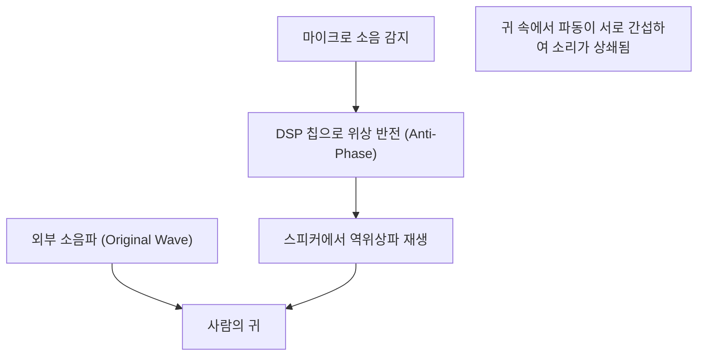

## 1. 마법 같은 정적의 정체

현대 무선 이어폰이나 헤드폰에 없어서는 안 될 기능이 된 '액티브 노이즈 캔슬링(ANC)'.
스위치를 켜는 순간 마치 다른 공간으로 이동한 것처럼 주변 소음이 스르륵 사라지는 경험은 처음 맛보는 사람에게 마법처럼 느껴집니다.
하지만 그 정체는 마법이 아니라, 매우 고전적이고 아름다운 물리학 법칙인 '**파동의 간섭(Interference)**'을 이용한 과학 기술의 결정체입니다.

소리는 공기의 압력 변화, 즉 '파동'으로서 우리의 귀에 닿습니다. 이 파동을 상쇄하기 위해 ANC 시스템은 '반대 파동'을 인공적으로 만들어내어 소음에 부딪히게 합니다. 본 기사에서는 이 마법 같은 정적을 만들어내는 메커니즘을 물리학의 관점에서 깊이 파헤쳐 보겠습니다.

## 2. 소리의 정체와 '파동의 간섭'

### 소리는 '소밀파(종파)'이다
소리가 전달되는 원리를 이해하려면 공기를 작은 알갱이(분자)의 집합으로 상상하는 것이 지름길입니다.
스피커의 콘이 앞으로 움직이면 공기가 밀려 분자가 밀집되는 '밀' 부분이 생깁니다. 반대로 뒤로 당기면 '소' 부분이 생깁니다. 이 소밀 패턴이 차례차례 이웃한 공기로 전달되는 현상이 '소리'입니다.
그래프로 나타내면 기압이 높은 부분이 '마루', 낮은 부분이 '골'이 되는 파형(사인파 등)으로 그려집니다.

### 파동의 중첩 원리
물리학에서 여러 파동이 같은 장소에서 만났을 때, 그 파동들은 서로 영향을 주고받으며 새로운 파동을 만듭니다. 이것을 '파동의 중첩 원리'라고 부릅니다.
중첩에는 크게 두 가지 패턴이 있습니다.

1. **보강 간섭 (Constructive Interference)**
   두 파동의 '마루'와 '마루', '골'과 '골'이 딱 일치(위상이 같음)했을 때, 파동은 합쳐져 더 큰 파동이 됩니다. 소리가 커지는 현상입니다.
2. **상쇄 간섭 (Destructive Interference)**
   한 파동의 '마루'와 다른 파동의 '골'이 딱 일치(위상이 180도 어긋남)했을 때, 파동은 서로를 상쇄하여 평평해집니다. 즉, 소리가 사라지는 것입니다.

노이즈 캔슬링 기술은 바로 이 '**상쇄 간섭**'을 의도적으로 일으키는 시스템입니다.

$$
y_1(t) = A \sin(\omega t)
$$
$$
y_2(t) = A \sin(\omega t + \pi) = -A \sin(\omega t)
$$
$$
y_{total}(t) = y_1(t) + y_2(t) = 0
$$

## 3. 액티브 노이즈 캔슬링(ANC)의 구조

그렇다면 실제 헤드폰이나 이어폰 속에서 이 '상쇄 간섭'은 어떻게 구현되고 있을까요?
그 과정은 다음의 3단계를 초고속으로 반복함으로써 이루어집니다.

### Step 1: 소음 집음(감지)
이어폰 외부(또는 내부)에 탑재된 초소형 마이크가 주변 환경음(비행기 엔진 소리, 전철 주행음, 에어컨 소리 등)을 실시간으로 잡아냅니다. 이 마이크의 성능과 배치가 ANC의 정밀도를 크게 좌우합니다.

### Step 2: 역위상파 계산(처리)
집음된 소리 데이터는 내장된 전용 DSP(디지털 시그널 프로세서) 칩으로 보내집니다. DSP는 순식간에 소리의 파형을 분석하여, "이 파형을 상쇄하려면 완전히 반대되는 형태(위상을 180도 반전시킨) 파형을 내보내면 된다"라는 계산을 수행합니다.
소리는 초당 약 340미터라는 속도로 나아가기 때문에, DSP에는 극히 낮은 레이턴시(지연)로 고속 처리할 수 있는 능력이 요구됩니다. 처리가 늦어지면 위상이 어긋나버려 오히려 소리를 키우는(보강 간섭) 위험성이 있기 때문입니다.

### Step 3: 안티 노이즈 발생(재생)
DSP에서 생성된 '역위상의 파동(안티 노이즈)'은 이어폰의 스피커에서 재생됩니다.
이 안티 노이즈와 실제로 밖에서 귀로 들어온 소음이 정확히 고막 직전에서 부딪힙니다. 훌륭하게 마루와 골이 상쇄되어 우리의 뇌는 '무음'으로 인식하는 것입니다.

## 4. ANC의 종류: 피드포워드와 피드백

노이즈 캔슬링의 정밀도를 높이기 위해 각 제조사는 마이크의 배치에 심혈을 기울이고 있습니다. 주로 다음과 같은 방식이 존재합니다.

### 피드포워드 방식
이어폰 **외부** 에 마이크를 배치하는 방식입니다.
소음이 귀에 닿기 전에 마이크로 빠르게 포착할 수 있어 처리에 여유가 있고, 고음역대의 노이즈 처리에도 유리합니다. 하지만 실제로 귀 속에서 소리가 어떻게 상쇄되었는지(결과)를 시스템이 확인할 수 없기 때문에, 풍절음의 영향을 받기 쉽다는 약점이 있습니다.

### 피드백 방식
이어폰 **내부** (스피커와 고막 사이)에 마이크를 배치하는 방식입니다.
최종적으로 귀에 도달하는 소리를 마이크로 주워담아, 노이즈가 남아있으면 다시 수정을 가할 수 있기 때문에 저음역대의 중저음 노이즈에 대해 매우 높은 캔슬링 효과를 발휘합니다. 단, 음악 그 자체까지 노이즈로 오인하여 상쇄해 버릴 위험이 있으므로 고도의 알고리즘이 필요합니다.

### 하이브리드 방식
현재 상위 모델(Apple의 AirPods Pro나 Sony의 WF-1000XM 시리즈 등)에서 주류를 이루고 있는 것이 외부와 내부 양쪽에 마이크를 탑재한 하이브리드 방식입니다.
피드포워드 방식으로 밖의 소리를 미리 읽고, 피드백 방식으로 귀 속의 최종적인 소리를 감시 및 미세 조정하는 양쪽의 장점만을 취했습니다. 이를 통해 압도적인 정적과 자연스러운 음악 재생을 양립시키고 있습니다.

## 5. 발명의 역사: 조종사의 귀를 보호하기 위해

노이즈 캔슬링의 개념 자체는 오래되어, 1930년대에는 이미 특허가 출원되어 있었습니다. 하지만 실용화된 것은 1950년대, 프로펠러기나 헬리콥터 조종사를 강렬한 엔진 소음으로부터 보호하기 위한 군사 및 항공 기술로서였습니다.

본격적인 도약을 이룬 것은 1989년, 음향 기기 제조사인 Bose(보스)사가 최초의 상업용 노이즈 캔슬링 헤드셋을 항공용으로 출시한 것입니다. Bose의 창업자인 아마르 G. 보스 박사는 비행기로 이동하던 중 기내에서 받은 헤드폰의 음질이 엔진 소리 때문에 전혀 들리지 않는 것에 실망하여, 그 기내에서 노이즈 캔슬링의 기본 아이디어를 노트에 적어 둔 것으로 알려져 있습니다.

그 후 디지털 처리 기술(DSP)의 진화와 소형화에 힘입어, 2000년대에는 일반 소비자용 헤드폰으로 보급되기 시작했고, 현재는 쌀알 크기의 완전 무선 이어폰에까지 탑재되는 일반적인 기술이 되었습니다.

## 6. 기술의 한계와 향후의 진화

마법 같은 노이즈 캔슬링에도 약점은 있습니다.

* **잘하는 소리와 못하는 소리**
  비행기의 엔진 소리나 에어컨의 웅웅거리는 소리 등, 일정한 패턴으로 지속되는 '저주파수의 지속음'을 상쇄하는 것은 매우 잘합니다. 하지만 아기 울음소리나 갑작스러운 유리 깨지는 소리 등, 돌발적이고 주파수가 높은 소리(고주파수)에 대해서는 DSP의 계산과 파동의 발생이 제때 이루어지지 않아 다 지우지 못하는 경우가 많습니다.

* **패시브 노이즈 캔슬링의 중요성**
  시스템에 의한 상쇄(액티브)뿐만 아니라, 이어폰의 이어 팁을 귓구멍에 딱 맞게 밀착시켜 물리적으로 소리를 차단하는 '패시브 노이즈 캔슬링(귀마개 효과)'도 매우 중요합니다. 최신 제품은 이 물리적 차음성과 디지털 처리를 고도로 융합하고 있습니다.

향후의 진화로는 AI(인공지능)를 활용한 '적응형 노이즈 캔슬링'이 주목받고 있습니다. 사용자가 있는 환경(전철 안, 카페, 사무실 등)을 AI가 자동으로 인식하여, 상쇄할 노이즈의 특성을 순식간에 최적화하거나 특정 사람의 목소리만 투과시키는 기술입니다.

파동의 간섭이라는 단순한 물리 법칙에서 시작된 노이즈 캔슬링 기술은, 컴퓨터 과학의 진화와 함께 우리의 일상적인 '소리 환경'을 자유자재로 제어할 수 있는 시대를 열었습니다.