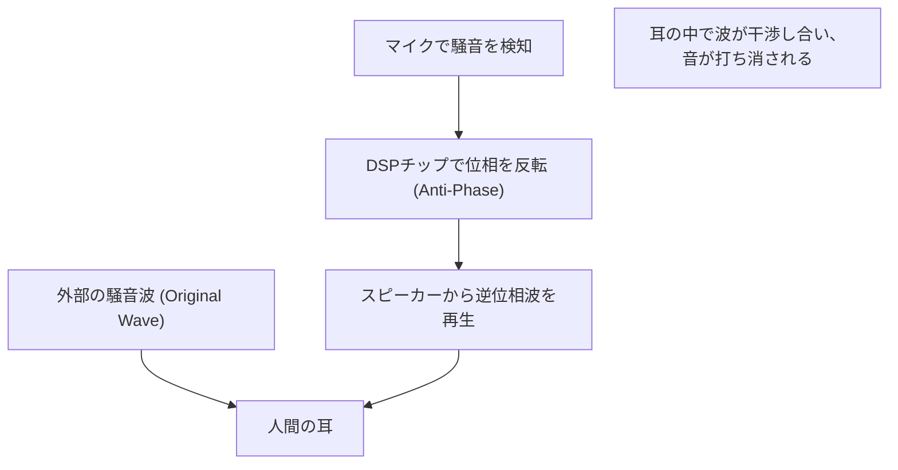

## 1. 魔法のような静寂の正体

現代のワイヤレスイヤホンやヘッドホンに欠かせない機能となった「アクティブ・ノイズキャンセリング（ANC）」。
スイッチを入れた瞬間に、まるで別の空間に移動したかのように周囲の騒音がスッと消え去る体験は、初めて味わう人にとって魔法のように感じられます。
しかし、その正体は魔法ではなく、非常に古典的で美しい物理学の法則「**波の干渉（Interference）**」を利用した科学技術の結晶なのです。

音は空気の圧力の変化、つまり「波」として私たちの耳に届きます。この波を打ち消すために、ANCシステムは「逆の波」を人工的に作り出し、騒音にぶつけています。本記事では、この魔法のような静寂を生み出すメカニズムを、物理学の視点から深く掘り下げていきます。

## 2. 音の正体と「波の干渉」

### 音は「疎密波（縦波）」である
音が伝わる仕組みを理解するには、空気を小さな粒（分子）の集まりとして想像するのが近道です。
スピーカーのコーンが前方に動くと、空気が押されて分子が密集する「密」の部分ができます。逆に後ろに引くと「疎」の部分ができます。この疎密のパターンが次々と隣の空気に伝わっていく現象が「音」です。
グラフで表すと、空気圧が高い部分が「山」、低い部分が「谷」となる波形（サイン波など）として描かれます。

### 波の重ね合わせの原理
物理学において、複数の波が同じ場所で出会ったとき、それらの波は互いに影響し合って新しい波を作ります。これを「波の重ね合わせの原理」と呼びます。
重ね合わせには大きく分けて2つのパターンがあります。

1. **強め合う干渉 (Constructive Interference)**
   2つの波の「山」と「山」、「谷」と「谷」がピタリと一致（位相が同じ）したとき、波は合体してより大きな波になります。音が大きくなる現象です。
2. **弱め合う干渉 (Destructive Interference)**
   一方の波の「山」と、もう一方の波の「谷」がピタリと一致（位相が180度ズレている）したとき、波は互いに打ち消し合い、平らになります。つまり、音が消えるのです。

ノイズキャンセリング技術は、まさにこの「**弱め合う干渉**」を意図的に引き起こすシステムです。

$$
y_1(t) = A \sin(\omega t)
$$
$$
y_2(t) = A \sin(\omega t + \pi) = -A \sin(\omega t)
$$
$$
y_{total}(t) = y_1(t) + y_2(t) = 0
$$

## 3. アクティブ・ノイズキャンセリング(ANC)の仕組み

では、実際のヘッドホンやイヤホンの中で、この「弱め合う干渉」はどのように実現されているのでしょうか。
そのプロセスは、以下の3つのステップを超高速で繰り返すことで成り立っています。

### Step 1: 騒音の集音（検知）
イヤホンの外側（または内側）に搭載された極小のマイクが、周囲の環境音（飛行機のエンジン音、電車の走行音、エアコンの音など）をリアルタイムで拾い上げます。このマイクの性能と配置が、ANCの精度を大きく左右します。

### Step 2: 逆位相波の計算（処理）
集音された音のデータは、内蔵された専用のDSP（デジタル・シグナル・プロセッサ）チップに送られます。DSPは瞬時に音の波形を分析し、「この波形を打ち消すためには、まったく逆の形（位相を180度反転させた）波形を出せばよい」という計算を行います。
音は毎秒約340メートルという速さで進むため、DSPには極めて低いレイテンシ（遅延）での高速処理能力が求められます。処理が遅れれば、位相がズレてしまい、逆に音を大きくしてしまう（強め合う干渉）危険性があるからです。

### Step 3: アンチノイズの発生（再生）
DSPで生成された「逆位相の波（アンチノイズ）」は、イヤホンのスピーカーから再生されます。
このアンチノイズと、実際に外から耳に入り込んできた騒音が、ちょうど鼓膜の直前でぶつかり合います。見事に山と谷が相殺され、私たちの脳には「無音」として認識されるのです。

## 4. ANCの種類：フィードフォワードとフィードバック

ノイズキャンセリングの精度を高めるため、各メーカーはマイクの配置に工夫を凝らしています。主に以下の方式が存在します。

### フィードフォワード方式
イヤホンの**外側**にマイクを配置する方式です。
騒音が耳に届く前にマイクで素早くキャッチできるため、処理に余裕があり、高音域のノイズ処理にも有利です。しかし、実際に耳の中でどのように音が打ち消されたか（結果）をシステムが確認できないため、風切り音の影響を受けやすいという弱点があります。

### フィードバック方式
イヤホンの**内側**（スピーカーと鼓膜の間）にマイクを配置する方式です。
最終的に耳に届く音をマイクで拾い、ノイズが残っていれば再度修正をかけることができるため、低音域の重低音ノイズに対して非常に高いキャンセリング効果を発揮します。ただし、音楽そのものまでノイズと誤認して打ち消してしまうリスクがあるため、高度なアルゴリズムが必要です。

### ハイブリッド方式
現在の上位モデル（AppleのAirPods ProやSonyのWF-1000XMシリーズなど）で主流となっているのが、外側と内側の両方にマイクを搭載したハイブリッド方式です。
フィードフォワード方式で外の音を先読みし、フィードバック方式で耳の中の最終的な音を監視・微調整するという、両者のいいとこ取りをしています。これにより、圧倒的な静けさと自然な音楽再生を両立させています。

## 5. 発明の歴史：パイロットの耳を守るために

ノイズキャンセリングの概念自体は古く、1930年代にはすでに特許が出願されていました。しかし、実用化されたのは1950年代、プロペラ機やヘリコプターのパイロットを強烈なエンジン騒音から守るための軍事・航空技術としてでした。

本格的な飛躍を遂げたのは1989年、音響機器メーカーのBose（ボーズ）社が、初の商業用ノイズキャンセリングヘッドセットを航空向けに発売したことです。Boseの創業者であるアマー・G・ボーズ博士は、飛行機での移動中に機内で渡されたヘッドホンの音質がエンジン音で全く聞こえないことに落胆し、その機内でノイズキャンセリングの基本アイデアをノートに書き留めたと言われています。

その後、デジタル処理技術（DSP）の進化と小型化により、2000年代には一般消費者向けのヘッドホンとして普及し始め、現在では米粒大の完全ワイヤレスイヤホンにまで搭載される一般的な技術となりました。

## 6. 技術の限界と今後の進化

魔法のようなノイズキャンセリングにも弱点はあります。

* **得意な音と苦手な音**
  飛行機のエンジン音やエアコンのブーンという音など、一定のパターンで続く「低周波数の持続音」を打ち消すのは非常に得意です。しかし、赤ちゃんの泣き声や、突然のガラスが割れる音など、突発的で周波数の高い音（高周波数）に対しては、DSPの計算と波の発生が間に合わず、消しきれないことが多いのです。

* **パッシブノイズキャンセリングの重要性**
  システムによる打ち消し（アクティブ）だけでなく、イヤホンのイヤーピースを耳の穴にぴったりと密着させて物理的に音を遮断する「パッシブ・ノイズキャンセリング（耳栓効果）」も非常に重要です。最新の製品は、この物理的遮音性とデジタル処理を高度に融合させています。

今後の進化としては、AI（人工知能）を活用した「適応型ノイズキャンセリング」が注目されています。ユーザーがいる環境（電車内、カフェ、オフィスなど）をAIが自動で認識し、打ち消すノイズの特性を瞬時に最適化したり、特定の人の声だけを透過させたりする技術です。

波の干渉というシンプルな物理法則から始まったノイズキャンセリング技術は、計算機科学の進化とともに、私たちの日常の「音の環境」を自在にコントロールできる時代を切り開きました。