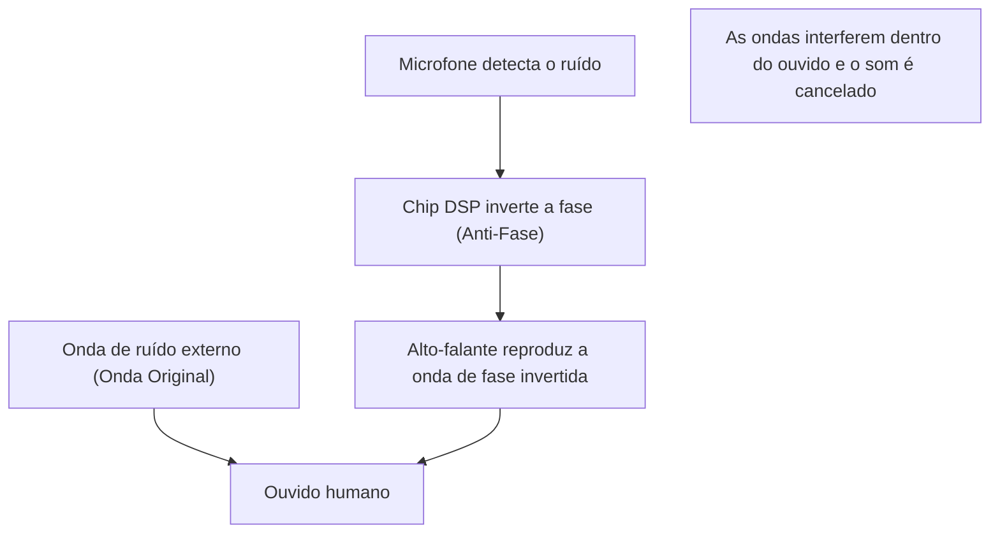

## 1. A verdadeira identidade do silêncio mágico

O "cancelamento ativo de ruído (ANC)", que se tornou uma função indispensável em fones de ouvido e headsets sem fio modernos.
A experiência em que o ruído ao redor desaparece assim que você liga o interruptor, como se você tivesse se movido para outro espaço, parece magia para quem experimenta pela primeira vez.
No entanto, sua verdadeira identidade não é magia, mas sim um cristal da ciência e tecnologia utilizando a clássica e bela lei da física da "**interferência de ondas (Interference)**".

O som chega aos nossos ouvidos como uma mudança na pressão do ar, ou seja, uma "onda". Para cancelar essa onda, o sistema ANC cria artificialmente uma "onda inversa" e a colide com o ruído. Neste artigo, exploraremos profundamente o mecanismo que cria esse silêncio mágico a partir da perspectiva da física.

## 2. A verdadeira identidade do som e a "interferência de ondas"

### O som é uma "onda longitudinal (onda de compressão)"
Para entender como o som viaja, o caminho mais rápido é imaginar o ar como uma coleção de pequenas partículas (moléculas).
Quando o cone de um alto-falante se move para frente, o ar é empurrado, criando uma parte de "compressão" (densa) onde as moléculas se aglomeram. Inversamente, quando ele se retrai, cria uma parte de "rarefação" (menos densa). O fenômeno em que esse padrão de compressão e rarefação é sucessivamente transmitido para o ar adjacente é o "som".
Representado em um gráfico, ele é desenhado como uma forma de onda (onda senoidal, etc.) onde a parte de alta pressão do ar é a "crista" (pico) e a parte de baixa pressão é o "vale".

### Princípio da superposição de ondas
Na física, quando múltiplas ondas se encontram no mesmo lugar, essas ondas se influenciam e criam uma nova onda. Isso é chamado de "princípio da superposição de ondas".
Existem basicamente dois padrões de superposição.

1. **Interferência Construtiva (Constructive Interference)**
   Quando a "crista" e a "crista", ou o "vale" e o "vale" de duas ondas coincidem perfeitamente (a fase é a mesma), as ondas se fundem e se tornam uma onda maior. É o fenômeno onde o som fica mais alto.
2. **Interferência Destrutiva (Destructive Interference)**
   Quando a "crista" de uma onda e o "vale" de outra onda coincidem perfeitamente (a fase está deslocada em 180 graus), as ondas se anulam e se tornam planas. Em outras palavras, o som desaparece.

A tecnologia de cancelamento de ruído é um sistema que induz intencionalmente essa "**interferência destrutiva**".

$$
y_1(t) = A \sin(\omega t)
$$
$$
y_2(t) = A \sin(\omega t + \pi) = -A \sin(\omega t)
$$
$$
y_{total}(t) = y_1(t) + y_2(t) = 0
$$

## 3. Mecanismo do Cancelamento Ativo de Ruído (ANC)

Então, como essa "interferência destrutiva" é realizada dentro de fones de ouvido ou headsets reais?
Esse processo é formado pela repetição ultrarrápida dos 3 passos a seguir.

### Passo 1: Captação de ruído (Detecção)
Microfones minúsculos montados na parte externa (ou interna) do fone de ouvido captam os sons do ambiente ao redor (ruído de motor de avião, som de trem em movimento, som de ar condicionado, etc.) em tempo real. O desempenho e a colocação desses microfones influenciam grandemente a precisão do ANC.

### Passo 2: Cálculo da onda de fase invertida (Processamento)
Os dados do som captado são enviados para um chip DSP (Digital Signal Processor) dedicado integrado. O DSP analisa instantaneamente a forma de onda do som e realiza o cálculo de que "para cancelar essa forma de onda, basta emitir uma forma de onda de formato completamente oposto (fase invertida em 180 graus)".
Como o som viaja a uma velocidade de cerca de 340 metros por segundo, o DSP requer uma capacidade de processamento de alta velocidade com uma latência (atraso) extremamente baixa. Se o processamento atrasar, a fase se deslocará, e há o risco de tornar o som mais alto (interferência construtiva).

### Passo 3: Geração de anti-ruído (Reprodução)
A "onda de fase invertida (anti-ruído)" gerada pelo DSP é reproduzida pelo alto-falante do fone de ouvido.
Esse anti-ruído e o ruído que realmente entrou no ouvido colidem logo antes do tímpano. As cristas e os vales se cancelam de forma brilhante, e o nosso cérebro reconhece isso como "silêncio".

## 4. Tipos de ANC: Feedforward e Feedback

Para aumentar a precisão do cancelamento de ruído, cada fabricante inova na colocação dos microfones. Existem principalmente os seguintes métodos.

### Método Feedforward
É um método em que o microfone é colocado na parte **externa** do fone de ouvido.
Como o ruído pode ser captado rapidamente pelo microfone antes de chegar ao ouvido, há folga no processamento, o que é vantajoso para o processamento de ruídos de alta frequência. No entanto, como o sistema não pode confirmar como o som foi efetivamente cancelado dentro do ouvido (o resultado), ele tem a desvantagem de ser suscetível ao ruído do vento.

### Método Feedback
É um método em que o microfone é colocado na parte **interna** do fone de ouvido (entre o alto-falante e o tímpano).
Como ele capta o som que finalmente chega ao ouvido e pode aplicar correção novamente se houver ruído restante, ele exibe um efeito de cancelamento muito alto para ruídos graves de baixa frequência. No entanto, há o risco de reconhecer erroneamente a própria música como ruído e cancelá-la, por isso exige algoritmos avançados.

### Método Híbrido
O que é dominante nos modelos de ponta atuais (como os AirPods Pro da Apple e a série WF-1000XM da Sony) é o método híbrido que incorpora microfones tanto na parte externa quanto interna.
Ele aproveita o melhor dos dois mundos, antecipando o som externo com o método feedforward e monitorando e ajustando finamente o som final dentro do ouvido com o método feedback. Isso alcança tanto um silêncio avassalador quanto uma reprodução musical natural.

## 5. A história da invenção: Para proteger os ouvidos dos pilotos

O conceito de cancelamento de ruído em si é antigo, com patentes já registradas na década de 1930. No entanto, foi colocado em uso prático na década de 1950, como uma tecnologia militar e de aviação para proteger pilotos de aeronaves a hélice e helicópteros do intenso ruído dos motores.

O avanço em grande escala ocorreu em 1989, quando a fabricante de equipamentos de áudio Bose lançou os primeiros headsets comerciais com cancelamento de ruído para aviação. Diz-se que o Dr. Amar G. Bose, fundador da Bose, ficou decepcionado com o fato de a qualidade do som dos fones de ouvido distribuídos durante um voo não poder ser ouvida em nada por causa do ruído do motor, e anotou a ideia básica do cancelamento de ruído em seu bloco de notas durante esse voo.

Posteriormente, com a evolução e miniaturização da tecnologia de processamento digital (DSP), começou a se popularizar como fones de ouvido para consumidores em geral na década de 2000 e, agora, tornou-se uma tecnologia comum que é equipada até mesmo em fones de ouvido totalmente sem fio do tamanho de um grão de arroz.

## 6. Os limites da tecnologia e a evolução futura

Até mesmo o cancelamento de ruído, que parece mágica, tem suas fraquezas.

* **Sons que são fáceis e difíceis de cancelar**
  É muito bom em cancelar "sons contínuos de baixa frequência" que seguem um padrão constante, como o ruído de um motor de avião ou o zumbido de um ar condicionado. No entanto, para sons repentinos e de alta frequência (altas frequências), como o choro de um bebê ou o som de um vidro quebrando, o cálculo do DSP e a geração da onda muitas vezes não são rápidos o suficiente, e eles não podem ser totalmente cancelados.

* **A importância do cancelamento passivo de ruído**
  Além do cancelamento pelo sistema (ativo), o "cancelamento passivo de ruído (efeito de tampão de ouvido)", que bloqueia fisicamente o som ajustando perfeitamente a ponta do fone de ouvido no canal auditivo, também é muito importante. Os produtos mais recentes fundem altamente esse isolamento acústico físico e o processamento digital.

Como evolução futura, o "cancelamento de ruído adaptativo" que utiliza IA (Inteligência Artificial) está atraindo atenção. É uma tecnologia em que a IA reconhece automaticamente o ambiente em que o usuário está (dentro de um trem, café, escritório, etc.) e otimiza instantaneamente as características do ruído a ser cancelado, ou permite que apenas a voz de uma pessoa específica passe.

A tecnologia de cancelamento de ruído, que começou a partir de uma simples lei física da interferência de ondas, juntamente com a evolução da ciência da computação, abriu uma era em que podemos controlar livremente o "ambiente sonoro" em nossas vidas diárias.