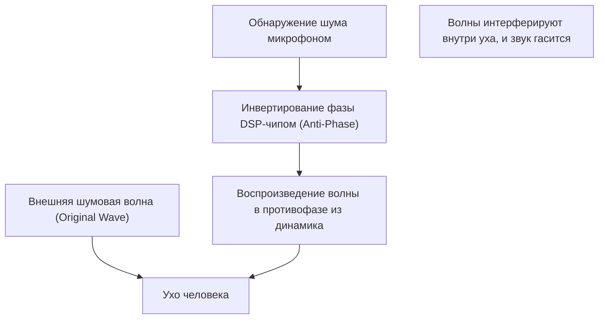

## 1. Истинная природа магической тишины

«Активное шумоподавление (ANC)» стало незаменимой функцией современных беспроводных наушников.
Опыт, когда в момент включения окружающий шум исчезает, словно вы перенеслись в другое пространство, для тех, кто пробует это впервые, кажется настоящей магией.
Однако на самом деле это не магия, а кристаллизация научно-технической мысли, использующая очень классический и красивый закон физики — **интерференцию волн (Interference)**.

Звук достигает наших ушей в виде изменений давления воздуха, то есть «волн». Чтобы нейтрализовать эти волны, система ANC искусственно создает «обратные волны» и сталкивает их с шумом. В этой статье мы глубоко рассмотрим механизм создания этой магической тишины с точки зрения физики.

## 2. Природа звука и «интерференция волн»

### Звук — это «продольная волна (волны сжатия и разрежения)»
Чтобы понять, как распространяется звук, проще всего представить воздух как скопление крошечных частиц (молекул).
Когда диффузор динамика движется вперед, он толкает воздух, создавая зону «сжатия» (плотную область), где молекулы скапливаются. Наоборот, когда он оттягивается назад, создается зона «разрежения» (разреженная область). Явление, при котором этот паттерн сжатия и разрежения последовательно передается соседним участкам воздуха, и есть «звук».
На графике это изображается в виде формы волны (например, синусоиды), где области высокого давления воздуха — это «гребни», а области низкого давления — «впадины».

### Принцип суперпозиции волн
В физике, когда несколько волн встречаются в одном и том же месте, они влияют друг на друга и создают новую волну. Это называется «принципом суперпозиции волн».
Суперпозицию можно условно разделить на два типа.

1. **Конструктивная интерференция (Constructive Interference)**
   Когда «гребень» и «гребень» или «впадина» и «впадина» двух волн точно совпадают (фазы одинаковы), волны сливаются и образуют более крупную волну. Это явление увеличения громкости звука.
2. **Деструктивная интерференция (Destructive Interference)**
   Когда «гребень» одной волны и «впадина» другой точно совпадают (фазы сдвинуты на 180 градусов), волны взаимно гасят друг друга и становятся плоскими. Другими словами, звук исчезает.

Технология шумоподавления — это система, которая намеренно вызывает именно эту **деструктивную интерференцию**.

$$
y_1(t) = A \sin(\omega t)
$$
$$
y_2(t) = A \sin(\omega t + \pi) = -A \sin(\omega t)
$$
$$
y_{total}(t) = y_1(t) + y_2(t) = 0
$$

## 3. Как работает активное шумоподавление (ANC)

Как же на самом деле реализуется эта «деструктивная интерференция» внутри наушников?
Этот процесс состоит из постоянного повторения трех следующих шагов на сверхвысокой скорости.

### Шаг 1: Сбор шума (Обнаружение)
Крошечные микрофоны, расположенные снаружи (или внутри) наушников, в реальном времени улавливают окружающие звуки (шум двигателей самолета, звук движущегося поезда, шум кондиционера и т.д.). Характеристики и расположение этих микрофонов во многом определяют точность работы ANC.

### Шаг 2: Вычисление противофазной волны (Обработка)
Собранные звуковые данные отправляются во встроенный специализированный чип DSP (цифровой сигнальный процессор). DSP мгновенно анализирует форму звуковой волны и вычисляет: «Чтобы погасить эту волну, нужно выдать волну совершенно противоположной формы (с фазой, перевернутой на 180 градусов)».
Поскольку звук распространяется со скоростью около 340 метров в секунду, от DSP требуются сверхбыстрые вычислительные возможности с крайне низкой задержкой (latency). Если обработка задержится, фаза сместится, что может привести к опасности усиления звука (конструктивной интерференции).

### Шаг 3: Генерация антишума (Воспроизведение)
«Волна в противофазе (антишум)», сгенерированная DSP, воспроизводится через динамик наушников.
Этот антишум и шум, фактически поступающий снаружи в ухо, сталкиваются прямо перед барабанной перепонкой. Гребни и впадины идеально компенсируют друг друга, и наш мозг воспринимает это как «тишину».

## 4. Типы ANC: Feed-forward и Feed-back

Для повышения точности шумоподавления производители придумывают различные способы размещения микрофонов. В основном существуют следующие методы.

### Система Feed-forward (прямая связь)
Метод, при котором микрофон размещается **снаружи** наушников.
Поскольку микрофон может быстро уловить шум до того, как он достигнет уха, остается больше времени на обработку, что дает преимущество при подавлении высокочастотных шумов. Однако у этого метода есть недостаток: он уязвим к шуму ветра, поскольку система не может проверить, как именно звук был подавлен внутри уха (результат).

### Система Feed-back (обратная связь)
Метод, при котором микрофон размещается **внутри** наушников (между динамиком и барабанной перепонкой).
Микрофон улавливает звук, который в конечном итоге достигает уха, и если шум остается, система может применить повторную коррекцию, поэтому она демонстрирует очень высокий эффект шумоподавления против глубоких низкочастотных шумов. Однако существует риск того, что система ошибочно примет саму музыку за шум и подавит ее, что требует сложных алгоритмов.

### Гибридная система
В современных топовых моделях (таких как Apple AirPods Pro или серия Sony WF-1000XM) доминирующей является гибридная система, оснащенная микрофонами как снаружи, так и внутри.
Она берет лучшее от обоих подходов: предугадывает внешние звуки с помощью системы Feed-forward и отслеживает и корректирует конечный звук внутри уха с помощью системы Feed-back. Благодаря этому достигается идеальный баланс между потрясающей тишиной и естественным воспроизведением музыки.

## 5. История изобретения: для защиты слуха пилотов

Сама концепция шумоподавления стара, патенты подавались еще в 1930-х годах. Однако практическое применение она нашла в 1950-х годах как военная и авиационная технология для защиты пилотов винтовых самолетов и вертолетов от сильного шума двигателей.

Настоящий прорыв произошел в 1989 году, когда производитель аудиотехники Bose выпустил первую коммерческую гарнитуру с шумоподавлением для авиации. Говорят, что доктор Амар Дж. Боуз, основатель компании Bose, во время перелета был разочарован тем, что из-за шума двигателей качество звука в выданных ему в самолете наушниках было абсолютно неразборчивым, и прямо на борту набросал в блокноте базовую идею шумоподавления.

Впоследствии, благодаря развитию и миниатюризации технологий цифровой обработки (DSP), в 2000-х годах она начала распространяться в качестве наушников для обычных потребителей, а сегодня стала стандартной технологией, устанавливаемой даже в полностью беспроводные наушники размером с рисовое зернышко.

## 6. Ограничения технологии и будущее развитие

Даже у магического шумоподавления есть свои слабости.

* **Звуки, с которыми система справляется хорошо и плохо**
  Система отлично справляется с подавлением «продолжительных низкочастотных звуков», которые длятся с постоянным паттерном, таких как шум двигателей самолета или гул кондиционера. Однако в отношении внезапных и высокочастотных звуков, таких как плач ребенка или звон разбивающегося стекла, вычисления DSP и генерация волны часто не успевают, и звук не удается подавить полностью.

* **Важность пассивного шумоподавления**
  Помимо системного (активного) подавления, очень важным является «пассивное шумоподавление (эффект берушей)», которое физически блокирует звук за счет плотного прилегания амбушюров наушников к ушному каналу. Новейшие продукты в высокой степени объединяют эту физическую звукоизоляцию и цифровую обработку.

Что касается будущего развития, то большое внимание уделяется «адаптивному шумоподавлению» с использованием ИИ (искусственного интеллекта). Это технология, при которой ИИ автоматически распознает среду, в которой находится пользователь (в поезде, кафе, офисе и т.д.), мгновенно оптимизирует характеристики подавляемого шума или пропускает только голоса конкретных людей.

Технология шумоподавления, начавшаяся с простого физического закона интерференции волн, вместе с развитием вычислительной техники открыла эпоху, когда мы можем свободно управлять нашей повседневной «звуковой средой».
