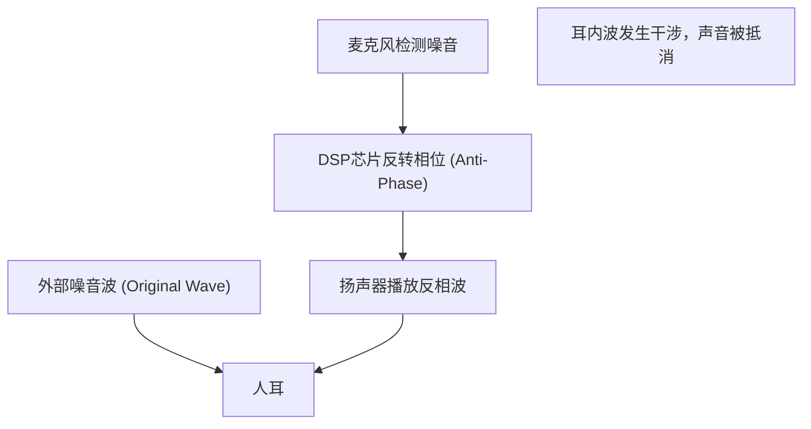

## 1. 如魔法般寂静的真相

现代无线耳机和头戴式耳机中不可或缺的功能“主动降噪（ANC）”。
打开开关的瞬间，仿佛移动到了另一个空间，周围的噪音瞬间消失，对于初次体验的人来说感觉就像魔法一样。
然而，其真相并非魔法，而是利用了非常古典且美丽的物理学定律“ **波的干涉（Interference）** ”的科学技术结晶。

声音是空气压力的变化，即作为“波”传达到我们的耳朵。为了抵消这种波，ANC系统人工制造出“相反的波”，并使其与噪音相撞。本文将从物理学的视角，深入挖掘产生这种如魔法般寂静的机制。

## 2. 声音的真相与“波的干涉”

### 声音是“疏密波（纵波）”
为了理解声音传播的机制，将空气想象为小颗粒（分子）的集合是捷径。
当扬声器的纸盆向前移动时，空气被推挤，形成分子密集的“密”部。反之向后拉时，形成“疏”部。这种疏密模式接连不断地传导给相邻空气的现象就是“声音”。
用图表表示，空气压力高的部分为“波峰”，低的部分为“波谷”，绘制成波形（如正弦波）。

### 波的叠加原理
在物理学中，当多个波在同一地点相遇时，这些波会相互影响并产生新的波。这被称为“波的叠加原理”。
叠加大致分为两种模式。

1. **相长干涉 (Constructive Interference)**
   当两个波的“波峰”与“波峰”、“波谷”与“波谷”完全一致（相位相同）时，波会合并成为更大的波。这就是声音变大的现象。
2. **相消干涉 (Destructive Interference)**
   当一个波的“波峰”与另一个波的“波谷”完全一致（相位相差180度）时，波会相互抵消变平。也就是说，声音消失了。

降噪技术正是故意引发这种“ **相消干涉** ”的系统。

$$
y_1(t) = A \sin(\omega t)
$$
$$
y_2(t) = A \sin(\omega t + \pi) = -A \sin(\omega t)
$$
$$
y_{total}(t) = y_1(t) + y_2(t) = 0
$$

## 3. 主动降噪(ANC)的机制

那么，在实际的头戴式耳机或入耳式耳机中，这种“相消干涉”是如何实现的呢？
该过程是通过以超高速重复以下三个步骤来完成的。

### 第一步：噪音的采集（检测）
搭载在耳机外侧（或内侧）的极小麦克风实时拾取周围的环境音（飞机发动机声、火车行驶声、空调声等）。这种麦克风的性能和位置极大地影响着ANC的精度。

### 第二步：反相波的计算（处理）
采集到的声音数据被发送到内置的专用DSP（数字信号处理器）芯片。DSP瞬间分析声音波形，并计算出“为了抵消这个波形，只需发出形状完全相反（相位反转180度）的波形即可”。
由于声音以每秒约340米的速度传播，因此DSP需要具备极低延迟的高速处理能力。如果处理延迟，相位就会产生偏差，反而有放大声音（相长干涉）的风险。

### 第三步：抗噪波的产生（播放）
DSP生成的“反相波（抗噪波）”通过耳机的扬声器播放出来。
这种抗噪波与实际从外部进入耳朵的噪音，刚好在耳膜前相撞。波峰与波谷完美抵消，我们的大脑便将其认知为“无声”。

## 4. ANC的种类：前馈与反馈

为了提高降噪的精度，各厂家在麦克风的配置上下足了功夫。主要存在以下几种方式。

### 前馈方式
将麦克风配置在耳机 **外侧** 的方式。
因为可以在噪音到达耳朵之前用麦克风快速捕捉，所以在处理上有余量，对高频噪音的处理也很有利。然而，由于系统无法确认声音在耳内实际是如何被抵消的（结果），因此存在容易受到风噪影响的弱点。

### 反馈方式
将麦克风配置在耳机 **内侧** （扬声器和耳膜之间）的方式。
用麦克风拾取最终到达耳朵的声音，如果残留有噪音还可以再次进行修正，因此对低频的重低音噪音发挥出极高的降噪效果。但是，由于存在将音乐本身也误认为噪音而抵消的风险，因此需要高度的算法。

### 混合方式
目前在高端机型（如Apple的AirPods Pro和Sony的WF-1000XM系列等）中成为主流的，是在外侧和内侧都搭载了麦克风的混合方式。
通过前馈方式预判外部声音，再通过反馈方式对耳内最终的声音进行监控和微调，可以说集齐了双方的优点。这使得压倒性的宁静与自然的音乐播放得以兼顾。

## 5. 发明历史：为了保护飞行员的耳朵

降噪的概念本身很古老，在20世纪30年代就已经申请了专利。然而，直到20世纪50年代才被实用化，当时是作为保护螺旋桨飞机和直升机飞行员免受强烈发动机噪音伤害的军事和航空技术。

实现真正飞跃是在1989年，音响设备制造商Bose（博士）公司推出了首款用于航空的商业级降噪耳机。据说，Bose的创始人Amar G. Bose（阿玛尔·G·博士）在乘飞机旅行时，对机上发放的耳机音质完全被发动机噪音掩盖感到失望，并于那架飞机上在笔记本里写下了降噪的基本构想。

随后，随着数字处理技术（DSP）的进步和微型化，在2000年代开始作为面向普通消费者的耳机普及，现在甚至已经成为搭载在米粒大小的真无线耳机中的常见技术。

## 6. 技术的局限性与未来的演进

如魔法般的降噪也有弱点。

* **擅长的声音与不擅长的声音**
  它非常擅长抵消像飞机发动机声、空调嗡嗡声等以一定模式持续的“低频持续音”。然而，对于婴儿哭声、突发的玻璃破碎声等突发且频率高的声音（高频），DSP的计算和波的产生往往跟不上，很多时候无法完全消除。

* **被动降噪的重要性**
  不仅依靠系统的抵消（主动），让耳机的耳塞紧密贴合耳道，在物理上阻断声音的“被动降噪（耳塞效应）”也极其重要。最新的产品高度融合了这种物理隔音性和数字处理技术。

未来的演进方面，利用AI（人工智能）的“自适应降噪”备受瞩目。这是AI自动识别用户所处的环境（电车内、咖啡馆、办公室等），瞬间优化要抵消的噪音特性，或者只让特定人的声音穿透的技术。

源于波的干涉这一简单物理定律的降噪技术，伴随计算机科学的进步，开创了我们可以自由掌控日常“声音环境”的时代。