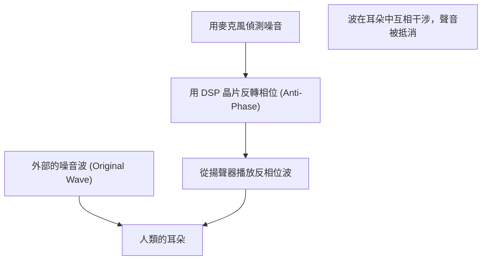

## 1. 如魔法般寂靜的真面目

現代無線耳機不可或缺的功能「主動降噪（ANC）」。
打開開關的瞬間，彷彿移動到另一個空間般，周圍的噪音瞬間消失，對於初次體驗的人來說簡直就像魔法一樣。
然而，其真面目並非魔法，而是利用非常古典且美麗的物理學定律「 **波的干涉 (Interference)** 」所創造出的科學技術結晶。

聲音是空氣壓力的變化，也就是作為「波」傳達到我們的耳朵。為了抵消這個波，ANC 系統會人工產生「反向的波」，並將其與噪音相撞。本文將從物理學的角度，深入探討產生這種如魔法般寂靜的機制。

## 2. 聲音的真面目與「波的干涉」

### 聲音是「疏密波（縱波）」
要理解聲音傳播的機制，將空氣想像成微小顆粒（分子）的集合體是最好的捷徑。
當揚聲器的音盆向前移動時，空氣被推擠，會形成分子密集的「密」部。反之向後拉時，則會形成「疏」部。這種疏密模式接連傳遞給相鄰空氣的現象，就是「聲音」。
用圖表來表示的話，氣壓高的部分為「波峰」，低的部分為「波谷」，繪製成波形（如正弦波等）。

### 波的疊加原理
在物理學中，當多個波在同一個地方相遇時，這些波會互相影響並產生新的波。這被稱為「波的疊加原理」。
疊加大致可以分為兩種模式。

1. **建設性干涉 (Constructive Interference)**
   當兩個波的「波峰」與「波峰」、「波谷」與「波谷」完全一致（相位相同）時，波會合併成為更大的波。這就是聲音變大的現象。
2. **破壞性干涉 (Destructive Interference)**
   當一個波的「波峰」與另一個波的「波谷」完全一致（相位相差 180 度）時，波會互相抵消並變得平坦。也就是說，聲音會消失。

降噪技術，正是刻意引發這種「 **破壞性干涉** 」的系統。

$$
y_1(t) = A \sin(\omega t)
$$
$$
y_2(t) = A \sin(\omega t + \pi) = -A \sin(\omega t)
$$
$$
y_{total}(t) = y_1(t) + y_2(t) = 0
$$

## 3. 主動降噪 (ANC) 的機制

那麼，在實際的頭戴式耳機或入耳式耳機中，這種「破壞性干涉」是如何實現的呢？
其過程是由以下 3 個步驟以超高速重複進行而成立的。

### Step 1: 噪音的收音（偵測）
搭載於耳機外側（或內側）的微小麥克風，會即時拾取周圍的環境音（飛機引擎聲、火車行駛聲、冷氣聲等）。這個麥克風的性能與配置，會大大左右 ANC 的精準度。

### Step 2: 反相位波的計算（處理）
收集到的聲音資料，會被送到內建的專屬 DSP（數位訊號處理器）晶片。DSP 會瞬間分析聲音的波形，並進行「為了抵消這個波形，只要發出完全相反形狀（相位反轉 180 度）的波形即可」的計算。
因為聲音以每秒約 340 公尺的速度前進，所以 DSP 需要具備極低延遲的高速處理能力。如果處理延遲，相位就會產生偏差，反而會有讓聲音變大（建設性干涉）的危險性。

### Step 3: 抗噪音的產生（播放）
由 DSP 產生的「反相位的波（抗噪音）」，會從耳機的揚聲器播放出來。
這個抗噪音，與實際從外面進入耳朵的噪音，正好在耳膜前相撞。完美地讓波峰與波谷互相抵消，我們的大腦就會將其認知為「無聲」。

## 4. ANC 的種類：前饋式與反饋式

為了提高降噪的精準度，各家廠商在麥克風的配置上下足了功夫。主要有以下幾種方式。

### 前饋式
在耳機的 **外側** 配置麥克風的方式。
因為能在噪音到達耳朵前用麥克風迅速捕捉，所以處理上較有餘裕，對於高頻噪音的處理也較為有利。然而，因為系統無法確認聲音在耳朵中實際是如何被抵消的（結果），所以有容易受到風切聲影響的缺點。

### 反饋式
在耳機的 **內側** （揚聲器與耳膜之間）配置麥克風的方式。
用麥克風拾取最終到達耳朵的聲音，如果還有殘留噪音就能再次進行修正，因此對於低頻的重低音噪音能發揮非常高的降噪效果。不過，因為有將音樂本身也誤認為噪音而抵消的風險，所以需要高度的演算法。

### 混合式
目前高階機型（如 Apple 的 AirPods Pro 或 Sony 的 WF-1000XM 系列等）的主流，是外側與內側皆搭載麥克風的混合式。
用前饋式預判外面的聲音，並用反饋式監控、微調耳朵裡最終的聲音，結合了兩者的優點。藉此實現了壓倒性的寂靜與自然的音樂播放。

## 5. 發明的歷史：為了保護飛行員的耳朵

降噪的概念本身很古老，在 1930 年代就已經申請了專利。不過，真正實用化是在 1950 年代，作為保護螺旋槳飛機或直升機飛行員免受強烈引擎噪音傷害的軍事、航空技術。

獲得實質性飛躍發展是在 1989 年，音響設備製造商 Bose 公司發售了首款針對航空的商業用降噪耳機。據說 Bose 的創辦人 Amar G. Bose 博士，在搭乘飛機移動時，對機上發放的耳機音質完全被引擎聲蓋過感到失望，並在該班機上將降噪的基本想法寫在筆記本上。

之後，隨著數位處理技術（DSP）的進化與小型化，到了 2000 年代開始作為一般消費者用的耳機普及，現在已經成為連米粒般大小的真無線耳機都會搭載的普遍技術。

## 6. 技術的極限與未來的進化

如魔法般的降噪也有弱點。

* **擅長的聲音與不擅長的聲音**
  非常擅長抵消飛機引擎聲或冷氣的嗡嗡聲等，以一定模式持續的「低頻持續音」。然而，對於嬰兒哭聲或突然的玻璃碎裂聲等突發性且頻率高的聲音（高頻），DSP 的計算與波的產生往往來不及，大多無法完全消除。

* **被動降噪的重要性**
  不僅是系統的抵消（主動），讓耳機的耳塞緊密貼合耳道以物理方式阻擋聲音的「被動降噪（耳塞效應）」也非常重要。最新的產品將這種物理隔音性與數位處理進行了高度的融合。

未來的進化方面，活用 AI（人工智慧）的「適應性降噪」正備受矚目。這是由 AI 自動辨識使用者所在的環境（電車內、咖啡廳、辦公室等），瞬間最佳化要抵消的噪音特性，或者只讓特定人物的聲音穿透的技術。

從波的干涉這個簡單物理定律開始的降噪技術，隨著電腦科學的進化，開創了我們能自在控制日常「聲音環境」的時代。