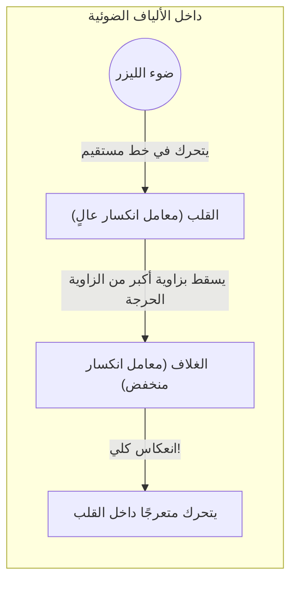

## 1. إنترنت العالم متصل بـ "الضوء"

عندما تقوم بتشغيل مقطع فيديو على يوتيوب موجود على خادم في الولايات المتحدة باستخدام هاتفك الذكي، هل تعتقد أن تلك البيانات تنتقل عبر الأقمار الصناعية في الفضاء؟ 
في الواقع، حوالي 99% من اتصالات الإنترنت في العالم تمر عبر **كابلات الألياف الضوئية** الممتدة في قاع المحيط، حيث تعبر البحار حرفيًا بـ "سرعة الضوء".

خيوط زجاجية لا يتجاوز سمكها سمك شعرة الإنسان تنقل كميات هائلة من البيانات، تصل إلى عدة تيرابايت، إلى جميع أنحاء العالم في لمح البصر. كان التحول الجذري من الاتصالات عبر الكابلات النحاسية القديمة (الإشارات الكهربائية) إلى الاتصالات عبر الألياف الضوئية (الإشارات الضوئية) أهم ثورة في البنية التحتية في مجتمع المعلومات الحديث.

الضوء له خاصية الانتقال في خطوط مستقيمة. إذن، كيف ينتقل الضوء عبر الكابلات المتعرجة في قاع المحيط دون أن يتسرب للخارج، ليصل إلى مسافات تبعد آلاف الكيلومترات؟

## 2. الانكسار وفيزياء "الانعكاس الكلي"

تكمن الإجابة في ظاهرة بصرية تُدرّس في فيزياء المدرسة الثانوية تُعرف باسم **الانعكاس الكلي (Total Internal Reflection)** .

عندما ينتقل الضوء من مادة تكون فيها "سرعة الضوء بطيئة (معامل الانكسار كبير)" إلى مادة تكون فيها السرعة "عالية (معامل الانكسار صغير)"، مثل الانتقال من الماء إلى الهواء أو من الزجاج إلى الهواء، يحدث "انكسار" حيث ينحني مسار الضوء عند السطح الفاصل.
عندما تنظر إلى سطح الماء من داخل حوض السباحة، هل سبق لك أن لاحظت أنه إذا نظرت من زاوية مائلة معينة، لا يمكنك رؤية المشهد الخارجي، ويبدو سطح الماء وكأنه مرآة تعكس قاع الحوض؟

مع زيادة الزاوية التي يسقط بها الضوء بشكل مائل (زاوية السقوط)، تأتي لحظة يصبح فيها الضوء المنكسر موازيًا للسطح الفاصل. تُسمى هذه الزاوية "الزاوية الحرجة".
**عندما تتجاوز زاوية السقوط هذه الزاوية الحرجة، لا يتسرب أي ضوء إلى الخارج على الإطلاق، بل ينعكس بنسبة 100% عند السطح الفاصل ويعود إلى الداخل. هذا هو « الانعكاس الكلي ».**

المرايا العادية تعكس الضوء باستخدام معادن مثل الفضة، ولكن يُمتص جزء ضئيل من الضوء ويُفقد حتمًا. ومع ذلك، فإن معدل الانعكاس الناتج عن "الانعكاس الكلي" هو 100% تمامًا، مما يجعلها مرآة مثالية بلا أي فقدان للطاقة على الإطلاق.

## 3. بنية الألياف الضوئية: القلب والغلاف

تُصنع الألياف الضوئية من زجاج كوارتز خاص ذي بنية ثنائية الطبقات لاحتواء مبدأ الانعكاس الكلي هذا داخل الكابل.

1. **القلب (الجزء المركزي)** : المسار الذي يمر عبره الضوء. وهو زجاج ذو معامل انكسار "أعلى قليلًا".
2. **الغلاف (الجزء الخارجي)** : الطبقة التي تغلف القلب. وهو زجاج ذو معامل انكسار "أقل قليلًا".

عند تسليط ضوء الليزر بشكل مستقيم من نهاية القلب، ينتقل الضوء في خط مستقيم داخله. وحتى إذا كان الكابل منحنياً واصطدم الضوء بالسطح الفاصل مع الغلاف، فإنه يصطدم بزاوية مائلة (زاوية سطحية أكبر من الزاوية الحرجة)، لذلك لا يتسرب خارج الغلاف ويحدث "انعكاس كلي".
وهكذا، من خلال تكرار الانعكاس الكلي عند السطح الفاصل بين القلب والغلاف، يتم توجيه الضوء إلى هدفه على بعد آلاف الكيلومترات دون أن يُفقد منه أي شيء على الإطلاق.

## 4. النمط الأحادي والنمط المتعدد

هناك نوعان رئيسيان من الألياف الضوئية بناءً على الغرض من استخدامها.

**الألياف متعددة النمط (Multi-mode fiber)**
يبلغ قطر القلب فيها حوالي 50 ميكرومتر، وهو سميك نسبيًا. ونظرًا لأن الضوء ينتقل بينما ينعكس بزوايا مختلفة داخل القلب، فإن هناك مسارات متعددة (أنماط) يمر عبرها الضوء. يمكن استخدام مصادر ضوء غير مكلفة مثل مصابيح LED، ولكن نظرًا لأن الضوء الذي ينعكس بشكل مائل يصل إلى وجهته في وقت متأخر عن الضوء الذي ينتقل في خط مستقيم، فإن الإشارة تتشوه وتتداخل عند انتقالها لمسافات طويلة. ولهذا السبب، تُستخدم هذه الألياف في الاتصالات قصيرة المدى مثل داخل المباني أو مراكز البيانات.

**الألياف أحادية النمط (Single-mode fiber)**
في هذا النوع، يتم تصغير قطر القلب إلى أقصى حد ليبلغ حوالي 9 ميكرومتر (في حجم الخلية تقريبًا). نظرًا لكونه رفيعًا للغاية، لا يمكن للضوء أن ينعكس بشكل مائل، مما يجبره على الانتقال في خط مستقيم عبر مركز الليف الضوئي (نمط أحادي) فقط. يتطلب هذا النوع ليزر أشباه الموصلات عالي التكلفة للغاية، ولكن نظرًا لعدم تشتت الضوء على الإطلاق، يتم استخدامه في الاتصالات فائقة السرعة للمسافات الطويلة جدًا التي تصل إلى آلاف الكيلومترات، مثل عبر المحيطات.

## 5. لماذا نستخدم "الضوء" بدلاً من الأسلاك النحاسية؟

السبب وراء الأهمية الكبيرة للألياف الضوئية هو تفوقها الساحق عند مقارنتها بالأسلاك النحاسية (الاتصالات الكهربائية).

1. **توهين أقل (يصل لمسافات أبعد)**
   تحتوي الأسلاك النحاسية على مقاومة كهربائية، مما يؤدي إلى تلاشي الإشارة بعد انتقالها لبضعة كيلومترات، بينما يتميز زجاج الألياف الضوئية، الذي أُزيلت منه الشوائب إلى أقصى حد، بشفافية مذهلة تتيح للضوء الوصول إلى مسافات تتجاوز 100 كيلومتر.
2. **مقاومة عالية للضوضاء (لا يتأثر بالحث الكهرومغناطيسي)**
   تلتقط الأسلاك النحاسية الضوضاء الكهرومغناطيسية من المجالات المغناطيسية المحيطة، أو البرق، أو الكابلات الأخرى، بينما لا يتأثر الضوء بأي ضوضاء خارجية على الإطلاق لأنه ليس كهرباءً.
3. **سعة ضخمة بفضل تقنية تعدد الإرسال بتقسيم الطول الموجي (WDM)**
   يتميز الضوء بخاصية "عدم اختلاط الألوان المختلفة". حتى إذا أرسلنا إشارات ليزر حمراء، وزرقاء، وخضراء في نفس الوقت عبر ليف ضوئي واحد، يمكن فصلها بدقة حسب اللون في الطرف المستقبل باستخدام منشور (مرشح). تُعرف هذه التقنية باسم "تعدد الإرسال بتقسيم الطول الموجي"، وتتيح تحقيق سعة اتصالات خيالية تصل إلى عدة تيرابت عبر كابل واحد.

## 6. الخلاصة: الخيوط الزجاجية التي تربط العالم

منذ ابتكار تقنية تصنيع زجاج الكوارتز عالي النقاء في السبعينيات، استمرت الألياف الضوئية في التطور، لتغطي الأرض بأكملها مثل الأوعية الدموية.
يكمن أساس سرعات الاتصال المذهلة هذه في قانون فيزيائي بسيط وجميل للضوء وهو "الانعكاس الكلي".

إن قدرتنا على إرسال الصور عبر وسائل التواصل الاجتماعي وإجراء مكالمات فيديو في الوقت الفعلي مع أصدقاء بعيدين تعود لفضل هذه الخيوط الزجاجية الرفيعة، التي تستمر بلا توقف في نقل جسيمات الضوء عبر الانعكاس الكلي، في قلب الظلام البارد بأعماق المحيطات.
