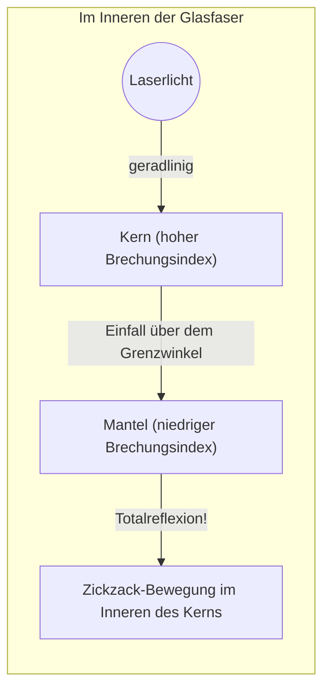

## 1. Das globale Internet ist durch "Licht" verbunden

Wenn Sie ein YouTube-Video von einem Server in den USA auf Ihrem Smartphone abspielen, glauben Sie da, dass diese Daten über Satelliten im Weltraum übertragen werden? 
Tatsächlich laufen etwa 99 % der weltweiten Internetkommunikation durch auf dem Meeresgrund verlegte "**Glasfaserkabel**", die sprichwörtlich mit "Lichtgeschwindigkeit" die Ozeane überqueren.

Ein Glasfaden, nur so dick wie ein menschliches Haar, transportiert im Bruchteil einer Sekunde riesige Datenmengen von mehreren Terabyte rund um die Welt. Der Paradigmenwechsel von der früheren Kommunikation über Kupferkabel (elektrische Signale) hin zur Kommunikation über Glasfasern (optische Signale) war die wichtigste infrastrukturelle Revolution der modernen Informationsgesellschaft.

Licht hat die Eigenschaft, sich geradlinig auszubreiten. Warum tritt also das Licht in den gewundenen Unterseekabeln nicht nach außen aus, sondern gelangt über Tausende von Kilometern ans Ziel?

## 2. Die Physik der Brechung und der "Totalreflexion"

Die Antwort liegt in einem optischen Phänomen namens "**Totalreflexion (Total Internal Reflection)**", das man in der Schulphysik lernt.

Wenn Licht von einem "Medium, in dem sich Licht langsam ausbreitet (hoher Brechungsindex)", in ein "schnelleres Medium (niedriger Brechungsindex)" übergeht, wie z. B. von Wasser zu Luft oder von Glas zu Luft, kommt es an der Grenzfläche zu einer "Brechung", bei der sich die Bahn des Lichts biegt.
Haben Sie jemals vom Grund eines Schwimmbeckens nach oben geschaut und festgestellt, dass man ab einem bestimmten Winkel die Außenwelt nicht mehr sehen kann, sondern die Wasseroberfläche den Beckenboden wie ein Spiegel reflektiert?

Wenn man den Winkel, in dem das Licht schräg einfällt (Einfallswinkel), immer weiter vergrößert, kommt ein Moment, an dem das gebrochene Licht parallel zur Grenzfläche verläuft. Dieser Winkel wird "Grenzwinkel" genannt.
**Wenn der Einfallswinkel diesen Grenzwinkel überschreitet, tritt das Licht überhaupt nicht mehr nach außen aus, sondern wird an der Grenzfläche zu 100 % reflektiert und in das Innere zurückgeworfen. Das ist die "Totalreflexion".**

Ein gewöhnlicher Spiegel verwendet Metalle wie Silber, um das Licht zu reflektieren, aber unweigerlich werden einige Prozent des Lichts absorbiert und gehen verloren. Der Reflexionsgrad bei dieser "Totalreflexion" beträgt jedoch exakt 100 %, wodurch sie der ultimative Spiegel ganz ohne Energieverlust ist.

## 3. Die Struktur der Glasfaser: Kern und Mantel

Um dieses Prinzip der Totalreflexion im Inneren des Kabels zu kapseln, werden Glasfasern aus speziellem Quarzglas mit einer zweischichtigen Struktur hergestellt.

1. **Kern (Zentrum)**: Der Weg, den das Licht nimmt. Glas mit einem "etwas höheren" Brechungsindex.
2. **Mantel (Außenbereich)**: Die Schicht, die den Kern umgibt. Glas mit einem "etwas niedrigeren" Brechungsindex.

Wenn Laserlicht gerade in das Ende des Kerns geschossen wird, wandert es geradlinig durch den Kern. Selbst wenn das Kabel gebogen ist und das Licht auf die Grenzfläche zum Mantel trifft, trifft das Licht schräg (in einem flachen Winkel größer als der Grenzwinkel) auf, so dass es nicht aus dem Mantel austritt und eine "Totalreflexion" verursacht.
Auf diese Weise wird das Licht durch wiederholte Totalreflexionen an der Grenzfläche zwischen Kern und Mantel geleitet, bis es ohne jeglichen Verlust an seinem Tausende von Kilometern entfernten Ziel ankommt.

## 4. Singlemode und Multimode

Bei Glasfasern gibt es je nach Anwendungszweck hauptsächlich zwei große Kategorien.

**Multimode-Faser**
Der Durchmesser des Kerns ist mit etwa 50 Mikrometern etwas dicker. Da das Licht intern in verschiedenen Winkeln reflektiert wird und sich so fortbewegt, gibt es mehrere Lichtwege (Moden). Zwar können kostengünstige LEDs als Lichtquelle verwendet werden, aber da sich schräg reflektiertes Licht später als geradliniges Licht am Ziel einfindet, verwischt das Signal über große Entfernungen. Daher werden sie für die Kommunikation auf kurzen Strecken, wie z. B. innerhalb von Gebäuden oder Rechenzentren, eingesetzt.

**Singlemode-Faser**
Hierbei ist der Durchmesser des Kerns extrem dünn gemacht und beträgt etwa 9 Mikrometer (etwa die Größe einer Zelle). Da sie so extrem dünn ist, kann das Licht nicht schräg reflektiert werden und sich nur in einer geraden Linie (einzelne Mode) durch das Zentrum der Faser bewegen. Es werden sehr teure Halbleiterlaser benötigt, aber da das Licht überhaupt nicht streut, werden sie für extrem lange und extrem schnelle Kommunikationen über Tausende von Kilometern, beispielsweise über Ozeane hinweg, eingesetzt.

## 5. Warum "Licht" und kein Kupferkabel?

Die Gründe, warum Glasfasern so hoch geschätzt werden, sind im Vergleich zu Kupferkabeln (elektrische Kommunikation) überwältigend.

1. **Geringe Dämpfung (Reicht sehr weit)**
   Da Kupferkabel einen elektrischen Widerstand aufweisen, verschwindet das Signal nach einigen Kilometern, aber das extrem gereinigte Glas der Glasfaser, aus dem Verunreinigungen entfernt wurden, besticht durch eine erstaunliche Transparenz und kann Licht über 100 km weit übertragen.
2. **Robust gegen Rauschen (Kein Einfluss durch elektromagnetische Induktion)**
   Kupferkabel nehmen umgebende Magnetfelder, Blitze und elektromagnetisches Rauschen anderer Kabel auf, aber da Licht keine Elektrizität ist, bleibt es völlig unbeeinflusst von externem Rauschen.
3. **Ultrahohe Kapazität durch Wellenlängenmultiplex (WDM)**
   Licht hat die Eigenschaft, dass "verschiedene Farben sich nicht mischen". Selbst wenn man ein rotes, ein blaues und ein grünes Lasersignal gleichzeitig durch eine einzige Glasfaser sendet, können sie auf der Empfängerseite mit einem Prisma (Filter) sauber nach Farben getrennt werden. Dies wird als "Wellenlängenmultiplex-Verfahren" (WDM) bezeichnet und ermöglicht so ein Kommunikationvolumen in völlig neuen Dimensionen von mehreren Terabit über ein einziges Kabel.

## 6. Fazit: Eine Welt, verbunden durch Glasfäden

Seit sich in den 1970er Jahren die Herstellungstechnologie für hochreines Quarzglas etabliert hat, haben sich Glasfasern immer weiter entwickelt und umspannen den gesamten Globus wie ein Netz aus Blutgefäßen.
Der Ursprung dieser erstaunlichen Kommunikationsgeschwindigkeit liegt in dem einfachen und schönen physikalischen Gesetz der "Totalreflexion" des Lichts.

Dass wir Fotos in sozialen Netzwerken versenden und in Echtzeit Videoanrufe mit weit entfernten Freunden führen können, verdanken wir diesem dünnen Glasfaden, der in der kalten Dunkelheit tief am Meeresgrund unaufhörlich Lichtpartikel durch Totalreflexion transportiert.
