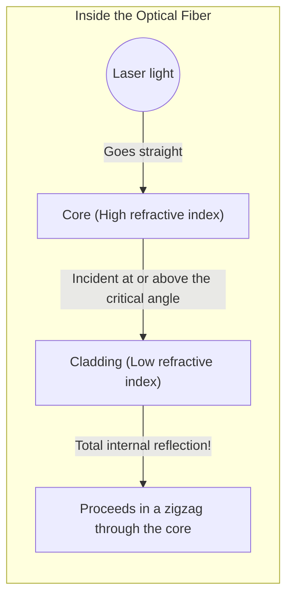

## 1. The World's Internet is Connected by "Light"

When playing a YouTube video hosted on an American server with your smartphone, do you think that data is being routed through artificial satellites in space? 
In reality, about 99% of the world's internet communications travel across the ocean at literally the "speed of light" through "**optical fiber cables**" laid on the seabed.

A glass thread no thicker than a human hair instantly transports terabytes of massive data around the world. The paradigm shift from the old copper cable (electrical signal) communication to optical fiber (optical signal) communication has been the most important infrastructure revolution in our modern information society.

Light has a property of traveling in a straight line. So, why does light travel thousands of kilometers through winding submarine cables without leaking out?

## 2. The Physics of Refraction and "Total Internal Reflection"

The answer lies in the optical phenomenon called "**Total Internal Reflection**", which is taught in high school physics.

When light travels from a "substance where light travels slowly (high refractive index)" to a "substance where light travels quickly (low refractive index)", such as from water to air or from glass to air, "refraction" occurs, where the path of the light bends at the boundary.
When looking up at the water surface from inside a pool, have you ever seen the phenomenon where, if you look from an oblique angle beyond a certain point, the outside view is not visible, and the water surface reflects the bottom of the pool like a mirror?

As the angle at which light is incident obliquely (angle of incidence) increases, a moment arrives when the refracted light becomes parallel to the boundary surface. This angle is called the "critical angle".
**When the angle of incidence exceeds this critical angle, the light does not leak out at all, but is 100% reflected at the boundary surface and returns back inside. This is "total internal reflection".**

Normal mirrors reflect light using metals like silver, but inevitably a few percent of the light is absorbed and lost. However, the reflectance caused by this "total internal reflection" is completely 100%, making it the ultimate mirror with absolutely no energy loss.

## 3. Structure of an Optical Fiber: Core and Cladding

To confine this principle of total internal reflection inside the cable, optical fibers are made of a special silica glass with a two-layer structure.

1. **Core (Center)**: The path where light travels. Glass with a "slightly higher" refractive index.
2. **Cladding (Outer layer)**: The layer wrapping the core. Glass with a "slightly lower" refractive index.

When a laser beam is shot straight from the end of the core, the light travels straight through the core. Even if the cable is bent and the light hits the boundary surface with the cladding, the light hits at an oblique angle (a shallow angle greater than the critical angle), so it does not leak out of the cladding and causes "total internal reflection".
In this way, the light is guided thousands of kilometers to its destination without any loss at all, repeating total internal reflection at the boundary surface between the core and the cladding.

## 4. Single-mode and Multi-mode

Optical fibers are broadly classified into two types depending on their application.

**Multi-mode Fiber**
The core diameter is slightly thicker at about 50 micrometers. Since the light travels while reflecting at various angles inside, there are multiple paths (modes) for the light. Inexpensive LEDs can be used as a light source, but the light traveling by reflecting obliquely arrives at the destination later than the light traveling straight, so the signal blurs when traveling long distances. Therefore, it is used for short-distance communication such as within buildings or data centers.

**Single-mode Fiber**
The core diameter is extremely thin down to about 9 micrometers (about the size of a cell). Because it is so thin, light cannot reflect obliquely and can only proceed in a straight line (a single mode) down the center of the fiber. It requires a very expensive semiconductor laser, but because the light does not scatter at all, it is used for ultra-long-distance, ultra-high-speed communication of thousands of kilometers across the ocean.

## 5. Why "Light" instead of Copper Wire?

The reason why optical fiber is so highly valued is overwhelming when compared to copper wire (electrical communication).

1. **Less Attenuation (Reaches further)**
   Since copper wire has electrical resistance, the signal disappears after traveling a few kilometers. However, the glass in optical fibers, from which impurities have been removed to the utmost limit, boasts incredible transparency and can deliver light more than 100 km away.
2. **Resistant to Noise (Zero influence of electromagnetic induction)**
   Copper wire picks up electromagnetic noise from surrounding magnetic fields, lightning, and other cables, but since light is not electricity, it does not receive any external noise at all.
3. **Ultra-High Capacity through Wavelength Division Multiplexing (WDM)**
   Light has the property that "different colors do not mix". Even if red, blue, and green laser signals are transmitted simultaneously in a single optical fiber, they can be neatly separated by color using a prism (filter) on the receiving end. This is called the "Wavelength Division Multiplexing system", which realizes an extraordinary communication volume of several terabits per single cable.

## 6. Conclusion: A World Connected by Glass Threads

Since the manufacturing technology for high-purity silica glass was established in the 1970s, optical fibers have continued to evolve, covering the entire earth like blood vessels.
At the root of this incredible communication speed lies the simple and beautiful physical law of light's "total internal reflection".

The fact that we can send photos on social media and have real-time video calls with distant friends is all thanks to these thin glass threads earnestly continuing to carry light particles through total internal reflection in the cold darkness deep at the bottom of the sea.
