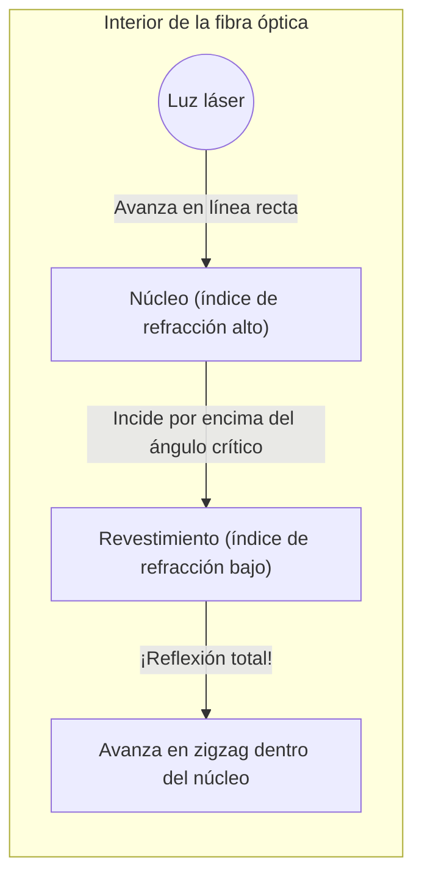

## 1. El internet del mundo está conectado por "luz"

Cuando reproduces un video de YouTube alojado en un servidor estadounidense desde tu smartphone, ¿crees que esos datos viajan a través de satélites en el espacio? 
En realidad, alrededor del 99% de las comunicaciones de Internet en el mundo viajan literalmente a la "velocidad de la luz" cruzando el océano a través de "**cables de fibra óptica**" tendidos en el lecho marino.

Un hilo de vidrio, tan fino como un cabello humano, transporta instantáneamente cantidades masivas de datos de varios terabytes alrededor de todo el mundo. El cambio de paradigma de las comunicaciones utilizando cables de cobre del pasado (señales eléctricas) a las comunicaciones por fibra óptica (señales ópticas) ha sido la revolución de infraestructura más importante en la actual sociedad de la información.

La luz tiene la propiedad de viajar en línea recta. Entonces, ¿por qué la luz puede recorrer miles de kilómetros sin filtrarse al exterior dentro de los cables serpenteantes del lecho marino?

## 2. Refracción y la física de la "reflexión total"

La respuesta reside en un fenómeno óptico llamado "**reflexión total**" (Total Internal Reflection), que se enseña en las clases de física del instituto.

Cuando la luz pasa de una "sustancia donde la luz viaja lentamente (alto índice de refracción)" a una "sustancia rápida (bajo índice de refracción)", por ejemplo, del agua al aire, o del vidrio al aire, ocurre la "refracción", donde la trayectoria de la luz se curva en la superficie límite.
Cuando miras hacia la superficie desde el interior de una piscina, ¿has notado alguna vez el fenómeno en el que, si miras desde un cierto ángulo inclinado, el paisaje exterior no es visible y la superficie del agua refleja el fondo de la piscina como si fuera un espejo?

Si aumentas gradualmente el ángulo en el que la luz entra de forma oblicua (ángulo de incidencia), llega un momento en el que la luz refractada se vuelve paralela a la superficie límite. Este ángulo se denomina "ángulo crítico".
**Cuando el ángulo de incidencia supera este ángulo crítico, la luz no se filtra en absoluto y se refleja al 100% en la superficie límite volviendo al interior. Esto es la "reflexión total".**

Los espejos ordinarios reflejan la luz usando metales como la plata, pero inevitablemente se pierde un pequeño porcentaje de la luz al ser absorbida. Sin embargo, la reflectividad debida a esta "reflexión total" es de un 100% absoluto, lo que la convierte en el espejo definitivo donde no hay absolutamente ninguna pérdida de energía.

## 3. Estructura de la fibra óptica: núcleo y revestimiento

Las fibras ópticas están fabricadas con un cristal de cuarzo especial con una estructura de dos capas para confinar este principio de reflexión total dentro del cable.

1. **Núcleo (parte central)**: El camino por donde viaja la luz. Vidrio con un índice de refracción "ligeramente alto".
2. **Revestimiento (parte exterior)**: La capa que envuelve al núcleo. Vidrio con un índice de refracción "ligeramente bajo".

Si se dispara una luz láser directamente desde el extremo del núcleo, la luz viajará en línea recta por su interior. Incluso si el cable está curvado y la luz choca contra la superficie límite con el revestimiento, la luz incidirá de forma oblicua (en un ángulo poco profundo por encima del ángulo crítico), por lo que no se filtrará fuera del revestimiento y provocará una "reflexión total".
De este modo, la luz es guiada hacia su destino a miles de kilómetros de distancia sin perderse en absoluto, repitiendo la reflexión total en la superficie límite entre el núcleo y el revestimiento.

## 4. Modo monomodo y multimodo

Las fibras ópticas se dividen principalmente en dos tipos dependiendo de su uso.

**Fibra multimodo**
El diámetro del núcleo es ligeramente grueso, de unos 50 micrómetros. Como la luz avanza reflejándose en varios ángulos en el interior, existen múltiples caminos (modos) para que la luz viaje. Se pueden utilizar fuentes de luz económicas como los LED, pero la luz que avanza reflejándose en diagonal llega a su destino más tarde que la luz que avanza en línea recta, por lo que las señales se distorsionan cuando viajan a largas distancias. Por tanto, se utiliza para comunicaciones a corta distancia dentro de edificios y centros de datos.

**Fibra monomodo**
Es un tipo donde el diámetro del núcleo se reduce al límite extremo de unos 9 micrómetros (tan pequeño como una célula). Debido a que es tan estrecho, la luz no puede reflejarse en diagonal y solo puede avanzar en línea recta (modo único) por el centro de la fibra. Requiere láseres semiconductores muy caros, pero como la luz no se dispersa en absoluto, se utiliza para comunicaciones de velocidad ultrarrápida y distancias ultralargas de miles de kilómetros, como cruzar océanos.

## 5. ¿Por qué "luz" en lugar de cables de cobre?

Las razones por las que la fibra óptica es tan valiosa son abrumadoras si se compara con los cables de cobre (telecomunicaciones eléctricas).

1. **Baja atenuación (llega muy lejos)**
   Los cables de cobre tienen resistencia eléctrica, por lo que la señal desaparece después de avanzar unos pocos kilómetros, pero el vidrio de la fibra óptica, cuyas impurezas se han eliminado al máximo, cuenta con una transparencia asombrosa y puede transmitir la luz a más de 100 km de distancia.
2. **Inmune al ruido (cero impacto por inducción electromagnética)**
   Los cables de cobre recogen campos magnéticos circundantes, rayos y ruidos electromagnéticos de otros cables, pero al no ser la luz electricidad, no recibe absolutamente ningún ruido externo.
3. **Capacidad ultra alta mediante la multiplexación por división de longitud de onda (WDM)**
   La luz tiene la propiedad de que "diferentes colores no se mezclan". Incluso si se envían simultáneamente una señal láser roja, una señal láser azul y una señal láser verde a través de una única fibra óptica, pueden separarse nítidamente por color utilizando un prisma (filtro) en el lado receptor. A esto se le denomina "multiplexación por división de longitud de onda", que permite alcanzar volúmenes de comunicación de otra dimensión en el orden de varios terabits a través de un solo cable.

## 6. Conclusión: El mundo conectado por hilos de vidrio

Desde que se establecieron las tecnologías de fabricación de vidrio de cuarzo de alta pureza en la década de 1970, las fibras ópticas han seguido evolucionando, cubriendo toda la Tierra como si fueran vasos sanguíneos.
La raíz de esta asombrosa velocidad de comunicación reside en una hermosa y simple ley física: la "reflexión total" de la luz.

El hecho de que podamos enviar fotos a través de las redes sociales y realizar videollamadas en tiempo real con amigos que se encuentran lejos se debe a este fino hilo de vidrio que transporta las partículas de luz por la fría oscuridad de las profundidades del mar, haciéndolas rebotar incansablemente mediante la reflexión total.
