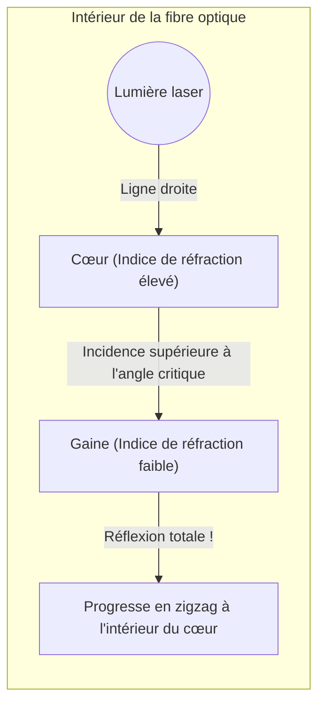

## 1. L'internet mondial est connecté par la « lumière »

Lorsque vous lisez une vidéo YouTube hébergée sur un serveur américain avec votre smartphone, ne pensez-vous pas que ces données transitent par un satellite dans l'espace ?
En réalité, environ 99 % des communications internet mondiales passent par des « **câbles à fibre optique** » posés au fond des océans, traversant littéralement les mers à la « vitesse de la lumière ».

Un fil de verre à peine plus épais qu'un cheveu transporte instantanément des téraoctets de données massives à travers le monde. Le changement de paradigme des anciennes communications par câbles en cuivre (signaux électriques) vers les communications par fibre optique (signaux lumineux) a été la révolution d'infrastructure la plus importante de notre société de l'information moderne.

La lumière a pour propriété de se propager en ligne droite. Alors, dans les câbles sous-marins sinueux, pourquoi la lumière ne s'échappe-t-elle pas vers l'extérieur et parvient-elle à atteindre des destinations situées à des milliers de kilomètres ?

## 2. La physique de la réfraction et de la « réflexion totale »

La réponse réside dans un phénomène optique appelé « **réflexion totale (Total Internal Reflection)** », que l'on étudie en physique au lycée.

Lorsque la lumière passe d'un milieu où sa « vitesse de propagation est lente (indice de réfraction élevé) » à un milieu où elle est « rapide (indice de réfraction faible) », comme de l'eau vers l'air ou du verre vers l'air, il se produit une « réfraction » où la trajectoire de la lumière se courbe à l'interface.
N'avez-vous jamais remarqué ce phénomène en regardant la surface de l'eau depuis l'intérieur d'une piscine : au-delà d'un certain angle d'inclinaison, le paysage extérieur devient invisible et la surface de l'eau agit comme un miroir reflétant le fond de la piscine.

Si l'on augmente de plus en plus l'angle d'incidence sous lequel la lumière pénètre (angle d'incidence), il arrive un moment où la lumière réfractée devient parallèle à l'interface. Cet angle est appelé « angle critique ».
**Lorsque l'angle d'incidence dépasse cet angle critique, la lumière ne s'échappe plus du tout vers l'extérieur et est réfléchie à 100 % à l'interface pour retourner à l'intérieur. C'est ce qu'on appelle la « réflexion totale ».**

Les miroirs ordinaires utilisent des métaux comme l'argent pour réfléchir la lumière, mais un petit pourcentage de la lumière est inévitablement absorbé et perdu. Cependant, la réflectivité due à cette « réflexion totale » est parfaitement de 100 %, ce qui en fait un miroir ultime sans aucune perte d'énergie.

## 3. Structure de la fibre optique : Cœur et gaine (cladding)

Pour confiner ce principe de réflexion totale à l'intérieur du câble, la fibre optique est fabriquée à partir d'un verre de silice spécial à double structure.

1. **Cœur (partie centrale)** : Le chemin par lequel passe la lumière. Un verre avec un indice de réfraction « légèrement plus élevé ».
2. **Gaine (partie périphérique, cladding)** : La couche qui enveloppe le cœur. Un verre avec un indice de réfraction « légèrement plus faible ».

Lorsqu'un rayon laser est projeté directement depuis l'extrémité du cœur, la lumière se propage en ligne droite à l'intérieur de celui-ci. Même si le câble est courbé et que la lumière percute l'interface avec la gaine, elle frappe en biais (à un angle rasant supérieur à l'angle critique), ce qui provoque une « réflexion totale » sans fuite à l'extérieur de la gaine.
Ainsi, la lumière est guidée sans aucune perte jusqu'à sa destination, à des milliers de kilomètres, en répétant des réflexions totales à l'interface entre le cœur et la gaine.

## 4. Monomode et multimode

Il existe principalement deux types de fibres optiques, selon leur utilisation.

**Fibre multimode**
Le diamètre du cœur est légèrement plus épais, d'environ 50 micromètres. Étant donné que la lumière avance en se réfléchissant sous divers angles à l'intérieur, il existe plusieurs chemins (modes) pour la lumière. Des sources lumineuses bon marché comme les LED peuvent être utilisées, mais la lumière qui avance en se réfléchissant de biais arrive plus tard à destination que celle qui se propage en ligne droite, ce qui entraîne une dispersion du signal sur de longues distances. C'est pourquoi elle est utilisée pour les communications à courte distance, comme à l'intérieur des bâtiments ou des centres de données.

**Fibre monomode**
Le diamètre du cœur est réduit à l'extrême, mesurant environ 9 micromètres (la taille d'une cellule). Étant si fin, la lumière ne peut pas se réfléchir de biais et ne peut avancer qu'en ligne droite (un mode unique) au centre de la fibre. Un laser à semi-conducteur très coûteux est nécessaire, mais comme la lumière ne se disperse pas du tout, elle est utilisée pour les communications à ultra-haute vitesse et sur de très longues distances de plusieurs milliers de kilomètres, comme pour traverser les océans.

## 5. Pourquoi la « lumière » plutôt que le fil de cuivre ?

Les raisons pour lesquelles la fibre optique est si prisée sont écrasantes par rapport aux fils de cuivre (télécommunications électriques).

1. **Faible atténuation (Atteint de grandes distances)**
   En raison de la résistance électrique des fils de cuivre, le signal disparaît après avoir parcouru quelques kilomètres. En revanche, le verre de la fibre optique, dont les impuretés ont été éliminées à l'extrême, possède une transparence étonnante et peut transmettre la lumière à plus de 100 km de distance.
2. **Résistance au bruit (Aucune influence de l'induction électromagnétique)**
   Les fils de cuivre captent les champs magnétiques environnants, la foudre et le bruit électromagnétique d'autres câbles, tandis que la lumière, n'étant pas de l'électricité, ne subit aucune interférence externe.
3. **Capacité ultra-massive grâce au multiplexage par répartition en longueur d'onde (WDM)**
   La lumière possède la propriété de « ne pas se mélanger si les couleurs sont différentes ». Même si l'on fait passer simultanément des signaux laser rouges, bleus et verts dans une seule fibre optique, le récepteur peut les séparer nettement par couleur en utilisant un prisme (filtre). C'est ce qu'on appelle le « multiplexage par répartition en longueur d'onde », permettant d'atteindre un volume de communication d'une dimension totalement différente, de l'ordre de plusieurs térabits par câble.

## 6. Conclusion : Le monde relié par des fils de verre

Depuis que la technologie de fabrication du verre de silice de haute pureté a été établie dans les années 1970, la fibre optique n'a cessé d'évoluer, recouvrant l'ensemble de la Terre comme un réseau de vaisseaux sanguins.
À la base de ces vitesses de communication stupéfiantes réside une loi physique simple et belle : la « réflexion totale » de la lumière.

Si nous pouvons envoyer des photos sur les réseaux sociaux et passer des appels vidéo en temps réel avec des amis éloignés, c'est parce qu'au fond de l'océan, dans les ténèbres glaciales, ce fin fil de verre continue inlassablement de transporter des particules de lumière grâce à la réflexion totale.
