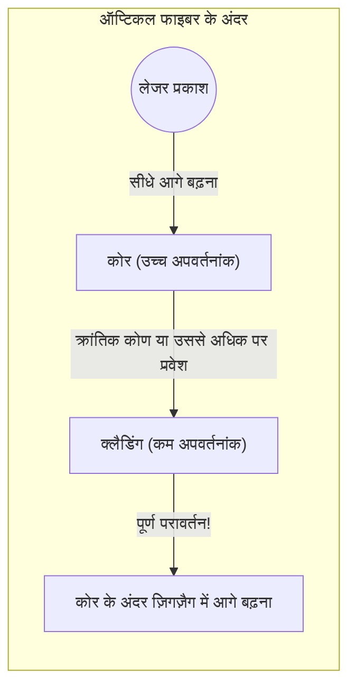

## 1. दुनिया का इंटरनेट "प्रकाश" से जुड़ा है

स्मार्टफोन पर अमेरिका के किसी सर्वर पर मौजूद YouTube वीडियो चलाते समय, क्या आप सोचते हैं कि वह डेटा अंतरिक्ष में किसी सैटेलाइट के ज़रिए आता है? 
दरअसल, दुनिया के लगभग 99% इंटरनेट संचार समुद्र तल पर बिछाई गई **ऑप्टिकल फाइबर केबल** के माध्यम से, सचमुच "प्रकाश की गति" से समुद्र पार करके हम तक पहुँचते हैं।

इंसानी बाल जितना पतला कांच का धागा, एक पल में दुनिया भर में कई टेराबाइट जितना विशाल डेटा ले जाता है। अतीत के तांबे के तारों (इलेक्ट्रिकल सिग्नल) वाले संचार से ऑप्टिकल फाइबर (ऑप्टिकल सिग्नल) वाले संचार में बदलाव, आधुनिक सूचना समाज में सबसे महत्वपूर्ण बुनियादी ढांचा क्रांति थी।

प्रकाश हमेशा सीधी रेखा में चलने की प्रकृति रखता है। तो फिर, घुमावदार पनडुब्बी केबलों के अंदर, प्रकाश बाहर निकले बिना हजारों किलोमीटर दूर तक कैसे पहुँच जाता है?

## 2. अपवर्तन और "पूर्ण आंतरिक परावर्तन" की भौतिकी

इसका उत्तर एक ऑप्टिकल घटना में निहित है जिसे हाई स्कूल भौतिकी में **पूर्ण आंतरिक परावर्तन (Total Internal Reflection)** के रूप में पढ़ाया जाता है।

जब प्रकाश "धीमी गति वाले पदार्थ (उच्च अपवर्तनांक)" जैसे पानी या कांच से "तेज गति वाले पदार्थ (कम अपवर्तनांक)" जैसे हवा में जाता है, तो प्रकाश का पथ सीमा पर मुड़ जाता है, जिसे "अपवर्तन" कहा जाता है।
जब आप पूल के अंदर से पानी की सतह को देखते हैं, तो क्या आपने कभी ऐसा देखा है कि एक निश्चित कोण से देखने पर बाहर का नजारा दिखाई नहीं देता, और पानी की सतह पूल के तल को शीशे की तरह परावर्तित करती हुई दिखाई देती है?

जैसे-जैसे हम प्रकाश के टकराने वाले कोण (आपतन कोण) को बढ़ाते हैं, एक क्षण ऐसा आता है जब अपवर्तित प्रकाश सीमा रेखा के समानांतर हो जाता है। इस कोण को "क्रांतिक कोण" कहा जाता है।
**जब आपतन कोण इस क्रांतिक कोण से अधिक हो जाता है, तो प्रकाश बिल्कुल भी बाहर नहीं निकलता है, और सीमा पर 100% परावर्तित होकर वापस अंदर लौट आता है। यही "पूर्ण आंतरिक परावर्तन" है।**

सामान्य दर्पण चांदी जैसी धातुओं का उपयोग करके प्रकाश को परावर्तित करते हैं, लेकिन कुछ प्रतिशत प्रकाश हमेशा अवशोषित होकर नष्ट हो जाता है। हालाँकि, इस "पूर्ण आंतरिक परावर्तन" द्वारा परावर्तन दर पूरी तरह से 100% है, जो इसे बिना किसी ऊर्जा हानि के एक अचूक दर्पण बनाता है।

## 3. ऑप्टिकल फाइबर की संरचना: कोर और क्लैडिंग

ऑप्टिकल फाइबर इस पूर्ण आंतरिक परावर्तन के सिद्धांत को केबल के अंदर ही सीमित रखने के लिए एक विशेष दो-परत वाली क्वार्ट्ज ग्लास संरचना से बने होते हैं।

1. **कोर (केंद्र भाग)** : वह मार्ग जिससे होकर प्रकाश गुजरता है। यह "थोड़ा अधिक" अपवर्तनांक वाला कांच होता है।
2. **क्लैडिंग (बाहरी भाग)** : वह परत जो कोर को घेरती है। यह "थोड़ा कम" अपवर्तनांक वाला कांच होता है।

जब कोर के एक सिरे से लेज़र प्रकाश को सीधे अंदर भेजा जाता है, तो प्रकाश कोर के अंदर सीधे आगे बढ़ता है। भले ही केबल मुड़ी हुई हो और प्रकाश क्लैडिंग की सीमा से टकराए, प्रकाश तिरछे (क्रांतिक कोण से अधिक उथले कोण पर) टकराता है, इसलिए यह क्लैडिंग के बाहर लीक नहीं होता है और "पूर्ण परावर्तन" का कारण बनता है।
इस तरह, प्रकाश कोर और क्लैडिंग की सीमा पर बार-बार पूर्ण परावर्तन करते हुए, बिना किसी नुकसान के हजारों किलोमीटर दूर अपने गंतव्य तक पहुँच जाता है।

## 4. सिंगल-मोड और मल्टी-मोड

ऑप्टिकल फाइबर मुख्य रूप से उनके उपयोग के आधार पर दो प्रकार के होते हैं।

**मल्टी-मोड फाइबर**
इसके कोर का व्यास लगभग 50 माइक्रोमीटर होता है, जो थोड़ा मोटा होता है। क्योंकि प्रकाश फाइबर के अंदर विभिन्न कोणों पर परावर्तित होकर आगे बढ़ता है, इसलिए प्रकाश के गुजरने के कई रास्ते (मोड) होते हैं। सस्ते एलईडी (LEDs) आदि को प्रकाश स्रोत के रूप में इस्तेमाल किया जा सकता है, लेकिन तिरछे परावर्तित होकर आगे बढ़ने वाला प्रकाश सीधे जाने वाले प्रकाश की तुलना में गंतव्य तक पहुंचने में अधिक समय लेता है, जिससे लंबी दूरी तय करने पर सिग्नल धुंधला हो जाता है। इसलिए, इसका उपयोग इमारतों या डेटा केंद्रों के भीतर कम दूरी के संचार के लिए किया जाता है।

**सिंगल-मोड फाइबर**
इसके कोर के व्यास को लगभग 9 माइक्रोमीटर (एक कोशिका जितना छोटा) तक बेहद पतला कर दिया गया है। क्योंकि यह इतना पतला होता है, प्रकाश तिरछे परावर्तित नहीं हो सकता है, और यह केवल फाइबर के केंद्र में एक सीधी रेखा (एकल मोड) में ही आगे बढ़ सकता है। इसके लिए बहुत महंगे सेमीकंडक्टर लेजर की आवश्यकता होती है, लेकिन चूंकि प्रकाश बिल्कुल भी नहीं बिखरता है, इसलिए इसका उपयोग समुद्र पार करने जैसी हजारों किलोमीटर की अति-लंबी दूरी, अति-उच्च गति वाले संचार के लिए किया जाता है।

## 5. तांबे के तार के बजाय "प्रकाश" क्यों?

ऑप्टिकल फाइबर के इतने उपयोगी होने का कारण तांबे के तारों (विद्युत संचार) की तुलना में इसके जबरदस्त फायदे हैं।

1. **कम क्षीणन (यह बहुत दूर तक पहुँचता है)**
   तांबे के तारों में विद्युत प्रतिरोध होता है, इसलिए सिग्नल कुछ किलोमीटर की यात्रा के बाद गायब हो जाते हैं। दूसरी ओर, अशुद्धियों को पूरी तरह से हटाकर बनाए गए ऑप्टिकल फाइबर ग्लास में अद्भुत पारदर्शिता होती है, जो प्रकाश को 100 किमी से अधिक दूर तक पहुंचा सकती है।
2. **शोर के प्रतिरोधी (विद्युत चुम्बकीय प्रेरण का शून्य प्रभाव)**
   तांबे के तार आस-पास के चुंबकीय क्षेत्र, बिजली, या अन्य केबलों से विद्युत चुम्बकीय शोर पकड़ते हैं। लेकिन क्योंकि प्रकाश बिजली नहीं है, यह बाहरी शोर से बिल्कुल भी प्रभावित नहीं होता है।
3. **तरंग दैर्ध्य विभाजन बहुसंकेतन (WDM) के माध्यम से अति-विशाल क्षमता**
   प्रकाश में यह गुण होता है कि "अलग-अलग रंग आपस में नहीं मिलते हैं"। भले ही एक ही ऑप्टिकल फाइबर में लाल लेजर सिग्नल, नीला लेजर सिग्नल और हरा लेजर सिग्नल एक साथ भेजे जाएं, तो रिसीवर साइड पर एक प्रिज्म (फिल्टर) का उपयोग करके उन्हें उनके रंगों के आधार पर आसानी से अलग किया जा सकता है। इसे "तरंग दैर्ध्य विभाजन बहुसंकेतन" कहा जाता है, और इसके कारण एक ही केबल के माध्यम से कई टेराबिट्स की एक अकल्पनीय संचार मात्रा प्राप्त की जा सकती है।

## 6. निष्कर्ष: कांच के धागे जो दुनिया को जोड़ते हैं

1970 के दशक में उच्च शुद्धता वाले क्वार्ट्ज ग्लास के निर्माण की तकनीक स्थापित होने के बाद से, ऑप्टिकल फाइबर का विकास जारी है, और इसने पूरी पृथ्वी को रक्त वाहिकाओं की तरह ढक लिया है।
इसकी आश्चर्यजनक संचार गति के मूल में प्रकाश के "पूर्ण आंतरिक परावर्तन" का सरल और सुंदर भौतिकी नियम है।

हम जो सोशल मीडिया पर तस्वीरें भेज सकते हैं और दूर बैठे दोस्तों के साथ वास्तविक समय में वीडियो कॉल कर सकते हैं, वह इस पतले कांच के धागे की वजह से है, जो गहरे समुद्र के ठंडे अंधेरे में प्रकाश के कणों को पूरी तरह से परावर्तित करते हुए बिना रुके आगे बढ़ाता रहता है।
