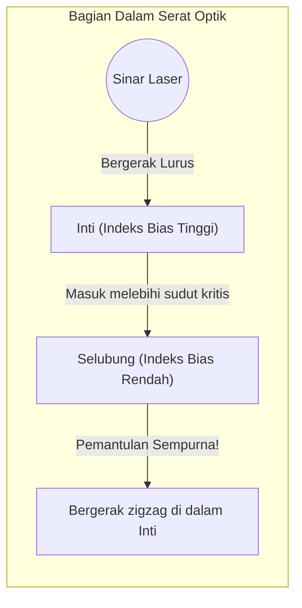

## 1. Internet Dunia Dihubungkan oleh "Cahaya"

Saat Anda memutar video YouTube yang ada di server Amerika dengan ponsel pintar Anda, apakah Anda berpikir bahwa data tersebut melewati satelit buatan di luar angkasa? 
Faktanya, sekitar 99% dari komunikasi internet dunia melewati "**kabel serat optik**" yang dipasang di dasar laut, dan benar-benar datang melintasi laut dengan "kecepatan cahaya".

Benang kaca yang hanya setipis rambut manusia membawa data dalam jumlah besar hingga beberapa terabita ke seluruh dunia dalam sekejap. Pergeseran paradigma dari komunikasi menggunakan kabel tembaga (sinyal listrik) di masa lalu ke komunikasi menggunakan serat optik (sinyal cahaya) adalah revolusi infrastruktur terpenting dalam masyarakat informasi modern.

Cahaya memiliki sifat merambat lurus. Lalu, mengapa di dalam kabel dasar laut yang meliuk-liuk, cahaya dapat mencapai ribuan kilometer tanpa bocor ke luar?

## 2. Fisika Pembiasan dan "Pemantulan Sempurna"

Jawabannya terletak pada fenomena optik yang disebut "**Pemantulan Sempurna (Total Internal Reflection)**", yang dipelajari dalam fisika sekolah menengah.

Ketika cahaya merambat dari air ke udara, atau dari kaca ke udara, dari "zat di mana cahaya merambat lambat (indeks bias besar)" ke "zat di mana cahaya merambat cepat (indeks bias kecil)", pembiasan terjadi di mana lintasan cahaya membengkok pada batas antara kedua medium.
Pernahkah Anda melihat fenomena di mana saat menatap permukaan air dari dalam kolam, jika dilihat dari sudut miring tertentu, pemandangan luar tidak terlihat, melainkan permukaan air memantulkan dasar kolam seperti cermin?

Saat sudut datang cahaya yang dimiringkan (sudut datang) semakin diperbesar, akan tiba saatnya di mana cahaya yang dibiaskan menjadi sejajar dengan bidang batas. Sudut ini disebut "sudut kritis".
**Ketika sudut datang melampaui sudut kritis ini, cahaya sama sekali tidak bocor ke luar, melainkan 100% dipantulkan pada bidang batas dan kembali ke dalam. Inilah yang disebut "pemantulan sempurna".**

Cermin biasa memantulkan cahaya menggunakan logam seperti perak, tetapi pasti ada beberapa persen cahaya yang terserap dan hilang. Namun, tingkat pantulan dari "pemantulan sempurna" ini benar-benar 100%, menjadikannya cermin pamungkas di mana tidak ada energi yang hilang sama sekali.

## 3. Struktur Serat Optik: Inti dan Selubung

Serat optik terbuat dari kaca kuarsa khusus dengan struktur dua lapis untuk mengurung prinsip pemantulan sempurna ini di dalam kabel.

1. **Inti (Bagian Tengah)**: Jalur yang dilewati cahaya. Kaca dengan indeks bias yang "sedikit lebih tinggi".
2. **Selubung (Bagian Luar)**: Lapisan yang membungkus inti. Kaca dengan indeks bias yang "sedikit lebih rendah".

Jika sinar laser ditembakkan lurus dari ujung inti, cahaya akan merambat lurus di dalam inti. Meskipun kabel melengkung dan cahaya menabrak bidang batas dengan selubung, karena cahaya menabrak secara miring (sudut yang lebih dangkal dari sudut kritis), cahaya tidak bocor ke luar selubung melainkan menyebabkan "pemantulan sempurna".
Dengan cara ini, cahaya memantul sempurna berulang kali pada batas antara inti dan selubung, dan diarahkan hingga ribuan kilometer ke tujuan tanpa kehilangan apa pun.

## 4. Mode Tunggal dan Mode Multi

Serat optik secara garis besar terbagi menjadi 2 jenis berdasarkan penggunaannya.

**Serat Mode Multi**
Diameter intinya sedikit lebih tebal, sekitar 50 mikrometer. Karena cahaya merambat sambil memantul pada berbagai sudut di dalam, terdapat beberapa jalur (mode) cahaya. Sumber cahaya yang murah seperti LED dapat digunakan, tetapi cahaya yang memantul miring datang terlambat di tujuan dibandingkan cahaya yang merambat lurus, sehingga sinyal akan kabur (menyebar) saat merambat pada jarak jauh. Oleh karena itu, serat ini digunakan untuk komunikasi jarak pendek di dalam gedung atau pusat data.

**Serat Mode Tunggal**
Diameter intinya dibuat setipis mungkin hingga sekitar 9 mikrometer (seukuran sel). Karena sangat tipis, cahaya tidak dapat memantul secara miring, dan hanya dapat merambat dalam satu garis lurus (mode tunggal) di tengah serat. Meskipun membutuhkan laser semikonduktor yang sangat mahal, cahaya tidak berpencar sama sekali, sehingga digunakan untuk komunikasi jarak sangat jauh dan ultracepat melintasi laut hingga ribuan kilometer.

## 5. Mengapa "Cahaya" dan Bukan Kabel Tembaga?

Alasan mengapa serat optik sangat berguna sangatlah jelas jika dibandingkan dengan kabel tembaga (komunikasi listrik).

1. **Redaman Rendah (Mencapai Jarak Jauh)**
   Kabel tembaga memiliki hambatan listrik, sehingga sinyal menghilang setelah merambat beberapa kilometer, tetapi kaca serat optik yang kotorannya dihilangkan semaksimal mungkin memiliki tingkat transparansi yang luar biasa, sehingga mampu mengantarkan cahaya hingga lebih dari 100 km.
2. **Tahan terhadap Kebisingan (Pengaruh Induksi Elektromagnetik Nol)**
   Kabel tembaga menangkap medan magnet di sekitarnya, petir, atau gangguan elektromagnetik dari kabel lain, tetapi karena cahaya bukanlah listrik, ia tidak menerima gangguan dari luar sama sekali.
3. **Kapasitas Ultra-besar melalui WDM (Wavelength Division Multiplexing)**
   Cahaya memiliki sifat "tidak tercampur jika warnanya berbeda". Meskipun sinyal laser merah, sinyal laser biru, dan sinyal laser hijau dikirimkan secara bersamaan dalam 1 serat optik, ketiganya dapat dipisahkan dengan jelas berdasarkan warna menggunakan prisma (filter) pada sisi penerima. Ini disebut sebagai "Sistem Pemultipleksan Pembagian Panjang Gelombang", yang mewujudkan jumlah lalu lintas komunikasi dimensi lain sebesar beberapa terabit hanya dalam 1 kabel.

## 6. Kesimpulan: Dunia yang Dihubungkan oleh Benang Kaca

Sejak teknologi manufaktur kaca kuarsa kemurnian tinggi didirikan pada tahun 1970-an, serat optik terus berevolusi dan menutupi seluruh bumi layaknya pembuluh darah.
Di balik kecepatan komunikasinya yang luar biasa itu, terbentang hukum fisika pemantulan sempurna cahaya yang sederhana dan indah.

Alasan kita bisa mengirim foto di media sosial dan melakukan panggilan video waktu nyata dengan teman di tempat yang jauh adalah berkat benang kaca tipis ini yang terus membawa partikel cahaya sambil melakukan pemantulan sempurna di dalam kegelapan dingin di dasar laut yang dalam.
