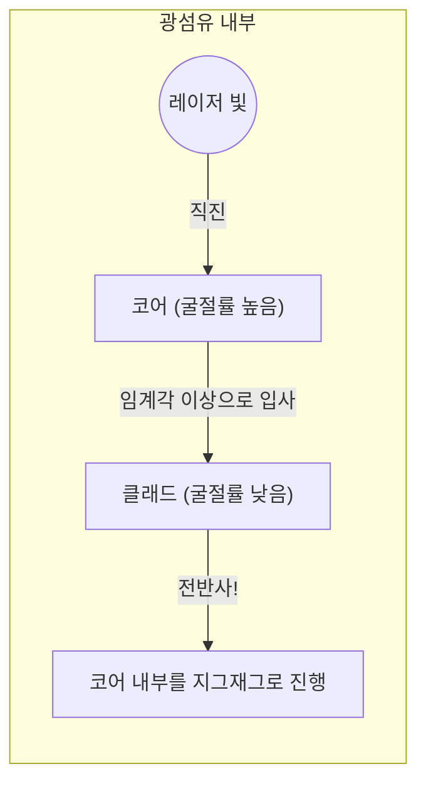

## 1. 세계의 인터넷은 '빛'으로 연결되어 있다

스마트폰으로 미국 서버에 있는 YouTube 동영상을 재생할 때, 그 데이터가 우주에 있는 인공위성을 거쳐 온다고 생각하지 않으신가요? 
사실 전 세계 인터넷 통신의 약 99%는 해저에 부설된 **광섬유 케이블** 을 통해 말 그대로 '빛의 속도'로 바다를 건너오고 있습니다.

머리카락만큼 가는 유리 실이 수 테라바이트에 달하는 방대한 데이터를 순식간에 전 세계로 실어 나릅니다. 과거 구리선 케이블(전기 신호)을 이용한 통신에서 광섬유(광 신호)를 이용한 통신으로의 패러다임 전환은 현대 정보화 사회에서 가장 중요한 인프라 혁명이었습니다.

빛은 직진하는 성질을 가지고 있습니다. 그렇다면 구불구불한 해저 케이블 속에서 빛은 왜 밖으로 새어 나오지 않고 수천 킬로미터 앞까지 닿을 수 있는 것일까요?

## 2. 굴절과 '전반사'의 물리

그 해답은 고등학교 물리에서 배우는 **전반사(Total Internal Reflection)** 라는 광학 현상에 있습니다.

빛이 물에서 공기로, 혹은 유리에서 공기 등 '빛의 진행 속도가 느린 물질(굴절률이 큼)'에서 '빠른 물질(굴절률이 작음)'로 진행할 때, 경계면에서 빛의 궤도가 꺾이는 '굴절'이 일어납니다.
수영장 안에서 수면을 올려다볼 때, 특정 각도보다 비스듬히 보면 밖의 경치가 보이지 않고, 수면이 거울처럼 수영장 바닥을 반사해서 보여주는 현상을 본 적이 있지 않으신가요?

빛을 비스듬히 입사시키는 각도(입사각)를 점점 크게 하면, 굴절된 빛이 경계면과 평행해지는 순간이 찾아옵니다. 이 각도를 '임계각'이라고 부릅니다.
**입사각이 이 임계각을 넘으면 빛은 밖으로 전혀 새어 나가지 않고 경계면에서 100% 반사되어 내부로 돌아와 버립니다. 이것이 '전반사'입니다.**

일반적인 거울은 은과 같은 금속으로 빛을 반사시키지만, 아무래도 수 %의 빛은 흡수되어 사라지고 맙니다. 하지만 이 '전반사'에 의한 반사율은 완벽하게 100%이며, 에너지 손실이 전혀 없는 궁극의 거울인 것입니다.

## 3. 광섬유의 구조: 코어와 클래드

광섬유는 이 전반사의 원리를 케이블 안에 가두기 위해 2층 구조의 특수 석영 유리로 만들어져 있습니다.

1. **코어(중심부)**: 빛이 지나가는 길. 굴절률이 '약간 높은' 유리.
2. **클래드(외곽부)**: 코어를 감싸는 층. 굴절률이 '약간 낮은' 유리.

코어의 끝에서 똑바로 레이저 빛을 쏘면, 빛은 코어 안을 직진합니다. 케이블이 구부러져 있어서 빛이 클래드와의 경계면에 부딪히더라도, 빛은 비스듬하게(임계각 이상의 얕은 각도) 부딪히기 때문에 클래드 밖으로 새어 나가지 않고 '전반사'를 일으킵니다.
이렇게 빛은 코어와 클래드의 경계면에서 전반사를 반복하며 수천 킬로미터 앞의 목적지까지 전혀 손실 없이 안내되는 것입니다.

## 4. 싱글 모드와 멀티 모드

광섬유에는 용도에 따라 크게 2가지 종류가 있습니다.

**멀티 모드 파이버**
코어의 직경이 약 50마이크로미터로 약간 굵은 편입니다. 빛이 내부에서 다양한 각도로 반사되며 진행하기 때문에 빛의 통로(모드)가 여러 개 있습니다. 저렴한 LED 등을 광원으로 사용할 수 있지만, 비스듬히 반사되어 나아가는 빛은 직진하는 빛보다 목적지에 도착하는 것이 늦어지므로 장거리를 이동하면 신호가 번져 버립니다. 따라서 건물 내부나 데이터 센터 내부 등 단거리 통신에 사용됩니다.

**싱글 모드 파이버**
코어의 직경을 약 9마이크로미터(세포 수준의 작은 크기)까지 극한으로 가늘게 만든 것입니다. 너무 가늘기 때문에 빛은 비스듬히 반사될 수 없고, 파이버의 중심을 일직선(단일 모드)으로밖에 진행하지 못하게 됩니다. 매우 비싼 반도체 레이저가 필요하지만, 빛이 전혀 산란되지 않기 때문에 바다를 건너는 것 같은 수천 킬로미터의 초장거리·초고속 통신에 사용되고 있습니다.

## 5. 왜 구리선이 아니라 '빛'일까?

광섬유가 이렇게 중용되는 이유는 구리선(전기 통신)과 비교하면 압도적이기 때문입니다.

1. **감쇠가 적다 (멀리까지 도달한다)**
   구리선은 전기 저항이 있어서 수 킬로미터 진행하면 신호가 사라져 버리지만, 불순물을 극한까지 제거한 광섬유 유리는 경이로운 투명도를 자랑하여 100km 이상 떨어진 곳까지 빛을 전달할 수 있습니다.
2. **노이즈에 강하다 (전자 유도의 영향 제로)**
   구리선은 주변의 자기장이나 번개, 다른 케이블로부터의 전자기 노이즈를 주워 담지만, 빛은 전기가 아니기 때문에 외부로부터의 노이즈를 전혀 받지 않습니다.
3. **파장 분할 다중(WDM)에 의한 초대용량화**
   빛은 '색이 다르면 섞이지 않는다'는 성질을 가지고 있습니다. 1가닥의 광섬유 안에 빨간색 레이저 신호, 파란색 레이저 신호, 초록색 레이저 신호를 동시에 흘려보내도 수신 측에서 프리즘(필터)을 사용하면 색깔별로 깨끗하게 분리할 수 있습니다. 이것을 '파장 분할 다중 방식'이라고 부르며, 이를 통해 1가닥의 케이블로 수 테라비트라는 차원이 다른 통신량을 실현하고 있습니다.

## 6. 요약: 유리 실이 연결하는 세계

1970년대에 고순도 석영 유리 제조 기술이 확립된 이래 광섬유는 진화를 거듭하여 지구 전체를 혈관처럼 뒤덮었습니다.
그 경이로운 통신 속도의 근본에는 빛의 '전반사'라는 단순하고 아름다운 물리 법칙이 가로놓여 있습니다.

우리가 SNS로 사진을 보내고 멀리 있는 친구와 실시간으로 영상 통화를 할 수 있는 것은, 깊은 바닷속 차가운 어둠 속을 이 가는 유리 실이 빛의 입자를 전반사시키며 묵묵히 계속 실어 나르고 있는 덕분인 것입니다.
