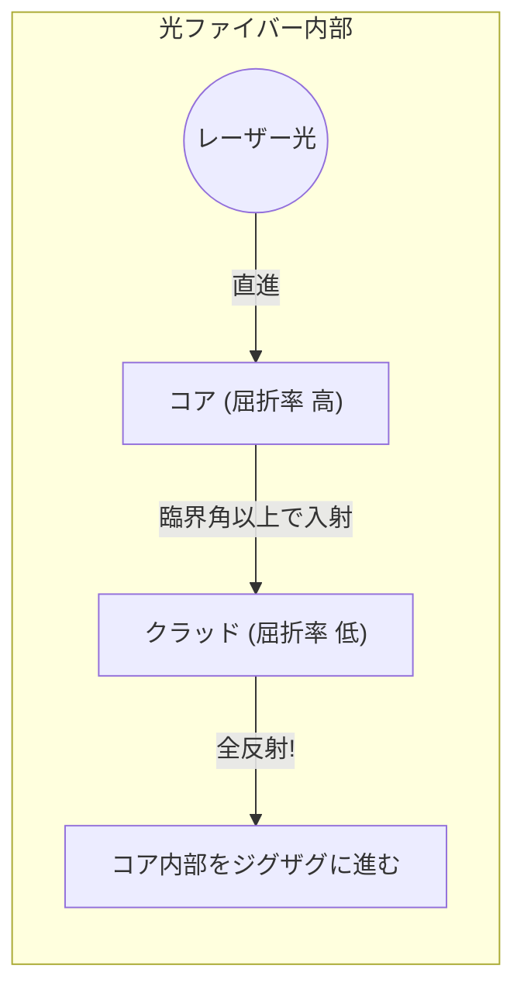

## 1. 世界のインターネットは「光」で繋がっている

スマートフォンでアメリカのサーバーにあるYouTubeの動画を再生する時、そのデータは宇宙にある人工衛星を経由していると思っていませんか？ 
実は、世界のインターネット通信の約99%は、海底に敷設された「**光ファイバーケーブル**」を通って、文字通り「光の速さ」で海を越えてやってきています。

髪の毛ほどの細さしかないガラスの糸が、数テラバイトもの膨大なデータを一瞬で世界中に運んでいます。かつての銅線ケーブル（電気信号）による通信から、光ファイバー（光信号）による通信へのパラダイムシフトは、現代の情報化社会において最も重要なインフラ革命でした。

光は直進する性質を持っています。では、曲がりくねった海底のケーブルの中で、光はなぜ外に漏れ出ることなく、何千キロも先まで届くのでしょうか？

## 2. 屈折と「全反射」の物理

その答えは、高校物理で習う「**全反射（Total Internal Reflection）**」という光学現象にあります。

光が、水から空気、あるいはガラスから空気など、「光の進む速度が遅い物質（屈折率が大きい）」から「速い物質（屈折率が小さい）」へ進むとき、境界面で光の軌道が曲がる「屈折」が起きます。
プールの中から水面を見上げたとき、ある角度より斜めから見ると、外の景色は見えず、水面が鏡のようにプールの底を反射して見える現象を見たことがないでしょうか。

光を斜めに入射させる角度（入射角）をどんどん大きくしていくと、屈折した光が境界面と平行になる瞬間が訪れます。この角度を「臨界角」と呼びます。
**入射角がこの臨界角を超えると、光は外に一切漏れ出ず、境界面で100%反射して内部に戻ってしまいます。これが「全反射」です。**

通常の鏡は銀などの金属で光を反射させますが、どうしても数%の光は吸収されて失われてしまいます。しかし、この「全反射」による反射率は完全に100%であり、エネルギーのロスが全くないという究極の鏡なのです。

## 3. 光ファイバーの構造：コアとクラッド

光ファイバーは、この全反射の原理をケーブルの中に封じ込めるため、2層構造の特殊な石英ガラスで作られています。

1. **コア（中心部）**：光が通る道。屈折率が「少しだけ高い」ガラス。
2. **クラッド（外周部）**：コアを包む層。屈折率が「少しだけ低い」ガラス。

コアの端から真っ直ぐにレーザー光を打ち込むと、光はコアの中を直進します。ケーブルが曲がっていて光がクラッドとの境界面にぶつかっても、光は斜め（臨界角以上の浅い角度）にぶつかるため、クラッドの外には漏れず「全反射」を起こします。
こうして、光はコアとクラッドの境界面で全反射を繰り返しながら、何千キロも先のゴールまで全く失われることなく導かれていくのです。

## 4. シングルモードとマルチモード

光ファイバーには、用途によって大きく2つの種類があります。

**マルチモードファイバー**
コアの直径が約50マイクロメートルと少し太めです。光が内部で様々な角度で反射しながら進むため、光の通り道（モード）が複数あります。安価なLEDなどを光源に使えますが、斜めに反射して進む光は、直進する光よりゴールに着くのが遅れるため、長距離を飛ぶと信号が滲んでしまいます。そのため、ビル内やデータセンター内などの短距離通信に使われます。

**シングルモードファイバー**
コアの直径を約9マイクロメートル（細胞ほどの小ささ）まで極限まで細くしたものです。あまりに細いため、光は斜めに反射することができず、ファイバーの中心を一直線（単一のモード）にしか進めなくなります。非常に高価な半導体レーザーが必要ですが、光が全く散乱しないため、海を越えるような数千キロの超長距離・超高速通信に使われています。

## 5. なぜ銅線ではなく「光」なのか？

光ファイバーがこれほど重宝される理由は、銅線（電気通信）と比較すると圧倒的です。

1. **減衰が少ない（遠くまで届く）**
   銅線は電気抵抗があるため、数キロ進むと信号が消えてしまいますが、不純物を極限まで取り除いた光ファイバーのガラスは驚異的な透明度を誇り、100km以上先まで光を届けることができます。
2. **ノイズに強い（電磁誘導の影響ゼロ）**
   銅線は周囲の磁場や雷、他のケーブルからの電磁ノイズを拾ってしまいますが、光は電気ではないため、外部からのノイズを一切受けません。
3. **波長分割多重（WDM）による超大容量化**
   光は「色が違えば混ざらない」という性質を持っています。1本の光ファイバーの中に、赤色のレーザー信号、青色のレーザー信号、緑色のレーザー信号を同時に流しても、受信側でプリズム（フィルター）を使えば色ごとに綺麗に分離できます。これを「波長分割多重方式」と呼び、これにより1本のケーブルで数テラビットという異次元の通信量を実現しています。

## 6. まとめ：ガラスの糸が結ぶ世界

1970年代に高純度な石英ガラスの製造技術が確立されて以来、光ファイバーは進化を続け、地球全体を血管のように覆い尽くしました。
その驚異的な通信速度の根本には、光の「全反射」というシンプルで美しい物理法則が横たわっています。

私たちがSNSで写真を送り、遠くの友人とリアルタイムでビデオ通話ができるのは、海の底深くの冷たい闇の中を、この細いガラスの糸が光の粒子を全反射させながらひたすらに運び続けているおかげなのです。
