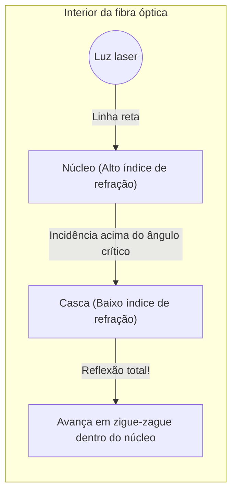

## 1. A internet global está conectada pela "luz"

Quando você assiste a um vídeo do YouTube em um servidor americano pelo seu smartphone, você acha que esses dados passam por um satélite artificial no espaço? 
Na verdade, cerca de 99% das comunicações da internet no mundo viajam através de "**cabos de fibra óptica**" instalados no fundo do oceano, cruzando literalmente o mar à "velocidade da luz".

Fios de vidro com a espessura de um fio de cabelo transportam enormes quantidades de dados de vários terabytes por todo o mundo em um instante. A mudança de paradigma das antigas comunicações por cabo de cobre (sinais elétricos) para as comunicações por fibra óptica (sinais ópticos) foi a revolução de infraestrutura mais importante na moderna sociedade da informação.

A luz tem a propriedade de viajar em linha reta. Então, por que a luz não vaza dos cabos curvos no fundo do mar e chega a milhares de quilômetros de distância?

## 2. Refração e a física da "reflexão total"

A resposta está em um fenômeno óptico chamado "**reflexão total interna (Total Internal Reflection)**", que aprendemos nas aulas de física do ensino médio.

Quando a luz passa da água para o ar, ou do vidro para o ar, como de um "material onde a velocidade da luz é mais lenta (índice de refração maior)" para um "material mais rápido (índice de refração menor)", ocorre a "refração", que curva a trajetória da luz na interface.
Você já deve ter notado um fenômeno em que, ao olhar para a superfície da água do fundo de uma piscina de um certo ângulo, a paisagem externa não é visível e a superfície da água reflete o fundo da piscina como um espelho.

À medida que o ângulo em que a luz entra obliquamente (ângulo de incidência) aumenta, chega um momento em que a luz refratada se torna paralela à interface. Esse ângulo é chamado de "ângulo crítico".
**Quando o ângulo de incidência excede esse ângulo crítico, a luz não vaza para fora, sendo 100% refletida na interface e retornando ao interior. Isso é a "reflexão total".**

Espelhos comuns refletem a luz usando metais como a prata, mas inevitavelmente alguns por cento da luz são absorvidos e perdidos. No entanto, a refletividade devido a essa "reflexão total" é de 100%, tornando-a o espelho definitivo sem nenhuma perda de energia.

## 3. Estrutura da fibra óptica: núcleo e casca

Para conter o princípio dessa reflexão total dentro do cabo, a fibra óptica é feita de um vidro de quartzo especial com uma estrutura de duas camadas.

1. **Núcleo (centro)**: O caminho por onde a luz passa. Vidro com um índice de refração "ligeiramente mais alto".
2. **Casca (periferia)**: A camada que envolve o núcleo. Vidro com um índice de refração "ligeiramente mais baixo".

Quando uma luz laser é disparada diretamente da extremidade do núcleo, ela viaja em linha reta dentro dele. Mesmo que o cabo seja curvo e a luz atinja a interface com a casca, ela o atinge em um ângulo oblíquo (ângulo raso acima do ângulo crítico), de modo que não vaza para fora da casca e causa uma "reflexão total".
Dessa forma, a luz é guiada por milhares de quilômetros até seu destino sem se perder, repetindo a reflexão total na interface entre o núcleo e a casca.

## 4. Modo monomodo e multimodo

As fibras ópticas são amplamente divididas em dois tipos, dependendo de seu uso.

**Fibra multimodo**
O diâmetro do núcleo é um pouco mais grosso, cerca de 50 micrômetros. Como a luz viaja refletindo em vários ângulos no seu interior, existem vários caminhos (modos) para a luz. LEDs baratos podem ser usados como fonte de luz, mas a luz que viaja refletindo em ângulos chega ao destino mais tarde do que a luz que viaja em linha reta, fazendo com que o sinal fique borrado em longas distâncias. Portanto, ela é usada para comunicações de curta distância, como dentro de edifícios ou data centers.

**Fibra monomodo**
O diâmetro do núcleo é afinado ao extremo, chegando a cerca de 9 micrômetros (tão pequeno quanto uma célula). Por ser tão fina, a luz não pode refletir diagonalmente e só consegue viajar em linha reta (um único modo) no centro da fibra. Requer um laser semicondutor muito caro, mas como a luz não se dispersa, ela é usada para comunicações de ultra-longa distância e ultra-alta velocidade de milhares de quilômetros através do oceano.

## 5. Por que "luz" em vez de cobre?

As razões pelas quais as fibras ópticas são tão valorizadas em comparação com os fios de cobre (comunicação elétrica) são esmagadoras.

1. **Menos atenuação (alcança maiores distâncias)**
   Os fios de cobre possuem resistência elétrica, o que faz com que os sinais desapareçam após alguns quilômetros. No entanto, o vidro da fibra óptica, com impurezas removidas ao extremo, possui uma transparência surpreendente, permitindo que a luz alcance distâncias de mais de 100 km.
2. **Forte contra ruídos (impacto zero da indução eletromagnética)**
   Os fios de cobre captam ruídos eletromagnéticos de campos magnéticos próximos, raios e outros cabos. No entanto, como a luz não é eletricidade, ela não recebe nenhum ruído externo.
3. **Capacidade ultra-alta por meio da multiplexação por divisão de comprimento de onda (WDM)**
   A luz tem a propriedade de que "cores diferentes não se misturam". Mesmo que os sinais de laser vermelho, azul e verde sejam transmitidos simultaneamente por uma única fibra óptica, eles podem ser claramente separados por cor usando um prisma (filtro) no lado receptor. Isso é chamado de "Multiplexação por Divisão de Comprimento de Onda", o que permite um volume de comunicação de outra dimensão de vários terabits em um único cabo.

## 6. Conclusão: O mundo conectado por fios de vidro

Desde que a tecnologia de fabricação de vidro de quartzo de alta pureza foi estabelecida na década de 1970, as fibras ópticas continuaram a evoluir, cobrindo o planeta inteiro como vasos sanguíneos.
Na raiz de suas impressionantes velocidades de comunicação está uma lei física simples e bela: a "reflexão total" da luz.

O fato de podermos enviar fotos nas redes sociais e fazer chamadas de vídeo em tempo real com amigos distantes se deve a esses finos fios de vidro que transportam continuamente partículas de luz, refletindo-as totalmente na escuridão profunda e fria do fundo do mar.
