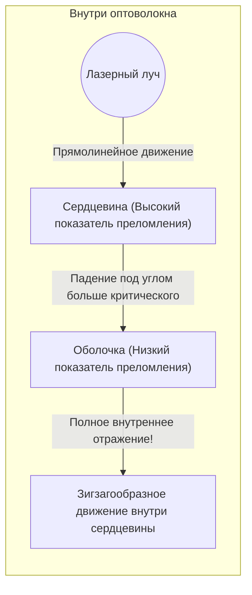

## 1. Мировой интернет соединен «светом»

Когда вы проигрываете видео на YouTube, находящееся на сервере в США, со своего смартфона, задумывались ли вы, что эти данные проходят через искусственные спутники в космосе? 
На самом деле, около 99% мирового интернет-трафика проходит через проложенные по дну океана «**оптоволоконные кабели**», пересекая океаны в буквальном смысле со «скоростью света».

Стеклянная нить толщиной с человеческий волос мгновенно передает колоссальные объемы данных в несколько терабайт по всему миру. Смена парадигмы от связи по медным кабелям (электрические сигналы) к связи по оптоволокну (оптические сигналы) стала важнейшей инфраструктурной революцией в современном информационном обществе.

Свет обладает свойством распространяться прямолинейно. Но почему же тогда в извилистых подводных кабелях свет не выходит наружу и может преодолевать тысячи километров?

## 2. Преломление и физика «полного внутреннего отражения»

Ответ кроется в оптическом явлении, изучаемом в школьном курсе физики — «**полном внутреннем отражении (Total Internal Reflection)**».

Когда свет переходит из среды, в которой «свет распространяется медленно (показатель преломления велик)», в среду, где он «распространяется быстро (показатель преломления мал)», например, из воды в воздух или из стекла в воздух, на границе раздела сред происходит «преломление» — искривление траектории луча.
Вы когда-нибудь замечали, глядя на поверхность воды из-под воды в бассейне, что если смотреть под определенным углом, то не видно того, что находится снаружи, а поверхность воды отражает дно бассейна, словно зеркало?

Если продолжать увеличивать угол, под которым свет падает на границу раздела (угол падения), наступит момент, когда преломленный свет станет параллельным границе раздела. Этот угол называется «критическим углом».
**Если угол падения превышает этот критический угол, свет вообще не выходит наружу, а на 100% отражается от границы раздела и возвращается внутрь. Это и есть «полное внутреннее отражение».**

Обычные зеркала используют металлы, такие как серебро, для отражения света, но несколько процентов света неизбежно поглощается и теряется. Однако коэффициент отражения при этом «полном внутреннем отражении» составляет ровно 100%, что делает его идеальным зеркалом с нулевыми потерями энергии.

## 3. Структура оптоволокна: сердцевина и оболочка

Оптоволокно изготавливается из специального кварцевого стекла с двухслойной структурой, чтобы заключить этот принцип полного отражения внутри кабеля.

1. **Сердцевина (центральная часть)**: Путь, по которому проходит свет. Стекло с «немного более высоким» показателем преломления.
2. **Оболочка (внешняя часть)**: Слой, окружающий сердцевину. Стекло с «немного более низким» показателем преломления.

Если направить лазерный луч прямо в торец сердцевины, свет будет распространяться внутри нее по прямой. Даже если кабель изогнут, и свет попадает на границу с оболочкой, он падает под углом (малым углом, превышающим критический угол), поэтому он не выходит за пределы оболочки, а вызывает «полное внутреннее отражение».
Таким образом, свет многократно испытывает полное внутреннее отражение на границе между сердцевиной и оболочкой, достигая своей цели за тысячи километров без каких-либо потерь.

## 4. Одномодовое и многомодовое волокно

Существует два основных типа оптических волокон в зависимости от их применения.

**Многомодовое волокно**
Диаметр сердцевины немного больше — около 50 микрометров. Поскольку свет распространяется, отражаясь внутри под разными углами, существует несколько путей (мод) прохождения света. В качестве источника света можно использовать недорогие светодиоды и т. п., но свет, распространяющийся за счет отражения под углом, достигает цели медленнее, чем свет, распространяющийся по прямой, что приводит к размытию сигнала на больших расстояниях. По этой причине его используют для связи на небольшие расстояния, например, внутри зданий или центров обработки данных.

**Одномодовое волокно**
Это волокно с предельно уменьшенным диаметром сердцевины — около 9 микрометров (размером с клетку). Поскольку оно очень тонкое, свет не может отражаться по диагонали и вынужден двигаться только по прямой линии (одна мода) через центр волокна. Хотя для этого требуются очень дорогие полупроводниковые лазеры, свет вообще не рассеивается, поэтому оно используется для сверхдальней и сверхскоростной связи на тысячи километров через океаны.

## 5. Почему «свет», а не медные провода?

Преимущества оптических волокон по сравнению с медными проводами (электрической связью) неоспоримы.

1. **Низкое затухание (достигает дальних расстояний)**
   Медные провода имеют электрическое сопротивление, поэтому через несколько километров сигнал затухает, но стекло оптического волокна, очищенное от примесей до предела, обладает невероятной прозрачностью и может передавать свет на расстояние более 100 км.
2. **Устойчивость к помехам (нулевое влияние электромагнитной индукции)**
   Медные провода улавливают окружающие магнитные поля, молнии и электромагнитный шум от других кабелей, но свет не является электричеством, поэтому он совершенно не подвержен влиянию внешних шумов.
3. **Сверхбольшая емкость благодаря спектральному уплотнению (WDM)**
   Свет обладает тем свойством, что «разные цвета не смешиваются». Даже если красный, синий и зеленый лазерные сигналы посылаются по одному оптоволокну одновременно, их можно четко разделить по цветам с помощью призмы (фильтра) на приемной стороне. Это называется «спектральным уплотнением (мультиплексированием с разделением по длине волны)», и это позволяет одному кабелю достичь связи совершенно иного уровня, обеспечивая передачу нескольких терабит данных.

## 6. Заключение: мир, связанный стеклянными нитями

С тех пор как в 1970-х годах была разработана технология производства кварцевого стекла высокой чистоты, оптические волокна продолжают развиваться, покрывая всю Землю, словно кровеносные сосуды.
В основе их невероятной скорости связи лежит простой и красивый физический закон света — «полное внутреннее отражение».

Мы можем отправлять фотографии в социальных сетях и совершать видеозвонки с друзьями, находящимися далеко от нас, в режиме реального времени только потому, что глубоко в холодной тьме на дне океана эта тонкая стеклянная нить неустанно несет частицы света, раз за разом полностью отражая их от своих стенок.
