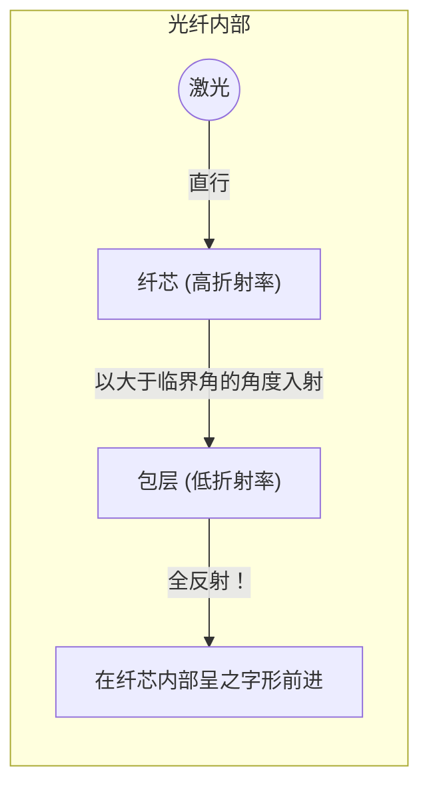

## 1. 世界的互联网是由“光”连接的

当您在智能手机上播放位于美国服务器上的 YouTube 视频时，您是否认为这些数据是通过太空中的人造卫星传输的？
事实上，世界上大约 99% 的互联网通信，都是通过铺设在海底的 **光纤电缆** ，以字面意义上的“光速”跨越海洋传输而来的。

只有头发丝般粗细的玻璃丝，瞬间将数 TB 的海量数据传输到世界各地。从过去通过铜线电缆（电信号）进行的通信，转变为通过光纤（光信号）进行的通信，这是现代信息化社会中最重要的基础设施革命。

光具有直线传播的性质。那么，在蜿蜒曲折的海底电缆中，光为什么不会向外泄漏，而是能够传输到数千公里之外呢？

## 2. 折射与“全反射”的物理学

其答案在于我们在高中物理中学到的一种光学现象： **全反射（Total Internal Reflection）** 。

当光从水进入空气，或者从玻璃进入空气等，即从“光速较慢的物质（折射率较大）”进入“光速较快的物质（折射率较小）”时，光在交界面处会发生轨道弯曲的“折射”现象。
当您从水池中仰望水面时，如果从某个角度斜视，您就看不到外面的景色，水面会像镜子一样反射出水池的底部——您有没有见过这种现象？

如果让光斜向入射的角度（入射角）越来越大，就会出现折射光与交界面平行的瞬间。这个角度被称为“临界角”。
**当入射角超过这个临界角时，光将完全不会向外泄漏，而是在交界面上发生 100% 的反射并返回内部。这就是“全反射”。**

普通的镜子是利用银等金属来反射光，但不可避免地会有百分之几的光被吸收而损耗。然而，这种由“全反射”产生的反射率是完全的 100%，这是一种能量完全没有损耗的终极镜子。

## 3. 光纤的结构：纤芯和包层

为了将全反射的原理封闭在电缆内部，光纤由特殊石英玻璃制成的双层结构组成。

1. **纤芯（中心部分）** ：光通过的通道。折射率“稍高”的玻璃。
2. **包层（外围部分）** ：包裹纤芯的层。折射率“稍低”的玻璃。

如果从纤芯的端面径直射入激光，光将在纤芯内部直线传播。即使电缆是弯曲的，光撞击到与包层的交界面上，由于光是倾斜地（以大于临界角的较浅角度）撞击，因此不会泄漏到包层外部，而是发生“全反射”。
这样，光在纤芯和包层的交界面上不断地进行全反射，被引导至数千公里之外的终点，而不会有任何损耗。

## 4. 单模和多模

光纤根据其用途主要分为两大类。

**多模光纤**
纤芯的直径约为 50 微米，稍微偏粗。由于光在内部以各种角度反射前进，因此存在多条光路（模式）。虽然可以使用廉价的 LED 等作为光源，但斜向反射前进的光会比直行前进的光晚到达终点，因此在长距离传输时信号会发生模糊。所以，它被用于大楼内或数据中心内等短距离通信。

**单模光纤**
将其纤芯直径极度缩减至约 9 微米（如细胞般大小）。由于非常细，光无法斜向反射，只能在光纤中心沿一条直线（单一模式）前进。虽然需要非常昂贵的半导体激光器，但由于光完全不会发生散射，因此它被用于跨越海洋等数千公里的超长距离、超高速通信。

## 5. 为什么是“光”而不是铜线？

与铜线（电通信）相比，光纤之所以如此受重视，其优势是压倒性的。

1. **衰减小（传输距离远）**
   由于铜线存在电阻，信号在前进数公里后就会消失；而将杂质去除到极限的光纤玻璃拥有惊人的透明度，能够将光传输到 100 公里之外。
2. **抗干扰能力强（零电磁感应影响）**
   铜线会吸收周围的磁场、雷电以及来自其他电缆的电磁干扰（噪声），而光不是电，因此完全不受外部干扰的影响。
3. **通过波分复用（WDM）实现超大容量化**
   光具有“不同颜色互不混合”的性质。即使在一根光纤中同时传输红色激光信号、蓝色激光信号和绿色激光信号，在接收端只需使用棱镜（滤波器）就能按颜色清晰地分离开来。这被称为“波分复用技术”，由此实现了一根电缆传输数太比特（Tbps）这种异次元级别的通信量。

## 6. 总结：玻璃丝连接的世界

自 20 世纪 70 年代确立了高纯度石英玻璃的制造技术以来，光纤不断发展，像血管一样覆盖了整个地球。
在这惊人的通信速度根基上，存在着一种简单而美丽的物理法则——光的“全反射”。

我们在社交网络上发送照片，能够与远方的朋友实时进行视频通话，都是多亏了这纤细的玻璃丝在海底深处冰冷的黑暗中，通过全反射不断地传输着光子。
