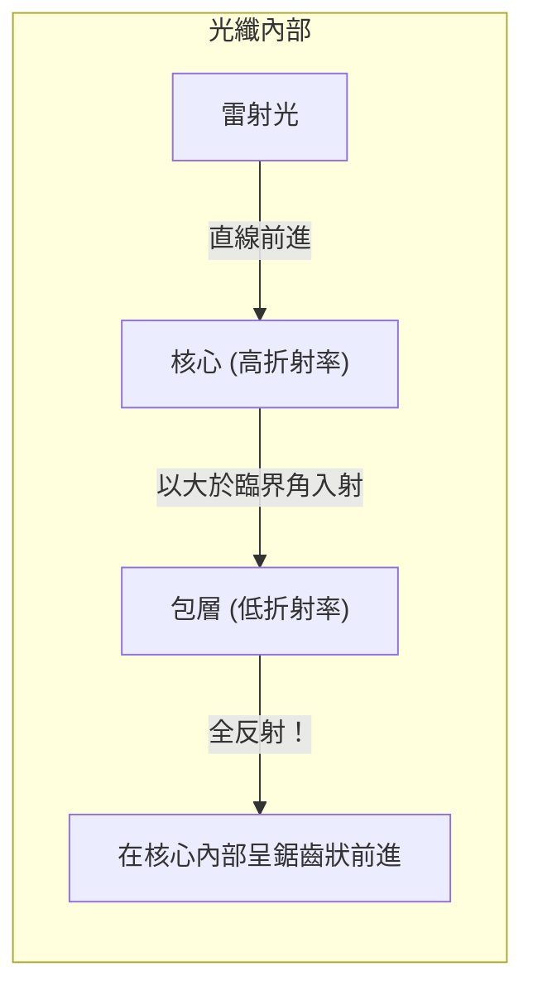

## 1. 世界的網際網路是由「光」連接的

當你在智慧型手機上播放位於美國伺服器上的 YouTube 影片時，你是否以為那些資料是經過太空中的人造衛星傳輸過來的？ 
其實，世界上約 99% 的網際網路通訊，都是透過鋪設在海底的「 **光纖電纜** 」，名副其實地以「光速」跨越海洋而來的。

細如髮絲的玻璃絲，在一瞬間將數 TB 的龐大資料傳輸到世界各地。從過去透過銅線電纜 (電子訊號) 進行通訊，轉變為透過光纖 (光訊號) 進行通訊的典範轉移，是現代資訊化社會中最重要的基礎建設革命。

光具有直線傳播的特性。那麼，在蜿蜒曲折的海底電纜中，光為什麼不會向外洩漏，還能傳遞到幾千公里外的地方呢？

## 2. 折射與「全反射」的物理

答案就在高中物理學過的「 **全反射 (Total Internal Reflection)** 」這個光學現象中。

當光從水進入空氣，或是從玻璃進入空氣等，從「光傳播速度較慢的物質 (折射率較大)」進入「速度較快的物質 (折射率較小)」時，光的路徑在交界面會發生彎曲，這就是「折射」。
當你從游泳池底向上看水面時，如果從某個角度斜視，會看不到外面的景色，水面反而像鏡子一樣反射出游泳池底部，你是否曾見過這樣的現象呢？

如果將光斜向射入的角度 (入射角) 逐漸增大，折射光會出現與交界面平行的瞬間。這個角度被稱為「臨界角」。
**當入射角超過這個臨界角時，光就完全不會向外洩漏，而在交界面發生 100% 反射並回到內部。這就是「全反射」。**

普通的鏡子是利用銀等金屬來反射光線，但無可避免地會有百分之幾的光被吸收而損失。然而，這種由「全反射」產生的反射率是完美的 100%，是一種完全沒有能量損失的終極鏡子。

## 3. 光纖的結構：核心與包層

為了解將這種全反射原理封閉在電纜內部，光纖採用了雙層結構的特殊石英玻璃製成。

1. **核心 (中心部分)** ：光線通過的通道。折射率「稍微偏高」的玻璃。
2. **包層 (外圍部分)** ：包覆核心的層。折射率「稍微偏低」的玻璃。

從核心的邊緣垂直射入雷射光時，光會在核心中直線前進。即使電纜彎曲，使得光碰撞到與包層的交界面，由於光是斜向 (大於臨界角的淺角度) 碰撞，因此不會洩漏到包層外部，而是發生「全反射」。
就這樣，光在核心與包層的交界面上不斷重複全反射，毫無損失地被引導至幾千公里外的終點。

## 4. 單模與多模

光纖根據用途主要分為兩種類型。

**多模光纖**
核心直徑約為 50 微米，稍微粗一些。由於光在內部以各種不同角度反射前進，因此光的路徑 (模式) 有多個。雖然可以使用廉價的 LED 等作為光源，但斜向反射前進的光，會比直線前進的光晚到達終點，如果在長距離傳輸，訊號就會變得模糊。因此，它被用於大樓內或資料中心內等短距離通訊。

**單模光纖**
將核心直徑極限縮小至約 9 微米 (大約是細胞的大小)。由於非常細，光無法斜向反射，只能沿著光纖的中心一直線 (單一模式) 前進。雖然需要非常昂貴的半導體雷射，但因為光完全不會散射，所以被用於跨越海洋等數千公里的超長距離、超高速通訊。

## 5. 為什麼是「光」而不是銅線？

光纖之所以如此受重視，是因為與銅線 (電子通訊) 相比有著壓倒性的優勢。

1. **衰減少 (能傳輸得更遠)**
   由於銅線有電阻，訊號在前進幾公里後就會消失；然而，去除了極限雜質的光纖玻璃擁有驚人的透明度，可以將光傳輸到 100 公里以外的地方。
2. **抗雜訊能力強 (電磁感應影響為零)**
   銅線會受到周圍磁場、雷電以及其他電纜的電磁雜訊干擾，但因為光不是電，所以完全不會受到來自外部的雜訊影響。
3. **透過波長分波多工 (WDM) 實現超大容量化**
   光具有「不同顏色就不會混合」的特性。即使在一根光纖中同時傳輸紅色雷射訊號、藍色雷射訊號和綠色雷射訊號，只要在接收端使用稜鏡 (濾波器)，就能乾淨地按顏色將它們分離。這被稱為「波長分波多工」方式，藉此一根電纜就能實現數 TB 這種異次元等級的通訊量。

## 6. 總結：玻璃絲連結的世界

自 1970 年代確立了高純度石英玻璃的製造技術以來，光纖不斷進化，如同血管般覆蓋了整個地球。
在其驚人的通訊速度基礎上，橫亙著光「全反射」這個既簡單又美麗的物理法則。

我們能夠在社群網路上傳送照片，或是與遠方的朋友進行即時視訊通話，全都要歸功於在海底深處冰冷的黑暗中，這些細微的玻璃絲一邊讓光粒子進行全反射，一邊持續不斷地將其傳遞出去。
