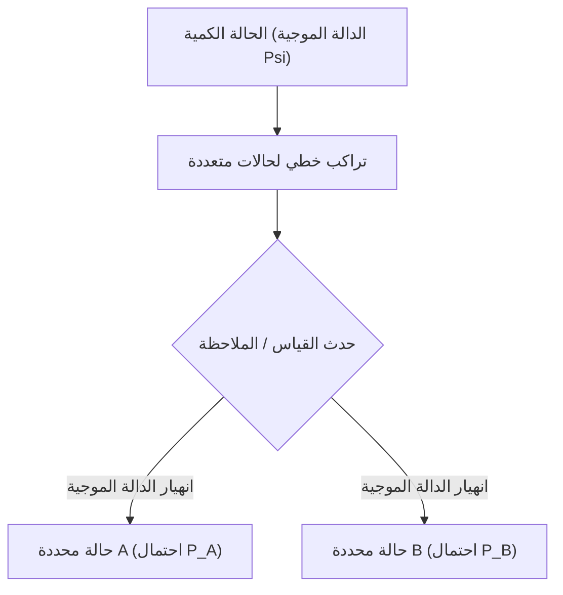

# الفيزياء: أسس ميكانيكا الكم - قطة شرودنغر وتجربة الشق المزدوج

## 1. مقدمة: العالم المجهري الغريب الذي يتحدى المنطق البديهي

يمكن تفسير الغالبية العظمى من الظواهر الطبيعية في حياتنا اليومية بدقة بالغة من خلال الفيزياء الكلاسيكية وميكانيكا نيوتن. فمسار المقذوفات، ودوران الكواكب في مداراتها الإهليلجية حول الشمس، وتصادم كرات البلياردو، كلها حركات حتمية تماماً: إذا عُرفت الشروط الابتدائية للنظام، أمكن التنبؤ بحالته المستقبلية بيقين مطلق.

ولكن مع مطلع القرن العشرين، عندما بدأ الفيزيائيون سبر أغوار العالم المجهري متناهي الصغر—عالم الذرات والإلكترونات وفوتونات الضوء—انهارت صروح الفيزياء الكلاسيكية. هل الضوء موجة مستمرة أم سيل من الجسيمات المنفصلة؟ وأين يوجد الإلكترون تحديداً قبل أن نرصده؟ للإجابة عن هذه التساؤلات الوجودية الكبرى، وُلدت **ميكانيكا الكم (Quantum Mechanics)**.

تُعد ميكانيكا الكم من أكثر النظريات رسوخاً ونجاحاً وتطبيقاً في تاريخ العلم البشري. فعليها تقوم رقائق أشباه الموصلات في هواتفنا، وليزر الاتصالات عبر الألياف الضوئية، وأجهزة الرنين المغناطيسي (MRI)، والحواسيب الكمومية الصاعدة. يحلل هذا المقال المبادئ الكبرى للفيزياء الكمية من خلال أيقونتين تاريخيتين: **تجربة الشق المزدوج** ومفارقة **قطة شرودنغر**.

## 2. الطبيعة المزدوجة للمادة والضوء: ازدواجية الموجة والجسيم

من أكثر المفاهيم ثورية في الفيزياء **ازدواجية الموجة والجسيم (Wave-particle duality)**. فرقت الفيزياء الكلاسيكية تفريقاً صارماً بين المادة باعتبارها "جسيمات" مادية ذات كتلة محددة، والضوء والصوت باعتبارهما "أمواجاً" متصلة تنتشر في الفضاء. غير أن ميكانيكا الكم ألغت هذا الحاجز، كاشفة أن كل كيان في الكون يمتلك خصائص موجية وجسيمية في آن واحد وفقاً لطريقة قياسه.

بدأت هذه النقلة عام 1905 بفرضية ألبرت أينشتاين حول **كمومية الضوء**، حيث بيّن أن الضوء ينتقل في حزم طاقة منفصلة تُدعى **فوتونات** ($E = h\nu$، حيث $h$ ثابت بلانك و $\nu$ التردد)، مما فسّر الظاهرة الكهروضوئية. وفي عام 1924، وسّع الفيزيائي الفرنسي لويس دي بروي هذا المفهوم: إذا كان لموجات الضوء سلوك جسيمي، فلا بد للجسيمات المادية كالإلكترونات أن تمتلك أطوالاً موجية مرافقة:

$$ \lambda = \frac{h}{p} $$

حيث $p = mv$ هو كمية الحركة. وأثبتت تجارب حيود الإلكترونات لاحقاً أن حزم الإلكترونات تحيد وتتداخل تماماً كالأشعة السينية، مرسخةً حقيقة موجات المادة.

## 3. جوهر الغموض الكمي: تجربة الشق المزدوج

تُظهر تجربة الشق المزدوج (Double-slit experiment) غرابة الطبيعة الكمية في أبهى صورها. وقد وصفها الفيزيائي الحائز على نوبل [ريتشارد فاينمان](/p/biography-richard-feynman/) بأنها تحتوي على "اللغز الوحيد الحقيقي لميكانيكا الكم".

### تركيبة التجربة
1. مدفع إلكتروني يطلق إلكترونات نحو جدار حاجز.
2. يحتوي الجدار على شقين متوازيين ضيقين للغاية (الشق A والشق B).
3. خلف الجدار شاشة كاشفة فوسفورية تسجل موضع اصطدام كل إلكترون كنقطة ضوئية منفصلة.

### لو كانت الإلكترونات جسيمات كلاسيكية بحتة
لو كانت الإلكترونات تشبه كرات البلياردو المصغرة، لعبر كل إلكترون إما من الشق A أو الشق B، ولتشكل على الشاشة مع الوقت شريطان رأسيان فقط يطابقان موضعي الشقين.

### لو كانت الإلكترونات أمواجاً كلاسيكية
لو كانت أمواج ماء، لانطلقت من الشقين جبهتا موجات دائريتان تتراكبان وتتداخلان: تلتقي القمم بالقمم فيحدث تداخل بنّاء، وتلتقي القمم بالقيعان فيحدث تداخل هدام، ولتكونت على الشاشة خطوط مضيئة ومظلمة متعاقبة تُدعى **نمط التداخل (Interference Pattern)**.

### النتيجة المذهلة للتجربة الحقيقية
عندما أطلق الفيزيائيون الإلكترونات **واحداً تلو الآخر**، لضمان وجود إلكترون وحيد في الجهاز في اللحظة الواحدة، اصطدم كل إلكترون بالشاشة كنقطة جسيمية مصمتة.

ولكن بعد إطلاق آلاف الإلكترونات المنفردة عبر الزمن، اجتمعت تلك النقاط العشوائية لتشكل **نمط تداخل موجي فائق الدقة**!
هذا يعني حقيقة واحدة لا مفر منها: كل إلكترون بمفرده تصرف كموجة احتمالية، **وعبر من الشقين معاً في نفس اللحظة**، وتداخل مع نفسه، وسقط على الشاشة وفقاً لاحتمالات التداخل!

### الرصد يغير الواقع المادي
في محاولة لحل هذا اللغز، وضع العلماء كواشف دقيقة بجانب الشقين لمعرفة من أي شق يمر الإلكترون فعلياً.

وما إن بدأ الرصد وعُرف مسار الإلكترون، **حتى اختفى نمط التداخل فوراً**، وعادت النتيجة لتكون شريطين كلاسيكيين عاديين!
كأن الإلكترون "يعلم" أنه خاضع للمراقبة البشرية! إن مجرد فعل "القياس والرصد" دمر تماسك الموجة وأجبر الإلكترون على التصرف كجسيم كلاسيكي. وتعرف هذه المعضلة في الفيزياء بـ **معضلة القياس (Measurement Problem)**.

## 4. التراكب الكمي والتفسير الاحتمالي

تُسمى قدرة الجسيم الكمي على اتخاذ مسارات أو حالات متعددة في نفس الوقت بـ **التراكب الكمي (Superposition)**.

في ميكانيكا الكم، لا يمتلك الجسيم غير المرصود موضعاً مكانياً محدداً، بل يتواجد كتراكب خطي لجميع الحالات الممكنة عبر أداة رياضية مركبة تُدعى **الدالة الموجية ($\Psi$)**. في عام 1926، قدم ماكس بورن **التفسير الاحتمالي (تفسير كوبنهاغن)**: يمثل مربع القيمة المطلقة لسعة الدالة الموجية **كثافة احتمالية** العثور على الجسيم في تلك النقطة عند إجراء القياس:

$$ P(\mathbf{r}) = |\Psi(\mathbf{r}, t)|^2 $$

قبل القياس، يكون الإلكترون في حالة تراكب متماسك:

$$ |\psi\rangle = \frac{1}{\sqrt{2}} |\text{الشق A}\rangle + \frac{1}{\sqrt{2}} |\text{الشق B}\rangle $$

وفي اللحظة التي يتدخل فيها القياس، يحدث **انهيار الدالة الموجية (Wave function collapse)**، وتتلاشى سحابة الاحتمالات لتستقر على قيمة واقعية واحدة. اعترض أينشتاين على هذا الطابع الاحتمالي قائلاً: *"إن الله لا يلعب النرد مع الكون"*. لكن التجارب أثبتت أن عالم الكم خاضع بالفعل للاحتمالات الصرفة.

## 5. معادلة شرودنغر: القانون الحاكم للديناميكا الكمية

لوصف كيفية تطور الدالة الموجية لنظام كمي تطوراً سلساً وحتمياً عبر الزمن، صاغ الفيزيائي النمساوي إرفين شرودنغر عام 1926 معادلته الشهيرة:

$$ i\hbar \frac{\partial}{\partial t} \Psi(\mathbf{r},t) = \hat{H} \Psi(\mathbf{r},t) $$

حيث $i$ الوحدة التخيلية، و $\hbar$ ثابت بلانك المخفض، و $\Psi$ الدالة الموجية، و $\hat{H}$ مؤثر الهاملتونيان الذي يعبر عن الطاقة الكلية للنظام. تعادل هذه المعادلة قانون نيوتن الثاني في الميكانيكا، ومن حلولها تُحسب المدارات الإلكترونية للذرات ومستويات الطاقة والروابط الكيميائية.

## 6. قمة المفارقات: «قطة شرودنغر»

رغم نجاح تفسير كوبنهاغن في الحسابات المجهرية، شعر شرودنغر نفسه بالانزعاج من فكرة أن الرصد هو ما يُحدث انهيار الواقع. ماذا يحدث لو رُبطت هذه الحالة المجهرية بكائن حي في عالمنا الماكروسكوبي؟

لتبيان هذا التناقض الظاهري، اقترح عام 1935 تجربته الفكرية الأسطورية: **قطة شرودنغر (Schrödinger's Cat)**.

### إعداد التجربة الفكرية
1. توضع قطة حية داخل صندوق فولاذي مغلق ومعزول تماماً عن الخارج.
2. داخل الصندوق جهاز يحتوي على ذرة مشعة واحدة، وعداد غايغر، ومطرقة مربوطة بمرحل كهربائي، وزجاجة مغلقة بها غاز السيانيد السام.
3. خلال ساعة واحدة، هناك احتمال كمي دقيق بنسبة 50% أن تتحلل الذرة المشعة، و 50% ألا تتحلل.
4. إذا تحللت، يرصد العداد الإشعاع، فتهوي المطرقة وتكسر الزجاجة، فيموت القط بالسم.
5. إذا لم تتحلل، تبقى الزجاجة سليمة ويبقى القط حياً.

### ما هي حالة القطة قبل فتح الصندوق؟
تحلل الذرة حدث كمومي صرف. وفقاً لتفسير كوبنهاغن، تظل الذرة في حالة تراكب بين "تحللت" و "لم تتحلل" طالما لم يفتح أحد الصندوق.

وبما أن مصير القطة ارتبط ميكانيكياً بحالة الذرة، فإن المنطق يفرض استنتاجاً مرعباً: قبل فتح الصندوق، **تكون القطة في حالة تراكب متزامن: حية وميتة في آن واحد**:

$$ |\Psi_{\text{النظام}}\rangle = \frac{1}{\sqrt{2}} |\text{قطة حية}\rangle + \frac{1}{\sqrt{2}} |\text{قطة ميتة}\rangle $$

وفقط عندما يرفع راصد بشري الغطاء، تنهار الدالة الموجية وتتحدد إحدى الحالتين في الواقع الكلاسيكي!

### فك الترابط الكمي والعوالم المتعددة
لم يقترح شرودنغر هذه التجربة ليثبت وجود قطط ميتة-حية، بل ليوضح عبثية تطبيق قوانين الذرة على الأجسام الكبيرة دون تمييز.

تفسر الفيزياء المعاصرة ذلك بنظرية **فك الترابط الكمي (Quantum Decoherence)**: تتكون الأجسام الكبيرة كالقطط والكواشف من تريليونات الذرات التي تتصادم باستمرار مع جزيئات الهواء والفوتونات الحرارية. وخلال جزء ضئيل من الثانية ($10^{-20}\text{ ث}$)، تتسرب أطوار التراكب الكمي إلى البيئة المحيطة، مما يمنح النظام المظاهر الكلاسيكية الحتمية قبل أن ينظر أي إنسان داخله بفترة طويلة.

وهناك تفسير آخر هو **تفسير العوالم المتعددة (Many-worlds interpretation)** لهيو إيفريت (1957): الدالة الموجية لا تنهار أبداً، بل ينقسم الكون عند كل رصد إلى مسارين متوازيين: كون تنجو فيه القطة، وكون آخر تموت فيه.

## 7. التشابك الكمي: «التأثير الشبحي عن بعد»

من أكثر ظواهر الكم دهشة **التشابك الكمي (Quantum entanglement)**. فعندما ينشأ جسيمان في حالة كمومية مشتركة، يشكلان كياناً واحداً لا يتجزأ:

$$ |\Phi^+\rangle = \frac{1}{\sqrt{2}} \left( |\uparrow\uparrow\rangle + |\downarrow\downarrow\rangle \right) $$

حتى لو فُصل الجسيمان بمسافة سنوات ضوئية، فإن قياس حالة الجسيم الأول يحدد فوراً (**دون أي فارق زمني**) الحالة الكمية للجسيم الثاني.

رفض أينشتاين ذلك ساخراً ووصفه بـ *"التأثير الشبحي عن بعد"*، معتقداً بوجود متغيرات خفية محلية. غير أن مبرهنة بيل والتجارب اللاحقة (نوبل للفيزياء 2022) أثبتت خطأ أينشتاين: فالطبيعة في جوهرها **غير محلية (Non-local)**.

## 8. الثورة الكمومية الثانية وتكنولوجيا المستقبل

تحولت هذه المفاهيم اليوم إلى محركات لـ **الثورة الكمومية الثانية**:
- **الحوسبة الكمومية (Quantum Computing)**: الاستفادة من الكيوبتات (Qubits) والتراكب والتشابك لمعالجة فضاءات حسابية هائلة بالتوازي، مما يحدث طفرة في محاكاة الأدوية وتشفير البيانات.
- **التشفير الكمي (QKD)**: الاعتماد على مبدأ عدم استنساخ الحالات الكمية لتأمين اتصالات مستحيلة الاختراق فيزيائياً.
- **المستشعرات الكمومية**: قياس الجاذبية والمجالات المغناطيسية بدقة ذرية فائقة.

## 9. خاتمة

تنسف ميكانيكا الكم بديهياتنا المألوفة. وكما قال [ريتشارد فاينمان](/p/biography-richard-feynman/): *"أعتقد أنني أستطيع القول باطمئنان إنه لا يوجد أحد يفهم ميكانيكا الكم"*. ومع ذلك، فإن الغوص في أسرارها يكشف لنا أعظم وأروع أسرار هذا الكون.
