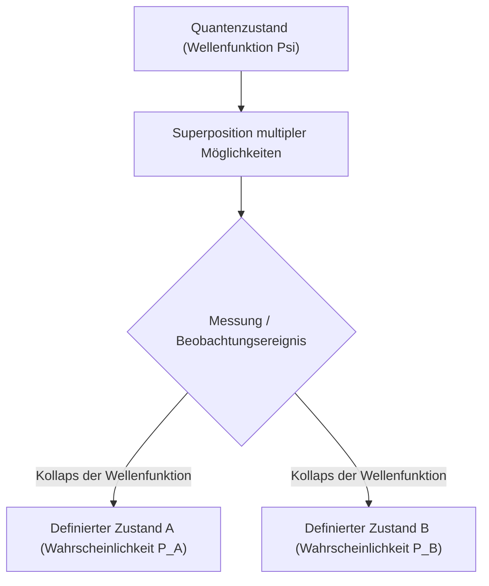

# Physik: Grundlagen der Quantenmechanik - Schrödingers Katze und das Doppelspaltexperiment

## 1. Einleitung: Die bizarre mikroskopische Welt jenseits der Intuition

Nahezu alle makroskopischen Phänomene unseres Alltags lassen sich mit erstaunlicher Präzision durch die klassische Physik – allen voran die Newtonsche Mechanik – beschreiben. Die Wurfparabel eines Steins, die elliptische Bahn der Planeten um die Sonne oder der elastische Stoß zweier Billardkugeln sind deterministischer Natur: Sind die Anfangsbedingungen eines Systems exakt bekannt, lässt sich jeder zukünftige Zustand im Prinzip mit vollkommener Gewissheit vorausberechnen.

Zu Beginn des 20. Jahrhunderts stießen Physiker bei der Erforschung der mikroskopischen Welt der Atome, Elektronen und Lichtquanten jedoch an die unüberwindbaren Grenzen der klassischen Physik. Ist Licht eine kontinuierliche Welle oder ein Strom diskreter Teilchen? Wo befindet sich ein Elektron, bevor es gemessen wird? Zur Lösung dieser fundamentalen Krisen entstand die **Quantenmechanik (Quantum Mechanics)**.

Die Quantenmechanik ist die am besten experimentell bestätigte Theorie der Wissenschaftsgeschichte. Sie bildet das Fundament moderner Halbleiterchips in Smartphones, von Telekommunikationslasern, MRT-Tomographen in Krankenhäusern bis hin zu modernen Quantencomputern. Dieser Artikel vermittelt eine fundierte Übersicht über die Grundprinzipien der Quantenwelt anhand zweier epochaler Beispiele: des **Doppelspaltexperiments** und des Paradoxons von **Schrödingers Katze**.

## 2. Das Wesen von Licht und Materie: Der Welle-Teilchen-Dualismus

Eines der revolutionärsten Konzepte der Physik ist der **Welle-Teilchen-Dualismus (Wave-particle duality)**. Die klassische Physik trennte strikt zwischen Materie (lokalisierte „Teilchen“ mit Masse) und Licht oder Schall (sich im Raum ausbreitende „Wellen“). Die Quantenmechanik hob diese starre Trennung auf und bewies, dass alle physikalischen Entitäten im Universum je nach Versuchsaufbau sowohl Teilchen- als auch Welleneigenschaften aufweisen.

Den Auftakt bildete Albert Einsteins **Lichtquantenhypothese** aus dem Jahr 1905, in der er zeigte, dass Licht Energie in diskreten Paketen namens **Photonen** ($E = h\nu$, mit dem Planckschen Wirkungsquantum $h$ und der Frequenz $\nu$) austauscht, was den photoelektrischen Effekt erklärte. 1924 verallgemeinerte der französische Physiker Louis de Broglie diesen Gedanken kühn: Wenn Lichtwellen Teilchencharakter besitzen, müssen materielle Teilchen wie Elektronen ebenfalls Welleneigenschaften aufweisen:

$$ \lambda = \frac{h}{p} $$

Wobei $p = mv$ der Impuls ist. Die nachfolgenden Elektronenbeugungsexperimente von Davisson und Germer bestätigten zweifelsfrei, dass Elektronenstrahlen wie Röntgenstrahlen gebeugt werden und miteinander interferieren.

## 3. Das Herz des Quantengeheimnisses: Das Doppelspaltexperiment

Das Doppelspaltexperiment führt den Welle-Teilchen-Dualismus in seiner radikalsten Form vor Augen. Der Nobelpreisträger [Richard Feynman](/p/biography-richard-feynman/) formulierte treffend, dass dieses Experiment «das einzige wirkliche Mysterium der Quantenmechanik» enthält.

### Der Versuchsaufbau
1. Eine Elektronenkanone emittiert Elektronen in Richtung einer Blende.
2. In der Blende befinden sich zwei sehr schmale, parallele Spalte (Spalt A und Spalt B).
3. Dahinter registriert ein fluoreszierender Detektorschirm den Aufprall jedes einzelnen Elektrons als diskreten Lichtpunkt.

### Wenn Elektronen klassische Teilchen wären
Verhielten sich Elektronen wie winzige Billardkugeln, müsste jedes Teilchen entweder Spalt A oder Spalt B passieren. Auf dem Schirm würden sich mit der Zeit exakt zwei parallele Streifen direkt hinter den Spalten abzeichnen.

### Wenn Elektronen klassische Wellen wären
Träfen kontinuierliche Wasserwellen auf die Spalte, entstünden zwei zirkuläre Elementarwellen, die sich überlagern. Wo Wellenberge auf Berge treffen, entsteht konstruktive Interferenz; wo Berg auf Tal trifft, löschen sich die Wellen aus. Auf dem Schirm entstünde ein charakteristisches **Interferenzmuster** aus hellen und dunklen Streifen.

### Das erstaunliche experimentelle Ergebnis
Als Physiker den Elektronenfluss so weit drosselten, dass **stets nur ein einziges Elektron gleichzeitig** die Apparatur durchquerte, traf jedes Elektron als punktförmiges, ungeteiltes Teilchen auf dem Schirm auf.

Doch nachdem Tausende von Elektronen nacheinander registriert worden waren, bildete die Gesamtheit der Punkte auf dem Schirm ein unverkennbares **Interferenzmuster**!
Das bedeutet zwingend: Jedes einzelne Elektron breitet sich im Raum als Wahrscheinlichkeitswelle aus, **passiert beide Spalte gleichzeitig**, interferiert mit sich selbst und trifft an einer Stelle auf, die durch diese Interferenzwahrscheinlichkeit bestimmt wird.

### Die Messung zerstört die Interferenz
Um herauszufinden, welchen Weg das Elektron tatsächlich nimmt, installierten Forscher Detektoren an den Spalten, um den Durchgang direkt zu beobachten.

In dem Moment, als die Detektoren aufzeichneten, durch welchen Spalt das Elektron flog, **verschwand das Interferenzmuster augenblicklich** und wandelte sich in zwei banale klassische Streifen um. Der bloße Akt der Beobachtung bzw. Messung zwang das Quantensystem, seine wellenförmige Natur aufzugeben und als klassisches Teilchen zu kollabieren. Dieses Phänomen ist als das **Messproblem (Measurement Problem)** bekannt.

## 4. Quantensuperposition und die Wahrscheinlichkeitsinterpretation

Dass ein Quantenteilchen mehrere Wege oder Zustände zugleich einnehmen kann, wird als **Quantensuperposition (Überlagerung)** bezeichnet.

Vor einer Messung befindet sich ein Teilchen nicht an einem festen Ort, sondern existiert als lineare Überlagerung aller möglichen Zustände, beschrieben durch eine mathematisch komplexe **Wellenfunktion ($\Psi$)**. 1926 stellte Max Born die **Wahrscheinlichkeitsinterpretation (Kopenhagener Deutung)** auf: Das Betragsquadrat der Amplitude der Wellenfunktion entspricht der **Wahrscheinlichkeitsdichte**, das Teilchen bei einer Messung an einem bestimmten Ort anzutreffen:

$$ P(\mathbf{r}) = |\Psi(\mathbf{r}, t)|^2 $$

Vor der Messung existiert das Elektron im Überlagerungszustand:

$$ |\psi\rangle = \frac{1}{\sqrt{2}} |\text{Spalt A}\rangle + \frac{1}{\sqrt{2}} |\text{Spalt B}\rangle $$

Sobald eine Messung stattfindet, erleidet die Wellenfunktion einen **Kollaps (Kollaps der Wellenfunktion)** und schrumpft schlagartig auf einen einzigen Eigenwert zusammen. Einstein haderte zeitlebens mit dieser statistischen Natur des Kosmos und formulierte: *„Gott würfelt nicht.“* Doch unzählige Experimente haben gezeigt, dass die Quantennatur fundamental indeterministisch ist.

## 5. Die Schrödinger-Gleichung: Grundgesetz der Quantendynamik

Um zu berechnen, wie sich die Wellenfunktion eines quantenmechanischen Systems kontinuierlich und deterministisch in Raum und Zeit entwickelt, stellte der österreichische Physiker Erwin Schrödinger 1926 die zentrale Grundgleichung der Quantenmechanik auf:

$$ i\hbar \frac{\partial}{\partial t} \Psi(\mathbf{r},t) = \hat{H} \Psi(\mathbf{r},t) $$

Hierbei ist:
- $i$ die imaginäre Einheit,
- $\hbar = \frac{h}{2\pi}$ das reduzierte Plancksche Wirkungsquantum,
- $\Psi(\mathbf{r},t)$ die zeitabhängige Wellenfunktion,
- $\hat{H}$ der Hamilton-Operator (Gesamtenergie aus kinetischer und potenzieller Energie).

Vergleichbar mit Newtons zweitem Axiom ($F = ma$) in der klassischen Mechanik oder den Maxwell-Gleichungen in der Elektrodynamik, liefert die Lösung der Schrödinger-Gleichung die atomaren Orbitale, Energieniveaus und Molekülstrukturen. Die moderne Festkörperphysik und Quantenchemie basieren auf diesem mathematischen Fundament.

## 6. Das ultimative Paradoxon: „Schrödingers Katze“

Obwohl die Kopenhagener Deutung die Vorgänge im Mikrokosmos perfekt berechnete, hielt Erwin Schrödinger selbst die Annahme eines durch Beobachtung ausgelösten Wellenfunktionskollapses für widersprüchlich. Was geschieht, wenn man diese mikroskopische Superposition auf makroskopische Alltagsgegenstände überträgt?

Um diese Absurdität aufzuzeigen, formulierte Schrödinger 1935 sein weltberühmtes Gedankenexperiment: **Schrödingers Katze (Schrödinger's Cat)**.

### Das Gedankenexperiment
1. Eine lebende Katze befindet sich in einer völlig isolierten, undurchsichtigen Stahlkammer.
2. In der Kammer befinden sich ein einzelnes radioaktives Atom, ein Geigerzähler, ein Relais-Hammer und eine Glasampulle mit hochgiftiger Blausäure.
3. Innerhalb einer Stunde zerfällt das radioaktive Atom mit einer Wahrscheinlichkeit von exakt 50 %, und mit 50 % Wahrscheinlichkeit zerfällt es nicht.
4. Zerfällt das Atom, registriert der Geigerzähler die Strahlung, löst den Hammer aus, zerschlägt die Ampulle und die Katze stirbt am giftigen Gas.
5. Zerfällt das Atom nicht, bleibt die Ampulle unversehrt und die Katze am Leben.

### Der Zustand der Katze vor dem Öffnen
Der atomare Zerfall ist ein quantenmechanischer Prozess. Nach der Kopenhagener Deutung existiert das Atom vor dem Öffnen der Kammer in einem Überlagerungszustand aus „zerfallen“ und „nicht zerfallen“.

Da das Schicksal der Katze mechanisch an das Atom gekoppelt ist, erzwingt die Logik der Kopenhagener Deutung eine groteske Schlussfolgerung: Vor dem Öffnen der Kiste **befindet sich die Katze in einer kohärenten Überlagerung aus gleichzeitig lebendig und tot**:

$$ |\Psi_{\text{System}}\rangle = \frac{1}{\sqrt{2}} |\text{Lebendige Katze}\rangle + \frac{1}{\sqrt{2}} |\text{Tote Katze}\rangle $$

Erst in dem Moment, in dem ein menschlicher Beobachter den Deckel anhebt und hineinschaut, kollabiert die Wellenfunktion in eine der beiden makroskopischen Realitäten!

### Dekohärenz und Viele-Welten-Interpretation
Schrödinger wollte damit beweisen, dass die Annahme einer unbeschränkten Gültigkeit der Kopenhagener Deutung für makroskopische Objekte unsinnig ist. Wo verläuft die Grenze zwischen Mikro- und Makrokosmos? Was definiert eine Messung?

Die moderne Physik erklärt dies durch die **Quantendekohärenz (Quantum Decoherence)**: Makroskopische Objekte bestehen aus unzähligen Atomen, die permanent mit Luftmolekülen und Wärmestrahlung der Umgebung wechselwirken. Innerhalb von Bruchteilen einer Sekunde ($10^{-20}\text{ s}$) geht die Phasenkohärenz unumkehrbar an die Umgebung verloren, sodass makroskopisch nur ein klassisch definierter Zustand sichtbar bleibt.

Eine weitere populäre Deutung ist die **Viele-Welten-Interpretation (Many-worlds interpretation)** von Hugh Everett (1957): Die Wellenfunktion kollabiert niemals; vielmehr spaltet sich das gesamte Universum bei jeder Messung in parallele Realitäten auf – eine Welt, in der die Katze lebt, und eine, in der sie stirbt.

## 7. Quantenverschränkung: Die „spukhafte Fernwirkung“

Ein weiteres spektakuläres Phänomen ist die **Quantenverschränkung (Quantum entanglement)**. Werden zwei Teilchen in einem gemeinsamen Quantenzustand erzeugt, bilden sie ein untrennbares System:

$$ |\Phi^+\rangle = \frac{1}{\sqrt{2}} \left( |\uparrow\uparrow\rangle + |\downarrow\downarrow\rangle \right) $$

Selbst wenn diese Teilchen Lichtjahre voneinander entfernt sind, legt die Messung des Spinzustands von Teilchen A im selben Augenblick (**ohne jegliche Zeitverzögerung**) den Zustand von Teilchen B fest.

Einstein lehnte diese scheinbar überlichtschnelle Kopplung als *„spukhafte Fernwirkung“* ab und postulierte unentdeckte lokale verborgene Variablen. Doch 1964 widerlegte John Bell dies mit den Bellschen Ungleichungen, und präzise Experimente (Physik-Nobelpreis 2022 für Aspect, Clauser und Zeilinger) bewiesen: Die Natur ist fundamental **nicht-lokal**.

## 8. Die Zweite Quantenrevolution: Zukunftstechnologien

Was einst als theoretische Debatte begann, begründet heute die **Zweite Quantenrevolution**:

- **Quantencomputer (Quantum Computing)**: Unter Nutzung von Quantenbits (**Qubits**), Superposition und Verschränkung lassen sich gigantische Zustandsräume parallel verarbeiten, was Durchbrüche bei der Primfaktorzerlegung (Shor-Algorithmus), Molekülsimulationen und Optimierungsaufgaben ermöglicht.
- **Quantenkryptographie (QKD)**: Nutzt das No-Cloning-Theorem: Jeder Abhörversuch verändert den Quantenzustand irreversibel und verrät den Lauschangriff sofort.
- **Quantensensorik**: Stickstoff-Fehlstellen-Zentren (NV-Zentren) in Diamanten messen Magnet- und Gravitationsfelder mit atomarer Präzision für GPS-freie Navigation und Neuro-Imaging.

## 9. Fazit: Einladung in das Quantenuniversum

Die Quantenmechanik entzieht unserer Alltagserfahrung den Boden: Teilchen befinden sich an mehreren Orten zugleich, Messungen prägen die physikalische Realität, und verschränkte Entitäten kommunizieren über kosmische Distanzen hinweg. 

Wie [Richard Feynman](/p/biography-richard-feynman/) feststellte: *„Ich glaube mit Sicherheit sagen zu können, dass niemand die Quantenmechanik versteht.“* Doch in diesem Ringen um Erkenntnis hat die Menschheit die tiefsten Naturgesetze unseres Kosmos enthüllt.
