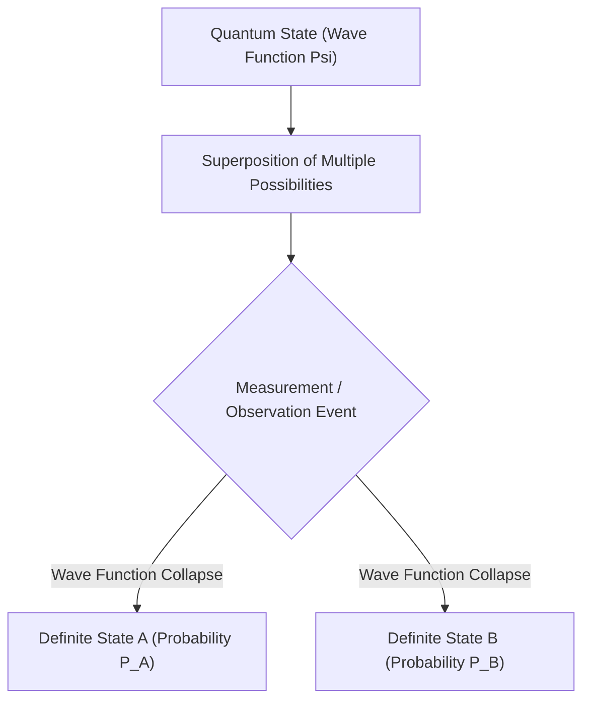

# Physics: Foundations of Quantum Mechanics - Schrödinger's Cat and the Double-Slit Experiment

## 1. Introduction: The Bizarre Microscopic Realm That Defies Intuition

Most phenomena we experience in daily life can be explained with extraordinary precision by classical physics, notably Newtonian mechanics. The parabolic trajectory of a tossed ball, the elliptical orbits of planets around the Sun, and the collision of billiard balls are deterministic: if one knows the initial conditions, every future state can in principle be predicted with absolute certainty.

However, at the beginning of the 20th century, as physicists probed deeper into the microscopic realm of atoms, electrons, and photons, classical mechanics broke down completely. Is light a continuous wave or a discrete stream of particles? Where does an electron actually reside before it is detected? In response to these foundational crises, theoretical physics forged **Quantum Mechanics**.

Quantum mechanics stands as one of the most rigorously tested and triumphant scientific theories in human history. It underpins the semiconductor chips in our smartphones, lasers in telecommunications, MRI scanners in hospitals, and emerging quantum supercomputers. This article explores the core principles of quantum physics through two celebrated paradigms: the **Double-Slit Experiment** and the paradox of **Schrödinger's Cat**.

## 2. The True Nature of Light and Matter: Wave-Particle Duality

One of the most revolutionary concepts in physics is **Wave-Particle Duality**. Classical physics maintained an unyielding separation: matter consisted of localized "particles" carrying mass, while light was a continuous "wave" propagating through space. Quantum mechanics dismantled this barrier, revealing that every entity in the universe exhibits both wave-like and particle-like characteristics depending on how it is measured.

In 1905, Albert Einstein published his **photoelectric effect hypothesis**, proposing that light travels and exchanges energy in discrete packets called **photons** ($E = h\nu$, where $h$ is Planck's constant and $\nu$ is frequency). In 1924, French physicist Louis de Broglie took this symmetry further: if light waves behave as particles, then material particles (like electrons) must possess an associated wavelength:

$$ \lambda = \frac{h}{p} $$

Where $p = mv$ is momentum. Subsequent diffraction experiments by Davisson, Germer, and Thomson proved that electron beams diffract and interfere exactly like X-rays, validating de Broglie's matter waves.

## 3. The Core of Quantum Mystery: The Double-Slit Experiment

The double-slit experiment demonstrates wave-particle duality in its most startling, counterintuitive form. Physicist [Richard Feynman](/p/biography-richard-feynman/) famously declared that the double-slit experiment contains "the only mystery of quantum mechanics."

### The Experimental Setup
1. An electron gun shoots electrons toward a barrier.
2. The barrier contains two narrow, closely spaced vertical slits (Slit A and Slit B).
3. Behind the barrier sits a phosphor detection screen that registers the impact of each arriving electron as a localized flash of light.

### If Electrons Were Purely Classical Particles
If electrons were miniature billiard balls, each would pass through either Slit A or Slit B. The screen would record two distinct vertical bands directly behind the two slits.

### If Electrons Were Purely Classical Waves
If continuous water waves passed through two slits, two semicircular wavefronts would emerge from the slits, spreading out and overlapping. Where wave crest meets crest, constructive interference produces a bright fringe; where crest meets trough, destructive interference cancels out the wave. The screen would display an **interference pattern** with multiple alternating bright and dark fringes.

### The Staggering Experimental Reality
When physicists fired electrons through the slits **one at a time**, so that only a single electron existed in the apparatus at any moment, each electron landed on the screen as a discrete, localized point of impact (particle behavior).

Yet, as thousands of individual electrons accumulated over time, the distribution of dots formed an unmistakable **interference pattern**. Even though electrons were fired in complete isolation, each electron behaved as a wave that passed through **both slits simultaneously**, interfered with itself, and landed according to the resulting probability distribution.

### The Act of Observation Changes Reality
Perplexed by this self-interference, researchers placed a detector near the slits to observe which slit each electron actually traversed.

The moment the detector recorded whether an electron passed through Slit A or Slit B, the **interference pattern vanished completely**. The electrons reverted to behaving like classical particles, forming two simple bands on the screen. The mere act of measurement fundamentally altered the quantum state. This profound puzzle is known as the **Measurement Problem**.

## 4. Quantum Superposition and the Probabilistic Interpretation

The capacity of a quantum particle to traverse multiple paths simultaneously is known as **Quantum Superposition**.

In quantum mechanics, an unobserved particle does not exist at a single definite coordinate in space; rather, it exists as a linear superposition of all possible states, mathematically described by a complex **Wave Function ($\Psi$)**. In 1926, Max Born proposed the **Born Rule (Copenhagen Interpretation)**: the absolute square of the wave function's amplitude represents the **probability density** of finding the particle at a given location upon measurement:

$$ P(\mathbf{r}) = |\Psi(\mathbf{r}, t)|^2 $$

Prior to measurement, the electron exists as a superposition:

$$ |\psi\rangle = \frac{1}{\sqrt{2}} |\text{Slit A}\rangle + \frac{1}{\sqrt{2}} |\text{Slit B}\rangle $$

The instant a measurement is performed, the wave function experiences **wave function collapse**, instantly reducing the continuous spectrum of probabilities to a single eigenvalue. Einstein famously rejected this probabilistic universe, asserting: *"God does not play dice with the universe."* Yet experimental evidence has repeatedly confirmed that quantum nature is fundamentally probabilistic.

## 5. The Schrödinger Equation: Governing the Quantum World

To describe how a quantum wave function evolves deterministically over time, Austrian physicist Erwin Schrödinger formulated the central dynamical equation of quantum mechanics in 1926:

$$ i\hbar \frac{\partial}{\partial t} \Psi(\mathbf{r},t) = \hat{H} \Psi(\mathbf{r},t) $$

Where:
- $i$ is the imaginary unit ($\sqrt{-1}$),
- $\hbar = \frac{h}{2\pi}$ is the reduced Planck constant,
- $\Psi(\mathbf{r},t)$ is the time-dependent wave function,
- $\hat{H}$ is the Hamiltonian operator representing the total energy (kinetic + potential) of the system.

Analogous to Newton's second law ($F = ma$) in classical mechanics or Maxwell's equations in electrodynamics, solving the Schrödinger equation yields the discrete quantum energy levels and atomic orbital geometries of atoms and molecules, laying the theoretical foundation for all modern chemistry, solid-state physics, and materials science.

## 6. The Ultimate Paradox: "Schrödinger's Cat"

While the Copenhagen interpretation worked flawlessly for subatomic particles, Erwin Schrödinger remained deeply troubled by the concept of wave function collapse triggered by observation. If microscopic particles can exist in superpositions, what prevents macroscopic objects from doing the same?

In 1935, Schrödinger proposed his legendary thought experiment: **Schrödinger's Cat**.

### The Thought Experiment
1. A living cat is placed inside a sealed, opaque steel chamber.
2. Inside the chamber is a radioactive atom, a Geiger counter, a relay-driven hammer, and a sealed glass vial of lethal hydrocyanic gas.
3. Within one hour, the radioactive atom has exactly a 50% quantum probability of decaying, and a 50% probability of remaining intact.
4. If the atom decays, the Geiger counter detects radiation, triggers the hammer, shatters the vial, and kills the cat.
5. If the atom does not decay, no poison is released, and the cat lives.

### The Cat's State Before Opening the Box
The radioactive decay is a quantum event. According to the strict Copenhagen interpretation, until an external observer opens the box and inspects the inside, the atom exists in a simultaneous superposition:

$$ |\psi_{\text{atom}}\rangle = \frac{1}{\sqrt{2}} |\text{Decayed}\rangle + \frac{1}{\sqrt{2}} |\text{Undecayed}\rangle $$

Because the fate of the cat is mechanically entangled with the quantum state of the atom, the entire macroscopic system enters a superposition:

$$ |\Psi_{\text{system}}\rangle = \frac{1}{\sqrt{2}} |\text{Dead Cat}\rangle + \frac{1}{\sqrt{2}} |\text{Living Cat}\rangle $$

The cat is neither purely dead nor purely alive; it is suspended in a **simultaneous superposition of living and dead states**. Only when a conscious observer lifts the lid does the wave function collapse into one of the two classical realities.

### Meaning and Interpretations
Schrödinger designed this thought experiment not to suggest that zombie cats exist, but to demonstrate the absurdity of applying microscopic Copenhagen rules directly to macroscopic systems. Where does the quantum realm end and the classical realm begin? What defines an "observation"?

Modern physics addresses this via **Quantum Decoherence**: interactions between a quantum system and the countless thermal particles of its macroscopic environment cause the fragile phase relationships of superposition to leak into the environment almost instantaneously ($10^{-20}\text{ s}$), giving the macroscopic appearance of classical certainty.

Alternatively, Hugh Everett III proposed the **Many-Worlds Interpretation (MWI)** in 1957. In MWI, the wave function never collapses; instead, the entire universe branches at every measurement event into parallel realities: one where the cat lives, and another where the cat dies.

## 7. Quantum Entanglement: Einstein's "Spooky Action at a Distance"

Another astonishing feature of quantum mechanics is **Quantum Entanglement**. When two particles are generated in an entangled state, their quantum states become inextricably linked, regardless of distance:

$$ |\Phi^+\rangle = \frac{1}{\sqrt{2}} \left( |\uparrow\uparrow\rangle + |\downarrow\downarrow\rangle \right) $$

If two entangled photons are separated by light-years, measuring the spin of Photon A instantly determines the spin of Photon B with zero time delay.

Einstein fiercely objected to this non-local behavior, calling it *"spooky action at a distance"* (spukhafte Fernwirkung) and arguing that quantum mechanics was incomplete—hidden local variables must exist. However, in 1964, John Stewart Bell proved that no local hidden-variable theory could reproduce the statistical predictions of quantum mechanics (**Bell's Theorem**). Groundbreaking experiments by Alain Aspect, John Clauser, and Anton Zeilinger (awarded the 2022 Nobel Prize in Physics) conclusively proved that nature is fundamentally **non-local**.

## 8. Real-World Applications and the Second Quantum Revolution

Once viewed as metaphysical debates, the bizarre principles of quantum mechanics now power the **Second Quantum Revolution**:

- **Quantum Computing**: Utilizing quantum bits (**qubits**) that exploit superposition and entanglement to evaluate complex multidimensional state spaces simultaneously, unlocking exponential speedups for cryptographic factoring (Shor's algorithm), molecular simulation, and optimization.
- **Quantum Key Distribution (QKD)**: Quantum cryptography (such as the BB84 protocol) exploits the no-cloning theorem and measurement disturbance. Any eavesdropper intercepting the communication inevitably collapses the quantum state, instantly alerting the communicating parties.
- **Quantum Sensors**: Harnessing entangled states and NV-centers in diamond to measure magnetic fields, gravity gradients, and time with atomic precision, enabling GPS-free submarine navigation and non-invasive brain imaging.

## 9. Conclusion: An Invitation into the Quantum Realm

Quantum mechanics dismantles our classical intuition. Particles occupy multiple states simultaneously, the act of measurement actively shapes physical reality, and distant particles remain connected across cosmic distances.

As [Richard Feynman](/p/biography-richard-feynman/) famously remarked: *"I think I can safely say that nobody understands quantum mechanics."* Yet, by formalizing its mathematical equations and verifying them through rigorous experimentation, humanity has unlocked the deepest mechanisms of nature. When we ponder the mystery of the double-slit experiment and the fate of Schrödinger's cat, we gaze into the ultimate fabric of reality.
