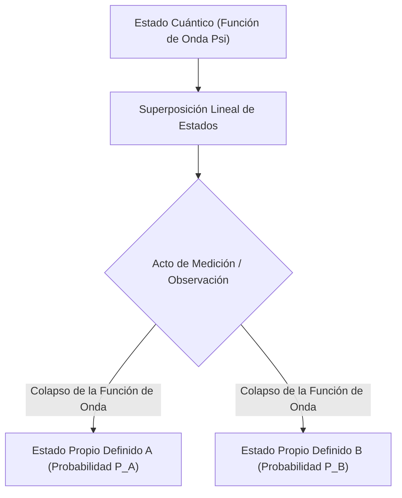

# Física: Fundamentos de la Mecánica Cuántica - El Gato de Schrödinger y el Experimento de la Doble Rendija

## 1. Introducción: El Extraño Mundo Microscópico que Desafía la Intuición

La inmensa mayoría de los fenómenos físicos que presenciamos en nuestra vida cotidiana pueden explicarse con asombrosa precisión mediante la física clásica, encabezada por la mecánica newtoniana. La trayectoria parabólica de una pelota, la órbita elíptica de los planetas alrededor del Sol o la colisión elástica en una mesa de billar son procesos estrictamente deterministas: si se conocen las condiciones iniciales, el estado futuro puede predecirse en teoría con absoluta exactitud.

Sin embargo, a principios del siglo XX, cuando los físicos comenzaron a escudriñar la escala microscópica de los átomos, electrones y fotones, el edificio clásico se desmoronó. ¿Es la luz una onda continua o un flujo discreto de partículas? ¿Dónde se encuentra un electrón antes de ser medido? Para dar respuesta a estos enigmas fundamentales, la física concibió la **Mecánica Cuántica (Quantum Mechanics)**.

La mecánica cuántica es una de las teorías más rigurosamente comprobadas de la ciencia. Sobre sus postulados descansan los microprocesadores de los teléfonos móviles, los láseres de fibra óptica, los equipos de resonancia magnética (MRI) y los incipientes ordenadores cuánticos. En este artículo exploraremos sus principios esenciales a través de dos hitos legendarios: el **Experimento de la Doble Rendija** y la paradoja del **Gato de Schrödinger**.

## 2. La Verdadera Naturaleza de la Materia: La Dualidad Onda-Partícula

Uno de los conceptos más revolucionarios de la física es la **Dualidad Onda-Partícula (Wave-particle duality)**. La física clásica trazaba una frontera rígida: la materia estaba formada por "partículas" con masa localizada, mientras que la luz y el sonido eran "ondas continuas" que se propagaban por el espacio. La mecánica cuántica abolió esta distinción, revelando que cualquier entidad del cosmos manifiesta propiedades ondulatorias o corpusculares en función del modo en que se observe.

En 1905, Albert Einstein introdujo la **Hipótesis del Cuanto de Luz**, demostrando que la luz se propaga en paquetes discretos de energía llamados **fotones** ($E = h\nu$), lo que explicó magistralmente el efecto fotoeléctrico. En 1924, Louis de Broglie generalizó esta simetría: si las ondas electromagnéticas actúan como partículas, los corpúsculos materiales (como los electrones) deben poseer una longitud de onda asociada:

$$ \lambda = \frac{h}{p} $$

Donde $p = mv$ es el momento lineal. Los posteriores experimentos de difracción de electrones de Davisson y Germer confirmaron que los haces de electrones se difractan e interfieren como los rayos X, consolidando la realidad de las ondas de materia.

## 3. El Corazón del Misterio Cuántico: El Experimento de la Doble Rendija

El experimento de la doble rendija expone la dualidad onda-partícula en su vertiente más desconcertante. El célebre físico [Richard Feynman](/p/biography-richard-feynman/) afirmó que este experimento encierra «el único misterio profundo de la mecánica cuántica».

### El Montaje Experimental
1. Un cañón de electrones dispara partículas hacia una barrera opaca.
2. La barrera contiene dos rendijas paralelas muy estrechas (Rendija A y Rendija B).
3. Detrás de la barrera se ubica una pantalla detectora fosforescente que registra el impacto individual de cada electrón como un punto luminoso.

### Si los electrones fueran partículas clásicas
Si los electrones fuesen diminutas bolas de billar, cada uno atravesaría forzosamente la Rendija A o la Rendija B. Con el tiempo, la pantalla mostraría únicamente dos franjas verticales concentradas detrás de las dos rendijas.

### Si los electrones fueran ondas clásicas
Si fuesen ondas continuas como las del agua, al cruzar las rendijas emergerían dos frentes de onda semicirculares que interferirían entre sí: las crestas coincidentes se amplificarían y los valles cancelarían las crestas, dibujando en la pantalla un patrón de múltiples franjas de interferencia claras y oscuras.

### El Desconcertante Resultado Real
Cuando los físicos redujeron la cadencia del cañón para disparar los electrones **uno a uno**, asegurando que solo hubiese una única partícula en el aparato en cada instante, cada electrón impactó en la pantalla como un punto discreto e indivisible (comportamiento corpuscular).

Sin embargo, a medida que miles de electrones aislados fueron acumulándose, la distribución espacial de todos los impactos reveló un impecable **patrón de interferencia**. Aunque viajaron en estricta soledad, cada electrón se comportó como una onda de probabilidad que **atravesó ambas rendijas al mismo tiempo**, interfirió consigo mismo y se materializó en la pantalla conforme a esa distribución ondulatoria.

### El Acto de Medición Altera la Realidad
Intrigados por esta autointerferencia, los científicos instalaron un detector microscópico junto a las rendijas para observar por cuál de ellas pasaba realmente cada electrón.

En cuanto el detector se activó e identificó la trayectoria, el **patrón de interferencia desapareció al instante**, transformándose en dos simples franjas clásicas. El mero hecho de «observar o medir» eliminó la coherencia cuántica y forzó al electrón a actuar como una partícula clásica. Este fenómeno se conoce como el **Problema de la Medida (Measurement Problem)**.

## 4. Superposición de Estados e Interpretación Probabilística

La capacidad de una partícula cuántica de transitar por múltiples caminos simultáneos se denomina **Superposición Cuántica (Superposition)**.

En la física cuántica, una partícula no posee una posición espacial definida antes de interactuar; existe como una superposición lineal de estados posibles descrita mediante la **Función de Onda ($\Psi$)**. En 1926, Max Born formuló la **Interpretación Probabilística (Escuela de Copenhague)**: el cuadrado del módulo de la función de onda representa la **densidad de probabilidad** de hallar a la partícula en un punto dado al realizar una medición:

$$ P(\mathbf{r}) = |\Psi(\mathbf{r}, t)|^2 $$

Antes de la medición, el electrón existe en una superposición coherente:

$$ |\psi\rangle = \frac{1}{\sqrt{2}} |\text{Rendija A}\rangle + \frac{1}{\sqrt{2}} |\text{Rendija B}\rangle $$

En el instante exacto en que se realiza la medición, se produce el **Colapso de la Función de Onda (Wave function collapse)**, y el abanico continuo de probabilidades se reduce instantáneamente a un único valor propio real. Einstein rechazó esta naturaleza intrínsecamente probabilística con su célebre frase: *«Dios no juega a los dados con el universo»*. Sin embargo, un siglo de experimentos ha ratificado que la probabilidad cuántica es la ley suprema del microcosmos.

## 5. La Ecuación de Schrödinger: El Pilar Dinámico del Mundo Cuántico

Para describir cómo evoluciona en el tiempo la función de onda de un sistema cuántico, el físico austriaco Erwin Schrödinger formuló en 1926 la ecuación fundamental de la mecánica cuántica:

$$ i\hbar \frac{\partial}{\partial t} \Psi(\mathbf{r},t) = \hat{H} \Psi(\mathbf{r},t) $$

Donde:
- $i$ es la unidad imaginaria,
- $\hbar = \frac{h}{2\pi}$ es la constante reducida de Planck,
- $\Psi(\mathbf{r},t)$ es la función de onda dependiente del tiempo,
- $\hat{H}$ es el operador Hamiltoniano (que representa la energía total del sistema).

Equivalente a la segunda ley de Newton en la mecánica clásica o a las ecuaciones de Maxwell en el electromagnetismo, la ecuación de Schrödinger permite calcular con exactitud los orbitales electrónicos de los átomos, los niveles de energía discretos y la estructura de los enlaces químicos. Prácticamente toda la química cuántica y la física del estado sólido modernas derivan de esta ecuación.

## 6. La Cúspide de las Paradojas: "El Gato de Schrödinger"

Aunque la interpretación de Copenhague describía con precisión impecable los experimentos subatómicos, al propio Schrödinger le inquietaba la noción de un colapso inducido por la observación. ¿Qué sucedería si esa superposición microscópica se acoplara directamente al mundo macroscópico cotidiano?

Para poner en evidencia lo que consideraba una laguna conceptual, concibió en 1935 su célebre experimento mental: **El Gato de Schrödinger**.

### El Escenario del Experimento
1. Un gato vivo es encerrado en una cámara de acero opaca y blindada.
2. Junto al gato se coloca un dispositivo que contiene un átomo radiactivo, un contador Geiger, un martillo accionado por relé y un frasco con cianuro volátil.
3. A lo largo de una hora, el átomo radiactivo tiene exactamente un 50% de probabilidad cuántica de desintegrarse y un 50% de no desintegrarse.
4. Si se desintegra, el contador Geiger lo detecta, libera el martillo, rompe el frasco y el veneno causa la muerte del gato.
5. Si no se desintegra, el mecanismo no se activa y el felino permanece con vida.

### ¿Cuál es el estado del gato antes de abrir la caja?
La desintegración del núcleo es un fenómeno cuántico. Según la ortodoxia de Copenhague, mientras la caja permanezca cerrada y no sea observada, el átomo se encuentra en una superposición de «desintegrado» y «no desintegrado».

Dado que la vida del gato está mecánicamente entrelazada con el estado del átomo, la deducción lógica resulta sobrecogedora: antes de abrir la caja, **el gato se encuentra en una superposición simultánea de estar vivo y muerto a la vez**:

$$ |\Psi_{\text{sistema}}\rangle = \frac{1}{\sqrt{2}} |\text{Gato Vivo}\rangle + \frac{1}{\sqrt{2}} |\text{Gato Muerto}\rangle $$

Solo en el instante en que un observador exterior abre la compuerta y mira en su interior, la función de onda colapsa en una de las dos realidades macroscópicas clásicas.

### Significado, Decoherencia y Mundos Paralelos
Schrödinger diseñó esta paradoja para ilustrar lo absurdo de extrapolar las reglas microscópicas a entidades macroscópicas sin una frontera clara.

La física moderna resuelve este dilema mediante la **Decoherencia Cuántica (Quantum Decoherence)**: los sistemas macroscópicos como un gato o un contador Geiger están formados por billones de partículas en colisión constante con el entorno térmico. En apenas $10^{-20}$ segundos, las fases cuánticas de la superposición se disipan en el entorno circundante, haciendo que el sistema aparente un comportamiento determinista clásico mucho antes de que un ser humano mire dentro.

Otra explicación influyente es la **Interpretación de los Muchos Mundos (Many-worlds interpretation)** formulada por Hugh Everett en 1957: la función de onda nunca colapsa; al abrir la caja, el universo entero se bifurca en dos realidades paralelas, una en la que el gato sobrevive y otra en la que perece.

## 7. Entrelazamiento Cuántico: La "Acción Fantasmagórica a Distancia"

Otro fenómeno extraordinario de la física cuántica es el **Entrelazamiento Cuántico (Quantum entanglement)**. Cuando dos partículas se generan en un estado entrelazado, forman un sistema inseparable:

$$ |\Phi^+\rangle = \frac{1}{\sqrt{2}} \left( |\uparrow\uparrow\rangle + |\downarrow\downarrow\rangle \right) $$

Aunque estas partículas sean trasladadas a extremos opuestos del universo observable, medir el espín de una de ellas fija de forma instantánea (**sin retraso temporal**) el estado cuántico de la otra.

Einstein desconfió profundamente de esta aparente transmisión superlumínica de información y la tildó con desdén de *"acción fantasmagórica a distancia"*, argumentando que la mecánica cuántica era incompleta y requería variables ocultas locales. Sin embargo, en 1964 John Bell formuló su teorema, y experimentos pioneros (galardonados con el Premio Nobel de Física en 2022) demostraron que no existen tales variables ocultas: la naturaleza es intrínsecamente **no local**.

## 8. La Segunda Revolución Cuántica y Tecnologías del Futuro

Las propiedades contraintuitivas de la mecánica cuántica impulsan hoy la denominada **Segunda Revolución Cuántica**:

- **Computación Cuántica (Quantum Computing)**: Los bits cuánticos (**qubits**) aprovechan la superposición y el entrelazamiento para procesar simultáneamente espacios de estados exponenciales, logrando ventajas masivas en algoritmos criptográficos (Shor), diseño molecular de fármacos y optimización logística.
- **Distribución de Claves Cuánticas (QKD)**: La criptografía cuántica utiliza el teorema de no clonación para garantizar una seguridad inviolable: cualquier intento de interceptar la clave altera irreversiblemente el estado cuántico, alertando a los comunicantes.
- **Sensores Cuánticos**: Centros de vacante de nitrógeno (NV) en diamante y trampas de iones miden campos gravitatorios y magnéticos con precisión atómica, habilitando la navegación de submarinos sin GPS y el mapeo cerebral no invasivo.

## 9. Conclusión: Invitación al Abismo Cuántico

La mecánica cuántica desafía las convicciones más arraigadas del sentido común humano. En palabras del célebre [Richard Feynman](/p/biography-richard-feynman/): *«Creo que puedo decir con seguridad que nadie entiende la mecánica cuántica»*. 

Sin embargo, al formular sus leyes matemáticas y contrastarlas experimentalmente, la humanidad ha descubierto las reglas más profundas que gobiernan el tejido del cosmos. En el enigma de la doble rendija y en la incertidumbre del gato de Schrödinger se revelan los secretos más asombrosos de nuestra existencia.
