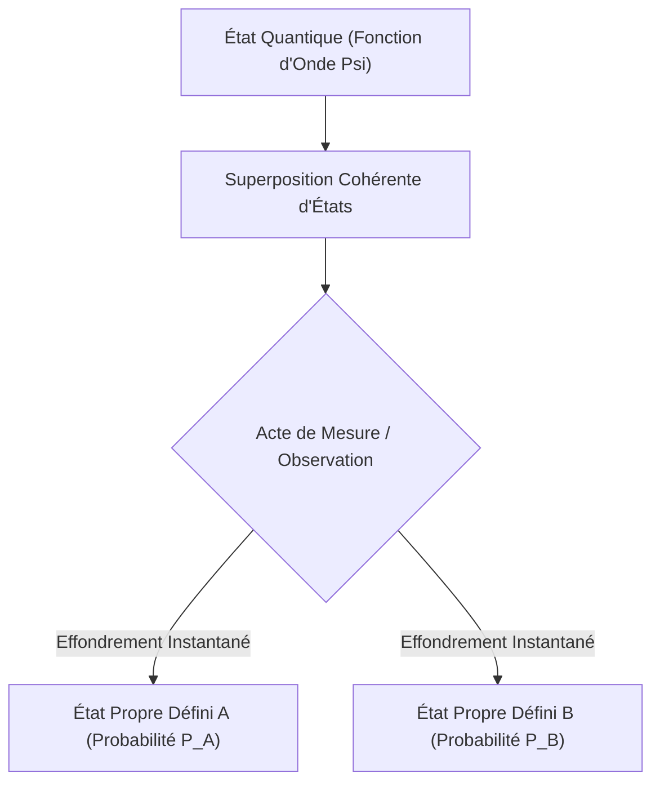

# Physique : Fondements de la Mécanique Quantique - Le Chat de Schrödinger et les Fentes d'Young

## 1. Introduction : L'Étrange Monde Microscopique qui Défie l'Intuition

La grande majorité des phénomènes observables à notre échelle macroscopique s'expliquent avec une exactitude remarquable par la physique classique, et tout particulièrement par la mécanique newtonienne. La trajectoire parabolique d'un projectile, la ronde immuable des planètes autour du Soleil ou le choc élastique de deux billes de billard sont des processus rigoureusement déterministes : pour peu que l'on connaisse les conditions initiales, l'état futur peut en théorie être prédit avec une certitude absolue.

Pourtant, au tournant du XXe siècle, dès lors que les physiciens entreprirent d'explorer l'infiniment petit des atomes, des électrons et des photons, l'édifice classique vola en éclats. La lumière est-elle une onde continue ou un flux de grains discrets ? Où se situe précisément un électron avant qu'un instrument ne le détecte ? Pour répondre à ces questions fondamentales, la physique a enfanté la **Mécanique Quantique (Quantum Mechanics)**.

La mécanique quantique s'affirme aujourd'hui comme la théorie scientifique la plus rigoureusement vérifiée et la plus féconde de l'histoire. Elle constitue le socle des puces électroniques de nos smartphones, des lasers à fibre optique, de l'imagerie par résonance magnétique (IRM) et des futurs ordinateurs quantiques. Cet article examine les principes fondateurs de ce monde microscopique à travers deux piliers légendaires : **l'Expérience des Fentes d'Young (Double-slit experiment)** et le paradoxe du **Chat de Schrödinger**.

## 2. La Véritable Nature de la Matière : La Dualité Onde-Corpuscule

L'un des concepts les plus novateurs de la physique contemporaine est la **Dualité Onde-Corpuscule (Wave-particle duality)**. La physique classique imposait une séparation hermétique : la matière était constituée de « corpuscules » matériels localisés, tandis que la lumière et le son étaient des « ondes » continues se propageant dans l'espace. La mécanique quantique a aboli cette dichotomie, démontrant que toute entité physique manifeste simultanément des propriétés d'onde et de particule selon le protocole de mesure employé.

En 1905, Albert Einstein introduisit **l'hypothèse des quanta de lumière**, avançant que la lumière transporte son énergie sous forme de paquets discrets baptisés **photons** ($E = h\nu$, où $h$ est la constante de Planck et $\nu$ la fréquence de l'onde), expliquant de manière éclatante l'effet photoélectrique. En 1924, le physicien français Louis de Broglie franchit une étape supplémentaire : si la lumière possède des propriétés corpusculaires, alors les particules de matière (comme les électrons) doivent réciproquement posséder une longueur d'onde associée :

$$ \lambda = \frac{h}{p} $$

Où $p = mv$ représente la quantité de mouvement. Les expériences de diffraction électronique menées ultérieurement par Davisson et Germer confirmèrent que les faisceaux d'électrons interfèrent exactement comme des rayons X, établissant définitivement la réalité des ondes de matière.

## 3. Le Cœur du Mystère Quantique : L'Expérience des Fentes d'Young

L'expérience des doubles fentes (fentes d'Young) illustre la dualité onde-corpuscule dans toute sa troublante étrangeté. Le prix Nobel de physique [Richard Feynman](/p/biography-richard-feynman/) déclara que cette expérience recèle à elle seule « le seul et unique mystère de la mécanique quantique ».

### Le Dispositif Expérimental
1. Un canon à électrons émet des particules vers une paroi protectrice.
2. La paroi est percée de deux fentes parallèles extrêmement étroites (Fente A et Fente B).
3. Derrière la paroi se trouve un écran détecteur scintillant qui enregistre chaque impact individuel sous la forme d'un point lumineux.

### Si les électrons étaient des particules classiques
Si les électrons étaient assimilables à des micro-billes d'acier, chacun franchirait nécessairement soit la fente A, soit la fente B. L'écran ne ferait apparaître au fil du temps que deux bandes verticales distinctes, alignées avec les fentes.

### Si les électrons étaient des ondes classiques
Si des vagues d'eau traversaient ces fentes, deux fronts d'onde circulaires émergeraient et se superposeraient : là où les crêtes coïncident, l'onde s'amplifie ; là où crêtes et creux se rencontrent, ils s'annulent. L'écran afficherait alors une alternance de franges brillantes et sombres : une **figure d'interférence**.

### Le Résultat Sidérant des Expériences
Lorsque les physiciens règlent le canon pour expédier les électrons **un par un**, s'assurant qu'une seule particule traverse l'appareil à la fois, chaque électron marque l'écran d'un impact ponctuel, net et indivisible (comportement d'un corpuscule).

Pourtant, après l'accumulation de milliers d'impacts individuels, la répartition globale des points forme indiscutablement une **figure d'interférence** !
Ce résultat prouve qu'un électron isolé voyage sous forme d'onde de probabilité, **traverse simultanément les deux fentes à la fois**, interfère avec lui-même et atterrit selon la distribution spatiale dictée par cette interférence.

### L'Acte de Mesure Bouleverse la Réalité
Déconcertés, les chercheurs placèrent un détecteur à proximité immédiate des fentes pour observer quelle trajectoire l'électron emprunte effectivement.

Dès l'instant où le dispositif enregistra par quelle fente chaque particule passait, la **figure d'interférence s'évanouit instantanément** pour laisser place à deux bandes classiques !
La particule quantique semble réagir au fait d'être observée. L'acte même de la mesure détruit la cohérence de l'onde de probabilité et force l'électron à se figer dans un état corpusculaire classique. Ce phénomène constitue le célèbre **Problème de la Mesure (Measurement Problem)**.

## 4. Superposition d'États et Interprétation Probabiliste

La faculté d'une particule quantique d'emprunter plusieurs chemins à la fois se nomme la **Superposition Quantique (Superposition)**.

Dans le monde quantique, une particule non perturbée ne réside pas en un point défini de l'espace ; elle existe sous forme d'une superposition linéaire de tous les états possibles, modélisée mathématiquement par une **Fonction d'Onde ($\Psi$)**. En 1926, Max Born formula la règle de l'**Interprétation Probabiliste (École de Copenhague)** : le carré de la valeur absolue de l'amplitude de la fonction d'onde représente la **densité de probabilité** de trouver la particule en un point donné lors d'une mesure :

$$ P(\mathbf{r}) = |\Psi(\mathbf{r}, t)|^2 $$

Avant la mesure, l'électron est décrit par une superposition cohérente :

$$ |\psi\rangle = \frac{1}{\sqrt{2}} |\text{Fente A}\rangle + \frac{1}{\sqrt{2}} |\text{Fente B}\rangle $$

Lors de l'intervention de l'appareil de mesure, la fonction d'onde subit un **Effondrement de la Fonction d'Onde (Wave function collapse)**, et l'infinité des probabilités s'évanouit instantanément au profit d'un état propre unique. Rétif à cette vision fondamentalement probabiliste, Albert Einstein proclama : *« Dieu ne joue pas aux dés avec l'univers ! »*. Néanmoins, un siècle d'expérimentations irréfutables a confirmé la nature intrinsèquement probabiliste du monde quantique.

## 5. L'Équation de Schrödinger : Loi Suprême de la Dynamique Quantique

Pour expliciter comment la fonction d'onde d'un système évolue de façon continue et déterministe dans le temps, le physicien autrichien Erwin Schrödinger établit en 1926 l'équation maîtresse de la mécanique quantique :

$$ i\hbar \frac{\partial}{\partial t} \Psi(\mathbf{r},t) = \hat{H} \Psi(\mathbf{r},t) $$

Où :
- $i$ est l'unité imaginaire,
- $\hbar = \frac{h}{2\pi}$ est la constante de Planck réduite,
- $\Psi(\mathbf{r},t)$ est la fonction d'onde spatiotemporelle,
- $\hat{H}$ est l'opérateur hamiltonien représentant l'énergie totale (cinétique et potentielle) du système.

Véritable pendant quantique du principe fondamental de la dynamique de Newton ($F = ma$) ou des équations de Maxwell, l'équation de Schrödinger permet de calculer avec une précision prodigieuse les orbitales électroniques, les niveaux d'énergie atomiques et les liaisons moléculaires. La chimie quantique et la physique des semi-conducteurs reposent entièrement sur cette équation.

## 6. L'Acmé des Paradoxes : « Le Chat de Schrödinger »

Bien que l'interprétation de Copenhague décrive à merveille le monde subatomique, Erwin Schrödinger luimême demeurait profondément réfractaire au postulat de l'effondrement causé par l'observateur. Que se passerait-il si l'on transférait cette superposition quantique à notre univers macroscopique quotidien ?

Pour souligner les apories de cette vision, il imagina en 1935 sa célèbre expérience de pensée : **Le Chat de Schrödinger (Schrödinger's Cat)**.

### Le Protocole de l'Expérience de Pensée
1. Un chat vivant est enfermé dans un caisson d'acier scellé, opaque et hermétique.
2. À l'intérieur se trouvent un atome radioactif unique, un compteur Geiger, un marteau mû par un relais et une fiole scellée contenant du cyanure de sodium volatil.
3. Pendant un intervalle d'une heure, cet atome a exactement 50 % de chance de se désintégrer et 50 % de chance de rester intact.
4. En cas de désintégration, le compteur Geiger déclenche le marteau qui brise la fiole, libérant le gaz létal qui tue le chat.
5. S'il n'y a pas de désintégration, aucun poison n'est libéré et l'animal reste en vie.

### Quel est l'état du chat avant l'ouverture de la boîte ?
La désintégration d'un noyau radioactif est un phénomène purement quantique. Selon l'interprétation de Copenhague, tant qu'aucun observateur n'a ouvert la boîte, l'atome est dans une superposition d'états : « désintégré » et « non désintégré ».

Comme la vie du chat est corrélée à l'état de l'atome, la logique impose une conclusion vertigineuse : avant l'ouverture du caisson, **le chat se trouve dans une superposition d'états à la fois vivant et mort** :

$$ |\Psi_{\text{système}}\rangle = \frac{1}{\sqrt{2}} |\text{Chat Vivant}\rangle + \frac{1}{\sqrt{2}} |\text{Chat Mort}\rangle $$

Ce n'est qu'au moment précis où un observateur humain soulève le couvercle que la fonction d'onde s'effondre brutalement sur l'une des deux réalités macroscopiques !

### Décohérence Quantique et Mondes Parallèles
Schrödinger n'a pas proposé cette expérience pour soutenir l'existence réelle de chats zombies, mais pour mettre en lumière l'incongruité d'appliquer aveuglément les concepts microscopiques à l'échelle humaine.

La physique moderne résout en grande partie cette énigme grâce à la théorie de la **Décohérence Quantique (Quantum Decoherence)** : un objet macroscopique tel qu'un chat ou un compteur Geiger compte plus de $10^{26}$ atomes constamment heurtés par les molécules d'air et les photons thermiques. En une infime fraction de seconde ($10^{-20}\text{ s}$), les phases quantiques de la superposition se dispersent de manière irréversible dans l'environnement, conférant au système une apparence classique bien avant que quiconque n'ouvre la boîte.

Une autre interprétation renommée est la **Théorie des Mondes Multiples (Many-worlds interpretation)** d'Hugh Everett (1957) : la fonction d'onde ne s'effondre jamais ; lors de la mesure, l'univers tout entier se scinde en deux branches parallèles autonomes : l'une où le chat est vivant, l'autre où il est mort.

## 7. L'Intrication Quantique : « L'Action Fantomatique à Distance »

Autre merveille du panthéon quantique, **l'Intrication Quantique (Quantum entanglement)** décrit une liaison indissoluble entre deux particules :

$$ |\Phi^+\rangle = \frac{1}{\sqrt{2}} \left( |\uparrow\uparrow\rangle + |\downarrow\downarrow\rangle \right) $$

Même si ces particules sont séparées par des années-lumière, mesurer l'état de la première fixe instantanément (avec un décalage temporel nul) l'état quantique de la seconde.

Einstein rejeta vigoureusement cette conséquence, la qualifiant avec ironie d'*« action fantomatique à distance »* (spukhafte Fernwirkung), persuadé qu'il existait des variables cachées locales. Or, en 1964, John Stewart Bell formula ses fameuses inégalités. Les expériences pionnières d'Alain Aspect, John Clauser et Anton Zeilinger (prix Nobel de physique 2022) prouvèrent que ces inégalités sont violées : la nature est fondamentalement **non locale**.

## 8. La Seconde Révolution Quantique et ses Applications

Ce qui ne semblait jadis être qu'une querelle philosophique donne aujourd'hui naissance à la **Seconde Révolution Quantique** :

- **Informatique Quantique (Quantum Computing)** : En exploitant les bits quantiques (**qubits**), la superposition et l'intrication permettent d'explorer des espaces de calcul gigantesques en parallèle, offrant des accélérations foudroyantes pour la factorisation (algorithme de Shor), la simulation moléculaire et l'optimisation logistique.
- **Cryptographie Quantique (QKD)** : Fondée sur le théorème de non-clonage quantique, toute tentative d'interception d'une clé secrète perturbe immédiatement les photons transmis, rendant la communication inviolable selon les lois mêmes de la physique.
- **Capteurs Quantiques** : Utilisant des centres NV dans le diamant et des interféromètres atomiques pour mesurer les champs magnétiques et gravitationnels avec une précision extrême, ouvrant la voie à la navigation sous-marine sans GPS et à l'imagerie cérébrale de haute résolution.

## 9. Conclusion : Plongée dans le Mystère Fondamental

La mécanique quantique bouleverse nos certitudes les plus intimes : des particules occupent plusieurs états à la fois, l'observation forge le réel physique, et des entités distantes demeurent unies par-delà le cosmos. 

Comme l'énonça avec lucidité [Richard Feynman](/p/biography-richard-feynman/) : *« Je crois pouvoir affirmer sans trop me tromper que personne ne comprend la mécanique quantique. »* C'est précisément dans cette incompréhension fertile que l'humanité puise ses plus grandes découvertes contemporaines.
