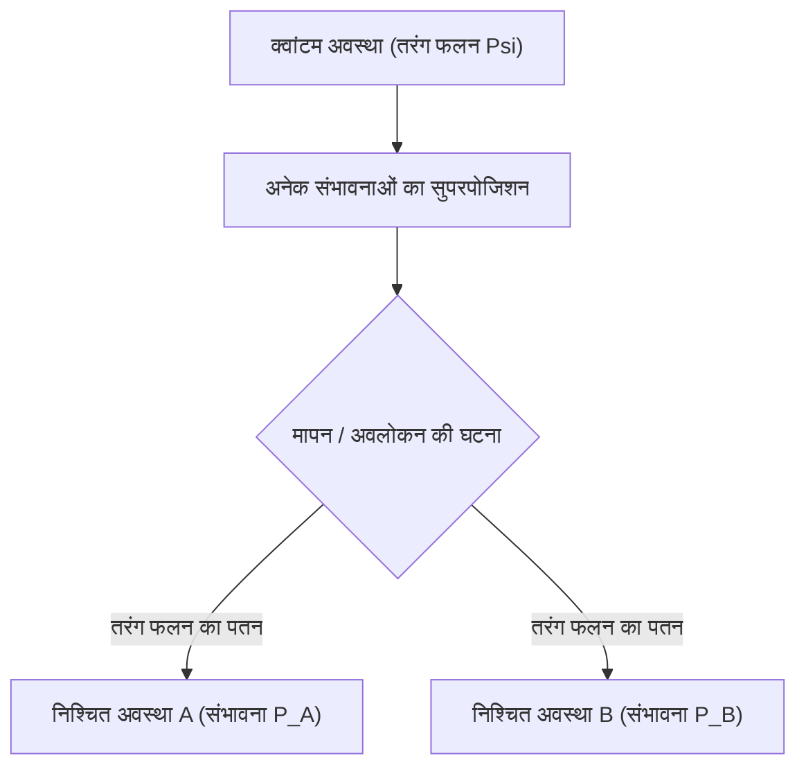

# भौतिकी: क्वांटम यांत्रिकी के मूल सिद्धांत - श्रोडिंगर की बिल्ली और डबल-स्लिट प्रयोग

## 1. प्रस्तावना: सामान्य समझ को चुनौती देने वाला सूक्ष्म जगत

हमारे दैनिक जीवन में होने वाली अधिकांश भौतिक घटनाओं को न्यूटन के नियमों वाली 'शास्त्रीय भौतिकी' द्वारा अत्यधिक सटीकता के साथ समझाया जा सकता है। फेंकी गई गेंद का परवलयाकार मार्ग, सूर्य के चारों ओर ग्रहों की अण्डाकार कक्षाएं, या बिलियर्ड्स की गेंदों की टक्कर पूरी तरह से नियतिवादी (Deterministic) होती हैं: यदि प्रारंभिक स्थितियां ज्ञात हों, तो भविष्य की स्थिति की पूर्ण निश्चितता के साथ भविष्यवाणी की जा सकती है।

परंतु 20वीं सदी की शुरुआत में, जब वैज्ञानिकों ने परमाणुओं, इलेक्ट्रॉनों और प्रकाश कणों के अत्यंत सूक्ष्म संसार में कदम रखा, तो शास्त्रीय भौतिकी के सभी नियम ढह गए। क्या प्रकाश एक निरंतर तरंग है या अलग-अलग कणों का प्रवाह? कोई इलेक्ट्रॉन मापे जाने से पहले वास्तव में कहाँ स्थित होता है? इन मूलभूत प्रश्नों के समाधान के रूप में **क्वांटम यांत्रिकी (Quantum Mechanics)** का जन्म हुआ।

क्वांटम यांत्रिकी आधुनिक विज्ञान के इतिहास में सबसे कठोरता से जांची गई और व्यावहारिक रूप से सबसे सफल सिद्धांतों में से एक है। स्मार्टफोन के सेमीकंडक्टर ट्रांजिस्टर, ऑप्टिकल फाइबर के लेजर, अस्पतालों के एमआरआई स्कैनर और क्वांटम कंप्यूटर इसी सिद्धांत पर आधारित हैं। इस लेख में, हम **डबल-स्लिट प्रयोग** और **श्रोडिंगर की बिल्ली** के प्रसिद्ध उदाहरणों के माध्यम से क्वांटम भौतिकी के मूलभूत सिद्धांतों का विश्लेषण करेंगे।

## 2. पदार्थ और प्रकाश का वास्तविक स्वरूप: तरंग-कण द्वैत

क्वांटम भौतिकी की सबसे क्रांतिकारी अवधारणा **तरंग-कण द्वैत (Wave-particle duality)** है। शास्त्रीय भौतिकी में पदार्थ को द्रव्यमान वाले 'कण' और प्रकाश को अंतरिक्ष में फैलने वाली 'तरंग' के रूप में देखा जाता था। क्वांटम यांत्रिकी ने इस अंतर को मिटा दिया और सिद्ध किया कि ब्रह्मांड की सभी चीजें एक साथ तरंग और कण दोनों के गुण प्रदर्शित करती हैं।

इसकी शुरुआत 1905 में अल्बर्ट आइंस्टीन की **प्रकाश क्वांटम परिकल्पना** से हुई, जिसमें उन्होंने बताया कि प्रकाश निरंतर तरंग न होकर ऊर्जा के छोटे पैकेटों यानी **फोटॉनों** ($E = h\nu$, जहाँ $h$ प्लांक नियतांक है और $\nu$ आवृत्ति है) के रूप में यात्रा करता है। 1924 में फ्रांसीसी वैज्ञानिक लुई डी ब्रोगली ने इसे आगे बढ़ाया: यदि प्रकाश तरंग कण बन सकती है, तो इलेक्ट्रॉन जैसे कणों में भी तरंग गुण होने चाहिए:

$$ \lambda = \frac{h}{p} $$

जहाँ $p = mv$ संवेग है। बाद में डेविसन और जर्मर के विवर्तन प्रयोगों ने सिद्ध किया कि इलेक्ट्रॉन किरणें एक्स-रे की तरह ही विवर्तित और व्यतिकरित होती हैं।

## 3. क्वांटम रहस्य का केंद्र: डबल-स्लिट प्रयोग

डबल-स्लिट प्रयोग तरंग-कण द्वैत को सबसे आश्चर्यजनक रूप में प्रदर्शित करता है। नोबेल पुरस्कार विजेता [रिचर्ड फेनमैन](/p/biography-richard-feynman/) ने कहा था कि इस एक प्रयोग में "क्वांटम यांत्रिकी का एकमात्र सच्चा रहस्य समाया हुआ है।"

### प्रयोग की संरचना
1. एक इलेक्ट्रॉन गन जो एक-एक करके इलेक्ट्रॉन दाग सकती है।
2. दो समानांतर संकीर्ण झिर्रियों (स्लिट A और स्लिट B) वाला एक पर्दा।
3. पीछे एक डिटेक्टर स्क्रीन जो इलेक्ट्रॉन के टकराने पर प्रकाश बिंदु बनाती है।

### यदि इलेक्ट्रॉन केवल शास्त्रीय कण होते
यदि इलेक्ट्रॉन कंचे की तरह होते, तो प्रत्येक इलेक्ट्रॉन या तो स्लिट A से गुजरता या स्लिट B से। स्क्रीन पर दोनों स्लिटों के ठीक पीछे केवल दो सीधी रेखाएं बननी चाहिए थीं।

### यदि इलेक्ट्रॉन केवल शास्त्रीय तरंग होते
यदि पानी की तरंगें दो स्लिटों से गुजरती हैं, तो दोनों स्लिटों से नई गोलाकार तरंगें निकलती हैं और आपस में टकराती हैं। जहाँ शिखर से शिखर मिलता है वहाँ तीव्रता बढ़ती है, और जहाँ गर्त मिलता है वहाँ वे एक-दूसरे को समाप्त कर देती हैं, जिससे स्क्रीन पर एक **व्यतिकरण पैटर्न (Interference Pattern)** बनता है।

### वास्तविक प्रयोग का चौंकाने वाला परिणाम
जब वैज्ञानिकों ने इलेक्ट्रॉनों को **एक-एक करके** दागा, जिससे उपकरण में एक समय में केवल एक ही इलेक्ट्रॉन उपस्थित था, तो प्रत्येक इलेक्ट्रॉन स्क्रीन पर एक निश्चित बिंदु (कण) के रूप में टकराया।

लेकिन जब हजारों इलेक्ट्रॉनों को एक-एक करके भेजा गया, तो स्क्रीन पर बने सभी बिंदुओं ने मिलकर एक आश्चर्यजनक **व्यतिकरण पैटर्न** बना दिया!
इसका अर्थ यह है कि एक अकेला इलेक्ट्रॉन भी एक संभावना तरंग के रूप में फैलता है, **दोनों स्लिटों से एक साथ गुजरता है**, स्वयं के साथ व्यतिकरण करता है और स्क्रीन पर पहुँचता है।

### अवलोकन वास्तविकता को बदल देता है
यह देखने के लिए कि इलेक्ट्रॉन वास्तव में किस स्लिट से होकर जा रहा है, वैज्ञानिकों ने स्लिटों के पास डिटेक्टर लगाए।

जैसे ही डिटेक्टर ने इलेक्ट्रॉन का मार्ग मापा, स्क्रीन पर से **व्यतिकरण पैटर्न तुरंत गायब हो गया** और केवल दो सामान्य रेखाएं रह गईं!
कण को जैसे पता चल गया कि उसे देखा जा रहा है। मापने की क्रिया ने इलेक्ट्रॉन के तरंग गुण को समाप्त कर दिया और उसे एक सामान्य कण बना दिया। इसे **मापन की समस्या (Measurement Problem)** कहते हैं।

## 4. अवस्थाओं का सुपरपोजिशन और संभाव्यता व्याख्या

मापे जाने से पहले इलेक्ट्रॉन का एक साथ दोनों स्लिटों से गुजरना **क्वांटम सुपरपोजिशन (Superposition)** कहलाता है।

क्वांटम यांत्रिकी में, कोई कण मापे जाने से पहले किसी एक निश्चित स्थान पर नहीं होता; वह सभी संभावित अवस्थाओं के रैखिक योग के रूप में रहता है, जिसे **तरंग फलन ($\Psi$)** द्वारा दर्शाया जाता है। 1926 में मैक्स बॉर्न ने **संभाव्यता व्याख्या (कोपेनहेगन व्याख्या)** दी: तरंग फलन के आयाम का वर्ग किसी स्थान पर कण के पाए जाने की **संभावना घनत्व** को दर्शाता है:

$$ P(\mathbf{r}) = |\Psi(\mathbf{r}, t)|^2 $$

मापन से पहले इलेक्ट्रॉन दोनों स्लिटों के सुपरपोजिशन में रहता है:

$$ |\psi\rangle = \frac{1}{\sqrt{2}} |\text{स्लिट A}\rangle + \frac{1}{\sqrt{2}} |\text{स्लिट B}\rangle $$

जैसे ही मापन किया जाता है, **तरंग फलन का पतन (Wave function collapse)** होता है, और सभी संभावनाएं समाप्त होकर केवल एक निश्चित परिणाम में बदल जाती हैं। आइंस्टीन ने इस पर नाराजगी जताते हुए कहा था: *"ईश्वर पासा नहीं फेंकता।"* लेकिन प्रयोगों ने बार-बार सिद्ध किया है कि सूक्ष्म जगत वास्तव में संभावनाओं पर ही चलता है।

## 5. श्रोडिंगर समीकरण: क्वांटम दुनिया का आधारभूत नियम

समय के साथ तरंग फलन कैसे बदलता है, यह बताने के लिए ऑस्ट्रियाई भौतिक विज्ञानी इरविन श्रोडिंगर ने 1926 में क्वांटम यांत्रिकी का मुख्य समीकरण दिया:

$$ i\hbar \frac{\partial}{\partial t} \Psi(\mathbf{r},t) = \hat{H} \Psi(\mathbf{r},t) $$

यहाँ $i$ काल्पनिक संख्या है, $\hbar$ प्लांक स्थिरांक है, $\Psi$ तरंग फलन है, और $\hat{H}$ कुल ऊर्जा का हैमिल्टनियन ऑपरेटर है। न्यूटन के नियम ($F = ma$) की तरह, यह समीकरण परमाणु कक्षाओं, ऊर्जा स्तरों और रासायनिक बंधों की सटीक गणना करता है।

## 6. विरोधाभास का चरम: "श्रोडिंगर की बिल्ली"

यद्यपि कोपेनहेगन व्याख्या परमाणुओं के लिए सही काम करती थी, लेकिन श्रोडिंगर को यह विचार अजीब लगा कि अवलोकन से वास्तविकता तय होती है। यदि यह नियम बड़ी वस्तुओं पर लागू हो तो क्या होगा?

इस विरोधाभास को दिखाने के लिए उन्होंने 1935 में एक विचार प्रयोग प्रस्तुत किया: **श्रोडिंगर की बिल्ली (Schrödinger's Cat)**।

### विचार प्रयोग की रूपरेखा
1. एक जीवित बिल्ली को एक बंद लोहे के बक्से में रखा जाता है।
2. बक्से में एक रेडियोधर्मी परमाणु, एक गीगर काउंटर, एक हथौड़ा और जहरीली गैस की शीशी होती है।
3. एक घंटे में परमाणु के टूटने की संभावना 50% और न टूटने की संभावना 50% है।
4. यदि परमाणु टूटता है, तो हथौड़ा शीशी को तोड़ देता है और बिल्ली मर जाती है।
5. यदि परमाणु नहीं टूटता, तो गैस नहीं निकलती और बिल्ली जीवित रहती है।

### बक्सा खोलने से पहले बिल्ली की स्थिति क्या है?
परमाणु का टूटना एक क्वांटम घटना है। जब तक कोई बक्सा नहीं खोलता, परमाणु 'टूटा हुआ' और 'न टूटा हुआ' दोनों अवस्थाओं में होता है।

चूँकि बिल्ली का जीवन परमाणु से जुड़ा है, इसलिए कोपेनहेगन व्याख्या के अनुसार, बक्सा खोलने से पहले **बिल्ली एक साथ जीवित और मृत दोनों अवस्थाओं के सुपरपोजिशन में है**:

$$ |\Psi_{\text{सिस्टम}}\rangle = \frac{1}{\sqrt{2}} |\text{जीवित बिल्ली}\rangle + \frac{1}{\sqrt{2}} |\text{मृत बिल्ली}\rangle $$

केवल तभी जब कोई व्यक्ति बक्सा खोलकर देखता है, तरंग फलन का पतन होता है और बिल्ली जीवित या मृत में बदलती है!

### डिकोहेरेंस और समानांतर ब्रह्मांड
श्रोडिंगर ने दिखाया कि क्वांटम नियमों को सीधे बड़े पैमाने पर लागू करना कितना विचित्र परिणाम दे सकता है।

आधुनिक भौतिकी इसे **क्वांटम डिकोहेरेंस (Quantum Decoherence)** द्वारा समझाती है: बिल्ली जैसी बड़ी वस्तु में खरबों परमाणु होते हैं जो पर्यावरण के साथ $10^{-20}$ सेकंड में परस्पर क्रिया करते हैं, जिससे सुपरपोजिशन तुरंत समाप्त हो जाता है और केवल एक ही निश्चित शास्त्रीय स्थिति दिखाई देती है।

एक अन्य व्याख्या ह्यूग एवरेट का **अनेक-संसार सिद्धांत (Many-worlds interpretation)** है: तरंग फलन कभी नष्ट नहीं होता, बल्कि बक्सा खोलने पर ब्रह्मांड दो शाखाओं में बंट जाता है—एक जहाँ बिल्ली जीवित है और दूसरी जहाँ बिल्ली मृत है।

## 7. क्वांटम उलझाव: "दूरी पर भूतिया क्रिया"

क्वांटम यांत्रिकी का एक और चमत्कार **क्वांटम उलझाव (Quantum entanglement)** है। जब दो कण एक साथ उलझ जाते हैं, तो वे एक संयुक्त प्रणाली बन जाते हैं:

$$ |\Phi^+\rangle = \frac{1}{\sqrt{2}} \left( |\uparrow\uparrow\rangle + |\downarrow\downarrow\rangle \right) $$

यदि इन कणों को प्रकाश वर्ष दूर भी रख दिया जाए, तो एक कण का मापन करते ही **बिना किसी समय अंतराल के** दूसरे कण की अवस्था तुरंत निर्धारित हो जाती है। आइंस्टीन ने इसे *"दूरी पर भूतिया क्रिया"* कहकर नकारा था, लेकिन जॉन बेल के प्रमेय और 2022 के नोबेल पुरस्कार विजेता प्रयोगों ने सिद्ध कर दिया कि प्रकृति वास्तव में **गैर-स्थानीय (Non-local)** है।

## 8. दूसरी क्वांटम क्रांति और भविष्य

क्वांटम सिद्धांत आज नई तकनीकों को जन्म दे रहे हैं:
- **क्वांटम कंप्यूटर**: क्यूबिट्स (Qubits) और सुपरपोजिशन का उपयोग करके जटिल गणनाओं को सेकंडों में हल करना।
- **क्वांटम संचार (QKD)**: बिना किसी हैकिंग के पूर्णतः सुरक्षित संचार।
- **क्वांटम सेंसर**: अत्यधिक सटीकता से गुरुत्वाकर्षण और चुंबकीय क्षेत्रों को मापना।

## 9. निष्कर्ष

क्वांटम यांत्रिकी हमारी सामान्य समझ को पूरी तरह चुनौती देती है। [रिचर्ड फेनमैन](/p/biography-richard-feynman/) ने कहा था: *"मैं विश्वास के साथ कह सकता हूँ कि कोई भी क्वांटम यांत्रिकी को नहीं समझता।"* फिर भी, इसके रहस्यों को समझकर ही हम ब्रह्मांड की सबसे गहरी सच्चाइयों को उजागर कर रहे हैं।
