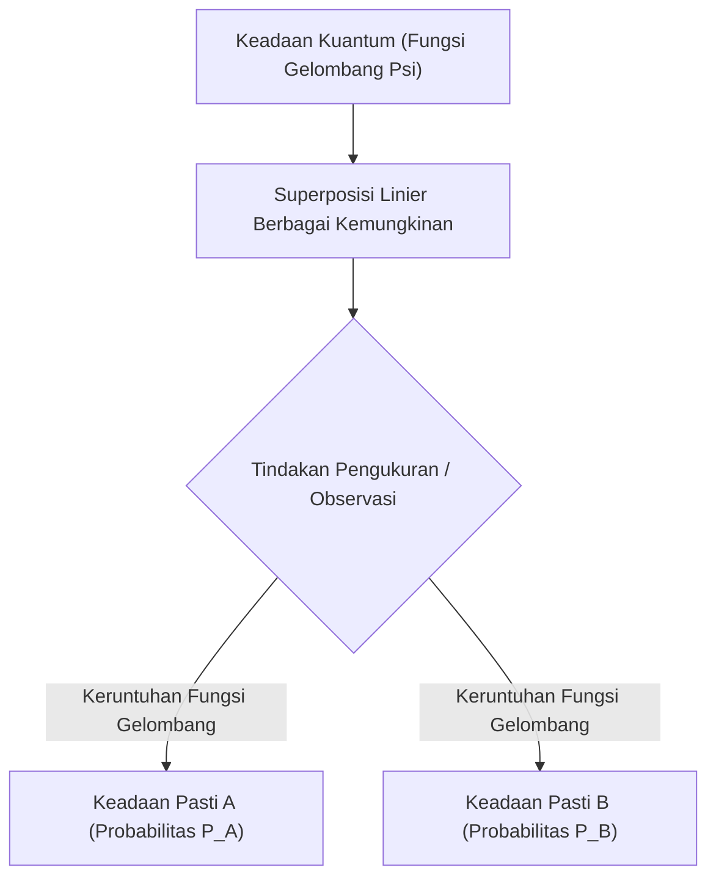

# Fisika: Dasar Mekanika Kuantum - Kucing Schrödinger dan Eksperimen Celah Ganda

## 1. Pendahuluan: Dunia Mikroskopis yang Menentang Akal Sehat

Sebagian besar fenomena fisik yang kita jumpai sehari-hari dapat dijelaskan dengan ketelitian luar biasa melalui fisika klasik, terutama mekanika Newton. Lintasan parabola bola yang dilempar, orbit elips planet mengitari Matahari, atau pantulan bola biliar adalah peristiwa deterministik: jika kondisi awal diketahui, masa depan sistem secara prinsip dapat dihitung dengan kepastian absolut.

Namun, pada awal abad ke-20, saat para fisikawan mulai meneliti ranah mikroskopis atom, elektron, dan foton, pilar-pilar fisika klasik runtuh. Apakah cahaya merupakan gelombang kontinu atau aliran partikel terpisah? Di manakah sebenarnya elektron berada sebelum diamati? Menjawab teka-teki eksistensial ini melahirkan **Mekanika Kuantum (Quantum Mechanics)**.

Mekanika kuantum diakui sebagai salah satu teori ilmiah paling teruji dan revolusioner sepanjang sejarah peradaban manusia. Prinsip kuantum mendasari transistor semikonduktor di ponsel cerdas kita, laser serat optik, pemindai MRI di rumah sakit, hingga komputer kuantum generasi baru. Artikel ini mengupas tuntas dasar fisika kuantum melalui dua eksperimen legendaris: **Eksperimen Celah Ganda** dan paradoks **Kucing Schrödinger**.

## 2. Hakikat Materi dan Cahaya: Dualitas Gelombang-Partikel

Salah satu konsep paling radikal dalam sains adalah **Dualitas Gelombang-Partikel (Wave-particle duality)**. Fisika klasik memisahkan alam menjadi dua kategori mutlak: materi adalah "partikel" yang memiliki massa terlokalisasi, sedangkan cahaya dan suara adalah "gelombang" kontinu yang merambat di ruang angkasa. Mekanika kuantum menghapus batas tersebut, membuktikan bahwa entitas subatomik memiliki sifat partikel sekaligus gelombang.

Tonggak ini berawal dari **hipotesis kuanta cahaya** Albert Einstein pada tahun 1905, yang membuktikan bahwa cahaya merambat dalam paket energi diskret bernama **foton** ($E = h\nu$, dengan $h$ konstanta Planck dan $\nu$ frekuensi), menjelaskan efek fotolistrik. Pada tahun 1924, fisikawan Prancis Louis de Broglie memperluas gagasan ini: jika gelombang cahaya dapat bersikap seperti partikel, partikel materi (seperti elektron) juga harus memiliki sifat gelombang materi:

$$ \lambda = \frac{h}{p} $$

Di mana $p = mv$ adalah momentum. Eksperimen difraksi elektron oleh Davisson dan Germer membuktikan bahwa berkas elektron mengalami difraksi dan interferensi selayaknya sinar-X, mengukuhkan kenyataan gelombang materi.

## 3. Inti Misteri Kuantum: Eksperimen Celah Ganda

Eksperimen celah ganda (Double-slit experiment) memperlihatkan keanehan dualitas gelombang-partikel secara telanjang. Fisikawan ternama [Richard Feynman](/p/biography-richard-feynman/) menyatakan bahwa eksperimen celah ganda memuat "satu-satunya misteri sejati dalam mekanika kuantum."

### Pengaturan Eksperimen
1. Sebuah penembak elektron (electron gun) menembakkan partikel ke arah penghalang.
2. Pada penghalang terdapat dua celah paralel yang sangat sempit (Celah A dan Celah B).
3. Di belakang penghalang dipasang layar fosfor detektor yang mencatat benturan setiap elektron sebagai titik cahaya tunggal.

### Jika Elektron Bersifat Sebagai Partikel Klasik
Seandainya elektron adalah kelereng mini, setiap elektron pasti melewati celah A atau celah B. Seiring berjalannya waktu, layar detektor hanya akan menampilkan dua garis vertikal yang sejajar dengan kedua celah tersebut.

### Jika Elektron Bersifat Sebagai Gelombang Klasik
Jika gelombang air merambat melalui dua celah, dua muka gelombang lingkaran baru akan muncul dan saling bertumpukan. Pertemuan puncak dengan puncak memperkuat gelombang, sedangkan puncak yang bertemu lembah saling meniadakan. Layar akan merekam pola garis terang-gelap bergantian yang disebut **pola interferensi**.

### Hasil Eksperimen yang Mengguncang Logika
Ketika fisikawan menembakkan elektron **satu demi satu**, memastikan hanya ada satu partikel di dalam ruang uji pada satu waktu, elektron tersebut mendarat di layar sebagai titik partikel tunggal yang padat.

Namun, setelah ribuan elektron ditembakkan secara mandiri, akumulasi titik-titik tersebut secara ajaib membentuk **pola interferensi**!
Ini membuktikan bahwa setiap elektron tunggal merambat sebagai gelombang probabilitas yang **melewati kedua celah sekaligus secara bersamaan**, berinterferensi dengan dirinya sendiri, dan mendarat sesuai distribusi probabilitas interferensi tersebut.

### Pengamatan yang Mengubah Kenyataan
Penasaran dengan kemampuan elektron yang seolah "membelah diri", ilmuwan menempatkan detektor tepat di samping celah untuk mengintip celah mana yang sebenarnya dilalui elektron.

Begitu detektor dinyalakan dan memastikan rute elektron, **pola interferensi seketika lenyap**, berganti menjadi dua garis partikel klasik biasa!
Partikel kuantum bertindak seolah-olah "menyadari" bahwa ia sedang diawasi. Tindakan pengukuran itu sendiri merusak koherensi gelombang dan memaksa elektron runtuh menjadi partikel klasik biasa. Fenomena ini disebut **Masalah Pengukuran (Measurement Problem)**.

## 4. Superposisi Kuantum dan Interpretasi Probabilitas

Kemampuan partikel kuantum untuk menempuh beberapa kemungkinan sekaligus dikenal sebagai **Superposisi Kuantum (Superposition)**.

Dalam fisika kuantum, partikel yang belum diukur tidak berada pada posisi koordinat pasti; partikel tersebut berada dalam superposisi linier dari seluruh kemungkinan kondisi, yang dirumuskan secara matematis melalui **Fungsi Gelombang ($\Psi$)**. Pada tahun 1926, Max Born mencetuskan **Interpretasi Probabilitas (Mazhab Kopenhagen)**: kuadrat nilai mutlak amplitudo fungsi gelombang menyatakan **kerapatan probabilitas** untuk menemukan partikel di lokasi tersebut saat pengukuran dilakukan:

$$ P(\mathbf{r}) = |\Psi(\mathbf{r}, t)|^2 $$

Sebelum diukur, kondisi elektron dirumuskan dalam superposisi:

$$ |\psi\rangle = \frac{1}{\sqrt{2}} |\text{Celah A}\rangle + \frac{1}{\sqrt{2}} |\text{Celah B}\rangle $$

Begitu instrumen pengukuran menyentuh sistem, fungsi gelombang mengalami **Keruntuhan Fungsi Gelombang (Wave function collapse)**, dan seluruh kemungkinan tereduksi seketika menjadi satu nilai pasti. Einstein menentang sifat probabilistik ini dengan ungkapan terkenalnya: *"Tuhan tidak bermain dadu dengan alam semesta."* Namun, serangkaian eksperimen mutakhir membuktikan bahwa alam semesta di tingkat fundamental memang berlandaskan probabilitas kuantum murni.

## 5. Persamaan Schrödinger: Hukum Dinamika Dunia Kuantum

Untuk memodelkan bagaimana fungsi gelombang kuantum berevolusi secara mulus dan deterministik terhadap waktu, fisikawan Austria Erwin Schrödinger merumuskan persamaan fondasional mekanika kuantum pada tahun 1926:

$$ i\hbar \frac{\partial}{\partial t} \Psi(\mathbf{r},t) = \hat{H} \Psi(\mathbf{r},t) $$

Di mana:
- $i$ adalah unit imajiner,
- $\hbar = \frac{h}{2\pi}$ adalah konstanta Planck tereduksi,
- $\Psi(\mathbf{r},t)$ adalah fungsi gelombang ruang dan waktu,
- $\hat{H}$ adalah operator Hamiltonian (menyatakan energi total kinetik dan potensial).

Menjadi padanan hukum kedua Newton ($F = ma$) dalam mekanika klasik, solusi persamaan Schrödinger menentukan bentuk orbital elektron atom, tingkat energi kuantum, dan ikatan molekul kimia. Seluruh sains semikonduktor modern bertumpu pada persamaan ini.

## 6. Puncak Paradoks: "Kucing Schrödinger"

Walaupun interpretasi Kopenhagen berhasil memecahkan kalkulasi partikel subatomik, Erwin Schrödinger sendiri sangat terganggu oleh konsep keruntuhan fungsi gelombang akibat pengamatan. Apa yang terjadi jika superposisi mikroskopis ini digabungkan secara mekanis ke objek makroskopis di dunia nyata?

Untuk menyoroti kejanggalan konseptual ini, Schrödinger mencetuskan eksperimen pikiran terkenalnya pada tahun 1935: **Kucing Schrödinger (Schrödinger's Cat)**.

### Skenario Eksperimen Pikiran
1. Seekor kucing hidup dimasukkan ke dalam kotak baja tertutup rapat, kedap suara dan cahaya.
2. Di dalam kotak terdapat perangkat: sebutir atom radioaktif, pencacah Geiger, palu mekanik, dan botol kaca berisi racun asam sianida.
3. Dalam tempo satu jam, atom radioaktif memiliki peluang kuantum tepat 50% untuk meluruh dan 50% untuk tidak meluruh.
4. Jika atom meluruh, pencacah Geiger mendeteksinya, memicu palu memecahkan botol, dan racun membunuh kucing tersebut.
5. Jika atom tidak meluruh, racun tetap tersegel dan kucing tetap hidup.

### Bagaimana Keadaan Kucing Sebelum Kotak Dibuka?
Peluruhan radioaktif adalah peristiwa kuantum. Menurut interpretasi Kopenhagen, sebelum ada yang membuka kotak, atom berada dalam superposisi "meluruh" dan "tidak meluruh".

Karena nasib kucing terhubung langsung dengan status atom, logika Kopenhagen membawa kita pada kesimpulan aneh: sebelum kotak dibuka, **kucing tersebut berada dalam superposisi simultan: hidup sekaligus mati**:

$$ |\Psi_{\text{sistem}}\rangle = \frac{1}{\sqrt{2}} |\text{Kucing Hidup}\rangle + \frac{1}{\sqrt{2}} |\text{Kucing Mati}\rangle $$

Hanya ketika seorang manusia membuka kotak dan mengamati isinya, fungsi gelombang runtuh seketika ke salah satu realitas klasik.

### Makna Paradoks, Dekoherensi, dan Banyak Dunia
Schrödinger merancang paradoks ini bukan untuk menyatakan adanya kucing zombi, melainkan untuk memperlihatkan cacat logika bila aturan mikroskopis diterapkan mentah-mentah ke ranah makroskopis.

Fisika modern menjelaskan masalah ini melalui **Dekoherensi Kuantum (Quantum Decoherence)**: objek makroskopis seperti kucing dan pencacah Geiger terdiri dari sextiliun atom yang terus bertumbukan dengan udara dan radiasi termal lingkungan. Dalam tempo $10^{-20}$ detik, koherensi fase kuantum bocor ke lingkungan, membuat sistem makroskopis menampilkan kepastian klasik jauh sebelum kotak dibuka.

Penjelasan memikat lainnya adalah **Interpretasi Banyak Dunia (Many-worlds interpretation)** oleh Hugh Everett (1957): fungsi gelombang tidak pernah runtuh; melainkan alam semesta bercabang menjadi dua dunia paralel saat kotak dibuka—satu dunia di mana kucing hidup, dan satu dunia di mana kucing mati.

## 7. Keterikatan Kuantum: "Aksi Seram Jarak Jauh"

Keajaiban spektakuler lainnya dari mekanika kuantum adalah **Keterikatan Kuantum (Quantum entanglement)**. Ketika dua partikel terikat dalam satu keadaan kuantum bersama, keduanya membentuk sistem terpadu:

$$ |\Phi^+\rangle = \frac{1}{\sqrt{2}} \left( |\uparrow\uparrow\rangle + |\downarrow\downarrow\rangle \right) $$

Bahkan jika kedua partikel dipisahkan sejauh miliaran tahun cahaya, pengukuran pada spin partikel A seketika menentukan status partikel B **tanpa jeda waktu sedikit pun**.

Einstein menolak fenomena ini dan menjulukinya secara sinis sebagai *"aksi seram jarak jauh"* (spooky action at a distance), menduga ada variabel tersembunyi lokal. Namun Teorema Bell dan eksperimen foton terikat (yang dianugerahi Hadiah Nobel Fisika 2022) membuktikan bahwa alam semesta memang bersifat **non-lokal**.

## 8. Revolusi Kuantum Kedua dan Teknologi Masa Depan

Prinsip-prinsip aneh mekanika kuantum kini menjadi motor penggerak **Revolusi Kuantum Kedua**:

- **Komputasi Kuantum (Quantum Computing)**: Memanfaatkan **qubit**, superposisi dan keterikatan mampu memproses data multi-dimensi secara masif paralel untuk memecahkan algoritma enkripsi (Shor), simulasi molekul obat, dan pemodelan iklim.
- **Kriptografi Kuantum (QKD)**: Menggunakan teorema tanpa-kloning, penyadapan seketika merusak keadaan kuantum foton, menghasilkan komunikasi berkeamanan fisik mutlak.
- **Sensor Kuantum**: Memanfaatkan pusat kekosongan nitrogen (NV) pada intan untuk mengukur medan gravitasi dan magnet dengan presisi atom, memungkinkan navigasi kapal selam tanpa GPS dan pemindaian otak non-invasif.

## 9. Penutup: Menyelami Kedalaman Semesta Kuantum

Mekanika kuantum membongkar pemahaman naluriah manusia: partikel berada di berbagai tempat sekaligus, pengamatan membentuk realitas, dan partikel terhubung melintasi kosmos. 

Sebagaimana diungkapkan [Richard Feynman](/p/biography-richard-feynman/): *"Saya rasa saya bisa mengatakan dengan yakin bahwa tidak ada seorang pun yang benar-benar memahami mekanika kuantum."* Namun, melalui hukum-hukum matematis dan eksperimen teliti inilah manusia berhasil menyentuh rahasia terdalam penciptaan alam semesta.
