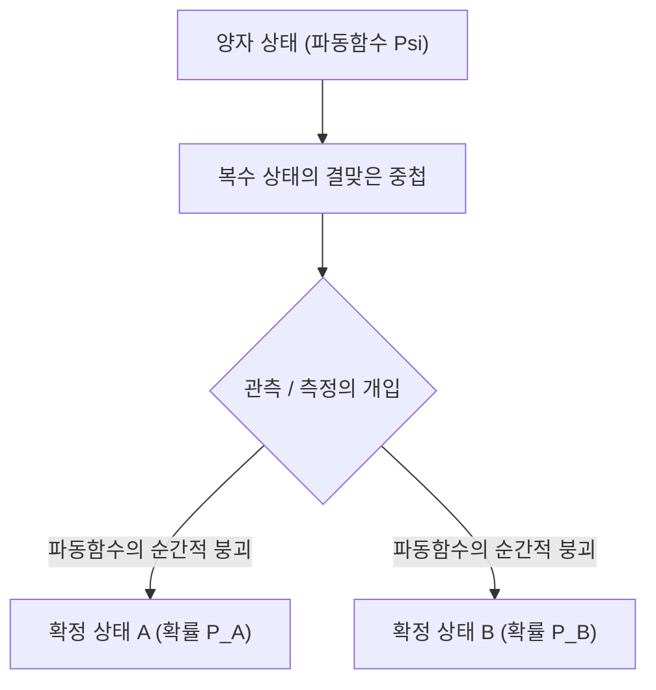

# 물리학: 양자역학의 기초 - 슈뢰딩거의 고양이와 이중 슬릿 실험

## 1. 서론: 상식을 뒤흔드는 미시 세계의 등장

우리가 일상에서 체감하는 대부분의 물리 현상은 뉴턴 역학으로 대표되는 '고전물리학'을 통해 오차 없이 정확히 설명됩니다. 허공에 던진 공의 포물선 궤적, 태양계를 공전하는 행성의 타원 궤도, 당구공의 탄성 충돌 등은 모두 완벽히 결정론적입니다. 즉, 초기 조건만 알고 있다면 미래의 상태를 원리적으로 100% 예측할 수 있습니다.

그러나 20세기 초, 물리학자들이 원자, 전자, 광자와 같은 극미의 세계(미시 세계)를 들여다보기 시작하자 고전역학의 견고한 성벽은 산산이 부서져 내렸습니다. 빛은 파동인가 입자인가? 전자는 관측되기 전에 도대체 어디에 존재하는가? 이러한 근원적인 물음에 답하기 위해 탄생한 학문이 바로 **양자역학(Quantum Mechanics)** 입니다.

양자역학은 현대 과학사에서 가장 정밀하게 검증되었으며 인류 문명을 가장 크게 바꾼 이론입니다. 스마트폰의 반도체 트랜지스터, 초고속 광통신 레이저, 병원의 MRI 장비, 그리고 미래의 양자 컴퓨터에 이르기까지 현대 기술 문명의 모든 주춧돌이 양자역학 위에 놓여 있습니다. 본 글에서는 **이중 슬릿 실험** 과 **슈뢰딩거의 고양이** 라는 두 가지 전설적인 실험과 사고실험을 통해 양자역학의 심오한 원리를 체계적으로 해설합니다.

## 2. 빛과 전자의 정체: 파동-입자 이중성

양자물리학에서 가장 혁명적인 개념은 **파동-입자 이중성(Wave-particle duality)** 입니다. 고전물리학에서는 물질을 질량을 가진 '입자'로, 빛과 소리를 공간에 퍼져나가는 '파동'으로 엄격히 구분했습니다. 하지만 양자역학의 세계에서는 우주의 모든 물질과 에너지가 입자의 성질과 파동의 성질을 동시에 가집니다.

이 문을 처음 연 것은 1905년 알베르트 아인슈타인의 **광양자 가설** 이었습니다. 그는 빛이 연속적인 파동이 아니라 $h\nu$($h$ 는 플랑크 상수, $\nu$ 는 진동수)라는 에너지 덩어리(광자)의 흐름이라는 점을 밝혀 광전효과를 완벽히 설명했습니다. 1924년 프랑스의 루이 드브로이는 이를 뒤집어 "빛이 입자의 성질을 띤다면, 전자와 같은 물질 입자도 파동의 성질을 가져야 한다"는 물질파 가설을 제창했습니다:

$$ \lambda = \frac{h}{p} $$

이후 데이비슨과 거머의 전자 회절 실험을 통해 전자가 엑스선처럼 회절하고 간섭한다는 사실이 입증되면서 파동-입자 이중성은 우주의 확고한 물리 법칙으로 자리 잡았습니다.

## 3. 양자역학의 핵심 미스터리: 이중 슬릿 실험

파동-입자 이중성을 가장 충격적이고 직관에 반하는 형태로 보여주는 무대가 바로 **이중 슬릿 실험(Double-slit experiment)** 입니다. 노벨 물리학상 수상자 [리처드 파인만](/p/biography-richard-feynman/)은 "양자역학의 모든 미스터리가 이 단 하나의 실험에 담겨 있다"고 단언했습니다.

### 실험 구성
1. 전자를 한 개씩 발사할 수 있는 전자총을 준비합니다.
2. 그 앞에 두 개의 좁은 틈새(슬릿 A, 슬릿 B)가 뚫린 차폐판을 세웁니다.
3. 차폐판 뒤편에 전자가 도달한 위치를 점으로 기록하는 형광 스크린(검출기)을 배치합니다.

### 전자가 순수한 고전적 입자라면?
전자가 단단한 당구공 같은 고전적 입자라면, 전자는 반드시 슬릿 A나 슬릿 B 중 하나만을 통과할 것입니다. 스크린에는 슬릿의 모양과 일치하는 '두 줄의 직선 띠'만이 나타나야 합니다.

### 전자가 순수한 파동이라면?
수면에 이는 물결파가 두 개의 슬릿을 통과하면, 슬릿에서 각각 동심원 모양의 파면이 퍼져나가며 겹쳐집니다. 마루와 마루가 만나는 곳은 보강 간섭으로 강해지고, 마루와 골이 만나는 곳은 상쇄 간섭으로 사라져 스크린에는 얼룩말 무늬 같은 '간섭무늬'가 나타납니다.

### 경악스러운 실제 실험 결과
물리학자들이 전자총의 발사 간격을 극도로 늦추어 **장치 내에 오직 한 개의 전자만 날아가도록** 했을 때, 믿을 수 없는 현상이 관측되었습니다. 전자는 스크린에 분명히 단 하나의 점(입자) 형태로 찍혔습니다.

그러나 수천, 수만 개의 전자를 하나씩 시간을 두고 누적해서 쏘아 보내자, 스크린 위에 나타난 전체 점들의 분포는 완벽한 **간섭무늬** 를 그렸습니다!
이것은 단 하나의 전자가 공간에 파동처럼 퍼져 **왼쪽 슬릿과 오른쪽 슬릿을 동시에 통과한 뒤**, 자기 자신과 스스로 간섭하여 스크린에 도달했음을 의미합니다.

### '관측'이 현실을 붕괴시킨다
물리학자들은 전자가 실제로 두 슬릿 중 어디를 지나는지 확인하기 위해 슬릿 바로 옆에 정밀 센서를 설치하고 전자의 통과를 '관측'했습니다.

그 순간, 믿기 힘든 일이 일어났습니다. 전자가 어느 슬릿을 통과했는지 관측 장비가 감지하자마자, 스크린 위의 간섭무늬가 **거짓말처럼 사라지고 평범한 두 줄의 직선 띠** 로 바뀌어 버린 것입니다.
인간이나 측정 장비가 '본다(관측한다)'는 행위 자체가 전자의 파동적 성질을 지워버리고 고전적 입자로 강제 확정 지어버린 것입니다. 이를 물리학에서는 **관측 문제(Measurement Problem)** 라고 부릅니다.

## 4. 상태의 중첩과 확률 해석

관측하기 전 전자가 두 슬릿을 동시에 통과하는 기묘한 상태를 **상태의 중첩(Superposition)** 이라고 합니다.

양자역학에서 입자는 관측되기 전까지 특정한 위치에 '존재'하는 것이 아니라, 여러 상태가 확률적으로 겹쳐진 채 존재합니다. 이를 수학적으로 기술하는 도구가 복소수 함수인 **파동함수($\Psi$)** 입니다. 1926년 막스 보른은 파동함수의 진폭의 절댓값 제곱이 해당 위치에서 입자가 발견될 **확률 밀도** 를 나타낸다는 **확률 해석(코펜하겐 해석)** 을 내놓았습니다:

$$ P(\mathbf{r}) = |\Psi(\mathbf{r}, t)|^2 $$

관측 전의 전자는 두 슬릿 상태의 결맞은 중첩 상태에 머뭅니다:

$$ |\psi\rangle = \frac{1}{\sqrt{2}} |\text{슬릿 A}\rangle + \frac{1}{\sqrt{2}} |\text{슬릿 B}\rangle $$

그러나 관측 장비가 개입하는 찰나, 파동함수는 순간적으로 **파동함수의 붕괴(Wave function collapse)** 를 일으켜 오직 하나의 고유 상태로 수축합니다. 우주의 근본 원리가 결정론이 아니라 '주사위 던지기' 같은 확률에 지배된다는 사실에 아인슈타인은 "신은 주사위 놀이를 하지 않는다"라며 격렬히 반발했습니다. 그러나 지난 100년간의 정밀한 실험들은 양자역학의 확률적 본질이 자연의 진실임을 증명했습니다.

## 5. 슈뢰딩거 방정식: 양자 세계를 지배하는 기본 법칙

파동함수가 시간에 따라 어떻게 결정론적으로 진화하는지를 기술하는 양자역학의 기본 방정식이 바로 1926년 에르빈 슈뢰딩거가 유도한 **슈뢰딩거 방정식(Schrödinger equation)** 입니다:

$$ i\hbar \frac{\partial}{\partial t} \Psi(\mathbf{r},t) = \hat{H} \Psi(\mathbf{r},t) $$

여기서:
- $i$ 는 허수 단위,
- $\hbar = \frac{h}{2\pi}$ 는 디랙 상수(환산 플랑크 상수),
- $\Psi(\mathbf{r},t)$ 는 시공간에 따른 파동함수,
- $\hat{H}$ 는 계의 총 에너지를 나타내는 해밀토니언 연산자입니다.

고전역학의 뉴턴 제2법칙($F = ma$)이나 전자기학의 맥스웰 방정식처럼, 슈뢰딩거 방정식은 양자물리학의 절대적 기초입니다. 이 편미분 방정식을 풀면 원자 내부 전자의 오비탈 궤도, 에너지 준위, 화학 결합의 본질을 완벽하게 계산할 수 있습니다.

## 6. 역설의 정점: "슈뢰딩거의 고양이"

코펜하겐 해석은 미시 세계의 계산에서 완벽한 성공을 거두었습니다. 그러나 정작 방정식을 만든 슈뢰딩거 자신은 "관측 행위가 파동함수를 붕괴시킨다"는 개념에 깊은 거부감을 느꼈습니다. 만약 미시의 기묘한 중첩이 일상의 거시 세계로 확장된다면 어떤 일이 벌어질 것인가?

이 모순을 지적하기 위해 1935년 고안된 사고실험이 바로 **슈뢰딩거의 고양이(Schrödinger's Cat)** 입니다.

### 사고실험의 설계
1. 속이 전혀 보이지 않는 완벽히 밀폐된 철제 상자에 살아있는 고양이 한 마리를 넣습니다.
2. 상자 안에는 방사성 원자 한 개, 방사선 검출기(가이거 계수기), 망치, 청산가리가 든 유리병이 설치되어 있습니다.
3. 1시간 동안 이 방사성 원자가 붕괴할 확률은 정확히 50%, 붕괴하지 않을 확률도 50%입니다.
4. 원자가 붕괴하면 계수기가 이를 감지해 망치로 유리병을 깨뜨려 독가스가 방출되고 고양이는 즉사합니다.
5. 붕괴하지 않으면 장치는 작동하지 않고 고양이는 살아남습니다.

### 상자를 열기 전 고양이의 상태는?
원자의 붕괴는 양자역학적 사건이므로 상자를 열어보기 전까지 원자는 '붕괴한 상태'와 '붕괴하지 않은 상태'의 중첩입니다.

장치와 고양이의 생명이 양자역학적으로 얽혀 있기 때문에, 코펜하겐 해석을 기계적으로 적용하면 섬뜩한 결론이 도출됩니다. 상자를 열기 전까지 **고양이는 살아있는 상태와 죽어있는 상태가 반반씩 겹쳐진 '생사의 중첩' 상태로 존재한다** 는 것입니다:

$$ |\Psi_{\text{계}}\rangle = \frac{1}{\sqrt{2}} |\text{살아있는 고양이}\rangle + \frac{1}{\sqrt{2}} |\text{죽은 고양이}\rangle $$

오직 관측자가 상자 뚜껑을 열어 안을 들여다보는 순간에야 비로소 파동함수가 붕괴하여 고양이의 생사가 결정된다는 뜻이 됩니다.

### 역설이 던지는 질문과 양자 결어긋남
슈뢰딩거는 "거시 세계에 양자 규칙을 그대로 적용하면 산 고양이와 죽은 고양이가 겹쳐 있다는 해괴망측한 결론에 도달한다"며 코펜하겐 해석의 불완전성을 비판했습니다. 미시와 거시의 경계는 어디인가? 무엇이 '관측'인가? 고양이 스스로는 자신을 관측할 수 없는가?

현대 물리학은 이에 대해 **양자 결어긋남(Quantum Decoherence)** 이론으로 답합니다. 고양이와 같은 거시계는 무수한 원자로 구성되어 주변의 공기 분자, 광자와 $10^{-20}$초라는 찰나의 시간 안에 상호작용합니다. 이때 파동의 결맞음이 환경으로 순식간에 누출되어 흩어지면서 거시 세계에서는 고전적인 단일 현실만이 관찰된다는 설명입니다.

또 다른 매혹적인 설명은 휴 에버렛 3세가 제창한 **다세계 해석(Many-worlds interpretation)** 입니다. 파동함수는 결코 붕괴하지 않으며, 상자를 여는 순간 우주 자체가 '고양이가 산 세계'와 '고양이가 죽은 세계'로 평행하게 갈라져 둘 다 존재한다는 가설입니다.

## 7. 양자 얽힘: 시공간을 초월한 '유령 같은 원격 작용'

양자역학의 또 다른 경이로움은 **양자 얽힘(Quantum entanglement)** 입니다. 두 입자가 얽힘 상태에 놓이게 되면 둘은 하나의 분리할 수 없는 양자계를 형성합니다:

$$ |\Phi^+\rangle = \frac{1}{\sqrt{2}} \left( |\uparrow\uparrow\rangle + |\downarrow\downarrow\rangle \right) $$

두 얽힌 입자를 수만 광년 떨어진 우주 양 끝으로 격리해 놓더라도, 한쪽 입자의 스핀을 관측하여 결정하는 순간, 반대편 입자의 상태도 **시간 지연 전혀 없이 즉각적으로** 결정됩니다.

아인슈타인은 빛보다 빠른 정보 전달처럼 보이는 이 현상을 "유령 같은 원격 작용(Spooky action at a distance)"이라 부르며 부정했습니다. 그러나 1964년 존 벨의 '벨 부등식' 제창과 2022년 노벨 물리학상을 수상한 정밀 광자 실험을 통해, 자연계에는 숨은 변수가 없으며 양자역학이 예견한 **비국소성(Non-locality)** 이 우주의 진실임이 확증되었습니다.

## 8. 제2차 양자 혁명: 미래 기술로의 도약

순수 이론적 논쟁에 머물던 양자역학의 원리들은 오늘날 '제2차 양자 혁명'을 촉발하고 있습니다:

- **양자 컴퓨터(Quantum Computing)**: 0과 1의 중첩 상태를 갖는 큐비트(Qubit)와 양자 얽힘을 활용하여, 고전 슈퍼컴퓨터로 수만 년이 걸리는 암호 해독(쇼어 알고리즘), 신약 분자 시뮬레이션, 최적화 문제를 획기적으로 단축합니다.
- **양자 암호 통신(QKD)**: 양자 복제 불가능성 정리와 관측 시 상태가 교란되는 특성을 이용하여, 제3자가 도청을 시도하는 즉시 발각되는 절대적 보안 통신을 구현합니다.
- **양자 센서**: 다이아몬드 NV 센터 등을 이용해 원자 수준의 정밀도로 미세 자기장과 중력장을 측정하여, GPS 없는 잠수함 관성 항법 및 뇌 신경 정밀 이미징을 가능케 합니다.

## 9. 맺음말: 심오한 양자 세계로의 초대

양자역학은 인간의 직관을 뿌리째 뒤흔듭니다. 입자는 동시에 여러 곳에 존재하고, 관측이 물리적 실재를 결정하며, 광막한 우주를 가로질러 얽힌 입자들이 호흡합니다. [리처드 파인만](/p/biography-richard-feynman/)의 말처럼 "양자역학을 완벽히 이해하는 사람은 아무도 없다"고 할 수 있을 만큼 미지의 심연은 깊습니다.

그러나 인류는 이 기묘한 법칙을 수학과 실험으로 증명해 냈고, 이를 바탕으로 문명의 지평을 넓히고 있습니다. 이중 슬릿을 통과하는 전자의 발자국과 상자 속 슈뢰딩거의 고양이를 생각할 때, 우리는 우주가 품은 가장 경이로운 비밀과 마주하고 있는 것입니다.
